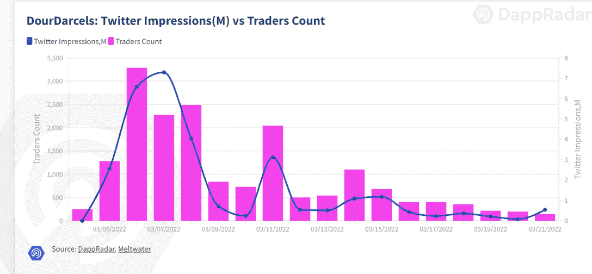

# 新的 Dapps 报告:杜达塞尔

> 原文：<https://web.archive.org/web/https://dappradar.com/blog/new-dapps-report-dourdarcels>

## 从博客的开端到元宇宙

在 DappRadar 新的 Dapps 报告中，我们关注了流行而有趣的 NFT 系列，这一次我们涵盖了 DourDarcels。新的 Dapps 报告是对 NFT 收藏的财务指标的执行概述和分析。

这份新的 Dapps 报告是一系列执行报告的一部分，为读者提供了一个有前途的随机生成的 NFT 集合的高级视角。该报告侧重于财务指标，包括销售活动和价格分析，以及分布指标，如独特持有人比率和鲸鱼集中指数。此外，它还深入研究了鲸鱼的行为模式，以及社会和技术概况。

在宏观经济压力的推动下，加密市场再次加速，NFT 的销量开始回升。在这份报告中，我们讨论了 DourDarcels NFT 系列，它引起了许多交易者的注意。

DourDarcels 是由澳大利亚平面设计师和艺术家克雷格·莱德曼(又名 DourDarcel)创作的 10，000 个 NFT 头像的集合。莱德曼创造了主角达塞尔，作为他的图文博客“达塞尔失望”的一部分，讲述了在纽约一个简陋的公寓里生活的故事。他的艺术表达的简单性很快激起了知名品牌的兴趣，导致了与阿迪达斯、路易威登、谷歌和宜家等公司的合作。莱德曼的 Darcel 作品已经在巴黎和纽约展出，出现在《纽约时报》和《Vogue》的封面上，现在正通过 DourDarcels 系列进入元宇宙。

**请不要考虑本文件的财务建议。**
**数据更新日期:2022 年 3 月 24 日**

## 目录

*   [关键要点](https://web.archive.org/web/20221202040219/https://dappradar.com/blog/new-dapps-report-dourdarcels/#key)
*   [财务概况](https://web.archive.org/web/20221202040219/https://dappradar.com/blog/new-dapps-report-dourdarcels/#financial)
*   [效用](https://web.archive.org/web/20221202040219/https://dappradar.com/blog/new-dapps-report-dourdarcels/#utility)
*   [社会意识和参与度](https://web.archive.org/web/20221202040219/https://dappradar.com/blog/new-dapps-report-dourdarcels/#social)
*   [团队概述](https://web.archive.org/web/20221202040219/https://dappradar.com/blog/new-dapps-report-dourdarcels/#team)
*   [技术概述](https://web.archive.org/web/20221202040219/https://dappradar.com/blog/new-dapps-report-dourdarcels/#technical)
*   [鲸鱼钱包分析](https://web.archive.org/web/20221202040219/https://dappradar.com/blog/new-dapps-report-dourdarcels/#whale)
*   [总结](https://web.archive.org/web/20221202040219/https://dappradar.com/blog/new-dapps-report-dourdarcels/#summary)

## 关键要点

*   DourDarcels 是过去 30 天内交易量第 23 大的系列，销售额超过 2200 万美元
*   自 3 月 4 日发行以来，该系列的底价已经上涨了近 720%

## dour darcels–底价增长 720%

**区块链:**以太坊
**上线日期:**2022 年 3 月 4 日
**版本大小:** 1 万–限量版
**特质:** 10
**属性:** 261
**底价:** 0.72 ETH

DourDarcels 在第一周创造了 1100 万美元的销售额，一周后达到 800 万美元。这是新项目的典型场景，通常会在第一周出现销售高峰。此后，项目往往会在接下来的几周内出现回调。项目的可持续性通常取决于开发价格和销售量。平均售价的持续强劲增长表明该项目的需求良好。

## 附加效用–投机性效用产品

到目前为止，DourDarcels 还没有官方的实用路线图。因此，在撰写本文时，没有与该项目相关的公用事业。

尽管如此，达塞尔的性格带来了莱德曼的长期承诺。在最近与 CoolHunting.com 的一次采访中，莱德曼说“第一套工具将是衣物投放、合作和空投，随着时间的推移会陆续发布”。他进一步指出，拥有数字和物理工具的“良好组合”是一件好事。此外，他“很高兴看到社区希望这个项目朝哪个方向发展”。

## 社会意识和参与

DourDarcels 拥有强大的在线社交网络。它的 [Discord](https://web.archive.org/web/20221202040219/https://discord.com/invite/dourdarcels) 服务器拥有 **27，380 名活跃用户**，并拥有复杂的入职程序和活跃的审核团队，既减少了恶意机器人活动，也减少了不良行为者。社区对话全天都在进行，并通过各种渠道进行，这表明参与度很高。

多尔达塞尔的推特于 2021 年 11 月在 T2 上线，目前在 T4 拥有 34186 名粉丝。在过去的 30 天里，该帐户经历了 97%的总增长，获得了 **33，915** 个新粉丝，平均每天 **1，130 个新粉丝**。这表明了人们对该系列的强烈兴趣和不断增长的需求。

该项目还有一个 Instagram 账户，目前已经有超过 12700 名**粉丝，用于分享推广艺术**

杜塞尔斯在第一个星期就有过一次史无前例的交易者，当时它积累了 70%以上的独特交易者。虽然在随后的几周内数量有所减少，但共有 9 208 名独特的交易商对收藏品表现出健康的需求。独一无二的译者计数与推特印象之间的强烈相关性反映了新译者通过口词对社会媒体的影响。

## 团队概述

这个项目背后的团队由克雷格·莱德曼组成，他也被称为[、杜达尔塞尔](https://web.archive.org/web/20221202040219/http://twitter.com/dourdarcel)、[威斯特康星](https://web.archive.org/web/20221202040219/http://twitter.com/westcoastnft)、[希尔 xyz](https://web.archive.org/web/20221202040219/https://twitter.com/shillrxyz) 、[敏多菲姆普](https://web.archive.org/web/20221202040219/https://twitter.com/mindofimpact)、、[、](https://web.archive.org/web/20221202040219/https://twitter.com/mindofimpact)[This _ is _ bonbonbon](https://web.archive.org/web/20221202040219/https://twitter.com/This_is_BonBon)和 [Awj5](https://web.archive.org/web/20221202040219/https://twitter.com/_awj5) 。该团队只是部分公开，但这没有什么可担心的，因为其成员在社交媒体上很活跃，并拥有良好的声誉。

克雷格·莱德曼是项目负责人。他创立了 Darcel designs 品牌，并与阿迪达斯、路易威登、谷歌、宜家和口袋妖怪等公司合作。除了他的达尔塞尔主题的项目，莱德曼的其他艺术作品也很成功。他为《国家地理》、《时尚》和《纽约客》设计过杂志封面。他的作品已经在巴黎和纽约展出。

亚当·约翰逊，又名 Awj5，是该项目的网络开发人员。在过去的五年里，他在苹果公司担任过各种职务，目前是苹果应用商店的游戏编辑。

WestcoastNFT 和 Shillr 是合作团体，专注于启动 NFT 项目，帮助铸造，区块链开发，定价和启动执行等。WestCoastNFT 与涂鸦和 T2 MFers 合作，而 Shillrxyz 为不可替代真菌和 POAP 项目[提供动力。](https://web.archive.org/web/20221202040219/https://thefungi.app/#About)

Source:  dourdarcels.io

## 技术概述

像大多数 NFT 项目一样，DourDarcels 使用 IPFS 存储其元数据，而不是完全在链上。这给视觉上丰富的元数据项目带来了一个共同的挑战，因为智能合约和元数据是分开的。不过，从技术角度来看，没有什么大问题。

*   审计状态:尚未执行审计

*   存储:战斗堡垒

 ***   合同地址:[0x8d 609 BD 201 beaea 7 dccbfbd 9 c 22851 e 23 da 6869](https://web.archive.org/web/20221202040219/https://etherscan.io/address/0x8d609bd201beaea7dccbfbd9c22851e23da68691)[1](https://web.archive.org/web/20221202040219/https://etherscan.io/address/0x8d609bd201beaea7dccbfbd9c22851e23da68691)

## 鲸鱼钱包分析

DourDarcels 目前有一个独特的持有人比例 **51%，**表明它是一个适度多元化的集合；较低的比率表明对价格突变的敏感度较高。在 **5.36%** ，其鲸类浓度一般。更高的鲸鱼聚集度表明知名收藏者操纵价格的风险增加。前五名持有者中有三个突出的鲸鱼——[bonzi . eth](https://web.archive.org/web/20221202040219/https://dappradar.com/hub/wallet/eth/0x71e7b94490837ccaf45f9f6c7c20a3e17bbeb7d3)、 [poorpleb.eth](https://web.archive.org/web/20221202040219/https://dappradar.com/hub/wallet/eth/0xf2aba42dcff6f912a2a6b4a52c279ad3246b17b9) 和 [ohmy.eth](https://web.archive.org/web/20221202040219/https://dappradar.com/hub/wallet/eth/0xd8ab491e7e0727d71525dad99717627951a87680) 。知名 NFT 收藏家和密码投资者的出现通常表明交易活动增加，对藏品的整体兴趣更高。

## 摘要

到目前为止，DourDarcels 的表现一直受到声誉和受欢迎程度的影响，同时也遵循市场模式。这是过去 7 天中交易量第 23 大的藏品，交易量接近 500 万美元。它也是过去 30 天内交易量排名第 23 位的藏品，交易量为 2300 万美元。底价巩固在 0.72 ETH，比原价上涨了 720%。与此同时，平均价格增长了 1180%。20 ETH/53，620 美元的最高销售额仅在铸造后 9 天出现。

从长远来看，效用是大多数收藏品增长的驱动因素。由于还没有关于潜在的公用事业产品的具体公告，它仍然是一个通配符。由于莱德曼对 Darcel 项目的长期承诺，DourDarcels 可能会在不久的将来宣布一些令人兴奋的事情，将该项目推向新的高度。**