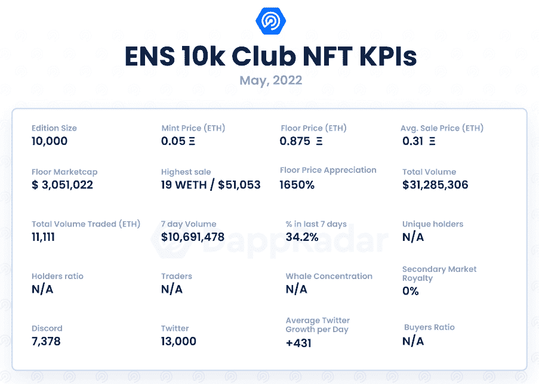

# 新的 Dapps 报告:ENS 域名，10k 俱乐部-数字不会说谎

> 原文：<https://web.archive.org/web/https://dappradar.com/blog/new-dapps-report-ens-domains-10k-club-numbers-dont-lie>

## 深入了解 10k 俱乐部 NFT 系列

在 DappRadar 的新 Dapps 报告中，我们关注了流行和有趣的 NFT 系列，这次我们涵盖了以太坊名称服务及其 ENS 域名，或者更具体地说，10k 俱乐部。新的 Dapps 报告是对 NFT 收藏的财务指标的执行概述和分析。

这份新的 Dapps 报告是一系列执行报告的一部分，为读者提供了一个充满希望的、可再生的 NFT 收藏的高层次视角。该报告侧重于财务指标，包括销售活动和价格分析，以及分布指标，如独特持有人比率和鲸鱼集中指数。它还深入研究了鲸鱼的行为模式以及社会和技术概况。

以太坊名称服务(ENS)于 2017 年 5 月推出，作为以太坊区块链上的分布式开放命名系统。它允许像 john.eth 这样的可读名称是机器可读的，并映射到以太坊地址、加密货币地址、散列内容和其他元数据。本质上，ENS 的功能类似于 internet 域，并且像所有的 NFT 一样，这些地址也是唯一的和不可替代的。

2022 年 4 月 26 日，在没有任何集中协调的情况下，用户开始狂热地购买编号为 0000-9999 的 ENS 域名。一名推特用户[丹尼尔·戈特这个](https://web.archive.org/web/20220925022306/https://twitter.com/danielgothits)创建了[推特](https://web.archive.org/web/20220925022306/https://twitter.com/10kClubOfficial)账户和[不和](https://web.archive.org/web/20220925022306/https://discord.com/invite/aUemBKUuZ5)服务器，名为 10K 俱乐部，供所有 0-9999 的域名持有者聚会。

请不要将本文件视为财务建议。

**数据更新日期:****2022 年 5 月 11 日**

## 目录

*   [关键要点](https://web.archive.org/web/20220925022306/https://dappradar.com/blog/new-dapps-report-ens-domains-10k-club-numbers-dont-lie/#Key)
*   [财务概况](https://web.archive.org/web/20220925022306/https://dappradar.com/blog/new-dapps-report-ens-domains-10k-club-numbers-dont-lie/#Ethereum)
*   [效用](https://web.archive.org/web/20220925022306/https://dappradar.com/blog/new-dapps-report-ens-domains-10k-club-numbers-dont-lie/#Utility)
*   [社会意识和参与度](https://web.archive.org/web/20220925022306/https://dappradar.com/blog/new-dapps-report-ens-domains-10k-club-numbers-dont-lie/#Social)
*   [技术概述](https://web.archive.org/web/20220925022306/https://dappradar.com/blog/new-dapps-report-ens-domains-10k-club-numbers-dont-lie/#Technical)

## 关键要点

*   ENS 是过去 7 天内交易量第 16 大的收藏，交易量为 10，691，478 美元，过去两周内交易量第 19 大，交易量为 30，769，814 美元

*   自 4 月 26 日炒作以来，该系列的底价上涨了 1，650 %

## ENS 域名 10k 俱乐部-底价增长 1，650 %

### 区块链:以太坊

**上市日期:**2022 年 4 月 26 日

**版本大小:** 10，000-无限追踪器中的限量收藏

**性状:**一万

**属性:**不适用

**底价:** 0.875 瑞士法郎

 Source: [Crypto Slam](https://web.archive.org/web/20220925022306/https://cryptoslam.io/ethereum-name-service/sales/summary)

ENS 在第一周创造了超过 1800 万美元的销售额，5 月 2 日达到了超过 500 万美元的峰值。高峰过后几天的大幅回调是正常交易行为的一部分。虽然没有官方的造币活动，但编号的 ENS 域名背后的炒作始于 4 月 26 日，一个域名的造币价格约为 0.05 ETH。

10k 俱乐部域名的底价目前为 0.875 ETH，自 4 月 26 日以来已升值 1650%。卖出最高的域名是 555.eth，售价为 55.5 ETH。

## 添加的实用程序

ENS 已经通过许多使用案例证明了自己是一项有价值的资产。人们可以为自己的钱包创建一个简单易读的名字，推出一个分散的区块链网站，并注册一个传统的 DNS 域名。组织，。com，或者。在 Web3 生态系统中使用 ENS 或安全用户名的 io。

很像传统的域名，这些域名可以转售和出租。这同样适用于可以存在于 ENS 域保护伞下的子域。例如，surname.eth 可以提供像 john.surname.eth 和 jenny.surname.eth 这样的子域名。

名字和数字都具有文化意义，具体的数字在个体中具有主观价值。例如，有些人购买了与他们的无聊猿对应的号码域，并将他们的 NFT 分配给它；其他人购买了他们的幸运数字或与之相关的迷因，如 420、666 或 1337。数字域名背后的炒作是由对许多人来说具有文化和个人意义的数字驱动的。

## 社会意识和参与

如前所述，ENS 已经存在多年，并且已经有了一个强大的、成熟的社区，聚集在[官方论坛](https://web.archive.org/web/20220925022306/https://discuss.ens.domains/)、[不和谐](https://web.archive.org/web/20220925022306/https://chat.ens.domains/)、[推特](https://web.archive.org/web/20220925022306/https://twitter.com/ensdomains)和 [Github](https://web.archive.org/web/20220925022306/https://github.com/ensdomains) 上。

官方 Discord 有 39196 名成员。它有一个简单的入职/验证流程，并且全天都相当活跃。他们的推特拥有超过 180 000 名粉丝，平均每天新增 546 名粉丝。

一个分散的社区围绕着 10，000 个 4 位数字域名发展起来，并自称为 10K 俱乐部。他们没有正式加入 ENS 团队，并围绕 ENS 创建了自己的社区。他们还成立了一个独立但志同道合的 999 俱乐部，该俱乐部以 10k 域名的前 999 个为基础。10k 俱乐部 [Discord](https://web.archive.org/web/20220925022306/https://discord.com/invite/aUemBKUuZ5) 服务器**7378 活跃用户**，对于一个交易量这么大的项目来说是比较低的。

10k 俱乐部 [Twitter](https://web.archive.org/web/20220925022306/https://twitter.com/10kClubOfficial) 于 2022 年 3 月上线，但直到 4 月下旬才开始活跃。它目前有 13000 名追随者。该帐户在过去 30 天内经历了 100%的总增长，平均每天获得 431 名新粉丝。这一趋势表明人们对该系列的兴趣不大，需求也在增长。

## 团队概述

ENS 官方团队已经完全公开了自己的身份，并享有长久的声誉。

ENS 项目于 2017 年由创作者兼首席开发者[尼克·约翰逊](https://web.archive.org/web/20220925022306/https://twitter.com/nicksdjohnson)启动。他之前是谷歌和以太坊的高级软件工程师。

尼克得到了开发团队的支持，该团队由[杰夫·刘](https://web.archive.org/web/20220925022306/https://twitter.com/_jefflau)、[井上诚](https://web.archive.org/web/20220925022306/https://twitter.com/makoto_inoue)、[莱昂·塔尔伯特](https://web.archive.org/web/20220925022306/https://twitter.com/talbert_leon)、[毛利小五郎](https://web.archive.org/web/20220925022306/https://twitter.com/ricmoo)、[穆罕默德·坦里库鲁](https://web.archive.org/web/20220925022306/https://twitter.com/md_tanrikulu)和[泰姆斯](https://web.archive.org/web/20220925022306/https://twitter.com/taytemss)组成。

艾丽夏和 T2 照顾这个社区。

10k 俱乐部是分散的，没有正式的写作领导。

## 技术概述

ENS 注册表将数据直接存储在以太坊区块链上。域名存储为 ERC-721 令牌。持有人还可以将他们的可视 NFT 分配给他们的 ENS 域，由于智能合同和元数据是分开的，这可能会导致对可视要求高的元数据的问题。

*   审核状态:ENS 已经过[审核](https://web.archive.org/web/20220925022306/https://github.com/ConsenSys/ens-audit-report-2019-02#1-summary)，所有大小矛盾都已解决

*   存储:NFT 作为 ERC-721 令牌存储在区块链以太坊。

*   合同地址:[0x57f 1887 A8 BF 19 b 14 fc 0 df 6 FD 9 b 2 ACC 9 af 147 ea 85](https://web.archive.org/web/20220925022306/https://etherscan.io/address/0x57f1887a8bf19b14fc0df6fd9b2acc9af147ea85)

## 鲸鱼钱包分析

不幸的是，10k 编号的域名并不是一个独立于一般 ENS 域名的集合。鲸鱼钱包分析不适用于这种情况。

## 摘要

ENS 已经存在了很多年，但最近独立买家开始积极搜寻从 0000 到 9999 的 10，000 个带编号的域名时，ENS 被推到了聚光灯下。这些领域充当了大 ENS 生态系统中存在的非正统 NFT 集合。

数字 ENS 域名背后的炒作发生在 4 月 26 日。购买这些域名的用户将销售量从 10 万以下提高到 50 万，然后达到数百万。这笔交易在过去 7 天内交易量排名第 16 位，交易量超过 1000 万，在过去两周内总交易量超过 3000 万。这些域名的底价比 0.05 ETH 的新价上涨了 1，650%。

这些领域的购买者已经形成了一个名为 10k 俱乐部的集体，它是完全分散的。他们不是官方 ENS DAO 的一部分，作为一个自治社区运作。他们在写作时的目标是建立一个社区。

与传统的 NFTs 不同，ENS 域不仅具有主观或文化上的数字意义，还具有许多用例。ENS 已被用于缩写许多以太坊散列地址，以保护以太坊网络上的网站名称以及传统的 DNS 基础设施，并且它们还用作 Web3 用户名。

 NewsletterUnsubscribe at any time. [T&Cs](https://web.archive.org/web/20220925022306/https://dappradar.com/terms) and [Privacy Policy](https://web.archive.org/web/20220925022306/https://dappradar.com/privacy-policy)