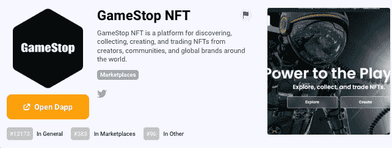
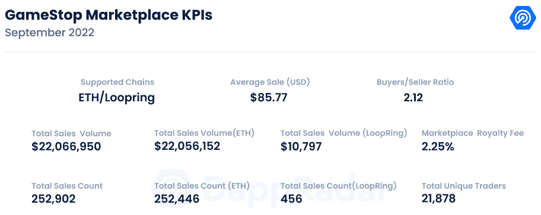
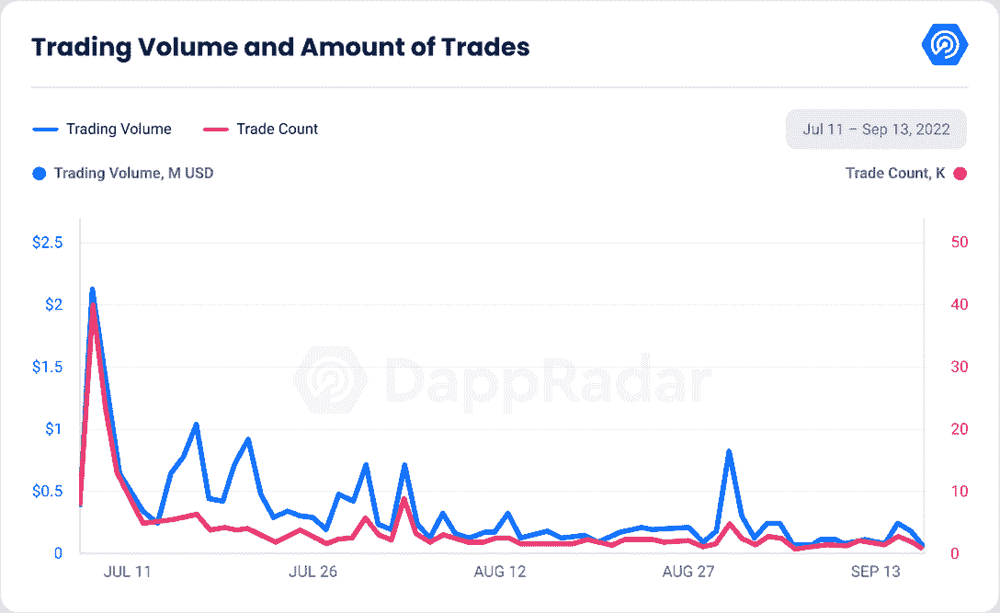
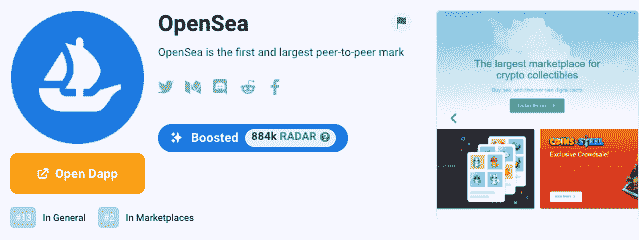
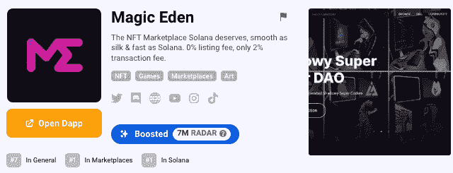
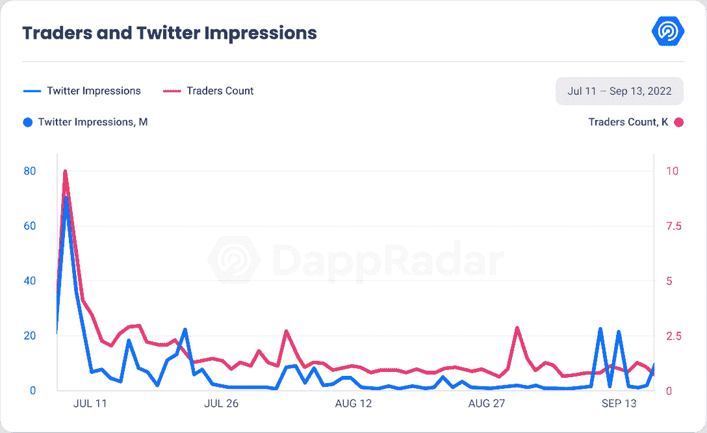

# 新的 Dapps 报告:GameStop 市场

> 原文：<https://web.archive.org/web/https://dappradar.com/blog/new-dapps-report-gamestop-marketplace>

## GameStop 是 NFT 市场的新成员。

**在 2022 年 9 月版的 DappRadar 的新 Dapps 报告中，我们更深入地研究了爬上** [**NFT 图表**](https://web.archive.org/web/20220926001822/https://dappradar.com/hub/nft-explorer) **的 Dapps 和市场。新的 Dapps 报告详细分析了 NFT 收藏的财务指标，极具吸引力。**

这份新的 Dapps 报告是一系列执行报告的一部分，为读者提供了一个有前途的、有收益的 NFT 收藏品和市场的高层次视角。该报告侧重于财务指标，包括销售活动、价格分析和分布指标，如独特持有人比率和鲸鱼集中指数。它还深入研究了鲸鱼的行为模式以及社会和技术概况。

7 月 11 日发布的 GameStop Marketplace 最近已经整合到 DappRadar 中。GameStop 是 NFT 市场的新来者，之前通过视频游戏零售店的广泛连锁而闻名。

[<picture></picture>](https://web.archive.org/web/20220926001822/https://dappradar.com/other/marketplaces/gamestop-nft)

GameStop 在 2021 年 1 月吸引了市场参与者的注意，当时其股票从每股 5 美元飙升至 80 美元，有些交易高达 120 美元。由于其失败的商业模式和对新的在线销售环境的延迟适应，该公司股票被过度卖空。从那以后，它重新改造了自己，并没有在游戏 NFT 领域领先。

请不要将本文件视为财务建议。

**数据更新日期:****2022 年 9 月 15 日**

## 目录

*   [关键要点](https://web.archive.org/web/20220926001822/https://dappradar.com/blog/new-dapps-report-gamestop-marketplace/#Key-Takeaways)
*   [财务概况](https://web.archive.org/web/20220926001822/https://dappradar.com/blog/new-dapps-report-gamestop-marketplace/#Financial-Overview-)
*   [争议产生](https://web.archive.org/web/20220926001822/https://dappradar.com/blog/new-dapps-report-gamestop-marketplace/#Controversy-arises)
*   [社会意识和参与度](https://web.archive.org/web/20220926001822/https://dappradar.com/blog/new-dapps-report-gamestop-marketplace/#Social-Awareness-and-Engagement-)
*   [技术概述](https://web.archive.org/web/20220926001822/https://dappradar.com/blog/new-dapps-report-gamestop-marketplace/#Technical-Overview)

## 关键要点

*   最高交易量是在推出后的第二天，累计交易量为 200 万美元。
*   该平台的总交易量刚刚超过 2200 万美元，其中 58%是在 7 月的第一个交易月赚的。
*   自发布以来，GameStop 大约赚了 496，506 美元。
*   2022 年 8 月，GameStop 是第九大 NFT 市场，交易额为 6，387，516 美元。

## 财务概述

### Gamestop 市场–逐渐衰落

### **区块链:**以太坊/ LoopRing

**上市日期:**2022 年 7 月 11 日

Source: DappRadar

GameStop 是 NFTs 领域的后来者。一个没人预料到的举动。它加入了寻求削弱公海主导地位的挑战者行列。截至 2022 年 8 月，它在交易量最大的市场中排名第九。

GameStop 的最高交易量是在 7 月 12 日，交易的第二天。它的交易额超过了 200 万美元，有 4.1 万笔交易。

平均下来，每笔交易要花费 48 美元。超过一半(58%)的 dapp 交易总量是在 7 月的第一个月完成的。这一流量连续几天急剧下降，几个月来一直处于低位。截至 9 月份的平均交易量为 334，184 美元。

关于交易者，GameStop 总共有 21，878 个独立交易者，最高记录是 7 月 12 日的 9981 个。与 OpenSea 相比，这些统计数据并不起眼，open sea 使这些参数相形见绌。相比之下，OpenSea 的日交易量为 1000 万美元，市场上平均有 33，474 名交易者。

[<picture></picture>](https://web.archive.org/web/20220926001822/https://dappradar.com/multichain/marketplaces/opensea)

然而，这种低于标准的表现是由几个因素造成的。一个关键因素是 GameStop 在一个充满挑战的市场推出。由于乌克兰战争、能源价格上涨以及 2020 年以来 16 万亿美元流动性刺激导致的通货膨胀等宏观经济因素，市场已经看跌。

自 1 月份 57 亿美元的峰值以来，8 月份市场交易量暴跌了 85%。虽然与 NFTs 没有直接关系，但 Terra Luna 的崩溃已经极大地影响了比特币的价格。比特币的贬值对其他加密资产产生了连锁效应，迫使许多人进行清算。结果，非功能性食品的价格下降了，人们的胃口也变小了。

其次，竞争也非常激烈，因为多个其他市场一直在争夺主导地位，并蚕食 OpenSea 的宝座。X2Y2 是第二大市场，占据了近四分之一的 NFT 交易总量。

[<picture></picture>](https://web.archive.org/web/20220926001822/https://dappradar.com/solana/marketplaces/magic-eden)

魔力伊甸园(Magic Eden)位居第三，这是一个专注于索拉纳的市场，控制着 7.1%的市场份额。相比之下，GameStop 仅占 T2 NFT 总销售额的 0.7%。

尽管在游戏相关的非功能性游戏上有很大的倾斜，但它与同行相比并没有实质性的优势。GameStop 也是在许多大品牌如迪士尼、华纳兄弟和比特币基地建立市场的时候推出的。

尽管如此，在 2022 年 8 月，GameStop 仍是第九大市场，总交易额为 6，387，516 美元，仅略高于 [NBA Top Shot](https://web.archive.org/web/20220926001822/https://dappradar.com/flow/collectibles/nba-topshot) 。NBA 总成交量为 6752696 美元，仅比 GameStop 高 5%。

### 争议出现了

尽管在技术层面上相对顺利，但该产品的推出已经引发了一系列争议，对市场声誉产生了负面影响。

7 月，GameStop 有一个宇航员主题，并专注于销售相关的 NFT。其中一张 NFT 是一张 911 恐怖袭击中一名男子从双子塔坠落的著名照片的 PS 版。

NFT 被多次出售，在被撤出市场之前达到了 5eth/7492 美元的价格。麻烦并没有就此结束；另一个系列被发现销售未经许可的作品，在社区的强烈反对下被删除。

据说，由用户 NiFty 创建的集合“街机游戏”一直在销售带有各种游戏的街机柜的交互式 NFT。集合的创作者在没有得到游戏原创者许可的情况下，一直在销售这些。

由于上述因素，GameStop 作为市场的表现并不出色。它的总收入超过 2200 万美元，销量为 252，000 部。对于该公司来说，这净收益为 496，506 美元，接近 50 万美元。

根据 Q2 报道，GameStop 的收入为 14 亿美元。这意味着 NFTs 将只占总数的 3.5%，这不是 GameStop 业务的重要组成部分。

一个可能的答案是，GameStop 寄希望于区块链游戏和游戏资产交易的增长。据 Crypto.com 称，区块链游戏今年已经获得了价值 60 亿美元的投资，到 2025 年将成为价值 500 亿美元的产业。

目前，区块链游戏在区块链互动中占主导地位，2021 年 8 月区块链 dapp 互动中有 51%是与区块链游戏进行的，达到 847，230 次。这种优势在全年持续增强。

### 社会意识和参与

Source: DappRadar

GameStop 的 Twitter 印象与平台上的交易者数量相关。我们可以观察到与交易量相同的模式，在最初的上涨之后是急剧的下跌。最高的 9981 名交易者出现在 7 月 12 日。目前 9 月份的平均水平约为 1200 名交易员，较峰值水平下降了 87%。

GameStop 在 2022 年 3 月创建了一个 [Twitter](https://web.archive.org/web/20220926001822/https://twitter.com/GameStopNFT?ref_src=twsrc%5Egoogle%7Ctwcamp%5Eserp%7Ctwgr%5Eauthor) 账户。该简介目前有 84，933 名粉丝，5 月份增加了 40%的粉丝。自 5 月份以来，在过去 30 天里，平均每日增长已降至 142 名新粉丝。

GameStop 没有不和，也没有已知的计划，如果它实习生在未来创建一个。

## 收款和交易

虽然 GameStop 有很多独特的游戏系列，但它的表现主要被其他市场的系列所掩盖。

在过去的三十天里，GMERICA 1 中最畅销的系列是由 GameStop 自己制作的。收藏总量为 664 ETH 或 996，000 美元。0.11 ETH 或 165 美元的底价，只有五种不同类型的 NFT，总计 532。

尽管它是一个旗舰系列，但它缺少当前用户期望的几个功能。艺术是漂亮的，但只有五种不同的 NFT，供应相对有限。

一个方面是旗舰系列的性能更好。与像伦加这样在公海上新造的相比，底价低于平均水平。目前来看，9 月 7 日铸造的 [RENGA](https://web.archive.org/web/20220926001822/https://opensea.io/collection/renga) ，底价为 0.84 ETH，体积为 2700 ETH，藏品共供应 6900 件资产。

虽然这并不是对 GMERICA 1 表现的控诉，但 GameStop 无疑可以努力吸引那些能够制作下一个热门系列的创作者，如 [CloneX](https://web.archive.org/web/20220926001822/https://dappradar.com/hub/nft-explorer/collection/clonex) 、 [Moonbirds](https://web.archive.org/web/20220926001822/https://dappradar.com/ethereum/collectibles/moonbirds) 或 BAC，这将是 GameStop 独有的。

尽管 GameStop marketplace 的设计非常时尚，但它今天仍然缺少许多与其竞争对手相关的功能。

购买者需要能够过滤和排序集合中的单个资产，并根据它们的性能过滤不同的集合。就目前而言，分类工具相当有限。Gamestop 还将受益于对许多收藏的交易性能和统计支持的跟踪。如果没有平均价格、NFT 的交易历史和底价的历史进程，人们会感到失职。

购买者将欣赏批量或打包购买多个非功能性食物的能力。

那些更倾向于技术的用户可能需要链接到给定集合的 Etherscan，或者链接到大多数集合所缺少的 socials。

没有这些功能，GameStop 将很难吸引必要的人才在其平台上销售。

## 技术概述

从技术角度来看，GameStop 没有任何技术问题。到目前为止，该市场没有黑客攻击、漏洞利用或任何其他重大违规行为。

市场建立在第 2 层解决方案 Loopring 之上。这意味着低费用和高交易速度，由[以太坊](https://web.archive.org/web/20220926001822/https://dappradar.com/rankings/protocol/ethereum)主网保障。

GameStop 遇到了用户将未经许可的作品作为 NFTs 出售的问题，GameStop 只是因为社区的强烈反对才删除了这些内容。这个问题源于这样一个事实，即 GameStop 不验证销售的产品是否是真的，而是将确定产品有效性的责任转移给买家。尽管 GameStop 根据其 TOS 保护知识产权，但确保知识产权的程序很少。

## 摘要

截至 2022 年 8 月，GameStop 是 NFTs 的第九大市场，占 7 月 11 日推出的 NFT 市场总份额的 0.7%。在首次推出时，交易量增加了 200 万美元，7 月 12 日共售出 4.1 万份。该项目的推出在社交媒体上受到了极大的欢迎，3 月份为该项目推出的官方 Twitter 页面有稳定的粉丝流入，尤其是在 5 月份，占该账户总增长的 40%。GameStop 专注于游戏相关的 NFTs，并计划将该平台作为其游戏业务的延伸。

发射发生在一个非常不合时宜的时间。许多宏观经济因素，如乌克兰战争、通胀和能源成本上升、Terra Luna 崩溃以及许多加密资产贬值，导致了长期熊市。

熊市降低了对 NFTs 的热情，影响了 GameStop 的销售。GameStop 也是在竞争非常激烈的时候推出的，因为许多其他市场如 LooksRare 和 Magic Eden 已经出现。GameStop 是加密领域的新手，缺乏与这些市场竞争的优势。

虽然此次发布在技术上取得了成功，部分原因是第 2 层环路解决方案确保了快速翻译速度和低油费，但它也不是没有问题。GameStop 在质量控制方面一直很松懈，并因出售一张在 911 恐怖袭击期间从世贸中心坠落的男子的 PS 照片而卷入了众多争议。

另一个争议涉及出售一个收藏，这个收藏的资产不是创作者所有，而是从其他创作者那里挪用的。该集合最终被删除，但只是在社区强烈反对之后。

尽管最初的发布并不成功，GameStop 仍然寄希望于区块链游戏带来的光明未来。一些人估计，该行业的估值将在未来三年内达到 500 亿美元，GameStop 希望在这一发展中发挥关键作用。