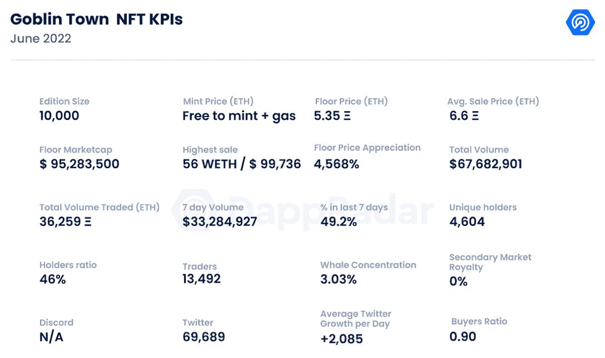
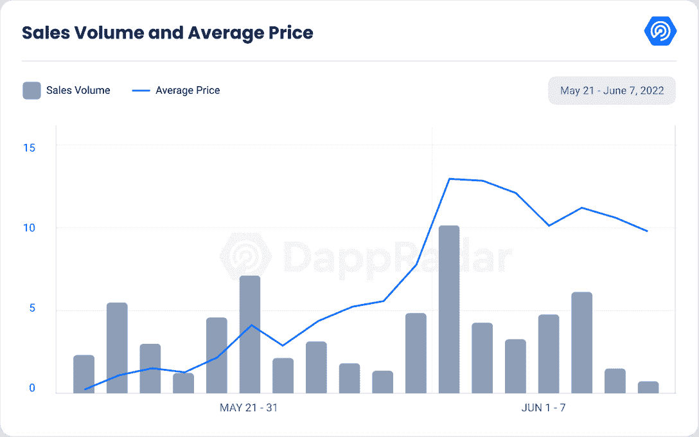
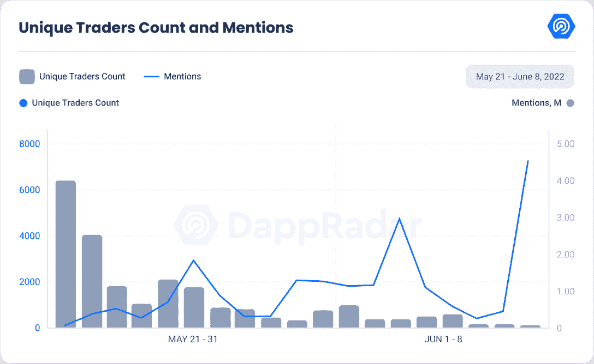
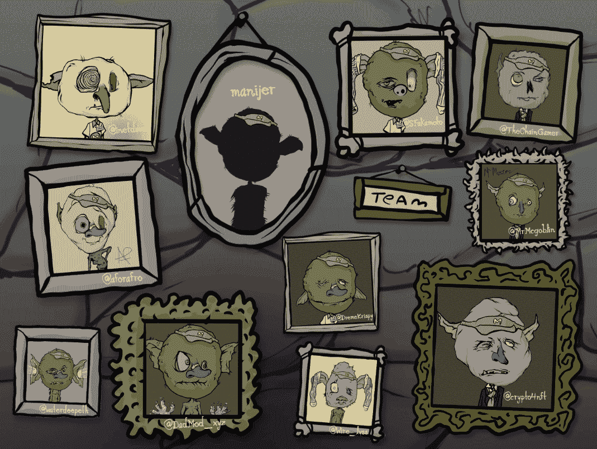

# 新的 Dapps 报告:哥布林镇-挑战传统和熊市

> 原文：<https://web.archive.org/web/https://dappradar.com/blog/new-dapps-report-goblin-town-defying-tradition-and-the-bear-market>

## 哥布林镇在两周内加入了 NFT 主要收藏品的行列，无视熊市的可能性。

在 2022 年 6 月版的 DappRadar 的新 Dapps 报告中，我们看到了流行和有趣的 NFT 系列，这次我们涵盖了妖精镇。新的 Dapps 报告对 NFT 收藏的财务指标进行了深入分析。

这份新的 Dapps 报告是一系列执行报告的一部分，为读者提供了一个充满希望的、可再生的 NFT 收藏的高层次视角。该报告侧重于财务指标，包括销售活动和价格分析，以及分布指标，如独特持有人比率和鲸鱼集中指数。它还深入研究了鲸鱼的行为模式以及社会和技术概况。

[妖精镇](https://web.archive.org/web/20220704234051/https://dappradar.com/hub/nft-explorer/collection/goblintownnft)是 5 月 19 日发布的[万 NFT](https://web.archive.org/web/20220704234051/https://dappradar.com/ethereum/collectibles/goblintown)合集。该系列[颠覆了标准 NFT 做法](https://web.archive.org/web/20220704234051/https://dappradar.com/blog/what-is-goblin-town)的剧本，几乎做了所有倒退的事情。这个项目实现的最值得注意的不寻常的方法包括匿名团队、无冲突服务器、免费造币厂和在第一次社区呼叫期间不连贯的尖叫。

具有讽刺意味的是，这被证明是获胜的公式，因为它是过去七天中最畅销的系列之一，销售额超过 3300 万美元。

请不要将本文件视为财务建议。

**数据更新日期:2022 年 6 月 9 日**

## 目录

*   [关键要点](https://web.archive.org/web/20220704234051/https://dappradar.com/blog/new-dapps-report-goblin-town-defying-tradition-and-the-bear-market/#Key)
*   [财务概况](https://web.archive.org/web/20220704234051/https://dappradar.com/blog/new-dapps-report-goblin-town-defying-tradition-and-the-bear-market/#Strong-Performance)
*   [效用](https://web.archive.org/web/20220704234051/https://dappradar.com/blog/new-dapps-report-goblin-town-defying-tradition-and-the-bear-market/#Utility)
*   [社会意识和参与度](https://web.archive.org/web/20220704234051/https://dappradar.com/blog/new-dapps-report-goblin-town-defying-tradition-and-the-bear-market/#Social-Awareness)
*   [技术概述](https://web.archive.org/web/20220704234051/https://dappradar.com/blog/new-dapps-report-goblin-town-defying-tradition-and-the-bear-market/#Technical-Overview)

## 关键要点

*   哥布林镇是过去七天中交易量最大的收藏，交易量为 3330 万美元。
*   自铸币厂以来，地板价格已经升值了 4，568%，在撰写本文时已经超过了 5 ETH。

Source: DappRadar

## 哥布林镇——强大的性能

## **区块链:**以太坊

**上市日期:**2022 年 5 月 19 日

**版本数量:** 10，000-限量版

**特质:** 10

**属性:** 193

**底价:** 5.35 瑞士法郎

Source: DappRadar

哥布林镇在过去的七天里创造了 3300 万美元的收入，接近该系列总销售额的 50%。总交易量超过 6700 万美元，使哥布林镇成为过去两周交易量第五大的收藏，击败了 CloneX，Doodles 和 Moonbirds 等收藏。虽然造币厂是免费的，但造币厂一天的平均销售价格是 0.11 ETH。

在撰写本文时，5.35 ETH 的当前楼面价已升值 4568%，而均价升值 5659%。哥布林镇优于我们最近报道的许多成功的系列，例如来自志那都红豆的[比恩兹](https://web.archive.org/web/20220704234051/https://dappradar.com/blog/new-dapps-report-beanz-surprise-airdrop-from-azuki)、[村上春树](https://web.archive.org/web/20220704234051/https://dappradar.com/blog/new-dapps-report-murakami-flowers-murakami-goes-back-to-his-roots)和[网络经纪人](https://web.archive.org/web/20220704234051/https://dappradar.com/blog/new-dapps-report-cyberbrokers)。它们的底价分别增长了 42.5%、3，696%和 620%，而它们的七天交易量分别为 1，000 万美元、1，800 万美元和 300 万美元。

大多数收藏品通常在最初几天经历巨大的交易高峰，然后是急剧下降。哥布林镇遵循不同的模式，每日交易量来回波动，显示整体增长。最密集的交易日是 6 月 1 日，正好是首次造币后的一个多星期，不像大多数收藏品通常在造币当天交易量最大。

仍有 1000 只地精被保留，将在晚些时候释放。这表明很快会有更活跃的交易活动，因为通常情况下，最稀有的交易会被保留下来。

### 增加了效用-没有效用

哥布林镇背后的团队声称，除了艺术本身之外，这个项目没有路线图，也没有其他用途，这增加了这个系列的怪异元素。

在官方网站上，有一个名为哥布林镇汉堡的子部分，用户可以连接他们的钱包设计他们的哥布林汉堡，并免费铸造它，前提是他们拥有一个哥布林。

到目前为止，这些汉堡还没有实用价值，但是有一个有趣的姐妹网站启动了，叫做[githalpurger . wtf](https://web.archive.org/web/20220704234051/https://githalpburger.wtf/)。该网站列出了该团队及其各自的 Twitter 账号，并暗示了未来更大的计划。其中提到了一个路线图和一个预告，指出“sumtinn delishus wuz brewin”(原文如此)。但是，没有指定任何内容。

### 社会意识和参与

Source: DappRadar

哥布林镇继续挑战传统。它没有不和谐的服务器让人们聚集在项目周围。他们的[推特](https://web.archive.org/web/20220704234051/https://twitter.com/goblintownwtf)于 2022 年 5 月上线，目前拥有**69689 名粉丝**。

在过去的 30 天里，该账户经历了 100%的增长，平均每天获得 2085 名新关注者**。这是该系列增长和需求增加的有力标志。**

另一方面，Twitter 上有未经证实的传言称，这个收藏是宇迦实验室(以无聊猿闻名)的一个秘密项目，这继续推动人们对这个收藏的猜测和兴趣。

Source:  [githalpburger.wtf](https://web.archive.org/web/20220704234051/https://githalpburger.wtf/)

哥布林镇团队没有公开他们自己，他们的身份对每个人来说都是一个谜。人们只知道这些团队成员的 Twitter 账户，其中大部分账户还不到几个月。创作者自我意识到这一事实，并在官方页面上轻描淡写。

该项目的负责人是[加尔夫](https://web.archive.org/web/20220704234051/https://twitter.com/garfwtf)和[乌尔基。](https://web.archive.org/web/20220704234051/https://twitter.com/urkiwtf)姐妹网站[githalpurger . wtf](https://web.archive.org/web/20220704234051/https://githalpburger.wtf/)列出了管理地精镇汉堡店的地精团队。管理团队由[@ crypto 4 NFT](https://web.archive.org/web/20220704234051/https://twitter.com/crypto4nft)[@ aforafro](https://web.archive.org/web/20220704234051/https://twitter.com/aforafro)[@ waterdeepeth](https://web.archive.org/web/20220704234051/https://twitter.com/waterdeepeth)[@ MrMcgoblin](https://web.archive.org/web/20220704234051/https://twitter.com/MrMcgoblin)、 [@inetdave](https://web.archive.org/web/20220704234051/https://twitter.com/inetdave) 和 [@Wire_lyss](https://web.archive.org/web/20220704234051/https://twitter.com/Wire_lyss) 组成。而成员 [@TheChainGamer](https://web.archive.org/web/20220704234051/https://twitter.com/TheChainGamer) 、 [@DadMod_xyz](https://web.archive.org/web/20220704234051/https://twitter.com/DadMod_xyz) 、 [@DremeKrispy](https://web.archive.org/web/20220704234051/https://twitter.com/DremeKrispy) 则没有列出具体的角色。

传统上，这种缺乏透明度的情况会令大多数投资者担忧；然而，社区已经决定接受这方面的收集。如上所述，有人推测宇迦实验室或加里·维是这个项目的幕后黑手，但这一点尚未得到证实。

## 鲸鱼钱包分析

妖精小镇目前唯一持有人比例 **46%** ，表示收藏相对集中。较低的比率表明对价格突变的敏感度较高。在 **3.3%** ，其鲸密度非常低。更高的鲸鱼聚集度表明知名收藏者操纵价格的风险增加。

一条著名的鲸鱼 [761.eth](https://web.archive.org/web/20220704234051/https://dappradar.com/hub/wallet/eth/0x4ffe2f674c4afa078554cb2e5a6a672452b6c290) 是前五名持有者之一。他们持有 55 个妖精或者总收藏的 0.5501%。引人注目的鲸鱼的低参与度表明该收藏的价格操纵风险较低。他们的缺席有时也显示了收藏的财务吸引力下降。我们总是建议潜在买家进行尽职调查。

## 技术概述

像大多数 NFT 项目一样，哥布林镇使用 IPFS 存储其元数据，而不是完全在链上。这种类型的存储在 NFT 中很常见，因为完全在链上存储图像会产生过多的数据。尽管没有关于该项目的已知技术问题的报告，但谨慎总是明智的，特别是由于开发团队缺乏透明度。很难衡量团队在运行这些项目中的专业知识和他们的意图。

*   **审计状态:**尚未执行审计

*   存储:NFT 作为 ERC-721 令牌存储在以太坊区块链上，而视觉效果在 IPFS 上永久存在。

*   **合同地址:**[0x BCE 3781 AE 7 ca 1 a5e 050 BD 9 C4 c 77369867 ebc 307 e](https://web.archive.org/web/20220704234051/https://etherscan.io/address/0xbce3781ae7ca1a5e050bd9c4c77369867ebc307e)

## 摘要

妖精城的存在本身就是一个矛盾。根据惯例，这是一个不应该成功的系列，但它没有遵循任何传统惯例，并在充满逆风的市场中蓬勃发展。在过去的七天里，该系列的每周交易量超过 3300 万美元，总交易量超过 6700 万美元。在撰写本文时，它是上周交易量最大的收藏，也是前两周交易量第五大的收藏。它还有一个非常显著的底价升值 4，568%

尽管取得了成功的财务数据，但该系列缺乏许多与传统成功的 NFT 项目相关的特征。虽然它在 Twitter 上有很多追随者，但它没有一个不和谐的渠道来围绕这个项目创建一个社区。

此外，该项目在其官方页面上显示，它没有路线图，也没有实用程序(除了 PFPS)。因此，很难确定这个系列作为一个项目是否有长期的生命力。

在 Twitter 上，许多人猜测这些收藏是宇迦实验室的秘密附带项目，或者可能是最新的加里·维事业。这些谣言尚未得到证实，但继续推动 NFT 社区的兴趣。

 NewsletterUnsubscribe at any time. [T&Cs](https://web.archive.org/web/20220704234051/https://dappradar.com/terms) and [Privacy Policy](https://web.archive.org/web/20220704234051/https://dappradar.com/privacy-policy)