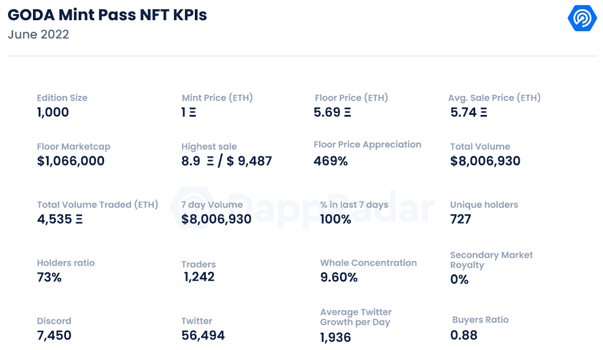
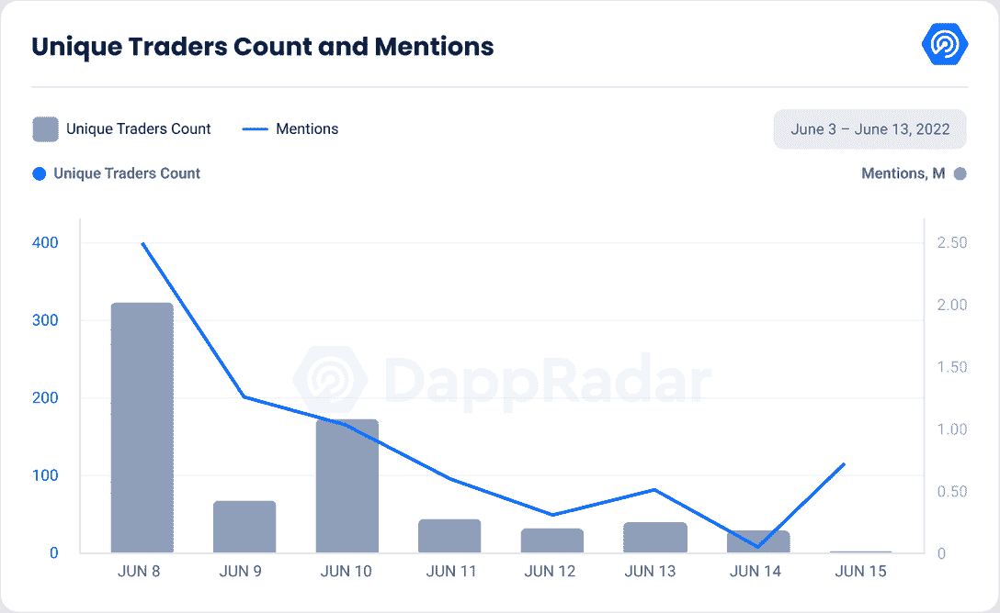
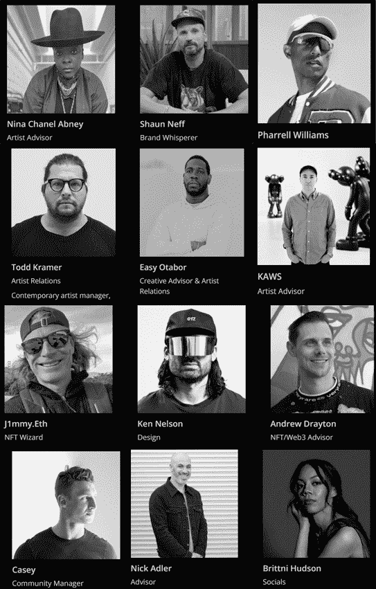

# 新 Dapps 报告:GODA Mint Pass——艺术与网络之间的门户 3

> 原文：<https://web.archive.org/web/https://dappradar.com/blog/new-dapps-report-goda-mint-pass-gateway-between-art-and-web3>

## GODA Mint Pass 是一个艺术 NFT 收藏，为艺术家进入 NFT 的世界提供了一个公平的竞争环境。

**在 2022 年 6 月版的 DappRadar 新 Dapps 报告中，我们更深入地探讨了 GODA Mint Pass 系列，它正在攀登** [**NFT 排行榜**](https://web.archive.org/web/20220712234217/https://dappradar.com/hub/nft-explorer) **。新的 Dapps 报告详细分析了 NFT 收藏的财务指标，极具吸引力。**

这份新的 Dapps 报告是一系列执行报告的一部分，为读者提供了一个充满希望的、可再生的 NFT 收藏的高层次视角。该报告侧重于财务指标，包括销售活动、价格分析和分布指标，如独特持有人比率和鲸鱼集中指数。它还深入研究了鲸鱼的行为模式以及社会和技术概况。

数字资产画廊 Mint Pass 收藏了 1000 张门票，允许持有者参观私人策划的当代艺术展览。这是一个传统艺术的收藏家和发展艺术家的平台，使双方能够进入 web3 和 NFTs 的世界。

这个项目由妮娜·阿布尼领导，她有着成功的艺术背景。她很难从传统背景进入非传统艺术领域，她旨在简化未来艺术家从边缘化社会群体进入非传统艺术领域的过程。

请不要将本文件视为财务建议。

**数据更新日期:****2022 年 6 月 16 日**

## 目录

*   [关键要点](https://web.archive.org/web/20220712234217/https://dappradar.com/blog/new-dapps-report-goda-mint-pass-gateway-between-art-and-web3/#Key)
*   [财务概况](https://web.archive.org/web/20220712234217/https://dappradar.com/blog/new-dapps-report-goda-mint-pass-gateway-between-art-and-web3/#financial)
*   [效用](https://web.archive.org/web/20220712234217/https://dappradar.com/blog/new-dapps-report-goda-mint-pass-gateway-between-art-and-web3/#Utility)
*   [社会意识和参与度](https://web.archive.org/web/20220712234217/https://dappradar.com/blog/new-dapps-report-goda-mint-pass-gateway-between-art-and-web3/#Social-Awareness)
*   [技术概述](https://web.archive.org/web/20220712234217/https://dappradar.com/blog/new-dapps-report-goda-mint-pass-gateway-between-art-and-web3/#Technical-)

## 关键要点

*   GODA 是过去七天中交易量第四大的藏品，交易量超过 800 万美元
*   自铸币厂以来，该系列的底价已经上涨了 469%

## GODA Mint Pass–超出其重量的小系列

## **区块链:**以太坊

**上市日期:**2022 年 6 月 8 日

**版本数量:**1000-限量版

**性状:** 1

**属性:**不适用

**底价:** 5.74 瑞士法郎

**来源:** [达普拉达](https://web.archive.org/web/20220712234217/https://dappradar.com/)

GODA 的财务概况显示，它的资产比大多数收藏品少得多。大多数收藏有八到一万件，有些低至五千件，而 GODA 只有一千件资产。

这一点很重要，因为尽管数量不多，GODA 的销量却超过了许多著名的收藏。自推出以来的一周内，它已经积累了超过 800 万美元的交易量，击败了我们最近报道的[哥布林镇](https://web.archive.org/web/20220712234217/https://dappradar.com/blog/new-dapps-report-goblin-town-defying-tradition-and-the-bear-market)和[瓦格纳](https://web.archive.org/web/20220712234217/https://dappradar.com/blog/new-dapps-report-we-are-all-going-to-die-embraces-uncertainty)等领先系列。

该系列遵循标准的交易模式。它在交易日经历了相当大的交易高峰，随后几天迅速消退。在最初的几天里，平均价格同样快速上涨，6 月 12 日高达 10.6 ETH，目前为 5.74 ETH，自铸币厂成立以来上涨了 474%。

楼面价也不甘落后，坐地 5.69 ETH 它显示出比原价升值了 467%。与 Veefriends Series 2 和 Wagdie 等近期系列相比，这种价格升值在熊市中是稳固的，它们分别升值了 85%和 24%。

但落后于[妖精小镇](https://web.archive.org/web/20220712234217/https://dappradar.com/blog/new-dapps-report-goblin-town-defying-tradition-and-the-bear-market)和[村上花](https://web.archive.org/web/20220712234217/https://dappradar.com/blog/new-dapps-report-murakami-flowers-murakami-goes-back-to-his-roots)，分别升值 4568%和 3696%。底价和均价之间相对较小的差异是因为集合中的所有 NFT 都可以互换，彼此拥有相同的方面。

最终，价格差异主要源于潜在持有者的时间偏好。

### 附加的实用性——网络 3 和艺术之间的桥梁

该系列有一个独特的机制，可以满足投资艺术品的专业收藏家和希望快速获得数字曝光的新锐艺术家的需求。

持有通行证的收藏者可以进入专业策划的在线展览，确保只有最好的作品才能展出。当然，通行证持有者可以优先挑选收藏品中最好的作品。

对于那些希望通过投资艺术品等另类资产来分散投资组合的投资者来说，这可能具有潜在的吸引力。

对于艺术家持有者来说，它提供了一个机会，可以进入一个与他们的理想一致的新兴空间，并为他们的艺术提供公平的价值。

### 社会意识和参与

Source: DappRadar

[Twitter](https://web.archive.org/web/20220712234217/https://twitter.com/TheGoda_io) 于 2022 年 2 月上线，但在 2022 年 5 月 23 日开始活跃。像许多传统的 NFT 项目一样，GODA 有一个 Twitter、Discord、Instagram 和一个官方网站。

Twitter 上的个人资料目前有 56494 名关注者，其中 **100%** 是在过去两周内增加的。Dapp 报告的第一条消息是，Twitter 在 6 月 10 日达到顶峰，拥有超过 6 万名用户，此后一直在缓慢下降。

考虑到这种下降，个人资料每天增加 1936 名新粉丝，这是我们在 DappReports 上记录的平均增长率。

[Discord](https://web.archive.org/web/20220712234217/https://discord.com/invite/thegoda) 有 7450 个注册用户，服务器也比较活跃。该团队还为其用户提供了一个简单的入职程序。人们聚集在三个公共频道，由于积极的调解团队，机器人和坏演员的存在是最小的。GODA 还有一个 Instagram，用于发布该项目的宣传材料，拥有 1958 名粉丝。

### 团队概述

Source: [thegoda.io](https://web.archive.org/web/20220712234217/https://thegoda.io/)

GODA 的团队是完全公开的，由来自时尚、密码和美术的专家组成。这种透明度为广受欢迎的 NFT 项目增加了更多信任。

其中包括:

妮娜·阿布尼——项目负责人兼艺术家顾问。多才多艺的优秀艺术家，她的收藏在现代艺术博物馆、瓦砾堆和惠特尼美国艺术博物馆展出。

[Shaun Neff](https://web.archive.org/web/20220712234217/https://www.linkedin.com/in/shaun-neff-8b608032?original_referer=https%3A%2F%2Fwww.google.com%2F)-与索尼、沙盒和罗宾汉交易应用合作的品牌顾问。

法瑞尔·威廉姆斯(Pharell Williams)——格莱美奖获得者、制片人和时装设计师。

[KAWS](https://web.archive.org/web/20220712234217/https://en.wikipedia.org/wiki/Kaws) 阿卡布莱恩·唐纳利——杰出的艺术家和设计师。他以创作雕塑、绘画和版画而闻名。

[托德·克莱默](https://web.archive.org/web/20220712234217/https://twitter.com/toddkramer1)–Web3 顾问兼艺术家经理

easy Otabor——创意顾问和艺术家关系经理

尼克·阿德勒——元宇宙的顾问，曾为 Snoop Dog 的 web3 项目提供建议

brittni Hudson–社交媒体经理

[J1mmy。eth](https://web.archive.org/web/20220712234217/https://twitter.com/j1mmyeth)——著名的 NFT 收藏家和无名画廊的创始人

肯·尼尔森——品牌设计师，曾与史努比·道格等艺术家和迪斯尼等卡莉法公司合作。

安德鲁·德雷顿——NFT 和 web3 顾问。他创建了[沃古集体。](https://web.archive.org/web/20220712234217/https://www.thevogu.io/)

Casey–团队的社区经理。

Ryan Ross——第二代艺术品经销商，25 年的私人艺术顾问。

该团队是全方位的，多名专家涵盖了所有必要的基础，如开发，品牌，艺术制作和社区关系。这样的团队构成激发了信心，并与社区建立了信任。

## 鲸鱼钱包分析

GODA 拥有独特的持有人比例 **73%** ，这表明它是一个非常多元化的系列。唯一持有人越多，持有人之间串通的可能性就越小。较高的比率也表明价格突然波动的风险较低。

鲸鱼的浓度为 9.60%(T1)，是我们在 Dapp 报告中记录的最高值之一。在前五名持有者中，有两条比较突出的鲸鱼。分别是 [jpegjohnny.eth](https://web.archive.org/web/20220712234217/https://dappradar.com/hub/wallet/eth/0xa69ed878d740e84d0d61c05c903b68e41e92d678) 和 [hypebeast.eth](https://web.archive.org/web/20220712234217/https://dappradar.com/hub/wallet/eth/0xcde960e12d87521395a6ef671ac6d4a935905dc7) 。

更高的鲸鱼聚集度表明著名收藏者操纵价格的风险增加。更高的鲸鱼集中度也增加了抛售的风险，如果他们清算他们的持有。抛售通常会引起连锁反应，迫使许多较小的鳍状肢也抛售。我们总是建议潜在买家进行尽职调查。

## 技术概述

像大多数 NFT 项目一样，GODA 使用 IPFS 存储元数据，而不是完全在链上。这种类型的存储是标准做法，因为在链上存储图像通常数据量太大。虽然没有关于这个项目的已知技术问题的报告，但谨慎总是明智的，主要是因为开发团队缺乏透明度。衡量团队在运行这些项目中的专业知识或他们的意图可能是具有挑战性的。

*   审计状态:尚未执行审计

*   存储:NFT 作为 ERC-721 令牌存储在以太坊区块链上，而视觉在 IPFS 上保持不变的所有权。

*   合同地址:[0x 0a 36 f 2178 c 0 db 2 c 85471 c 45334 a1 DD 17d 130 FD 42](https://web.archive.org/web/20220712234217/https://etherscan.io/address/0x0a36f2178c0db2c85471c45334a1dd17d130fd42)

## 摘要

GODA 是一个新颖的系列，具有许多与众不同的特点。与大多数收藏不同，它不是个人资料图片，而是根据用户的偏好解锁各种服务的实用工具通行证。

尽管它的资产计数很低，只有 1000，但该团队正在挤掉许多周交易量(也是总交易量)超过 800 万美元的既定收藏。价格和交易量的增长遵循标准的模式，即在最初几天剧烈增长，然后迅速下降。

楼面价 469%的升值幅度，与其同时代相比，属于中等水平。没有妖精镇(4568%)高，也没有 Wagdie (24%)低。该系列最独特的功能是通行证附带的实用工具。

该通行证面向艺术家和艺术收藏家/投资者，他们希望投资现代艺术，并获得进入专业策展画廊和最佳投资选择的额外待遇。

另一方面，艺术家们有专业的经理和专家帮助他们将传统艺术融入到 web3 基础设施中。GODA 团队将确保艺术家对艺术过程感到满意，并为他们的工作获得公平的报酬。

在这个熊市中，大多数投资资产都在贬值，就连债券、零售股票和贵金属等传统安全避风港也感受到了损失。

许多投资者正在寻找其他投资方式，并被艺术这一需要特定知识的专业领域所吸引。这正是 GODA 向其持有者提供的独特价值主张。

该项目由一组公众和非常成功的个人组成，增加了其成功的几率。