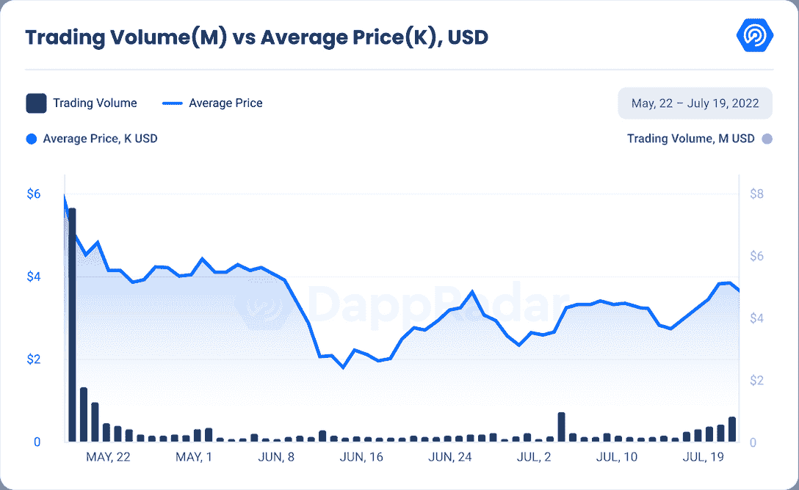
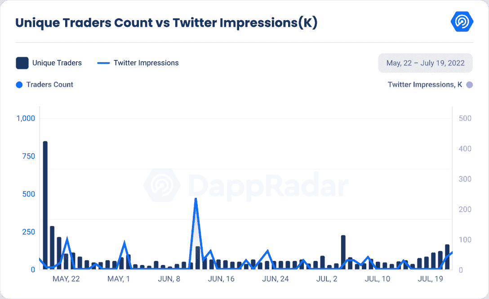

# 新的 Dapps 报告:奇怪的月鸟

> 原文：<https://web.archive.org/web/https://dappradar.com/blog/new-dapps-report-moonbirds-oddities>

## 将在 NFT 市场掀起一阵风暴的月鸟系列。

**在 2022 年 7 月版的 DappRadar 的新 Dapps 报告中，我们更深入地探讨了******的月鸟怪事，它们正在攀登** [**的 NFT 排行榜**](https://web.archive.org/web/20220906092115/https://dappradar.com/hub/nft-explorer) **。新的 Dapps 报告详细分析了 NFT 收藏的财务指标，极具吸引力。****

 **这份新的 Dapps 报告是一系列执行报告的一部分，为读者提供了一个充满希望的、可再生的 NFT 收藏的高层次视角。该报告侧重于财务指标，包括销售活动、价格分析和分布指标，如独特持有人比率和鲸鱼集中指数。它还深入研究了鲸鱼的行为模式以及社会和技术概况。

本周我们来看看[月鸟奇闻](https://web.archive.org/web/20220906092115/https://dappradar.com/hub/nft-explorer/collection/moonbirds-oddities)，这是 7 月 20 日公开的一万个 NFT 小球的集合。它于 5 月 22 日推出，作为最初的月鸟团队的一个附带项目，空投给“筑巢”他们的鸟的月鸟持有者。

负责 Cryptoadz 系列的艺术家 Gremplin 与设计师合作，为这些古怪的人制作艺术品。除了格雷普林的参与，这两个项目之间没有已知的关系。

请不要将本文件视为财务建议。

**数据更新日期:2022 年 7 月 20 日**

## 目录

*   关键要点
*   财务概述
*   效用
*   社会意识和参与
*   技术概述

## 关键要点

*   《月鸟奇闻》是过去七天中交易量第九大的收藏，成交额超过 170 万美元，总成交额超过 1700 万美元。
*   在上市两个月后，将于 7 月 20 日发布。

## 月鸟怪——努力跟上月鸟的步伐

## **区块链:**以太坊

**上市日期:**2022 年 5 月 23 日

**版本数量:** 10，000-限量版

**特质:** 12

**属性:** 209

**底价:** 3.1 ETH

Source: DappRadar

《月鸟奇闻》是过去七天中交易量第九大的收藏。这是一个已经在市场上销售了近两个月而没有透露的系列，并且每周仍有两百万美元的交易量。

自该系列推出以来，平均价格已经下跌了 40%。贬值是由于缺乏关于该系列的信息，发布会是在发布几个月后进行的，社交媒体账户并不特别活跃，考虑到在 7 月 20 日之前，他们只发了 7 次推特。

空投后，交易活动逐渐减少，并在过去两个月保持低交易量。在 6 月 15 日至 19 日期间，由于对藏品展示的预期，交易量增加了 50%，从 50 万美元增加到 100 万美元。平均价格的看涨图强化了这一点。

值得注意的是，尽管信息不足，但在推出 NFT 系列的第二天，Moonbirds 24 小时交易量增长了 78.82%，达到 1300 万美元。

### 增加的效用–没有路线图和模糊的效用计划

该小组还没有具体说明，如果有的话，公用事业将包括在古怪。相反，[他们说](https://web.archive.org/web/20220906092115/https://twitter.com/i/status/1528063463980797952)他们试图在设计古怪小球时完成除了基本衍生项目之外的事情。不过有一点是肯定的，持有奇怪的东西会让你成为集体生态系统的一部分。

值得一提的是，最初的 Moonbirds 项目是考虑到长期效用而构建的。月鸟的持有者可以“筑巢”他们的鸟，这意味着他们可以在 NFT 上下注，而不会让它离开他们的钱包。持有人被鼓励长时间筑巢，因为他们持有的时间越长，他们获得的回报就越多。随着更多实用程序的加入，这些回报将会逐渐提高。

举办 Moonbirds 的直接好处是获得独家 Discord 服务器、证明会议和活动、NFT 的完全知识产权，以及未来进入高层元宇宙，这是证明集体独有的。有关月鸟的更多信息，请查看 [DappReport](https://web.archive.org/web/20220906092115/https://dappradar.com/blog/new-dapps-report-moonbirds-to-the-moon-and-beyond) 。

### 社会意识和参与

Source: DappRadar

Moonbirds Oddities 没有稳固的在线社交存在，但它们是最初的 Moonbirds 社区的一部分。月鸟的推特账户有将近 20 万名粉丝。

古怪的人有一个创建于 2022 年 5 月的推特账户；然而，它在 2022 年 5 月 17 日首次活跃，在空投前几天。该简介目前有 24269 名粉丝，只有 7 条推文。古怪收藏只关注了五个账号，都是参与证明集体和月鸟原创收藏的人，账号也不是特别活跃。

该团队没有一个单独的 odds 不和谐账户，但 Moonbirds 的不和谐服务器有 20，243 个活跃用户，对于一个交易量如此之大的项目来说，这是相对较低的。不和谐是唯一的证明集体 NFT 持有人，这就是为什么会员人数少。月鸟持有者在这种不和中有他们的私人渠道。

## 团队概述

如前所述，Oddities 是 PROOF 生态系统的一部分，该生态系统包括[凯文·罗斯](https://web.archive.org/web/20220906092115/https://twitter.com/kevinrose)、[贾斯汀·梅策尔](https://web.archive.org/web/20220906092115/https://twitter.com/JustinMezzell)和[瑞安·卡森](https://web.archive.org/web/20220906092115/https://twitter.com/ryancarson)，这些科技和媒体行业的资深人士通过他们的播客建立了一个基层社区。

凯文·罗斯是月鸟系列的项目负责人。他是一名科技企业家和媒体人。他创建了 Reddit 的前身 [Digg](https://web.archive.org/web/20220906092115/https://digg.com/) 网站，并领导了 PROOF 播客。[贾斯汀·梅泽尔](https://web.archive.org/web/20220906092115/https://twitter.com/JustinMezzell)负责该项目的视觉效果。他曾为许多上市公司设计过标识，如迪士尼、谷歌和贝宝。

艺术家 Gremlin 与设计师合作，为古怪的人制作艺术品，他在 2021 年 1 月左右开始涉足加密货币艺术领域，在 [Toadz](https://web.archive.org/web/20220906092115/https://opensea.io/collection/trippytoadznft) 之前几个月，他开始建立自己的品牌。这位匿名艺术家逐渐创作了大量的 NFT 作品和项目，通过实验逐渐完善了他独特的风格。

Kevin Rose

Justin Mezzel

*图片来源:奥兰多创作者*

### 鲸鱼钱包分析

Moonbirds Oddities 系列目前的独特持有人比例为 **62%** ，表明该系列适度多元化。唯一持有人越多，持有人之间串通的可能性就越小。

鲸鱼浓度 **1.58%** ，比较低。这两个指标表明，藏品非常多样化，被知名投机者操纵价格的风险很低，这些投机者通常恰好是大多数藏品的顶级持有者。

好像基金会的一个钱包有 513 个怪。正如在最近的一条推文中所提到的，它们将被用于未来的空投，为那些与他们有合作关系的社区成员空投物资。

在该系列的前五名持有者中没有突出的鳍状肢。这种缺席可能表明一个收藏的低知名度。一个更有可能的解释是，买家被激励“筑巢”更长时间，因此不太可能翻盘。

## 技术概述

Moonbirds Oddities 使用 IPFS 存储其元数据，而不是完全在链上。这种类型的存储对视觉上丰富的元数据项目提出了一个常见的挑战，因为智能合约和元数据是分开的。

*   审计状态:尚未执行审计

*   存储:月鸟怪 NFT 作为 ERC-721 令牌存储在以太坊区块链上，视觉效果在 IPFS 上保持不变的所有权。

*   合同地址:[0x 1792 a 96 e 5668 ad 7c 167 ab 804 a 100 ce 42395 ce 54d](https://web.archive.org/web/20220906092115/https://etherscan.io/address/0x1792a96e5668ad7c167ab804a100ce42395ce54d)

## 摘要

Moonbirds Oddities 是与 Cryptoadz 背后的艺术家 Gremplin 合作制作的一个系列，是第一个空投给 Moonbirds 所有者的系列，这些所有者已经将他们的鸟栓了 30 天，并达到了青铜巢的地位。虽然社区期望收到蛋作为最初的筑巢奖励，但许多人在到达青铜巢里程碑后震惊地发现钱包里有小球。

顾名思义，古怪是健康的月鸟的奇怪分支。本周早些时候，持有古怪物品的人注意到他们的小球开始破裂。一些人的眼睛、腿甚至是瘦骨嶙峋的手都露了出来。随着炒作的增长，人们开始猜测这些东西在展示时会是什么样子。自由空投在 7 月 17 日达到了 3.6 ETH 的高点，并在 3 ETH 左右稳定下来。

奇怪的事情终于在美国东部时间 7 月 20 日中午 12 点孵化出来。对于整个社区来说，这感觉像是一个庆祝的时刻，因为每个人都看到了 Gremplin 在幕后所做的一切。正如预期的那样，猫头鹰颗粒以格雷普林的经典像素艺术风格展示了啮齿动物的骨骼。这些有趣的小啮齿动物骨骼有不同的姿势，较暗的调色板，和与月鸟形成鲜明对比的冷酷美学。

关于它们的用途，它们增加了什么效用，或者它们如何为月鸟的可持续经济模式做出贡献，还没有任何信息被公布。该团队只是在他们发布在 Twitter 上的一个视频中表示，他们的目标是做更多的古怪事情，而不仅仅是创建一个衍生项目。持有奇怪的东西无疑会将持有人融入集体环境中。

 NewsletterUnsubscribe at any time. [T&Cs](https://web.archive.org/web/20220906092115/https://dappradar.com/terms) and [Privacy Policy](https://web.archive.org/web/20220906092115/https://dappradar.com/privacy-policy)**