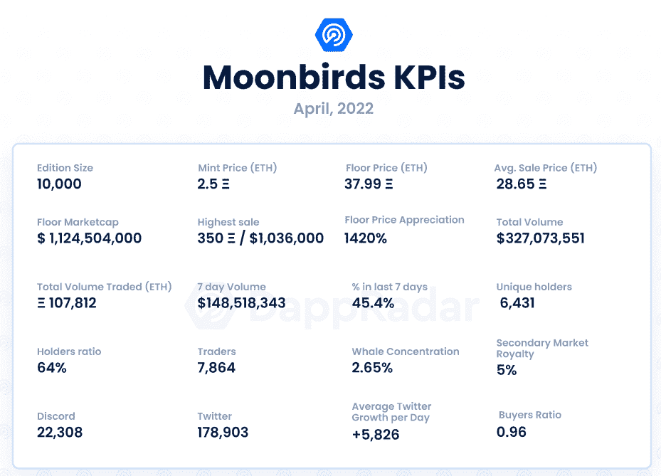
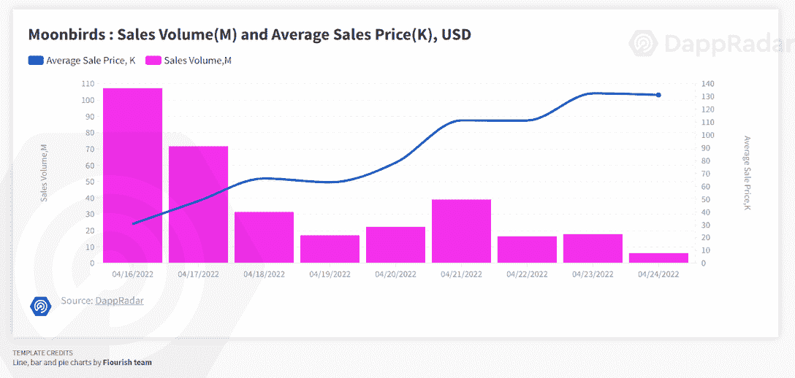
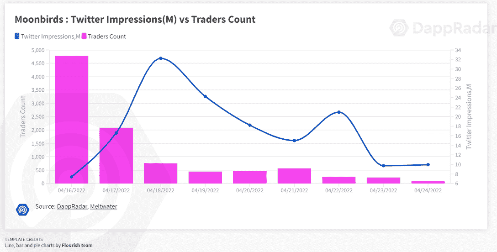
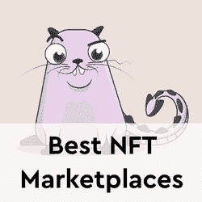

# 新的 Dapps 报告:月鸟——到月球和更远的地方

> 原文：<https://web.archive.org/web/https://dappradar.com/blog/new-dapps-report-moonbirds-to-the-moon-and-beyond>

## 月鸟是由证明集体制作的 10，000 个 NFT 的集合

在 2022 年 4 月版的 DappRadar 的新 Dapps 报告中，我们关注了流行和有趣的 NFT 系列，这次我们涵盖了月鸟。新的 Dapps 报告是对 NFT 收藏的财务指标的执行概述和分析。

这份新的 Dapps 报告是一系列执行报告的一部分，为读者提供了一个充满希望的、可再生的 NFT 收藏的高层次视角。该报告侧重于财务指标，包括销售活动和价格分析，以及分布指标，如独特持有人比率和鲸鱼集中指数。它还深入研究了鲸鱼的行为模式以及社会和技术概况。

本周我们来看看月鸟，这个系列在 NFT 市场掀起了一阵风暴。Moonbirds 是 PROOF Collective 制作的 10，000 个 NFT 的集合，PROOF Collective 是一群技术和媒体行业的资深人士，他们通过他们的播客建立了一个基层社区。该播客以诚实和反映 NFT 文化和市场而闻名。PROOF Collective 希望通过这个集合在 NFTs 项目中建立新的标准。

请不要将本文件视为财务建议。

**数据更新日期:2022 年 4 月 27 日**

## 目录

*   [关键要点](https://web.archive.org/web/20221127161336/https://dappradar.com/blog/new-dapps-report-moonbirds-to-the-moon-and-beyond/#Key-Takeaways)
*   [财务概况](https://web.archive.org/web/20221127161336/https://dappradar.com/blog/new-dapps-report-moonbirds-to-the-moon-and-beyond/#Moonbirds---Floor-price-growth-of-1420%)
*   [效用](https://web.archive.org/web/20221127161336/https://dappradar.com/blog/new-dapps-report-moonbirds-to-the-moon-and-beyond/#Added-Utility---Strong-Long-term-Utility-)
*   [社会意识和参与度](https://web.archive.org/web/20221127161336/https://dappradar.com/blog/new-dapps-report-moonbirds-to-the-moon-and-beyond/#Social-Awareness-and-Engagement-)
*   [团队概述](https://web.archive.org/web/20221127161336/https://dappradar.com/blog/new-dapps-report-moonbirds-to-the-moon-and-beyond/#Team-Overview-)
*   [技术概述](/web/20221127161336/https://dappradar.com/blog/wp-admin/post.php)
*   [鲸鱼钱包分析](https://web.archive.org/web/20221127161336/https://dappradar.com/blog/new-dapps-report-moonbirds-to-the-moon-and-beyond/#Whale-Wallet-Analysis)
*   [总结](https://web.archive.org/web/20221127161336/https://dappradar.com/blog/new-dapps-report-moonbirds-to-the-moon-and-beyond/#Summary)

## 关键要点

*   《月鸟》是过去七天和之前两周交易量最大的藏品，交易量分别为 148，518，343 美元和 327，073，551 美元。
*   自 4 月 16 日铸造以来，月鸟系列的底价已经上涨了超过 1，420%

## 月鸟——底价增长 1420%

**区块链:**以太坊

**上市日期:**2022 年 4 月 16 日

**版本数量:** 10，000-限量版

**性状:** 8

**属性:** 116

**底价:** 37.99 瑞士法郎

《月鸟》上映第一周就创造了近 1.5 亿美元的销售额。尽管随后日成交量有所回落，但总体成交量继续稳步攀升。《月鸟》是过去七天里交易量最大的系列，也是前两周销量最大的系列。

自 4 月 16 日铸币以来，截至发稿时，楼面价上涨 1，420%至 37.99 ETH。撰写本文时的均价为 28.65 ETH，上涨了 1.046%。较低的平均价格是由于许多业主选择在铸造后不翻转他们的鸟。结果，一些 NFT 具有 nill 值，这些值将平均价格拉低到底价以下。

## 附加效用–强大的长期效用

Moonbirds 在官方网站上发布的路线图强调了该项目是以长期实用性为目标的。月鸟的持有者可以“筑巢”他们的鸟，这意味着他们可以在 NFT 上下注，而不会让它离开他们的钱包。持有人被鼓励长时间筑巢，因为他们持有的时间越长，他们获得的回报就越多。随着更多实用程序的加入，这些回报将会逐渐提高。

举办 Moonbirds 的直接好处是获得独家 Discord 服务器、证明会议和活动、NFT 的完全知识产权，以及进入证明集体独有的高层元宇宙。在最近的 Youtube 与无银行播客的访谈中，项目负责人凯文·罗斯深入谈论了回报。这些将包括实物奖励，如贴纸和帽衫。此外，数字奖励，如 NFT 下降，元宇宙的土地所有权，以及其他尚未透露的津贴。

## 社会意识和参与

Moonbirds 拥有稳固的在线社交地位。其 [Discord](https://web.archive.org/web/20221127161336/https://discord.com/invite/proof) 服务器**活跃用户**22308，对于一个交易量这么大的项目来说是比较低的。这种不和谐只存在于 NFT 集体持有人身上，这也解释了会员人数少的原因。在这种不和谐中，月鸟持有者有他们的私人频道。
月鸟[推特](https://web.archive.org/web/20221127161336/https://twitter.com/moonbirds_xyz)于 2022 年 3 月上线，目前拥有 178903 名粉丝。该帐户在过去 30 天内经历了 100%的总增长，平均每天获得 5，826 名新粉丝。这一趋势表明了对该系列的强烈兴趣和不断增长的需求。

Moonbirds 有 7，864 名独立交易者，根据我们的基准，这低于平均水平。然而，这个集合非常强调社区持有 NFT，以获取未来的利益。因此，许多交易者选择不为短期利润而抛售他们的月鸟。

## 团队概述

月鸟团队由[凯文·罗斯](https://web.archive.org/web/20221127161336/https://twitter.com/kevinrose)T2【和】贾斯汀·梅泽尔组成。[凯文·罗斯](https://web.archive.org/web/20221127161336/https://twitter.com/kevinrose)是项目负责人。他是一名科技企业家和媒体人。他创建了 Reddit 的前身 Digg 网站，他也是 PROOF 播客的负责人。贾斯汀·梅泽尔负责该项目的视觉效果。他曾为许多上市公司设计过标识，如迪士尼、谷歌和贝宝。

      Kevin Rose     
**Image Credits: **Christopher Michel / TechCrunch

Justin Mezzel
Image Credits: Orlando Creators

## 技术概述

Moonbirds 使用 IPFS 存储其元数据，而不是完全在链上。这给视觉上丰富的元数据项目带来了一个共同的挑战，因为智能合约和元数据是分开的。从技术角度来看，没有任何迹象。

*   审计状态:尚未执行审计

*   存储:月鸟**NFT 作为 ERC-721 令牌存储在以太坊区块链，视觉效果在 IPFS 上实时显示，所有权不变。**

 ***   合同地址:[0x 23581767 a 106 AE 21 c 074 b 2276d 25 e 5c 3 e 136 a 68 b](https://web.archive.org/web/20221127161336/https://etherscan.io/address/0x23581767a106ae21c074b2276d25e5c3e136a68b)

## 鲸鱼钱包分析

Moonbrids 系列目前的独特持有人比例为 **64%** ，表明该系列适度多元化。在 **2.65%** ，其鲸密度相对较低。这两个指标表明，藏品非常多样化，被知名投机者操纵价格的风险很低，这些投机者通常恰好是大多数藏品的顶级持有者。

在该系列的前五名持有者中没有突出的鳍状肢。这种缺席可能表明一个收藏的低知名度。一个更有可能的解释是，买家被激励“筑巢”更长时间，因此不太可能翻盘。

## 摘要

《月鸟》一炮而红，是过去两周交易量最大的收藏。该系列共售出 3.2 亿美元，其中 47%是在过去七天内售出的。Moonbirds 从一开始就开始做不同的事情，这种方法在社区中引起了共鸣。开发者是完全公开的，并且已经公开了很长时间。由于他们的播客，他们通过 NFT 社区的草根运动建立了自己的声誉。

Moonbirds 还计划成为一个长期项目，通过软下注 NFT 来激励持有而不是抛售。软赌注或“嵌套”的想法，将 NFT 放在持有者的钱包里，吸引了许多人。月鸟还透露了一个高层元宇宙独家集体项目的证据。

[<picture></picture>](https://web.archive.org/web/20221127161336/https://dappradar.com/blog/what-are-non-fungible-tokens-nfts)[<picture></picture>](https://web.archive.org/web/20221127161336/https://dappradar.com/nft/marketplaces)[<picture></picture>](https://web.archive.org/web/20221127161336/https://dappradar.com/nft/sales) NewsletterUnsubscribe at any time. [T&Cs](https://web.archive.org/web/20221127161336/https://dappradar.com/terms) and [Privacy Policy](https://web.archive.org/web/20221127161336/https://dappradar.com/privacy-policy)**