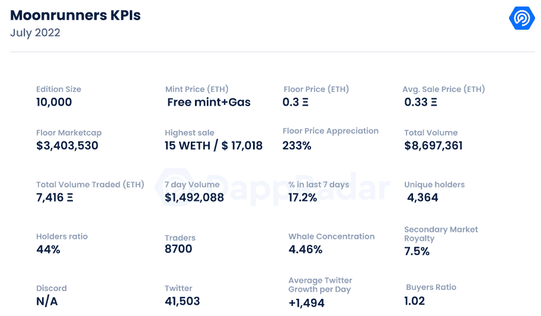
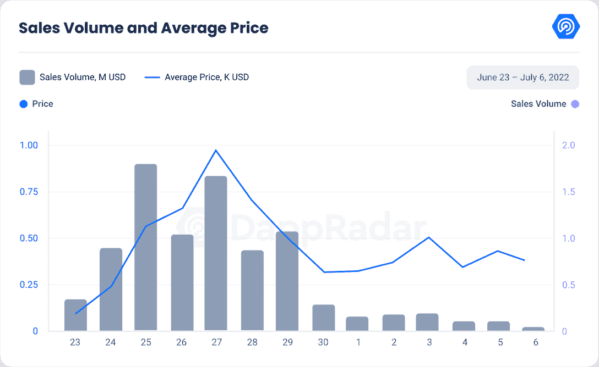
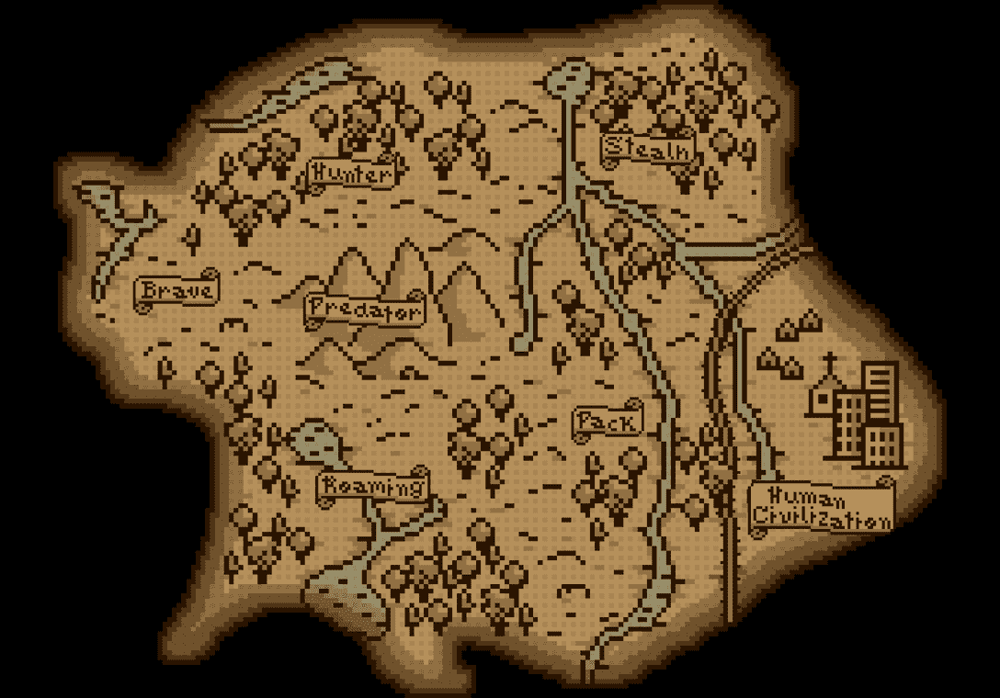
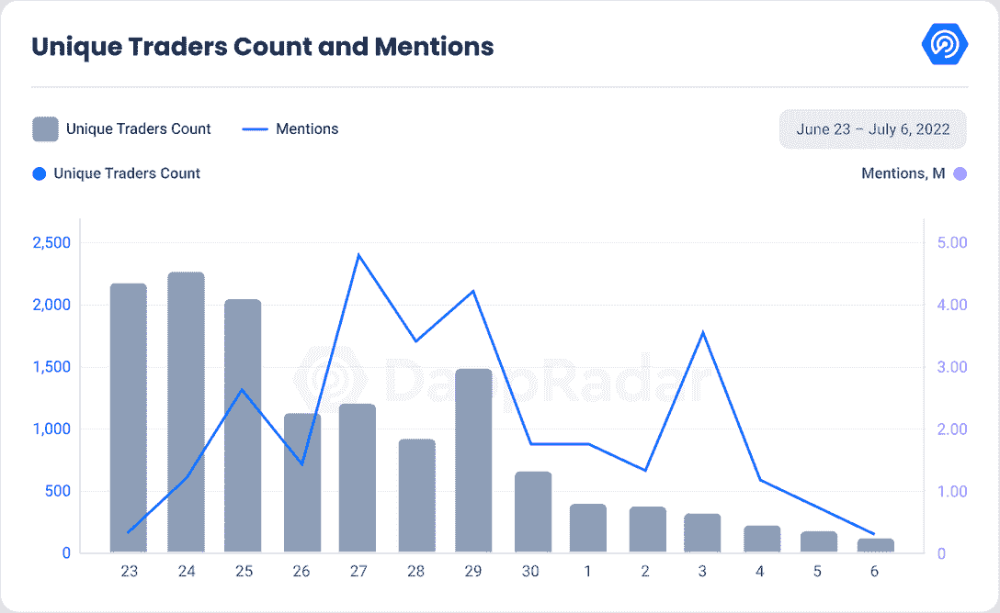

# 新的 Dapps 报告:奔月者 NFT 狼从排行榜的顶端嚎叫

> 原文：<https://web.archive.org/web/https://dappradar.com/blog/new-dapps-report-moonrunners-nft-wolves-howl-from-the-top-of-the-charts>

## Moonrunners 是一个 10，000 个生成性 NFT 的集合，在过去的七天里积累了超过 150 万美元的交易。

**在 2022 年 6 月版的 DappRadar 的新 Dapps 报告中，我们更深入地研究了奔月者，他们正在攀登** [**NFT 图表**](https://web.archive.org/web/20220912025629/https://dappradar.com/hub/nft-explorer) **。新的 Dapps 报告详细分析了 NFT 收藏的财务指标，极具吸引力。**

这份新的 Dapps 报告是一系列执行报告的一部分，为读者提供了一个充满希望的、可再生的 NFT 收藏的高层次视角。该报告侧重于财务指标，包括销售活动、价格分析和分布指标，如独特持有人比率和鲸鱼集中指数。它还深入研究了鲸鱼的行为模式以及社会和技术概况。

Moonrunners 是 10，000 个生成性 NFT 的集合，于 2022 年 6 月下旬启动了 Twitter 项目。Moonrunners 模仿了最近成功项目开创的许多功能，像素头像与 Moonbirds 非常相似。

该系列从 [Wagdie](https://web.archive.org/web/20220912025629/https://dappradar.com/blog/new-dapps-report-we-are-all-going-to-die-embraces-uncertainty) 和 [Goblin Town、](https://web.archive.org/web/20220912025629/https://dappradar.com/blog/new-dapps-report-goblin-town-defying-tradition-and-the-bear-market) anonymous、undoxxed、no discord、no roadmap 中汲取了讲故事的 Twitter 灵感。结果远远大于所有这些部分的总和。

请不要将本文件视为财务建议。

**数据更新日期:****2022 年 7 月 7 日**

## 目录

*   [关键要点](https://web.archive.org/web/20220912025629/https://dappradar.com/blog/new-dapps-report-moonrunners-nft-wolves-howl-from-the-top-of-the-charts/#Key-Takeaways)
*   [财务概况](https://web.archive.org/web/20220912025629/https://dappradar.com/blog/new-dapps-report-moonrunners-nft-wolves-howl-from-the-top-of-the-charts/#Moonrunners---Solid-initial-results,-but-the-hype-is-gone)
*   [效用](https://web.archive.org/web/20220912025629/https://dappradar.com/blog/new-dapps-report-moonrunners-nft-wolves-howl-from-the-top-of-the-charts/#Utility)
*   [社会意识和参与度](https://web.archive.org/web/20220912025629/https://dappradar.com/blog/new-dapps-report-moonrunners-nft-wolves-howl-from-the-top-of-the-charts/#Social-Awareness-and-Engagement-)
*   [技术概述](https://web.archive.org/web/20220912025629/https://dappradar.com/blog/new-dapps-report-moonrunners-nft-wolves-howl-from-the-top-of-the-charts/#Technical-Overview)

## 关键要点

*   Moonrunners 是过去七天中交易量第 14 大的收藏，交易量超过 150 万美元，总交易量超过 800 万美元。
*   自铸币厂以来，该系列的底价已经上涨了 233%。

Source: [DappRadar](https://web.archive.org/web/20220912025629/http://www.dappradar.com/)

## 登月者——坚实的初步结果，但炒作已经过去了

## **区块链:**以太坊

**上市日期:**2022 年 6 月 23 日

**版本数量:** 10，000-限量版

**特质:** 11

**属性:** 151

**底价:** 0.3 ETH

Source: [DappRadar](https://web.archive.org/web/20220912025629/http://www.dappradar.com/)

在 6 月 23 日系列造币厂之后的第一周，Moonrunners 展示了有希望的结果。因为造币厂是免费的，所以将使用第一天的平均交易价格而不是造币价格。

像之前的许多收藏一样，Moonrunners 产生了大量的炒作，转化为稳定的表现，在 6 月 25 日达到顶峰，日交易量为 170 万美元。引人入胜的叙述将该项目的官方推特置于聚光灯下。

在月球事件之后，所有的 NFT 都“进化”成了以月球为背景，人们的兴趣很快就消退了，目前的交易量比峰值低了 96%。平均价格与这一进程相呼应。

6 月 27 日达到峰值 0.81，首日出现 800%的升值，之后迅速消退到目前 0.33 ETH 的水平，也就是 267%的升值。

最低价格紧随其后，为 0.3 ETH，比铸币价格代理人高出 233%。价格发展最初非常有希望，因为它已经超过了许多最近成功的项目，如 [GODA Mint Pass](https://web.archive.org/web/20220912025629/https://dappradar.com/blog/new-dapps-report-goda-mint-pass-gateway-between-art-and-web3) 和[灵长类](https://web.archive.org/web/20220912025629/https://dappradar.com/blog/new-dapps-report-primates-welcome-to-the-jungle)，它们分别升值了 469%和 494%；然而，它很快失去了作为表现不佳的项目的最佳动力，如 [Veefriends V2](https://web.archive.org/web/20220912025629/https://dappradar.com/blog/new-dapps-report-veefriends-series-2) 和 [Wagdie](https://web.archive.org/web/20220912025629/https://dappradar.com/blog/new-dapps-report-we-are-all-going-to-die-embraces-uncertainty) 分别升值 85%和 24%。

### 增加的效用–没有路线图和计划效用

这个项目背后的团队是最近由[哥布林镇](https://web.archive.org/web/20220912025629/https://dappradar.com/blog/new-dapps-report-goblin-town-defying-tradition-and-the-bear-market)开创的趋势的一部分，在那里，项目不发布路线图，也没有计划的效用，而是每天与社区接触。

开发团队每天都在讲故事，为这个系列揭开了一个新的故事。这种体验是互动的，社区由 twitter hangout 会话驱动，几乎每天都发生。

开发人员已经发布了很多线索，发布的媒体目前为止暗示了未来一个潜在的交互式游戏世界。

Source: [Twitter](https://web.archive.org/web/20220912025629/https://twitter.com/MoonrunnersNFT/status/1541059109466013696)

NFT 的直接效用是它带有 CCO 许可证。持有者可以将它用于他们认为合适的任何商业用途。社区互动游戏对于喜欢解谜和参与社区的一类人来说也很有吸引力。

### 社会意识和参与

Source: [DappRadar](https://web.archive.org/web/20220912025629/http://www.dappradar.com/)

像 [Wagdie](https://web.archive.org/web/20220912025629/https://dappradar.com/blog/new-dapps-report-we-are-all-going-to-die-embraces-uncertainty) 一样，该项目只有一个 Twitter 和一个官方网站供社区参与。

[Twitter](https://web.archive.org/web/20220912025629/https://twitter.com/MoonRunnersNFT)2021 年 10 月上线；然而，它在 2022 年 6 月 21 日首次活跃，比铸币局早几天。该档案目前有 41，503 名关注者， **100%** ，其中 100%是在过去两周内增加的。

随着该账户平均每天增加 1，494 名新关注者，社区参与度保持稳定。

这些统计数据对于我们的 Dapp 报告来说非常普通；然而，与其最接近的竞争对手 Wagdie 相比，他们是强大的，因为 Wagdie 拥有 15，000 名粉丝，同期增长了 495 名。

该项目在很大程度上使用了 Twitter，每次平均有 4000 名听众收听。

据我们所知，这个项目没有官方的不和，也没有粉丝组织的渠道。虽然像[哥布林镇](https://web.archive.org/web/20220912025629/https://dappradar.com/blog/new-dapps-report-goblin-town-defying-tradition-and-the-bear-market)这样的收藏受益于没有官方不和的决定，但它也显示出适得其反的效果，就像 Wagdie 的情况一样。

由于没有一个社区中心来聚集和参与开发人员，这个项目一有争议就被搁置了。

## 团队概述

Moonrunners 延续了拥有完全匿名团队的趋势。当诈骗和欺诈仍然存在时，社区信任和沟通至关重要。对许多人来说，一个不知名的团队仍然是一个危险信号。如果持有者对项目感到困惑或失望，隐藏自己的选择可能会在未来引起摩擦。

### 鲸鱼钱包分析

Moonrunners 拥有独特的持股比例 **44%** ，这表明其多元化程度低于平均水平。唯一持有人越多，持有人之间串通的可能性就越小。较低的多样化比率通常与非常突然的价格波动密切相关。

月行者的鲸鱼浓度为 **4.36%** ，完全是平均水平。在前五名持有者中，一条著名的鲸鱼[钻了进去。](https://web.archive.org/web/20220912025629/https://dappradar.com/hub/wallet/eth/0xd9d7046933bd3d0a3e869959ef95e4c41522c1bf)

更高的鲸鱼聚集度表明著名收藏者操纵价格的风险增加。缺少引人注目的鲸鱼和普通的鲸鱼浓缩物表明该收藏被操纵价格的风险很低。

然而，我们总是建议潜在买家进行尽职调查，尤其是匿名开发者。

## 技术概述

与大多数 NFT 项目一样，Moonrunners 使用 IPFS 存储元数据，而不是完全在链上。这种类型的存储是标准做法，因为在链上存储图像通常数据量太大。

虽然没有关于这个项目的已知技术问题的报告，但谨慎总是明智的，主要是因为开发团队缺乏透明度。由于团队的匿名性，衡量团队在运行这些项目中的专业知识或他们的意图可能是具有挑战性的。

*   审计状态:尚未执行审计

*   存储:NFT 作为 ERC-721 令牌存储在以太坊区块链上，而视觉在 IPFS 上保持不变的所有权。

*   合同地址:[0x 1485297 e 942 ce 64 e 0870 ECE 60179 dfda 34 B4 c 625](https://web.archive.org/web/20220912025629/https://etherscan.io/address/0x1485297e942ce64e0870ece60179dfda34b4c625)

## 摘要

Moonrunners 在这个竞争激烈的市场上打了一场硬仗。熊市迫使规模小得多的收藏品退出市场，让新来者与蓝筹股争夺聚光灯下的一席之地。

由于这个市场的性质，该系列模仿了许多最近成功团体的原则以保持相关性，这在某种程度上是可以理解的。这些选择在最初阶段将藏品推向了顶级交易行列，但不幸的是，藏品很快失去了动力。

目前 233%的底价涨幅低于平均水平，即使是在熊市期间铸造的收藏，如[灵长类](https://web.archive.org/web/20220912025629/https://dappradar.com/blog/new-dapps-report-primates-welcome-to-the-jungle)和[哥达铸币通行证](https://web.archive.org/web/20220912025629/https://dappradar.com/blog/new-dapps-report-goda-mint-pass-gateway-between-art-and-web3)，但现在仍然像其他一些最近的收藏一样糟糕，如 [Vee Friends](https://web.archive.org/web/20220912025629/https://dappradar.com/blog/new-dapps-report-veefriends-series-2) 和 [Wagdie](https://web.archive.org/web/20220912025629/https://dappradar.com/blog/new-dapps-report-we-are-all-going-to-die-embraces-uncertainty) 。

社区游戏方面非常吸引人，社交反映了这一点。与本季度新收集的数据相比，Twitter 的关注者数量和每日增长高于平均水平。这是一个比其最接近的模拟 Wagdie 更强的性能。

开发者匿名的风格选择是一个大胆的选择。虽然这有助于他们在官方 Twitter 上培养的讲故事体验的神秘性。然而，如果出现任何争议，它可能会很快适得其反，就像我们在 Wagdie 身上看到的那样。

强大的实用程序和久经考验、声誉卓著的开发团队表明项目的卓越寿命。Moonrunners 没有过度承诺它的效用，所以它不会令人失望，但从长远来看，它可能会努力保持社区游戏的观众俘虏。