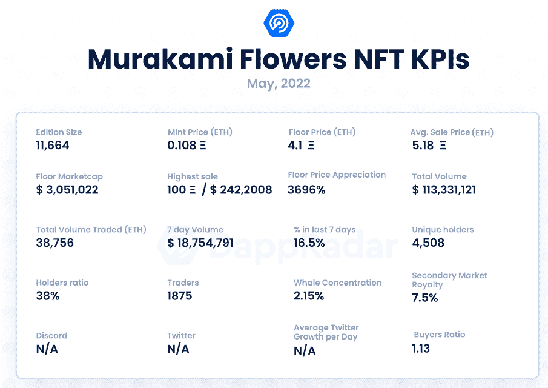
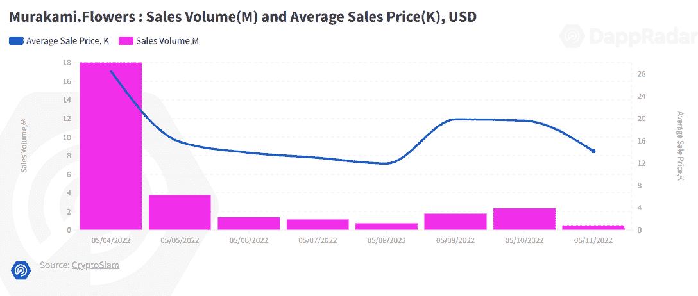
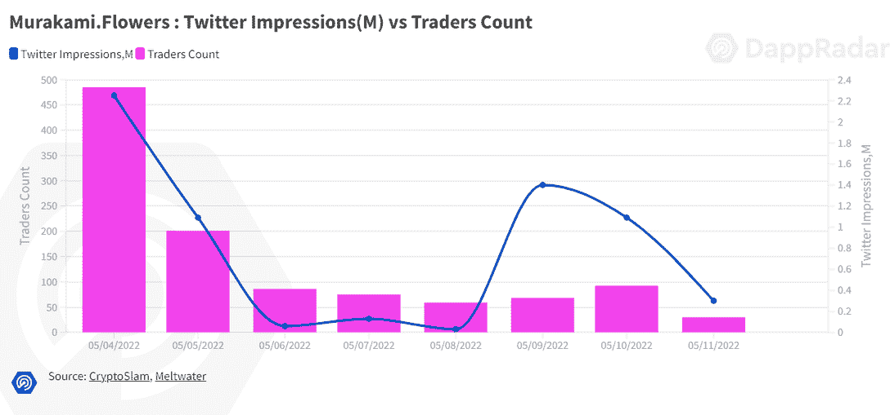

# 新 Dapps 报道:村上。花——村上回到他的根

> 原文：<https://web.archive.org/web/https://dappradar.com/blog/new-dapps-report-murakami-flowers-murakami-goes-back-to-his-roots>

## 村上。花是艺术家村上隆的 11，664 个 NFT 的集合

在 2022 年 5 月版的 DappRadar 的新 Dapps 报告中，我们关注了流行和有趣的 NFT 收藏，这次我们涵盖了村上。鲜花官方。新的 Dapps 报告是对 NFT 收藏的财务指标的执行概述和分析。

这份新的 Dapps 报告是一系列执行报告的一部分，为读者提供了一个有前途的随机生成的 NFT 集合的高级视角。该报告侧重于财务指标，包括销售活动和价格分析，以及分布指标，如独特持有人比率和鲸鱼集中指数。它还深入研究了鲸鱼的行为模式以及社会和技术概况。

村上隆是一位富有远见的日本设计师和艺术家，他对 NFTs 并不陌生。他之前用 RTFKT 创造了非常成功的 CloneX 系列(我们在一月份的 Dapp 报告中提到过)。这一次，村上大胆地创造了一个更加个人化的 11，664 幅 NFT 的集合，这是他首创的“超级平面”视觉风格。他继续着他在村上的优秀传统。

请不要将本文件视为财务建议。数据更新日期:2022 年 5 月 12 日

## 目录

*   [关键要点](https://web.archive.org/web/20221006031123/https://dappradar.com/blog/new-dapps-report-murakami-flowers-murakami-goes-back-to-his-roots/#key-takeaways)
*   [财务概况](https://web.archive.org/web/20221006031123/https://dappradar.com/blog/new-dapps-report-murakami-flowers-murakami-goes-back-to-his-roots/#financial-overview)
*   [效用](https://web.archive.org/web/20221006031123/https://dappradar.com/blog/new-dapps-report-murakami-flowers-murakami-goes-back-to-his-roots/#added-utility)
*   [社会意识和参与度](https://web.archive.org/web/20221006031123/https://dappradar.com/blog/new-dapps-report-murakami-flowers-murakami-goes-back-to-his-roots/#social-awareness)
*   [技术概述](https://web.archive.org/web/20221006031123/https://dappradar.com/blog/new-dapps-report-murakami-flowers-murakami-goes-back-to-his-roots/#technical-overview)

## 关键要点

*   村上。Flowers 是过去 7 天中交易量第 11 大的收藏，总销售额超过 1800 万美元，在不到两周的时间内总销售额超过 1.13 亿美元
*   自 5 月 4 日铸造以来，该系列的底价已升值超过 3，696%

## 村上。鲜花-底价增长 3，696%

## **区块链:**以太坊

**上市日期:**2022 年 5 月 4 日

**版本尺寸:** 11，664-限量版

**特质:** 10

**属性:** 432

**底价:** 4.1 ETH

Source: [Dappradar.com](https://web.archive.org/web/20221006031123/https://dappradar.com/hub/assets/eth/0x67d9417c9c3c250f61a83c7e8658dac487b56b09/9999)

村上。鲜花在第一周就创造了近 2000 万美元的销售额。尽管随后日成交量有所回落，但总体成交量仍在继续攀升。村上。Flowers 是过去 7 天中交易量第 11 大的藏品，也是过去两周中交易量第 7 大的藏品，交易量超过 1.13 亿美元。楼面价，目前是 4.1 ETH，已经比造币价升值 **3696%** 。平均价格在第一周大幅上涨，达到 10 ETH，在编写本报告时，随后几天跌至 5.18 ETH，比铸币价格上涨了 4.696%。

## 增加实用性——强烈的视觉吸引力，但路线图不清晰

村上。Flowers 在其官方网站上发布了发布后支持的计划。用村上的话说，这个收藏的目标是在传统艺术社区和新 NFT 数字艺术社区之间架起一座桥梁。他的目标是让他的艺术经受住时间的考验，并在未来的 100 年里继续存在。村上承诺推出一款在线视频游戏、现实生活中的展览以及与该系列相关的各种商品。该项目最终将转换为一个 DAO。村上的路线图。鲜花还没有最终确定。该系列仍处于初期阶段，并且可能会有所变化。在撰写本文时，除了美学视觉元素之外，没有其他与该系列相关的实用工具。

## 社会意识和参与

村上。Flowers 没有通常与 NFT 项目相关的社交渠道，比如 Discord 服务器或 Twitter 账户。该项目有一个 [Instagram](https://web.archive.org/web/20221006031123/https://www.instagram.com/murakami.flower2022/) 账户，拥有超过 147，000 名粉丝，用于发布该系列的推广艺术。

Source: [Dappradar.com](https://web.archive.org/web/20221006031123/https://dappradar.com/hub/assets/eth/0x67d9417c9c3c250f61a83c7e8658dac487b56b09/9999)

村上。Flowers 总共有 1，875 个独立交易者，与他之前的项目 CloneX(有 9，444 个独立交易者)相比，这个数字相对较低。这个系列有很多宣传，这是发行日的惯例。尽管如此，可能由于缺乏通常的社会渠道和与社区的直接沟通，对该系列的提及急剧下降。

## 团队概述

该项目由村上隆和他自己的制作公司,[大熊猫开开琪琪有限公司](https://web.archive.org/web/20221006031123/https://www.kaikaikiki.co.jp/)共同开发

## 技术概述

像大多数 NFT 项目一样，村上。Flowers 使用 IPFS 存储其元数据，而不是完全在链上。这种类型的存储在 NFTs 中很常见，因为它的数据量太大，无法将视觉上丰富的项目完全存储在链上。虽然没有已知的与项目相关的技术问题，但谨慎总是明智的，特别是由于开发团队缺乏透明度以及他们在运行 NFT 项目方面的经验。

*   审计状态:尚未执行审计

*   存储:**NFT 作为 ERC-721 令牌存储在以太坊区块链上，视觉在 IPFS 上保持不变的所有权。**

 ***   合同地址:[0x7d 8820 fa 92 EB 1584636 F4 F5 b 8515 b 5476 b 75171 a](https://web.archive.org/web/20221006031123/https://etherscan.io/address/0x7d8820fa92eb1584636f4f5b8515b5476b75171a)

## 鲸鱼钱包分析

村上。Flowers 目前唯一持有人比例 **38%** ，表示收藏相对集中。较低的比率表明对价格突变的敏感度较高。在 **2.15%** ，其鲸密度很低。更高的鲸鱼聚集度表明知名收藏者操纵价格的风险增加。

一条著名的鲸鱼 [0xcspr.eth](https://web.archive.org/web/20221006031123/https://dappradar.com/hub/wallet/eth/0x68bb0df47581a8ecdff325903546e19202236d2a) 是前五名持有者之一。她们持有 41 朵花，占 0.56%。知名鲸鱼的轻微参与表明，该系列的价格操纵风险较低。他们的缺席有时也显示了收藏的财务吸引力下降。我们总是建议潜在买家进行尽职调查。

## 摘要

村上隆在传统艺术行业工作超过 29 年，已经成为一名有影响力的艺术家。他与 RTFKT 一起进入 NFTs 数字世界的第一次冒险非常成功，他们的合作产生了 CloneX 项目。

很像 CloneX，村上。弗劳尔斯表现得非常好。在不到两个星期的时间里，募捐总额超过了 1 . 13 亿美元。自 5 月 4 日铸造以来，该系列的底价已升值逾 3，696%。最高销售额发生在造币当天，其中 [Flower #9125](https://web.archive.org/web/20221006031123/https://dappradar.com/hub/assets/eth/0x7d8820fa92eb1584636f4f5b8515b5476b75171a/473) 以 100 ETH/242，008 美元售出。

村上在过去无疑有着良好的记录。他的艺术作品获得了评论界的高度赞扬，在财务上也表现良好。他的一件作品《孤独的牛仔》2008 年在苏富比拍出了 1510 万美元(按今天的价格计算是 1900 万美元)，去年 2 月，一位买家以 450 ETH/120 万美元的价格买下了一件 CloneX。然而，不确定他是否拥有独立运营 NFT 项目的知识。一些常见的功能，如官方路线图、社交渠道和公开披露的开发团队都不见了。

 NewsletterUnsubscribe at any time. [T&Cs](https://web.archive.org/web/20221006031123/https://dappradar.com/terms) and [Privacy Policy](https://web.archive.org/web/20221006031123/https://dappradar.com/privacy-policy)**