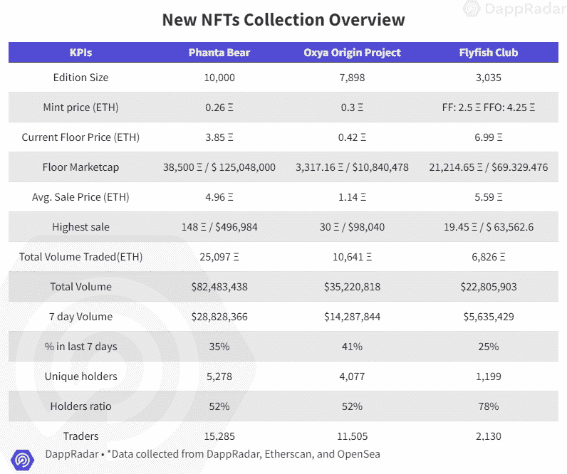
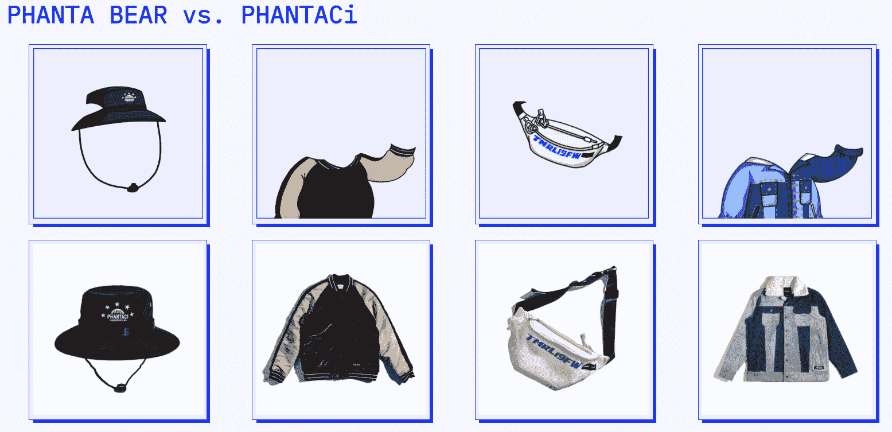
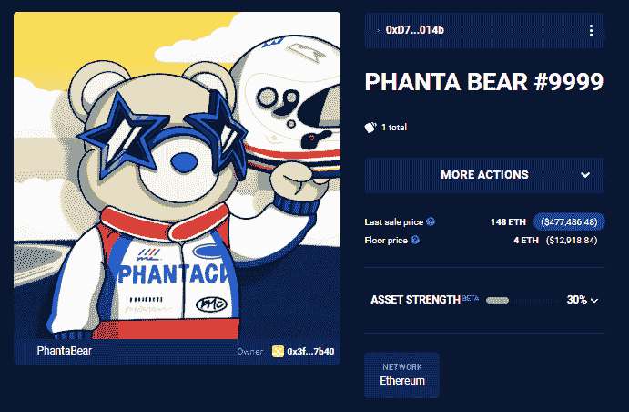
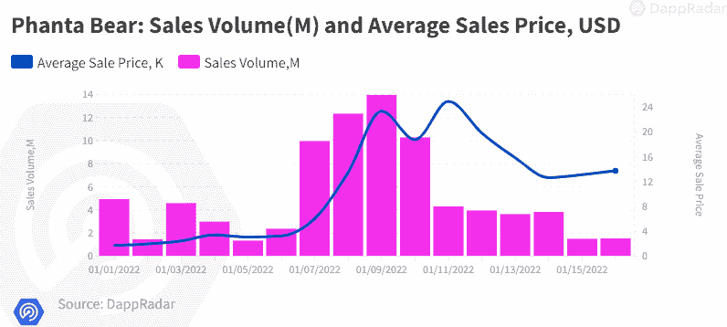
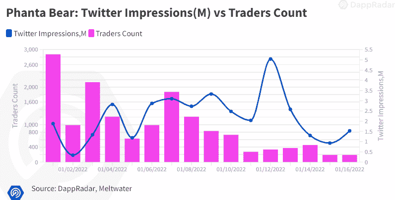
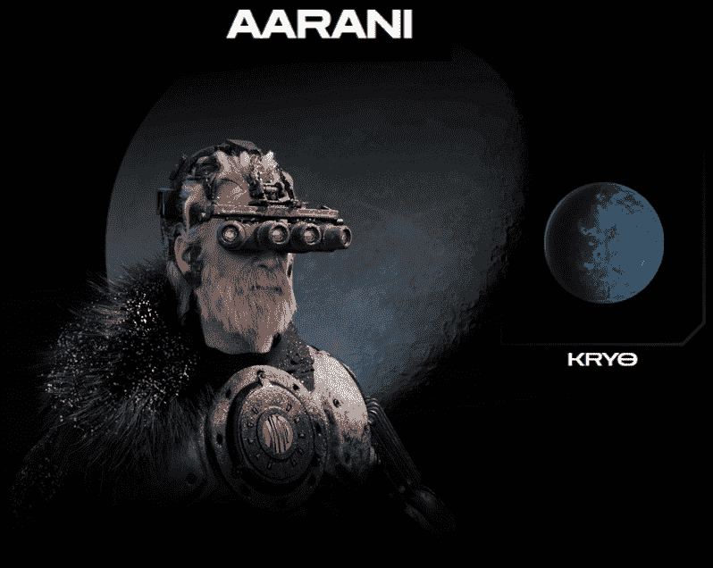
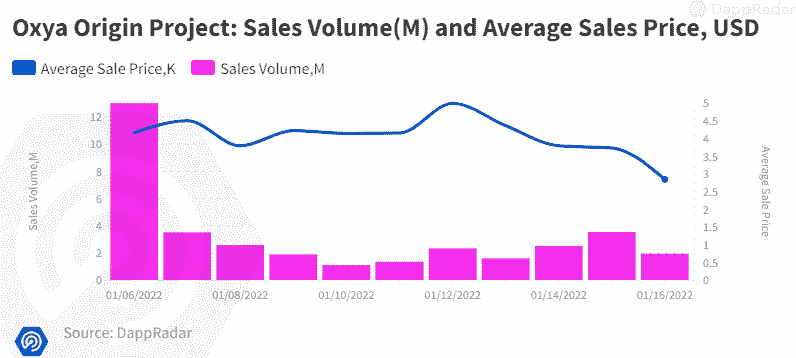
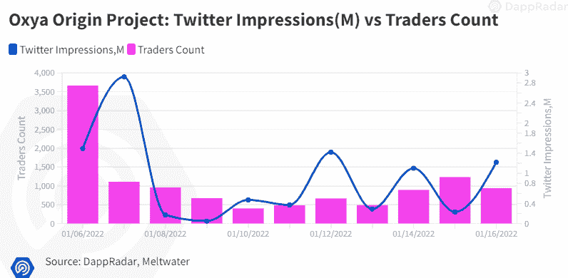
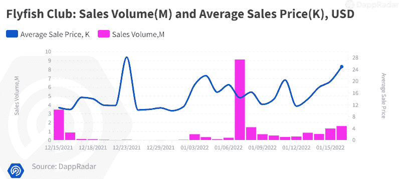
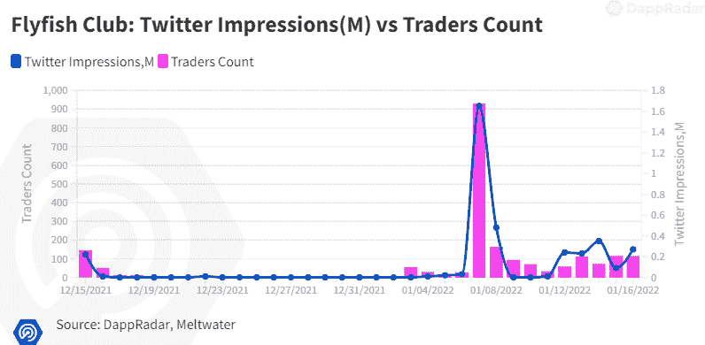

# 新的 Dapps 报告:NFT 收藏品-2022 年 1 月版

> 原文：<https://web.archive.org/web/https://dappradar.com/blog/new-dapps-report-nft-collectibles-january-2022-edition-2>

## 深入了解 3 个受欢迎的 NFT 系列:PhantaBear、OxyaOriginProject 和 Flyfish Club

在 DappRadar 2022 年 1 月第二版的新 Dapps 报告中，我们关注了三个受欢迎的 NFT 系列:Oxya Origin Project、PhantaBear 和 Flyfish club。新的 Dapps 报告是对 NFT 收藏的财务指标的执行概述和分析。

**新的 Dapps 报告系列由执行报告组成，为读者提供了一个新的和有前途的随机生成的 NFT 集合的高层次视角。该报告侧重于财务指标，如销售活动和价格分析，以及分布指标，如独特持有人比率和鲸鱼集中指数。此外，它还深入研究了鲸鱼的行为模式以及详细的社会和技术概述。**

2022 年是一个良好的开端，NFT 市场在去年年底的冷却期后开始加速。在这一期新的 Dapps 报告中，我们选择了三个在 1 月份的前两周引人注目的 NFT 项目来标志这种复苏。根据我们在分析中考虑的因素，每个人都显示出了潜力。

首先，我们来看看 PhantaBear:这是中国制作公司 Ezek Group 和中国“流行天王”周杰伦的时装品牌 PHANTACi 的合作项目。该系列以周本人的时装设计为特色。自 1 月 1 日推出以来，PhantaBear 已经席卷了 NFT 世界，在撰写本文时，其近 2900 万美元的交易量在过去 7 天的交易量中排名第 11 位。

然后，我们将看看 Oxya Origin 项目:一个由游戏和电影行业的一群资深人士制作的项目。他们试图创造一个独特的由 NFTs 驱动的可玩宇宙。头像系列于 1 月 6 日推出，但交易量已经达到 1400 万美元，因此在过去 7 天的交易量中排名第 21 位。

最后，我们来看看 Flyfish Club，这是由业内资深人士 Gary Vee 领导的 VCR 集团制作的一个系列。这款 NFT 系列让代币持有者在纽约最负盛名的餐厅之一体验高级海鲜美食。在过去的 7 天里，该系列的交易量为 560 万美元，排名第 49 位。

请不要将本文件视为财务建议。

**数据更新日期:****2022 年 1 月 17 日**

## 目录

*   [关键要点](https://web.archive.org/web/20221206165556/https://dappradar.com/blog/new-dapps-report-nft-collectibles-january-2022-edition-2/#key)
*   [Oxya 原产地项目](https://web.archive.org/web/20221206165556/https://dappradar.com/blog/new-dapps-report-nft-collectibles-january-2022-edition-2/#oxya)
*   [幻影](https://web.archive.org/web/20221206165556/https://dappradar.com/blog/new-dapps-report-nft-collectibles-january-2022-edition-2/#phanta)
*   [飞鱼俱乐部](https://web.archive.org/web/20221206165556/https://dappradar.com/blog/new-dapps-report-nft-collectibles-january-2022-edition-2/#fly)
*   [总结](https://web.archive.org/web/20221206165556/https://dappradar.com/blog/new-dapps-report-nft-collectibles-january-2022-edition-2/#summary)

## 关键要点

*   周杰伦的时装系列在中国市场具有强大的吸引力，在两周多一点的时间里，交易量达到 82，483，438 美元，席卷了 NFT 世界。

*   **Oxya Origin 项目**–一系列按照娱乐行业标准制作的独特专业 3D 头像。这些将是未来完整游戏体验的基础。自 1 月 6 日推出以来，艺术展览前的首次交易总额为 35，220，818 美元。

*   **Flyfish Club**——NFT 系列于 12 月下旬推出，但目前正经历第二波关注，因为关于美食体验的信息被披露。目前飞鱼俱乐部的交易总额为 22，805，903 美元。大多数交易(68%)发生在过去 7 天。

## 幻影

*   **区块链:**以太坊
*   **上市日期:**2022 年 1 月 1 日
*   **版本数量:** 10，000-限量版
*   **性状:** 8
*   **属性:** 142

PhantaBear 是周杰伦的时尚品牌 PHANTACi 和发展集团 Ezek 的合作。他们联手创造了一万个以服装品牌 PHANTACi 为原型的熊 NFT 头像。这一努力证明是非常成功的。该系列仅成立两周，在过去 30 天的 NFT 项目交易量中排名第 9，在过去 7 天的交易量中排名第 11，交易量超过 2800 万美元。

Source: [ezek.io](https://web.archive.org/web/20221206165556/https://ezek.io/about)

周杰伦是中国最成功的名人之一，有点像文艺复兴时期的人。他以流行歌星开始职业生涯，但很快成为演员、电影导演和成功的时尚企业家。这个系列的炒作和财务成功很大程度上可以归功于他的知名度和商业头脑。

### 添加的实用程序

PhantaBear 寻求利用与周杰伦的合作关系，在元宇宙建立强大的多媒体业务。路线图详细列出了将在全年发放的许多奖励。随着项目的展开,“幻影”的持有者将有权享受许多其他的好处。

全年的路已经铺好了。每个季度都有以下亮点:

Q1 关注来自 Ezek 俱乐部和名人合作伙伴的奖励:

*   持卡人可享受 10%的优惠
*   持有人将收到 Ezek 社区空投
*   优先铸造未来与其他名人的合作关系

Q2 寻求建立一个在线多媒体平台:

*   通过电话或虚拟现实访问虚拟音乐会
*   元宇宙娱乐城门票
*   和访问 Ezek 虚拟影院

第三季度将重点关注实物奖励和 VIP 活动:

*   持有者将收到实物礼品
*   进入私人虚拟现实俱乐部

第四季度将举办第一场虚拟音乐会，并扩展品牌:

*   访问 Ezek 虚拟音乐会
*   推出元宇宙娱乐公司

这些公用事业公司非常注重技术娴熟的媒体爱好者，因为许多二级公用事业公司与其他媒体明星的合作伙伴关系和新的多媒体平台的开发有关。

### 财务概述

尽管在撰写本文时还不到两周，但 PhantaBear 的交易量已经超过 5700 万美元，是过去 7 天中交易量第四大的收藏。

最卖座的拍卖发生在发布后仅仅 11 天，PHANTA BEAR #9999 以 148 ETH 的价格售出，价值 496984 美元。早期创造者享受了至少 1380%的底层资产增值。

  Source: [Dappradar.com](https://web.archive.org/web/20221206165556/https://dappradar.com/hub/assets/eth/0x67d9417c9c3c250f61a83c7e8658dac487b56b09/9999)

*   薄荷价格:**0.26 ETH(ξ)**
*   **当前底价:**3.85ξ(比出厂价格上涨 1380%)****
*   ****最低市值:38500 欧元/125048000 美元****
*   ****平均售价:4.96ξ/(比原价高 1807 %)****
*   ****最高销售额: [PHANTA BEAR #9999](https://web.archive.org/web/20221206165556/http://dappradar.com/hub/assets/eth/0x67d9417c9c3c250f61a83c7e8658dac487b56b09/9999) 售价 148ξ/496，984 美元****
*   ****初始收入:2600ξ****
*   ****唯一持有人(比例):5，278 人(52%)****
*   ****总量:82 483 438 美元/25 097 美元****
*   ****7 天成交量:28，828，366 / 9，002ξ****
*   ****买方与卖方比率:1.04 (8，659 / 8，257)****
*   ****交易员:15285 人****
*   ****二级市场版税:0%****

 ****### 社会意识和参与

PhantaBears 拥有强大的社交媒体影响力，并为年轻系列展示了令人印象深刻的数据。他们的 Discord 服务器于 12 月下旬推出，但已经有超过 49，000 名用户。它使用手机注册和广泛的节制，以防止机器人垃圾邮件和不良演员。这些渠道都非常活跃，围绕该项目建立了一个强大的社区。他们的 Twitter 大约在 Discord 成立的同时建立，目前有大约 24，500 名成员，平均每天增加 700 名新粉丝。考虑到这个项目的目标受众是中国人，很可能大多数关注者都使用他们的国内社交媒体渠道。

*   [推特](https://web.archive.org/web/20221206165556/https://twitter.com/EzekClub)关注者:24.500
*   [不和](https://web.archive.org/web/20221206165556/https://discord.com/invite/ezekclub)成员:49.622
*   Instagram 的关注者:11.000 人

### 团队概述

Ezek 的团队开发团队由 3 名创始成员组成。

*   与周杰伦合作的抒情歌手
*   马克·G——一位受过好莱坞教育的电影制作人，他想把自己的娱乐体验带到区块链
*   加州大学伯克利分校毕业的企业家，曾在 HTC 公司工作。

关于该团队的真实生活信息很少，也没有公开信息。这可能是为了保护他们的身份不被中国当局发现。缺乏关于该团队的真实生活信息确实引发了对潜在渎职行为的担忧。

### 技术概述

至于大多数 NFT 项目，元数据存储在中央服务器上，通过 IPFS 托管在以太坊上。不理想，但 IPFS 工作正常。

*   审计状态:尚未提交审计
*   存储:PhantaBear NFTs 作为 ERC-721 令牌存储在以太坊区块链上，托管在 IPFS 上，拥有不变的所有权。
*   合同地址:[0x67d 9417 c 9 C3 c 250 f 61 a83c 7 e 8658 DAC 487 b 56 b 09](https://web.archive.org/web/20221206165556/https://etherscan.io/token/0x67d9417c9c3c250f61a83c7e8658dac487b56b09#balances)

### 鲸鱼钱包分析

PhantaBears 不是一个分布很好的集合，其唯一持有人比例接近 50%。较低的比率表明更容易受到鲸鱼活动导致的价格波动的影响。

鲸鱼聚集指数同样相当高，为 8.52%。更高的鲸鱼集中度意味着更高的价格操纵风险。该项目的最大股东中没有知名的鲸鱼投资者，这可能表明该项目的可行性/安全性较低。

*   鲸鱼集中率:8.52%–852 只

## Oxya 起源项目(OOP)

*   **区块链:**以太坊
*   **上市日期:**2022 年 1 月 6 日
*   **版本尺寸:**7898–限量版
*   **特质:** 14
*   **属性:** 351

Oxya Origin Project 是一个由一群 3D 艺术家和设计师制作的头像集合。该团队的一些成员此前曾参与网飞的动画系列《神秘与巫师》，以及育碧的动作视频游戏《孤岛惊魂 6》。该系列包括 7，898 个在 Oxya Origin 生态系统中使用的生成式 3D 化身。它目前在过去 7 天的交易量中排名第 21 位。NFT 系列才推出不到一周，但已经卖出了 3500 万美元。

除了 3D 化身之外，该团队还雄心勃勃地计划创建一个扩展的可玩宇宙，玩家可以在其中战斗、征服和交易。

  Source: [Oxya Origin](https://web.archive.org/web/20221206165556/https://www.oxyaorigin.com/sold-out.html#about)

### 添加的实用程序

2022 年的 OOP 项目路线图非常紧凑，因为每个季度都会有许多令人兴奋的更新。在 Q1，该团队将介绍第一个游戏元素，他们将揭示该项目的令牌经济学。之后，在 Q2，该项目将引入土地销售，每月任务和游戏中的项目商店。

然后在第三季度，他们会以租金和象征性回报的形式增加土地的效用。一些玩家将能够提升到贵族身份，并获得 10%的分配版税。最后，在第四季度 OOP 将有一个全面的市场，PVP 土地奖励和项目将揭示 Oxya 宇宙。2022 年以后，该团队将专注于扩展宇宙和更广泛地融入元宇宙。

### 财务概述

OOP 正在迅速获得牵引力。该系列已经完全售罄，尽管仅用了一周多一点时间，但它仍是过去 30 天内交易量第 18 大的系列。铸币厂的底层资产增值了 40%。到目前为止，所有交易中有 82%是盈利的，这表明价格和对这一系列的需求正在上升。它拥有超过 11，000 个代币持有者，自 1 月 14 日星期五头像艺术发布以来增加了超过 3，000 个。

*   薄荷价格:**0.3ξ，**
*   **当前底价:**0.42ξ(比出厂价格上涨 40%)****
*   ****最低市值:3317.16ξ/10840478 美元****
*   ****平均售价:1.14ξ/3725.52 英镑(比原价高出 280%)****
*   ****最高销售额:[传奇的 Oxian](https://web.archive.org/web/20221206165556/http://dappradar.com/hub/assets/eth/0xe106c63e655df0e300b78336af587f300cff9e76/7749) 售价 30ξ/98040 美元****
*   ****初始收入:3159ξ/11 240 433.6 美元****
*   ****唯一持有人(比例):4，077 人(51.6%)****
*   ****总体积:35 220 818 美元/10 641 美元****
*   ****7 日成交量:14，287，844 / 4，352ξ****
*   ****买家与卖家的比率:0.97(5929/6116)****
*   ****交易员总数:11，505 人****
*   ****二级市场版税:0%****

 ****### 社会意识和参与

考虑到该项目的社交活动已于 2021 年 12 月中旬启动，OOP 具有非凡的影响力。他们的不和已经积累了超过 23 万用户，所有渠道都趋于活跃。他们使用移动验证和广泛的审核来确保最大限度地减少垃圾邮件机器人和恶意行为者的存在。他们的推特账户有超过 71，300 名粉丝，每天增长 2，142 人。他们还有一个 Instagram 账户，拥有超过 23，800 名用户，他们主要用来泄露即将推出的角色设计。

*   [推特](https://web.archive.org/web/20221206165556/https://twitter.com/OxyaOrigin)关注者:**71300 人**
*   [不和](https://web.archive.org/web/20221206165556/https://discord.com/invite/oxyaorigin)成员:230648 人
*   Instagram 的关注者:23800 人

### 团队概述

OOP 团队相当大，有超过 30 个人在这个项目上工作，包括艺术家、设计师、编码员以及财务专家。

该团队由以下人员领导:

*   Maxime Delcambre-项目负责人，育碧概念艺术家，为他们的看门狗作品创作艺术。
*   萝莉·金兰德——资深概念艺术家，曾参与《复仇者联盟》和网飞的《巫师》系列
*   盖坦·西蒙诺(Gaetan Simonot)——育碧公司的一名角色艺术家，他也曾参与制作网飞的《奥术》(Arcane)，这是一部广受好评的 3D 动画电影，背景设定在英雄联盟宇宙中。
*   Seth Pyrzynski——屡获殊荣的全球游戏专业人士和战略发展总监，曾任职于暴雪和 Riot Games
*   [理查德·哈梅林](https://web.archive.org/web/20221206165556/https://www.linkedin.com/in/richard-hamelin-714958127/)—创新总监兼项目经理
*   [Nathalie Taieb](https://web.archive.org/web/20221206165556/https://www.linkedin.com/in/nathalietaieb/)——分析和营销高级主管，之前是施乐的首席运营官和罗技的副总裁

这个团队在各自的领域都是老手，他们公开了自己，这增加了这个项目的可信度。

### 技术概述

从技术角度来看，没有什么大问题。像大多数 NFT 项目一样，OOP 元数据使用 IPFS 存储，而不是完全在链上。不理想，因为智能合同和元数据是分开的，但 IPFS 工作正常。这是视觉效果丰富的元数据项目中常见的挑战。

*   审计状态:尚未提交审计
*   存储:OOP NFTs 作为 ERC-721 令牌存储在以太坊区块链上，图形资产托管在 IPFS 上，以实现不变的所有权。
*   合同地址:[0x e 106 c 63 e 655 df 0 e 300 b 78336 af 587 f 300 CFF 9 e 76](https://web.archive.org/web/20221206165556/https://etherscan.io/address/0xe106c63e655df0e300b78336af587f300cff9e76)

### 鲸鱼钱包分析

面向对象程序的鲸鱼分析显示，鲸鱼浓缩率为 4.15%，低于平均值。更高的鲸鱼聚集度表明更高的市场操纵风险和更强的价格波动。

58%的唯一持有人比例相当低。较低的持有者比率表明受鲸鱼交易影响的风险较高。前 5 名持有者中有一个著名的 NFT 蛙鞋[阿金. eth](https://web.archive.org/web/20221206165556/https://dappradar.com/hub/wallet/eth/0xf42da2860c700b2f419bbf1862ab3de6887677b4) 排在第 2 位，第 6 位是著名的[恶作剧者](https://web.archive.org/web/20221206165556/https://dappradar.com/hub/wallet/eth/0xd387a6e4e84a6c86bd90c158c6028a58cc8ac459)，他有 51 个 Oxians。高调鲸鱼的出现增加了项目可行性的可信度，并提升了系列的知名度。这通常会增加收购和抛售期间的交易活动。

*   鲸鱼集中率:4.15%–328 只

## 飞鱼俱乐部(FFC)

*   **区块链:**以太坊
*   **上市日期:**2022 年 1 月 7 日
*   **版本尺寸:**总供应量 3035，飞鱼 standart (FF) 2650，飞鱼 Omakase (FFO) 385，(目前有 1535 个)–限量版
*   **性状:** 3
*   **属性:** 362

飞鱼俱乐部是一个独特的 NFT 集合，其中心是为其持有者提供顶级的用餐体验。它是由加里·维纳查克、大卫·罗德利茨、乔希·卡彭和康纳·汉伦组成的 VCR 小组创作的。这是一个由热情的烹饪和酒店业专家组成的团队。

尽管该系列于去年 12 月中旬推出，但在 1 月的前几周还是吸引了很多关注。这是过去 7 天中交易量第 49 大的收藏，交易量为 5，635，429 美元。

### 添加的实用程序

实用是 FFC 的王道，它以其独特的产品与大多数其他系列区分开来。令牌的持有者将可以在海鲜主题餐厅享受尊贵的用餐体验。第一家餐厅将于 2022 年在 Q1 和 Q2 之间建成。重要的是，所有者可以将他们的 Flyfishtokens 出租给其他人，收取一定的费用来获得其特权。

访问和定价分为两个层次。基本飞鱼令牌(FF)允许使用所有餐厅特权。飞鱼奥马卡斯(FFO)令牌奖励持有人与所有相同的特权，但也允许进入奥马卡斯房间。

此外，项目路线图详细说明了令牌持有者将在全年获得的许多奖励。

这些包括:

*   国际知名厨师 Josh Capon 的烹饪示范
*   私人奥马卡斯品尝作为豪华的伊藤餐厅在纽约
*   与加里·维一起品酒
*   私人弹出事件

### 财务概述

该系列于 12 月中旬推出，但在 1 月的第一周开始升温，总交易量的 68%发生在最后一周。根据 DappRadar 的数据，该系列在 7 天内的交易量为 5635429 美元，是第 49 大交易系列。Flyfish Club 收藏有 2000 多名交易者，虽然不多，但对于一个小型的利基收藏来说，仍然令人印象深刻。

根据你选择的代币类型，早期铸币者享有 66%的最低资产增值。

*   铸币价格:**T1:FF 2.5 ETH/FFO 4.25 ETH**
*   当前底价:**6.99ξ/22843.32(较出厂价格上涨 179.6%)**
*   **最低市值:21，214.65ξ/69，329.476 美元**
*   **平均售价:5.59ξ/18.268 美元，12 英镑(比原价上涨 123%)**
*   **最高销售额:[飞鱼俱乐部奥马卡斯会员#111](https://web.archive.org/web/20221206165556/https://dappradar.com/hub/assets/eth/0xc9d8f15803c645e98b17710a0b6593f097064bef/2761) 售价 19.45ξ/$ 63，562.6**
*   **总量:22 805 903 美元/6 826 美元**
*   **7 天交易量:5，635，429 美元/ 1，709 欧元**
*   **唯一持有人(比例):1，199 人(78.1%)**
*   **买方与卖方比率:1.27(1221/964)**
*   **交易员:2130 人**
*   **二级市场版税:0%**

 **### 社会意识和参与

FFC 是一个相当小众的收藏；它的社会地位反映了它的地位。FFC 的 Discord 服务器于 2022 年 1 月 3 日推出，目前已经拥有超过 11000 名用户。注册非常简单，只需要用户接受服务器规则就可以继续。尽管非常拥挤，但没有开放的聊天频道，目前的四个频道仅用于管理目的。

FFC 的推特账户于 2022 年 1 月开通，目前有 987 名粉丝。而 FFC 的 Instagram 个人资料有超过 4000 名粉丝，主要用于推广未来餐厅的美食。

*   [推特](https://web.archive.org/web/20221206165556/https://twitter.com/Flyfishclub)关注者:**1.974**
*   [不和](https://web.archive.org/web/20221206165556/https://discord.com/invite/nPUcrUHUpm)成员 11.250
*   Instagram 的关注者:8.232 人

### 团队概述

FFC 是由 VCR 集团开发的，该集团是一群来自餐饮和酒店业的专业人士，他们聚集在一起，将这个项目带入生活。

  Source: [flyfishclub.com](https://web.archive.org/web/20221206165556/https://www.flyfishclub.com/)

*   [加里·维纳查克](https://web.archive.org/web/20221206165556/https://www.instagram.com/garyvee/)——为财富 100 强客户服务的 VaynerMedia 广告公司的创始人兼董事长兼首席执行官。Gary 在加密领域也因他的 VeeFriends 系列而闻名。

*   [David rodo litz](https://web.archive.org/web/20221206165556/https://www.instagram.com/rodolitz/)–创始人&首席执行官–在纽约酒店业从业超过 20 年，在拥有和经营餐厅方面拥有丰富的经验

*   [Josh Capon](https://web.archive.org/web/20221206165556/https://www.instagram.com/chefcapon/)–创始人&首席烹饪官——国际知名厨师，他曾在世界各地的餐厅工作，在纽约餐饮业非常有名。

*   [Conor Hanlon](https://web.archive.org/web/20221206165556/https://www.instagram.com/chefconor/)–合作伙伴&运营执行副总裁–Conor 曾在酒店行业从底层走到高层，拥有丰富的酒店和餐厅运营经验。

整个团队是完全公开的，所有人都有良好的声誉。这个团队被认为是有能力和专业的，这给这个项目增加了很多可信度。

### 技术概述

从技术角度来看，没有什么大问题。

像大多数 NFT 项目一样，FFC 元数据使用 IPFS 存储，而不是完全在链上存储。不理想，因为智能合同和元数据是分开的，但 IPFS 工作正常。这是视觉效果丰富的元数据项目中常见的挑战。

审计状态:尚未提交审计

存储:FFC NFT 作为 ERC-721 令牌存储在区块链以太坊，图形资产托管在 IPFS，拥有不变的所有权。

*   合同地址:[0xc9d 8 f 15803 c 645 e 98 b 17710 a0b 6593 f 097064 bef](https://web.archive.org/web/20221206165556/https://etherscan.io/address/0xc9d8f15803c645e98b17710a0b6593f097064bef)

### 鲸鱼钱包分析

FFC 是一个分布非常均匀的集合。巨鲸集中度是指高度富裕的交易者拥有的资产百分比，低于平均水平 3.06%，这非常好。较低的比率表明市场操纵的可能性降低。唯一持有人比例为 76.6%，这表明所有者稀释非常严重。持有人比率越高，集合对抛售导致的价格突然变化越不敏感。

前五大鲸鱼持有者中有知名的鳍状肢鲸 [jsteezy.eth](https://web.archive.org/web/20221206165556/https://dappradar.com/hub/wallet/eth/0x6761bcaf2b2156c058634d9772f07374d6edef1d) 和 [tripwards.eth](https://web.archive.org/web/20221206165556/https://dappradar.com/hub/wallet/eth/0x268d3a8c4701000546dd0bf959bf6c8956cc3e5e) 。知名鲸鱼的兴趣增加了该项目的可信度，因为它有可能增加人们对该项目的兴趣。人们应该意识到跟踪大型鲸鱼交易的风险。他们退出项目可能会导致抛售。

*   鲸集中率:3.06%–47 只

## 摘要

PhantaBear 是 Ezek 集团和周杰伦的合作项目。这是最近 7 天交易量第 11 大的收藏，交易量为 58，216，120 美元。自铸造以来，该系列的底价已经上涨了 1380%。它拥有超过 15，000 名独特的交易者，它的成功归功于周杰伦作为流行歌星的巨大人气和他作为商人的商业头脑。这个系列拥有非常强大的中国观众，并与多媒体项目的发展紧密相关。

Oxya Origins 是一个由 3D 视频娱乐行业专业人士组成的大型开发团队领导的雄心勃勃的项目，旨在创造一个具有独特视觉效果的全面游戏体验。它有超过 11，000 个独特的交易者，并且每天都在增加。该系列是交易量第 21 大的系列，在过去的 7 天里，交易量达到 14，295，127 美元，在该艺术品于欧洲中部时间 14 日星期五晚上 8 点公开发行后，交易量显著增加。

最后，我们有飞鱼俱乐部，这是一个独特的 NFT 公用事业提供的录像机组。该组织由来自餐厅和酒店业的专业人士组成，旨在为令牌持有者提供前所未有的顶级海鲜用餐体验。这是一个相对较小的收藏，7 天交易量为 5，635，429 美元。它激起了许多高知名度的 NFT 交易者的兴趣，其中许多人都是前 10 大持有人钱包的代表，这使这个项目更加可信，值得关注。**********