# 新的 Dapps 报告:NFT 收藏品-2022 年 1 月版

> 原文：<https://web.archive.org/web/https://dappradar.com/blog/new-dapps-report-nft-collectibles-january-2022-edition-3>

## Hape Prime、志那都红豆和 C-01 官员:深入观察在不温不火的市场中战胜困难的三个受欢迎的 NFT 系列

在 DappRadar 2022 年 1 月第三版的新 Dapps 报告中，我们来看看三个受欢迎的 NFT 系列:志那都红豆、Hape Prime 和 C-01 官方。新的 Dapps 报告是对 NFT 收藏的财务指标的执行概述和分析。

新的 Dapps 报告系列由执行报告组成，为读者提供了随机生成的 NFT 集合的高层次视角。该报告侧重于财务指标，如销售活动和价格分析，以及分布指标，如独特持有人比率和鲸鱼集中指数。此外，它还深入研究了鲸鱼的行为模式以及详细的社会和技术概述。

2022 年，尽管与当前事件相关的市场条件不温不火，但 [NFT 市场正在变得强劲](https://web.archive.org/web/20221004142913/https://dappradar.com/nft)，每周都有新系列推出。在本期新的 Dapps 报告中，我们选择了三个在一月中旬引人注目的时尚导向的 NFT 项目。根据我们在分析中考虑的因素，每个人都显示出了潜力。

## 志那都红豆，Hape 总理，C-01 官员

首先，[我们来看看 Hape Prime](https://web.archive.org/web/20221004142913/https://dappradar.com/nft) ，这是一个受到 BAYC 启发的系列。HAPE 拥有强大的社交媒体影响力，在不到一个月的时间里获得了近 280，000 名 Twitter 粉丝和 450，000 名 Discord 用户，最低资产增长率为 3700%。

然后我们将[看看志那都红豆](https://web.archive.org/web/20221004142913/https://dappradar.com/nft):一个受动漫启发的集合，试图通过推广艺术、音乐和在线社区来建立一个狂热的追随者。前大型科技开发商和洛杉矶的艺术家开发了这个系列。它已经在两周内累积了超过 1.12 亿美元的总交易量，目前是过去七天内交易量第五大的藏品。

最后，我们来看看由曾为香奈儿和路易威登工作过的法国时尚界资深人士开发的 C-01 官方系列。该系列于 1 月中旬推出，在铸造后两周，创下了 40 ETH/96，000 美元的最高销售额。

请不要将本文件视为财务建议。

**数据更新日期:****2022 年 1 月 26 日**

## 目录

*   [关键要点](https://web.archive.org/web/20221004142913/https://dappradar.com/blog/new-dapps-report-nft-collectibles-january-2022-edition-3/#Key Takeaways)
*   形状质数
*   [志那都红豆](https://web.archive.org/web/20221004142913/https://dappradar.com/blog/new-dapps-report-nft-collectibles-january-2022-edition-3/#Azuki---Generated-over-$112-million-trading-volume-in--2-weeks-)
*   [C-01 官方](https://web.archive.org/web/20221004142913/https://dappradar.com/blog/new-dapps-report-nft-collectibles-january-2022-edition-3/#C-01-Official---French-Haute-Couture-meets-the-Metaverse)
*   [总结](https://web.archive.org/web/20221004142913/https://dappradar.com/blog/new-dapps-report-nft-collectibles-january-2022-edition-3/#Summary)

## 关键要点

*   Hape Prime–BAYC 灵感系列旨在沟通社区宣传和街头时尚。藏品生成总量为 62，536，068 美元/ 21，555ξ，铸造后一周内的最低资产增长率为 3700%。

*   **志那都红豆—**由前 Big Tech 员工开发的动漫灵感系列，总成交额为 122，918，806 美元/ 41，386ξ，自造币厂成立近两周以来，底价增长了 590%。

*   **C-01 官方**–由法国时尚业资深人士开发的系列，旨在搭建数字所有权和高级时尚之间的桥梁。在公开造币近两周之后，该集合的总交易量为 37，954，646 美元，有 13，050 个独立交易者。

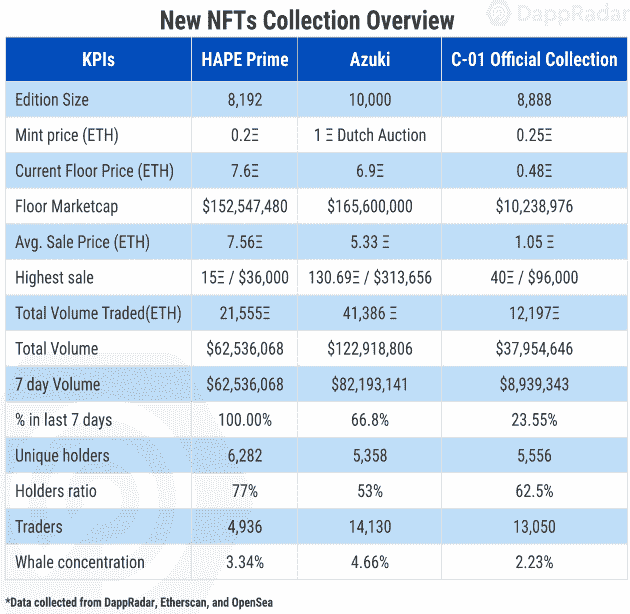

## HAPE 黄金地段——底价涨幅超过 3800%

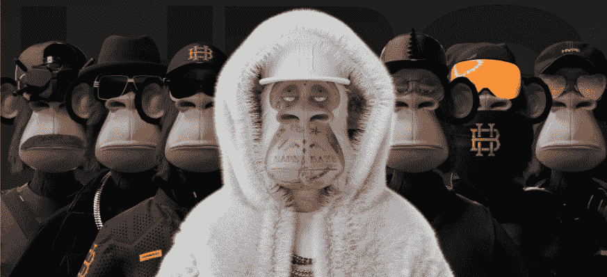

Source: [Hapebeast.com](https://web.archive.org/web/20221004142913/https://www.hapebeast.com/)

**区块链:**以太坊

**上市日期:**2022 年 1 月 19 日

**版本尺寸:**8192(目前有 8157 个)——限量版

**特征:不适用**

**属性:不适用**

Hape Prime 是 8192 个受 BAYC 启发的高质量 3D 渲染头像的集合，重点关注街头时尚和社区支持。在撰写本文时，该系列尚未正式发布该艺术作品。然而，官方 Instagram 上已经泄露了很多。总部位于伦敦的 Digimental Studios 正在开发该系列，这是一个在各自领域拥有丰富经验的高度专业的团队，以及一大批温和的以社区为中心的成员，以在全球范围内策划体验。

这种方法已经获得了很多关注，因为它目前的总交易量为 62，536，068 美元，尽管在撰写本文时才一周，但它是过去 30 天内交易量第十大的收藏。与此同时，自铸币以来，底价已经上涨了 3700%。一旦艺术作品发行，这个数字肯定会进一步增加。

### 附加实用程序–标准实用程序包

该项目旨在通过联合技术、社区和风格，成为数字时尚的下一个领导者。实用因素与时尚音乐和多媒体密切相关。路线图中的信息很少，但 Hape 持有者将获得以下奖励:

*   官方 Hape 音乐
*   次级 NFT 下降
*   特殊数字收藏
*   独家服装商品合作

我们的目标是将该系列发展成为一个独特的时尚品牌，只提供给 HAPE 持有者。

### 财务概述

该系列在发布后的第一周表现强劲。总交易量为 62，536，068 美元，是过去 30 天内交易量第十大的藏品，也是过去 7 天内交易量第六大的藏品。有 4，936 个独特的交易钱包与此系列相关，表明需求不断增长。到目前为止，所有交易中有 84%是盈利的，这表明平均价格仍在上涨。早期买家享受了 3700%的底层资产增值。

所有这些令人兴奋的交易都发生在项目的官方艺术发布之前。一旦艺术品发行，大部分交易将开始。

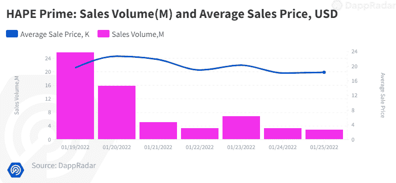

Source: [Dappradar.com](https://web.archive.org/web/20221004142913/https://dappradar.com/hub/assets/eth/0x67d9417c9c3c250f61a83c7e8658dac487b56b09/9999)

*   薄荷价格:0.2**ξ，**
*   **当前底价:**7.6ξ(比出厂价格上涨 3700%)****
*   ****最低市值:61993.2ξ/148783680 美元****
*   ****平均售价:7.56ξ/168.24 万美元(比原价上涨 3405%)****
*   ****最高销售额: [HAPE 顶级酒店](https://web.archive.org/web/20221004142913/https://opensea.io/assets/0x4db1f25d3d98600140dfc18deb7515be5bd293af/375)15ξ/36000 美元****
*   ****初始收入:1 638.4ξ/3 932 160 美元****
*   ****唯一持有人(比例):6282 人(77%)****
*   ****总量:62 536 068 美元/21 555 美元****
*   ****7 天成交量:62536068/21555ξ****
*   ****买家与卖家比率:0.89 (2，439 / 2，713)****
*   ****交易员总数:4，936 人****
*   ****二级市场版税:0%****

 ****### 社会意识和参与

Hape 拥有强大的社交媒体影响力。他们的 Twitter 账户创建于 2022 年 1 月，已经拥有超过 280，000 名粉丝，并且每天平均有 4，163 名粉丝。他们的不和也是一样的热闹。将近 450，000 个独立用户居住在这里。它有一个非常复杂的登录程序，专门用于消除潜在的机器人和不良行为者。

此外，他们有一个非常活跃的审核团队。不和谐社区全天在所有渠道都非常活跃。此外，还支持多种不同语言的用户。他们的 Instagram 有超过 169，000 名粉丝，主要用于泄露即将推出的系列艺术和发布宣传材料。

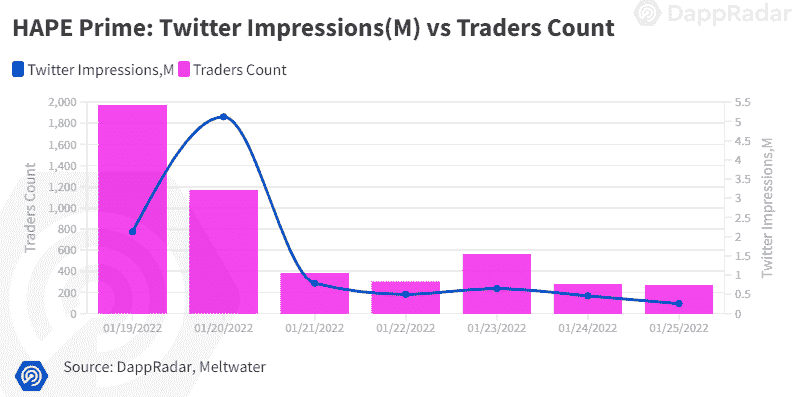

Source: [Dappradar.com](https://web.archive.org/web/20221004142913/https://dappradar.com/hub/assets/eth/0x67d9417c9c3c250f61a83c7e8658dac487b56b09/9999)

*   [推特](https://web.archive.org/web/20221004142913/https://twitter.com/HAPEBEASTGANG)关注者:**281900+人**

*   [不和](https://web.archive.org/web/20221004142913/https://discord.com/invite/hapebeast)成员:449485+人

*   Instagram 有 16.9 万名粉丝

### 团队概述

该团队主要由总部位于伦敦的数字工作室的成员组成。项目成员都非常有才华，其中一些人曾在谷歌和耐克等交易所上市公司工作过。

该团队由以下人员组成:

[digi mental](https://web.archive.org/web/20221004142913/https://www.linkedin.com/in/thesype/)—创始人、团队领导和 BAYC 成员——曾担任耐克和切尔西足球俱乐部的艺术总监，拥有十多年的工作经验。

[just Carl](https://web.archive.org/web/20221004142913/https://twitter.com/TheCarlbrutal)—成长与战略—**前谷歌和前电子竞技 Fnatic** 团队
[Krime 先生](https://web.archive.org/web/20221004142913/https://twitter.com/originalmrkrime)—音乐—该项目的官方音乐制作人。

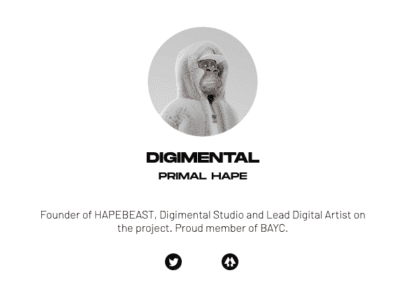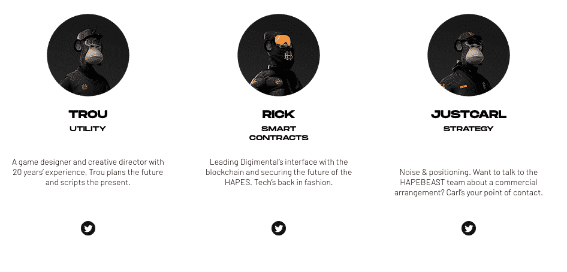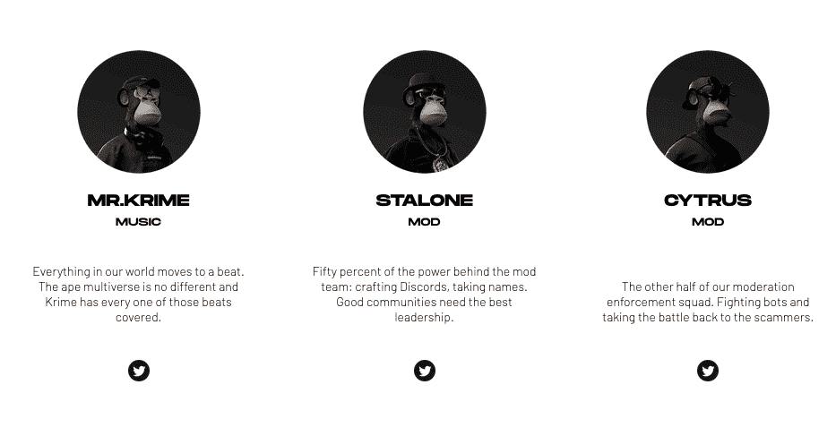

除了核心团队之外，该项目还有一大批区域协调成员来支持全球的国际社区。核心团队没有公开他们的信息，这是不理想的；然而，这不是一个值得关注的原因，因为他们都有一个完美的声誉和多年的专业经验。

### 技术概述

从技术角度来看，没有重大问题。像大多数 NFT 项目一样，Hape 元数据使用 IPFS 存储，而不是完全在链上存储。不太理想，因为智能合约和元数据是分开的，但 IPFS 工作正常。视觉丰富的元数据项目中的常见挑战。

*   审计状态:尚未提交审计
*   存储:OOP NFTs 作为 ERC-721 令牌存储在以太坊区块链上，图形资产托管在 IPFS 上，以实现不变的所有权。
*   合同地址:[0 x4 db 1 f 25 d3d 98600140 DFC 18 deb 7515 be 5b d 293 af](https://web.archive.org/web/20221004142913/https://etherscan.io/address/0x4db1f25d3d98600140dfc18deb7515be5bd293af)

### 鲸鱼钱包分析

Hape 是一个分布非常好的集合。唯一持有人比例为 0.77。比率越高，藏品越不容易受到价格操纵或价格突然波动的影响。前五大鲸鱼只控制了总收藏量的 3.34%，这是一个很好的指标，表明富裕用户不会容易受到价格操纵。

然而，许多著名的 NFT 商人在该系列的前 5 名所有者中均有代表，如 [lianli.eth](https://web.archive.org/web/20221004142913/https://dappradar.com/hub/wallet/eth/0x98fca56dac18c2b7639642000c4471eb836c2925) 、 [luca.eth](https://web.archive.org/web/20221004142913/https://dappradar.com/hub/wallet/eth/0x534c8bc9781a8072b524b853147a69bc6bf2b552) 和 [ajin.eth](https://web.archive.org/web/20221004142913/https://dappradar.com/hub/wallet/eth/0xf42da2860c700b2f419bbf1862ab3de6887677b4) 分别位于第 2、第 3 和第 5 位。知名交易商的出现让人相信，这种收集可能是一种非常成功的努力，通常会促进交易兴趣的增加。用户还必须警惕跟随高调的交易者，因为他们的集合退出往往先于抛售。

*   鲸鱼集中率:273 / 3.34%

## 志那都红豆——两周内产生了超过 1.12 亿美元的交易量

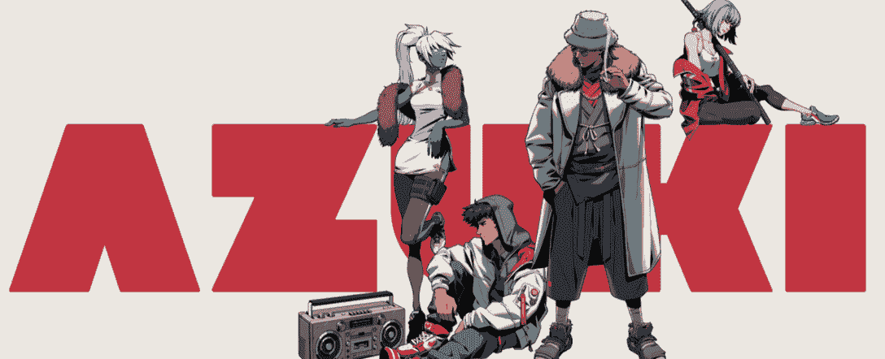

        Source: [www.azuki.com](https://web.archive.org/web/20221004142913/https://ezek.io/about)

**区块链:**以太坊

**上市日期:**2022 年 1 月 12 日

**版本数量:** 10，000-限量版

**特质:** 12

**属性:** 454

志那都红豆是一个合作的基层 NFT 项目，由渴望发展成为一个社区主导的艺术品牌的多元化个人团体创建。该项目由“社区第一”、“仅限 dope ****”和“信任流程，忠于这些理念”这三个指导原则管理。该系列由一万个由项目艺术家专业渲染的动漫形象组成。这一系列引起了社区的共鸣，因为它目前是第八大交易系列，尽管只有两周的历史，但在过去 30 天内交易量达到了 122，918，806 美元。此外，志那都红豆还在继续发展。自 1 月 12 日拍卖以来，地板价格已经上涨了 590%以上。

### 增加的实用性–非常强大的产品

志那都红豆仍处于早期发展阶段，目前正在为持有者探索潜在的实用途径。除了定制的动画头像，奖励名单是相当广泛的，还没有最终确定。在本节中，我们将讨论此时制定的最可行的报价。

为了让社区在线，志那都红豆将扩展到元宇宙，并为其持有人提供以下好处。

**元宇宙:**

*   lookbook——一个在线画廊，艺术家可以在这里向观众广播和宣传他们的作品
*   志那都红豆 3D-志那都红豆旨在创建一个全面的在线交流空间。它是否会在沙盒虚拟现实，分散土地或其他产品尚未最终确定。
*   志那都红豆游戏——视频游戏体验
*   数字商品(drip)——该团队将创建独特的 3D 资产，为一个人的头像镀金，让旁观者眼花缭乱。

**物理奖励**

*   街头服饰——志那都红豆正在寻求与一家尚未透露名字的公司合作，以制作一个独特的街头服饰品牌
*   IRL 活动——志那都红豆将举办见面会、音乐会和其他 IRL 专属活动
*   收藏品——志那都红豆将展出一系列从玩具到滑板的各种收藏品，重点是质量而不是数量。
*   唱片公司——志那都红豆的目标是通过 NFTs 推广音乐艺术家来整顿音乐产业

**社区**

*   $ BEAN——志那都红豆将推出一个完全的 SEC 投诉令牌，用于志那都红豆-verse
*   道——志那都红豆平原最终演变为道

### 财务概述

尽管在撰写本文时，志那都红豆的历史还不到两周，但其交易量已经超过了 1.12 亿美元，是过去 7 天中交易量第五大的收藏。

最卖座的拍卖发生在发布 11 天后，当时志那都红豆#2174 以 130.69 ETH，或 313，656 美元成交。早期创业者的底层资产至少增值了 590%。

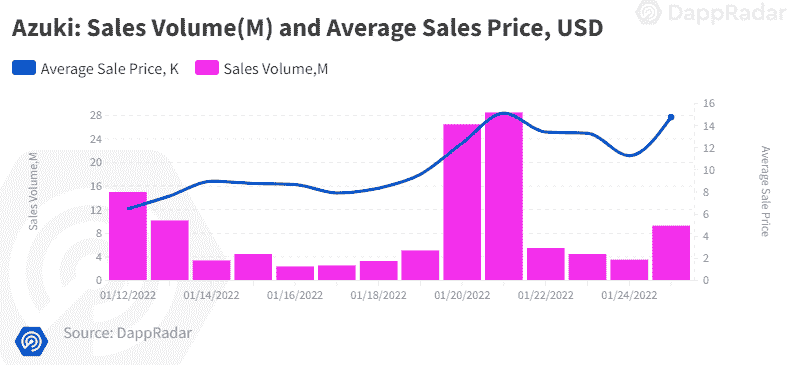

Source: [Dappradar.com](https://web.archive.org/web/20221004142913/https://dappradar.com/hub/assets/eth/0x67d9417c9c3c250f61a83c7e8658dac487b56b09/9999)

*   薄荷价格:1 ETH。价格将每 20 分钟下降 0.05 ETH，直到达到 0.15 ETH
*   当前底价:**6.9ξ(比出厂价格上涨 590%)**
*   **最低市值:6.9 万欧元/1.656 亿美元**
*   **平均售价:5.33ξ/12，792 美元(比原价高出 433 %)**
*   **最高成交价:[志那都红豆#2174](https://web.archive.org/web/20221004142913/https://opensea.io/assets/0xed5af388653567af2f388e6224dc7c4b3241c544/2174) 以 130.69 瑞士法郎/313，656 美元成交**
*   **初始收入:10，000ξ/2，400 万美元**
*   **唯一持有人(比例):5，358 人(53%)**
*   **总量:122 918 806 美元/41 386 美元ξ**
*   **7 天成交量:82，193，141 / 29，148ξ**
*   **买方与卖方比率:1.11 (8，277 / 7，476)**
*   **交易员:14130 人**
*   **二级市场版税:0%**

 **### 社会意识和参与

志那都红豆有丰富的在线社交活动。Discord 拥有超过 64000 名活跃用户。它具有双因素身份验证，并由一组勤奋的大使积极调节，因此服务器非常安全，不会受到机器人、骗子和其他不良行为者的攻击。社区在所有频道上都非常活跃，全天都在讨论。

他们的 Twitter 成立于将近半年前，即 2021 年 8 月，拥有超过 13 万名粉丝。其中 89000 人是在过去 30 天内加入的。他们的频道自成立以来一直在稳步增长，平均每天增长 2，972。

他们的 Instagram 有 16，100 名粉丝，用于发布该项目的宣传图片。

*   [推特](https://web.archive.org/web/20221004142913/https://twitter.com/AzukiZen)关注者:+130，900

*   [不和](https://web.archive.org/web/20221004142913/https://discord.com/invite/azuki)成员:+64783k

*   insta gram+16100 名粉丝

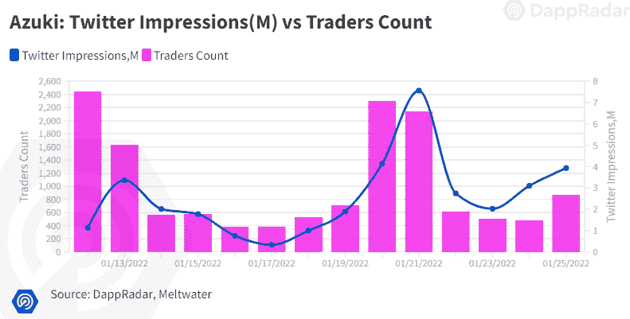

Source: [Dappradar.com](https://web.archive.org/web/20221004142913/https://dappradar.com/hub/assets/eth/0x67d9417c9c3c250f61a83c7e8658dac487b56b09/9999)

### 团队概述

多元化的团队由非常有才华的个人组成，他们曾为脸书、谷歌和动视暴雪等纳斯达克上市公司工作，这增加了项目的可信度。该项目由洛杉矶创意工作室 Chiru Labs 的成员创建。

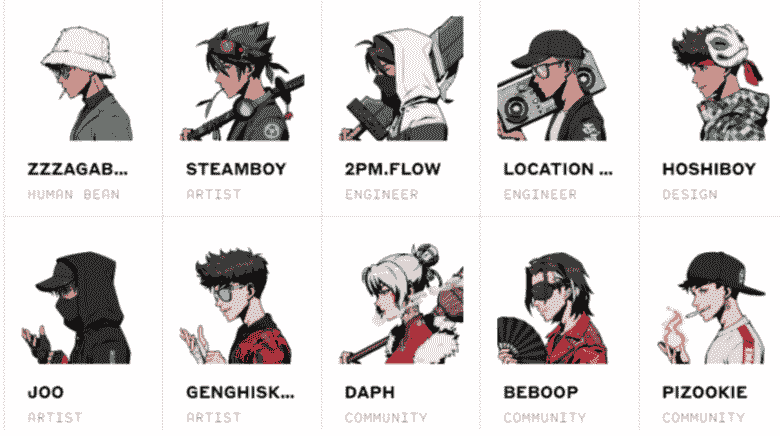

[ZZZAGABOND](https://web.archive.org/web/20221004142913/https://twitter.com/ZZZAGABOND)—项目负责人——前大型技术公司的资深员工

下午两点。心流**–**工程师，之前也在大科技工作过

[地点 TBA](https://web.archive.org/web/20221004142913/https://twitter.com/locationtba)-软件工程师-曾在脸书工作

[hoshi boy](https://web.archive.org/web/20221004142913/https://twitter.com/hoshiboyzen)——在 Y-Combinator 创业大赛中两次获得资助的设计师和企业家

**团队的其他成员由以下成员组成:**

[蒸汽男孩](https://web.archive.org/web/20221004142913/https://twitter.com/steamboy33)——前暴雪娱乐角色艺术总监

[JOO](https://web.archive.org/web/20221004142913/https://twitter.com/njoo)–[才华横溢的](https://web.archive.org/web/20221004142913/https://www.artstation.com/njoo)来自多伦多的自由艺术家和 [HJ 故事的创作者](https://web.archive.org/web/20221004142913/https://www.hj-story.com/)

自由像素艺术家

[DAPH](https://web.archive.org/web/20221004142913/https://twitter.com/daphtheSHAFT)——社区经理和 [twitch streamer](https://web.archive.org/web/20221004142913/http://twitch.tv/godgasm)

[be boop](https://web.archive.org/web/20221004142913/https://twitter.com/BeboopAzuki)–Discord 负责人和社区版主，前谷歌项目经理。

[PIZOOKIE](https://web.archive.org/web/20221004142913/https://twitter.com/pizookie1)–社区版主

这个团队还没有完全公开他们自己；然而，这没有什么可担心的，因为所有的成员都活跃在网上，并且有着干净的、公认的声誉。此外，拥有曾为谷歌、脸书和动视暴雪等纳斯达克上市公司工作的成员，大大提升了这一系列的血统。

### 技术概述

像大多数 NFT 项目一样，元数据存储在中央服务器上，通过 IPFS 托管在以太坊上。不理想，但 IPFS 工作正常。

*   审计状态:尚未提交审计

*   存储:志那都红豆 NFT 作为 ERC-721 令牌存储在区块链以太坊，托管在 IPFS，拥有不可改变的所有权。

*   合同地址:[0x ed 5a f 388653567 af 2f 388 e 6224 DC 7 C4 b 3241 c 544](https://web.archive.org/web/20221004142913/https://etherscan.io/address/0xed5af388653567af2f388e6224dc7c4b3241c544)

### 鲸鱼钱包分析

志那都红豆目前拥有 53%的独特持有人比例。这是在光谱的低端；不过，该系列仍然比较年轻，其薄荷价格相对较高，为 1 ETH。可以理解的是，潜在买家在承诺购买之前会等待铸币价格下跌。较低的比率表明对价格突变的敏感性较高。鲸鱼的浓度平均为 4.66%。更高的鲸鱼聚集度表明知名收藏者操纵价格的风险增加。

排名前五的鲸鱼中有一些杰出的鲸鱼，如 [luggis.eth](https://web.archive.org/web/20221004142913/https://dappradar.com/hub/wallet/eth/0x2079c29be9c8095042edb95f293b5b510203d6ce) 和 [chipnft.eth](https://web.archive.org/web/20221004142913/https://dappradar.com/hub/wallet/eth/0xbd74c3f96c38478460a0e3c88ac86dd133af72be) 。重要鲸鱼的出现增加了收藏品的社会形象，通常在买卖期间吸引更多的交易活动。

*   鲸集中率:4.66%–466 只

## C-01 官方——法国高级时装与元宇宙相遇

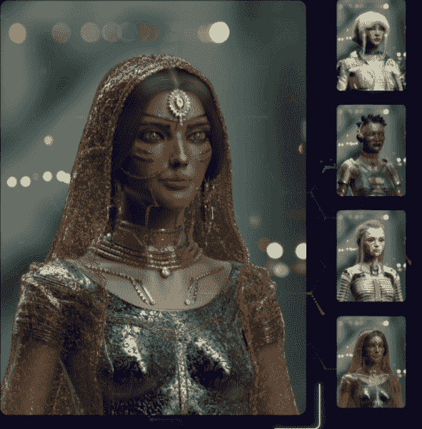

   Source: [c-01nft.io](https://web.archive.org/web/20221004142913/https://c-01nft.io/)

**区块链:**以太坊

**上市日期:**2022 年 1 月 14 日

**版本号:**8888-限量版

**特质:** 10

**属性:** 274

C-01 是一个面向高级时尚的系列，由 8888 个由时尚行业资深人士创作的手工头像组成。该系列的目标是彻底改革时尚产业，将高级时尚和个人资产所有权结合起来。自 C-01 铸币厂成立以来，已经有一周多一点的时间了，该系列已经产生了 37，954，646 美元的交易量。这是最近 30 天内交易量第 17 大的藏品。自铸币以来，底价已经上涨了 92%。

### 附加实用程序–标准实用程序包

虽然该系列的目标是面向女性高级时尚受众，但它拥有路线图中概述的更多实用功能，将证明对全球受众有所帮助。

除了镀金的时尚头像，NFTs 的持有者还将获得以下奖励:

*   象征性奖励
*   独家数码商品
*   与时尚行业合作的实体商品
*   将化身整合到元宇宙和虚拟世界中，如沙盒和分散的土地

### 财务概述

根据 DappRadar 的数据，该系列于 1 月中旬推出，目前交易量排名第 27 位，7 天交易量为 8939343 美元。它有 13，050 个独特的活跃交易钱包，对该系列有着良好的需求。早期投资者享受着 92%的底层资产增值。最高销售额发生在 2022 年 1 月 23 日，比 2022 年 1 月 14 日的铸造活动晚一周。

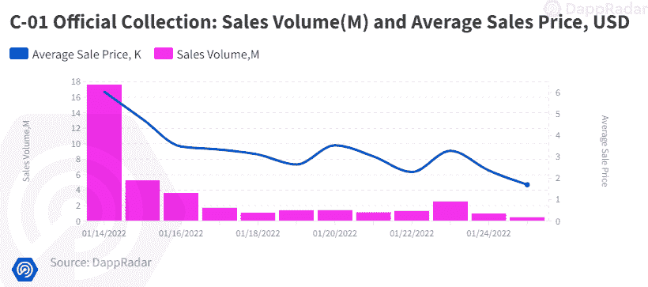

Source: [Dappradar.com](https://web.archive.org/web/20221004142913/https://dappradar.com/hub/assets/eth/0x67d9417c9c3c250f61a83c7e8658dac487b56b09/9999)

*   薄荷价格:**0.25ξ**
*   **当前底价:**0.48ξ/(比出厂价格上涨 92%)****
*   ****最低市值:4266.24ξ/10238976 美元****
*   ****平均售价:1.05 欧元/2520 美元(比原价高出 320%)****
*   ****最高销售额: [C-01 创世纪 2](https://web.archive.org/web/20221004142913/https://opensea.io/assets/0x6fd053bff10512d743fa36c859e49351a4920df6/8830)40ξ/9.6 万美元****
*   ****初始收入:2 222ξ/5 332 800 美元****
*   ****总体积:37 954 646 美元/12 197 美元****
*   ****7 日成交量:8，939，343 / 3，366ξ****
*   ****唯一持有人(比例):5，556 人(62.5%)****
*   ****买家与卖家比率:1.09(7018/6463)****
*   ****交易员:13050 人****
*   ****二级市场版税:0%****

 ****### 社会意识和参与

该系列在社交媒体上广受好评。其于 2022 年 1 月推出的 Twitter 已经拥有超过 89，000 名粉丝，平均每天增长 2，958 人。相比之下，他们的不和要激烈得多。它拥有超过 372，000 个注册用户。Discord 需要一个经过验证的电话号码和复杂的登录程序才能进入，还需要一个专门的版主团队，因此骗子、机器人和其他不良行为者的出现率非常低。

*   [推特](https://web.archive.org/web/20221004142913/https://twitter.com/Flyfishclub)关注者:**+89200 关注者**

 ***   [不和](https://web.archive.org/web/20221004142913/https://discord.com/invite/nPUcrUHUpm)成员+372，667 成员

*   insta gram+35700 名粉丝

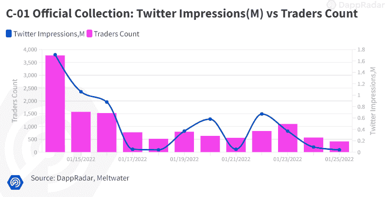

Source: [Dappradar.com](https://web.archive.org/web/20221004142913/https://dappradar.com/hub/assets/eth/0x67d9417c9c3c250f61a83c7e8658dac487b56b09/9999)

### 团队概述

这些团队是完全公开的，由曾在香奈儿、伊夫圣罗兰和路易威登等时装公司工作过的业内资深人士组成。此外，首席艺术家在华纳兄弟工作室工作多年。如此高知名度的成员的存在增加了这一系列的庄严。

Gilberto Zaragoza-3D 艺术家-前华纳兄弟娱乐工作室。娱乐圈资深人士。

网络安全开发人员 Kevin Dedelot 曾为法国银行开发过安全软件架构

[路易斯·蒙泰罗](https://web.archive.org/web/20221004142913/https://www.linkedin.com/in/luis-monteiro-31159b72/)——时装设计师——时装业资深人士，曾为路易·威登和圣罗兰等公司工作

Carla Hu velin——配饰开发员——一位时尚业资深人士，曾为香奈儿和克里斯汀·迪奥工作

[坦吉·德梅](https://web.archive.org/web/20221004142913/https://www.linkedin.com/in/dtanguy)–开发人员–机器人爱好者，一名拥有超过 10 年专业经验的嵌入式系统工程师

凯文·哈达德医生——整形外科医生

[朗加·钱德拉](https://web.archive.org/web/20221004142913/https://twitter.com/Noirtueur9999)–首席主持人

### 技术概述

从技术角度来看，没有重大问题。

像大多数 NFT 项目一样，C-01 元数据使用 IPFS 存储，而不是完全在链上存储。不太理想，因为智能合约和元数据是分开的，但 IPFS 工作正常。视觉丰富的元数据项目中的常见挑战。

审计状态:尚未提交审计

存储:对于不可变的所有权，C-01 NFT 作为 ERC-721 令牌存储在区块链以太坊，图形资产托管在 IPFS。

*   合同地址:[0x6fd 053 BFF 10512d 743 fa 36 c 859 e 49351 a 4920 df 6](https://web.archive.org/web/20221004142913/https://etherscan.io/address/0x6fd053bff10512d743fa36c859e49351a4920df6)

### 鲸鱼钱包分析

C-01 是一个分布非常均匀的集合。巨鲸集中度(whale concentration)是指高度富裕的交易员所拥有的资产的百分比，相对较低，为 2.23%，这很好。较低的比率表明市场操纵的可能性降低。唯一持有人的比例是 62.5%，这意味着非常高的所有者稀释。持有人的比例越高，藏品对抛售导致的价格突然变化就越不敏感。

前五大鲸鱼持有者中有著名的鳍状肢动物 [*라소카.eth](https://web.archive.org/web/20221004142913/https://dappradar.com/hub/wallet/eth/0x67f72412a592d066a2e688e62664116deabeab29) 和 [vfund.eth](https://web.archive.org/web/20221004142913/https://dappradar.com/hub/wallet/eth/0xd841b09d68cc44a9461dd46194d1c7c8b9c50e65) 。知名鲸鱼的兴趣增加了该项目的可信度，因为它可以增加吸引力。人们应该意识到跟踪大型鲸鱼交易的风险。他们退出项目可能会导致抛售。

*   鲸鱼集中比率:198 (2.23%)

## 摘要

在撰写本文时，Hape 刚刚成立一周，其交易量已经达到 58，740，108 美元，在过去七天的交易量中排名第六。在周交易量方面，它超过了许多像 BAYC 和 CryptoPunks 这样的老牌集合。自 mint 以来，该系列的底价已经上涨了 3，700%，甚至在艺术品公开之前还在继续上涨。

相比之下，这超过了最近的开拓者 [CloneX X TAKASHI MURAKAMI](https://web.archive.org/web/20221004142913/https://dappradar.com/blog/new-dapps-report-nft-collectibles-january-2022-edition) 或 [PhantaBear](https://web.archive.org/web/20221004142913/https://dappradar.com/blog/new-dapps-report-nft-collectibles-january-2022-edition-2) ，它们分别升值了 1200%和 1380%。它还吸引了许多著名的 NFT 鲸鱼交易商，其中 3 家( [lianli.eth](https://web.archive.org/web/20221004142913/https://dappradar.com/hub/wallet/eth/0x98fca56dac18c2b7639642000c4471eb836c2925) 、 [luca.eth](https://web.archive.org/web/20221004142913/https://dappradar.com/hub/wallet/eth/0x534c8bc9781a8072b524b853147a69bc6bf2b552) 和 [ajin.eth](https://web.archive.org/web/20221004142913/https://dappradar.com/hub/wallet/eth/0xf42da2860c700b2f419bbf1862ab3de6887677b4) )名列前五名。该系列从 BAYC 和街头时尚中汲取灵感，旨在打造一个只有 HAPE 持有者才能识别的品牌

志那都红豆是一个受动漫启发的时尚项目，正在市场上掀起波澜。该藏品在两周内的交易量超过了 112，579，387 美元，成为 30 天内交易量第八大的藏品。目前，它在月度销量上击败了许多知名收藏，如 BAYC 和 AxieInfinity。该系列有超过 13，000 个独特的交易钱包，并不断攀升，表明健康的需求。该项目的目标是发展成为线上和线下的独立品牌，支持艺术社区的发展。

C-01 是由法国时装业资深人士开发的品牌，旨在通过融合高级时装和数字所有权，成为传统时装业的下一步发展。根据 DappRadar 的数据，该藏品的历史略长于一周，总交易量已经达到 37，241，945 美元，是过去 30 天内交易量第 18 大的藏品。

 NewsletterUnsubscribe at any time. [T&Cs](https://web.archive.org/web/20221004142913/https://dappradar.com/terms) and [Privacy Policy](https://web.archive.org/web/20221004142913/https://dappradar.com/privacy-policy)************