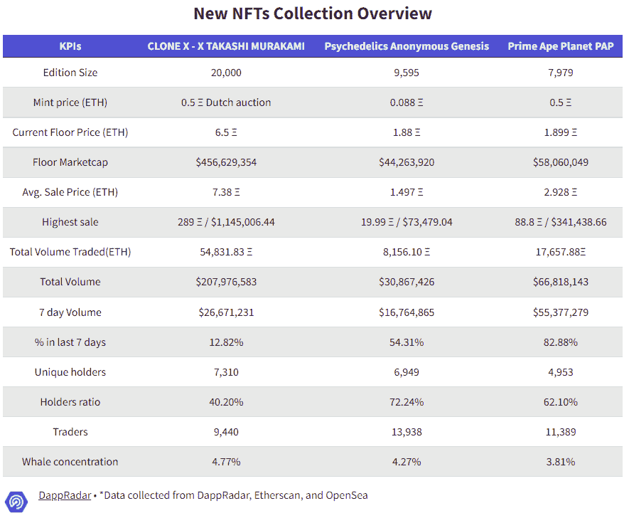
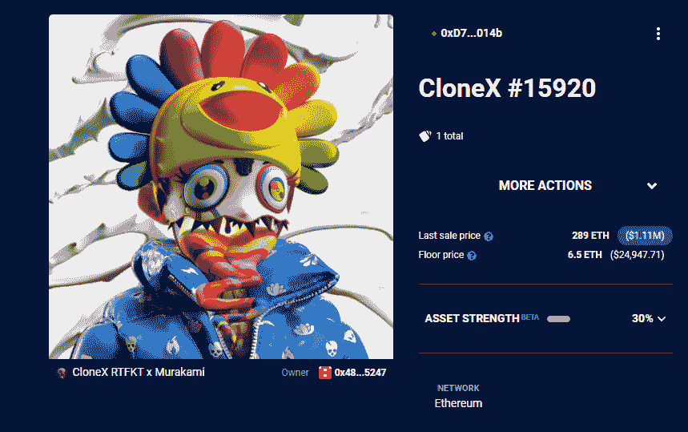
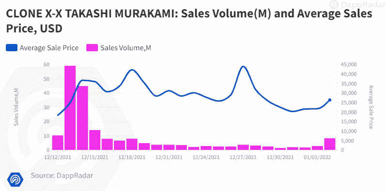
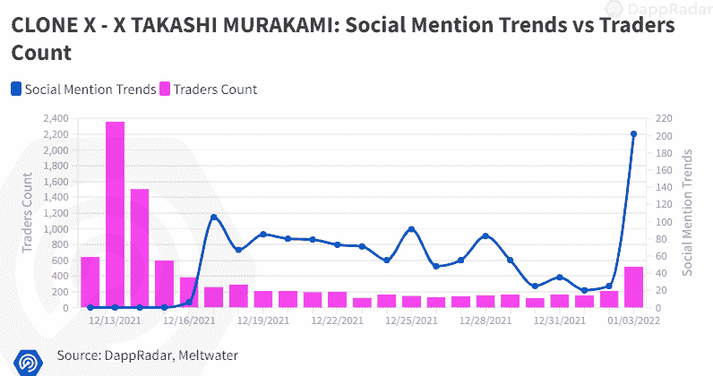
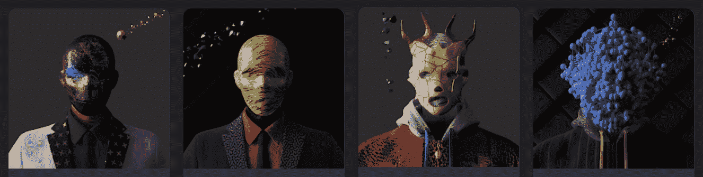
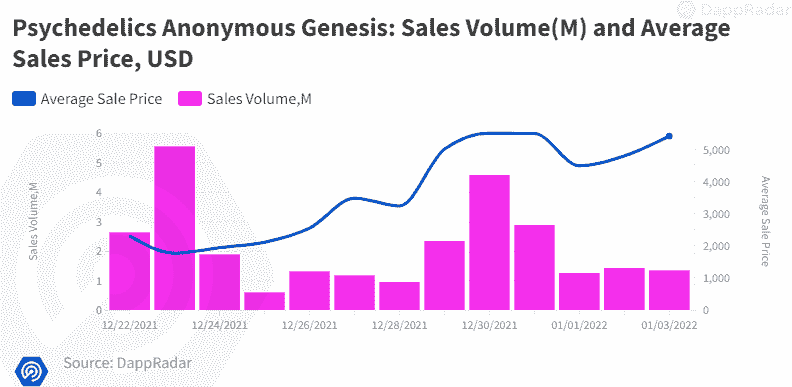
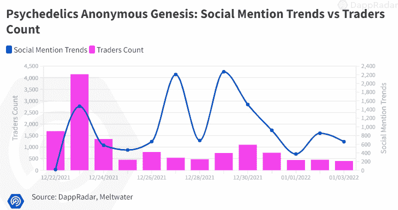
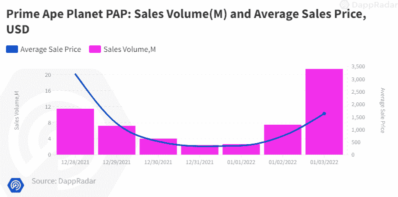
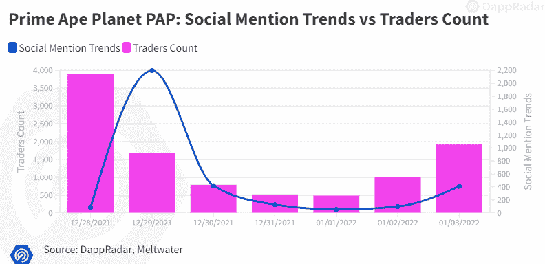
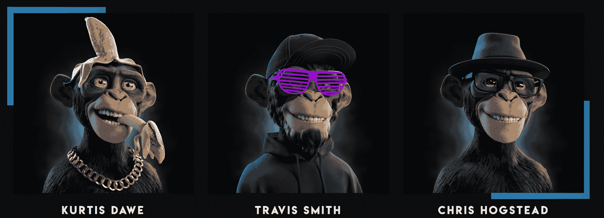

# 新的 Dapps 报告:NFT 收藏品-2022 年 1 月版

> 原文：<https://web.archive.org/web/https://dappradar.com/blog/new-dapps-report-nft-collectibles-january-2022-edition>

## 深入了解 3 个受欢迎的 NFT 收藏:克隆 X，迷幻剂匿名和原始猿星球

在 2022 年 1 月由 DappRadar 撰写的新 Dapps 报告中，我们来看看三个受欢迎的 NFT 收藏:克隆 X，迷幻药匿名和原始猿星球。新的 Dapps 报告是对 NFT 收藏的财务指标的执行概述和分析。

*以下文件属于“新 dapps 系列”，这是一套旨在为用户提供随机生成的有前途的新 NFT 系列的高级视角的执行报告。该报告侧重于财务指标，如销售活动和价格分析，分布指标，如独特持有人比率或鲸鱼集中指数，鲸鱼的行为模式，以及详细的社会和技术概述。*

2021 年对于 NFTs 来说是很棒的一年。该市场产生了创纪录的 240 亿美元的交易量，非金融交易也成为文化的显著特征。在接近年底的短暂冷静期之后，NFT 交易正在为 2022 年的新开始做准备。

为了在新版 Dapps 报告中纪念这一复兴，我们选择了三个在 12 月最后两周启动的 NFT 项目。根据我们在分析中考虑的因素，这些因素都显示出了潜力。

首先，我们来看看克隆人 X–X 村上隆，作为我们之前关于该系列的[报道](https://web.archive.org/web/20221201194710/https://dappradar.com/blog/new-dapps-report-december-edition#clonex)的续篇。自 12 月 12 日铸造以来，克隆 X 已成为第 11 大交易？收藏价值 207，976，583 美元。然后，我们将探索名为迷幻剂匿名(PA)的灵感项目。PA 头像底价自铸造以来已经升值了 2036 %。最后，我们将看看原始类人猿星球。由三位曾参与《复仇者联盟:无限战争》的视觉行业资深人士制作的系列。Prime Ape Planet 诞生不到一周，在过去 30 天的交易量中已经达到 66，818，143 美元，成为第八大畅销系列。

请不要将本文件视为财务建议。数据更新日期:2022 年 1 月 4 日

## 目录

*   关键要点
*   迷幻剂匿名 NFTs
*   克隆 X–X 村上隆
*   原始猿类行星纸
*   概括起来

## 关键要点

*   克隆 X–X 村上隆–rtf kt 的第一个头像项目 CLONE X 在公开发售后仅一周内就积累了超过 1.2 亿美元的交易量。
*   **迷幻剂匿名起源–**在铸造后的一周内交易超过 2400 万美元，在过去 7 天的交易量中稳居第 11 位
*   Prime Ape Planet PAP-在最初的 24 小时内获得了 10 万名 Discord 用户，尽管只有一周的历史，却是过去 30 天内交易量第八大的收藏，交易量超过 6600 万美元。

## 克隆 X–X 村上隆

**区块链:**以太坊

克隆 X 是由 RTFKT(发音为 artifact)工作室制作的头像集合；耐克最近收购的一个数码时尚品牌。该项目收集了 20，000 个随机生成的 3D 动画灵感化身。该系列目前是有史以来交易量第 11 大的系列。

RTFKT 在区块链地区是著名的数字资产创造者。他们之前设计了奢侈品零售店，为嘻哈艺术家创造了标志，并为 Dota 2 和 CSGO 制作了销量数百万的皮肤。他们经常与知名艺术家合作，创作出杰出且备受追捧的数字艺术作品。

Source: [DappRadar](https://web.archive.org/web/20221201194710/https://dappradar.com/hub/assets/eth/0x49cf6f5d44e70224e2e23fdcdd2c053f30ada28b/12822)

这个特别的系列是与著名的日本当代艺术家[村上隆](https://web.archive.org/web/20221201194710/https://en.wikipedia.org/wiki/Takashi_Murakami)合作创作的。众所周知，村上在许多时尚相关产品上进行合作，他的设计拥有狂热的追随者。他的一件雕塑在苏富比拍卖行以 1350 万美元的价格售出。同样，在铸造后仅仅 5 天，[克隆号 15920](https://web.archive.org/web/20221201194710/https://dappradar.com/hub/assets/eth/0x49cf6f5d44e70224e2e23fdcdd2c053f30ada28b/12822) 已经卖出了 111 万美元/289ξ。

### 添加的实用程序

项目路线图详细描述了 Clone X 系列将在不久的将来实现的许多新特性。在不久的将来，克隆人将会有一个 3D 的金库。在此存储库中，克隆可以动态更新并作为对象导出。obj)、Blender 文件(。混合)或用于虚幻引擎和其他图形引擎。克隆 X 化身是完全装配的模型，可用于会议或动画，并跨各种平台。此外，这些化身的所有者将可以访问 RTFKT 的衣服和独特的可穿戴设备的专用克隆库存。这些文件可用于元宇宙内外的各种 3D 项目。

此外，将有一个锻造活动，让所有者“锻造”类似于他们克隆人的独特实物收藏品，以及一个可穿戴市场，以提高克隆人的视觉天赋。

克隆人 X 化身还授予用户访问 RTFKT 生态系统和专属克隆人 X 活动的权限，以及获得他们在现实世界中购买的角色的专属商品的能力。

### 财务概述

克隆 X 已经成为 NFT 收藏中的后起之秀，在公开销售后的第一周就产生了 1.2 亿美元的交易量，而且这个数字还在继续上升。目前，Clone X 是过去 30 天内交易量第二大的收藏，交易量为 207，976，583 美元，是有史以来交易量第八大的收藏。

最高成交价为 289ξ/1，145，006.44 美元，仅在该系列首次铸造五天后。许多项目需要几个月甚至几年才能达到这样的数字。

到目前为止，所有交易中有 84%是盈利的，这表明价格和对这一系列的需求正在上升。

Clone X 授予早期采用者从原始造币价格增加 1200%的地板资产增值。

*   造币价格:**0.5ξ，荷兰式拍卖**
*   **最低市值:119，418 美元/456，629，354 美元**
*   **当前底价:**6.5ξ(比出厂价格上涨 1200%)****
*   ****平均售价:7.38ξ(比原价高出 1376%)****
*   ****最高销售额: [CloneX #15920](https://web.archive.org/web/20221201194710/https://dappradar.com/hub/assets/eth/0x49cf6f5d44e70224e2e23fdcdd2c053f30ada28b/12822) 售价 289ξ/1145006.44 美元****
*   ****初始收入:9 172ξ/37 009 020 美元****
*   ****唯一持有人(比例):7，310 人(40.2%)****
*   ****总体积:207，976，583 美元/ 54，831.83 美元****
*   ****7 日成交量:26，671，231 / 7，048.34ξ****
*   ****买家与卖家的比率:1.09(5579/5103)****
*   ****交易员总数:9，440 人****
*   ****二级市场特许权使用费:5%****

 ****### 社会意识和参与

RTFKT 在社交媒体上有着惊人的影响力，这是这种血统的团队所期望的。他们的推特账户有近 24 万粉丝。然而，自 12 月份发行以来，该账户每天增加近 2763 名新粉丝，仅在过去 30 天内，该账户就吸引了 82908 名新粉丝。

他们的 Discord 总共有 144000 个用户，每天都提供非常活跃的频道。他们的抖音也很受欢迎，有超过一百万的追随者。

*   [推特](https://web.archive.org/web/20221201194710/https://twitter.com/RTFKTstudios)关注者:+237.800
*   [不和](https://web.archive.org/web/20221201194710/https://t.co/G9qTWsHggo)成员:+144.000
*   抖音:100 万粉丝
*   [Instagra](https://web.archive.org/web/20221201194710/https://www.instagram.com/rtfktstudios/)[m](https://web.archive.org/web/20221201194710/https://www.instagram.com/rtfktstudios/)[356.000 追随者](https://web.archive.org/web/20221201194710/https://www.instagram.com/rtfktstudios/)
*   **宣布合作:**村上隆

### 团队概述

RTKFT 由三名共同创始成员创建。自 2021 年 12 月以来，它是耐克的一部分，耐克以未披露的金额收购了 RTFKT。

克里斯汀·克里斯汀·克里斯汀·克里斯汀·克里斯汀·克里斯汀·克里斯汀·克里斯汀·克里斯汀·克里斯汀·克里斯汀·克里斯汀·克里斯汀·克里斯汀是一位创意总监，他为热门网络大片《Dota 2》、《CSGO》和《彩虹 6 号:围攻》创作化妆内容，并从中获利数百万美元

Benoit Pagotto 是品牌总监。他之前担任电子竞技团队 Fnatic 的品牌和营销总监，目前担任耐克(最近收购了 RTFKT)品牌&合作伙伴的高级总监

最后，第三位联合创始人是 Steven Vasilev。他是一个成功的企业家，他的角色是市场营销，销售和产品战略的先锋。

### 技术概述

从技术角度来看，没有什么大问题。由于高需求和对 CloneX 制造厂的过度攻击，他们将最初的公开销售推迟了一天。该团队表现得很专业，公开出售没有发生进一步的事件。

像大多数 NFT 项目一样，CloneX 元数据使用 IPFS 进行存储，而不是完全在链上。不太理想，因为智能合约和元数据是分开的，但是 IPFS 工作正常。这是视觉效果丰富的元数据项目中常见的挑战。

*   审计状态:尚未提交审计
*   存储:CloneX NFTs 作为 ERC-721 令牌存储在以太坊区块链上，图形资产托管在 IPFS 上，拥有不变的所有权。
*   合同地址:[0x 49 cf 6 F5 d 44 e 70224 e 2e 23 FDC D2 c 053 f 30 ada 28b](https://web.archive.org/web/20221201194710/https://etherscan.io/address/0x49cf6f5d44e70224e2e23fdcdd2c053f30ada28b)

### 鲸鱼钱包分析

CloneX 的鲸鱼分析显示，鲸鱼浓缩率为平均值 4.77%。更高的鲸鱼聚集度表明更高的市场操纵风险和更强的价格波动。虽然克隆 X 的操纵风险很低，但考虑到并非所有克隆都已被制造出来，这种风险仍然不可忽视。

排名前两位的是 luggis.eth 和 [saintbayview.eth](https://web.archive.org/web/20221201194710/https://dappradar.com/hub/wallet/eth/0xb3ee5011a7965905cde351ea4905ff4725189a3b) ，他们都持有 Cryptopunks 和 BAYC 等知名系列的许多其他高价值作品，以及其他 RTFKT NFT 专属装备。高调鲸鱼的出现增加了项目可行性的可信度，并提升了系列的知名度。这通常会增加收购和抛售期间的交易活动。

*   鲸鱼集中率:4.77%–875 只

## 迷幻药匿名起源

**区块链:**以太坊
**上线日期:**2021 年 12 月 22 日
**版本大小:**9595–限量版
**特质:** 18
**属性:** 1142

迷幻剂匿名由 4 个独立的 NFT 收集，当结合起来，提供超过其部分的总和的价值。这个项目的展示非常宏大，它的抱负也是如此。虽然这个项目中的每一个收藏都值得关注，但创世纪头像才是这个项目最重要的部分，也是本报告将要讨论的内容。

创世纪头像是由来自澳大利亚悉尼的定制营销和产品开发公司 Voltura 的成员设计的 9595 个折衷而神秘的角色的前卫集合。这些头像与流行文化或其他 NFT 收藏品没有任何相似之处，这让它们在一个充满衍生品的市场中呼吸了一口新鲜空气。

Voltura Labs 此前曾与索尼、麦当劳、毕马威等多家重量级企业合作。该团队在提供精品解决方案方面有着良好的记录，这在本系列中显而易见。

Source: [OpenSea](https://web.archive.org/web/20221201194710/https://opensea.io/collection/psychedelics-anonymous-genesis)

创世纪头像在过去 7 天内以 16，764，865 美元的价格迅速成为第 11 大交易系列，并聚集了强大的社交追随者，自 2021 年 9 月以来在 Twitter 上聚集了 116，000 名追随者，在 Discord 上聚集了近 75，000 名用户。

### 添加的实用程序

匿名迷幻剂的完整体验可以通过铸造属于这个项目的所有四个 NFT 系列来实现。然而，每个用户都可以定义他们自己的体验，只创造对他们有意义的集合，并且仍然是项目的一部分。创世纪头像只是整个项目的四分之一。这个项目的其他部分是:IRL 匿名通行证，元宇宙通行证和组件#1 NFT。

创世化身是四个化身中最有声望的，除了艺术化身之外，它提供了最大的效用。

其他福利包括:

*   创世纪化身实体商品
*   创世纪元宇宙可穿戴设备
*   进入贵宾元宇宙活动和区域
*   Web3 加速器访问
*   企业绩效辅导
*   心理健康支持
*   标桩和未来 DAO 分配。

迷幻剂匿名项目仍处于早期开发阶段，对持有者的许多好处还有待具体阐述。

### 财务概述

尽管在撰写本文时，PAG 才刚刚诞生不到两周，但其交易量已经超过 1500 万美元，是过去 7 天内交易量第 11 大的收藏。该系列不断升值，目前已有 92%的交易高于之前的销售。该系列还吸引了超过 13，000 名独特的交易者，这也反映了对该项目的需求。

该项目获得了很大的吸引力，早期投资者已经看到从最初的薄荷价格上涨了 1318%。

*   薄荷价格:**0.088 ETH(ξ)**
*   **最低市值:44，263，920 美元**
*   **当前底价:**1.88ξ(比出厂价格上涨 2036%)****
*   ****平均售价:1.497ξ(比原价高出 1601%)****
*   ****最高销售额:[迷幻剂匿名创世纪#2060](https://web.archive.org/web/20221201194710/https://dappradar.com/hub/assets/eth/0x75e95ba5997eb235f40ecf8347cdb11f18ff640b/2060) 售价 19.99ξ/$ 73479.04****
*   ****初始收入:844.36ξ****
*   ****唯一持有人(比例):6，949 人(72.24%)****
*   ****总体积:30 867 426 美元/8 156.10 美元****
*   ****7 日成交量:16，764，865 / 4，429.7ξ****
*   ****买方与卖方比率:1.209 (7，565 / 7，348)****
*   ****交易员:13，938 人****
*   ****二级市场特许权使用费:5%****

 ****### 社会意识和参与

迷幻剂匿名拥有强大的社区追随者。自 9 月份创建 Twitter 账户以来，该账户一直在稳步增长，平均每天增加约 2045 个账户的粉丝。他们的分歧在于大约 72，000 名用户拥有强大的安全功能，如移动注册和活动模式。社区在所有渠道的不和谐上非常活跃。

总的来说，这个项目成功地培养了强大的品牌追随者。

*   [推特](https://web.archive.org/web/20221201194710/https://twitter.com/psychedelic_nft)关注者:114.800+
*   [不和](https://web.archive.org/web/20221201194710/https://discord.com/invite/we-are-the-night)成员:72.000+人

### 团队概述

该团队几乎完全由 Voltura Labs 的成员组成，Voltura Labs 是一家专门从事定制营销和品牌解决方案的公司。

该公司总部位于澳大利亚悉尼，与索尼、宜家、麦当劳和通用电气等巨头合作。让以前成功的企业成员参与一个项目(他们都公开了自己的个人数据)会增加项目的合法性和信心。

成员:

*   [Lewis Gale](https://web.archive.org/web/20221201194710/https://twitter.com/BAYC2745)——Voltura Labs 的创始人兼董事总经理。在纳斯达克上市公司工作了 10 年的资深市场人员。
*   [亚当·沙利文](https://web.archive.org/web/20221201194710/https://twitter.com/bxneNFT)——Voltura Labs 创意总监。创建营销活动超过 20 年，通过互动将人与产品联系起来。
*   [詹姆斯·曼宁](https://web.archive.org/web/20221201194710/https://twitter.com/mrjamesmanning)–Voltura 实验室顾问。比特币矿业公司莫森基础设施(MIGI)的首席执行官。强大的物流、投资和规划背景。
*   Nick Hughes-Jones-Voltura 实验室顾问。莫森基础设施集团(MIGI)首席合规官。Nick 在金融市场和基金管理领域拥有超过 15 年的经验。
*   Kate Mahoney–volt ura 实验室活动经理。丰富的金融、美容和酒店活动组织经验，在各个领域都有广泛的人脉。
*   [约书亚·康纳利](https://web.archive.org/web/20221201194710/https://twitter.com/metabaser)——Voltura 实验室创意总监。！5 年视觉行业工作经验，尤其是混合机器和艺术工作经验。
*   [Matt Lim](https://web.archive.org/web/20221201194710/https://twitter.com/pencilflip)–Voltura 实验室首席开发人员。专门从事 web3 开发的软件工程师。以前为脸书工作，现在是 Meta

### 技术概述

至于大多数 NFT 项目，元数据存储在中央服务器上，通过 IPFS 托管在以太坊上。不理想，但 IPFS 工作正常。

*   审计状态:尚未提交审计
*   存储:迷幻剂匿名 NFT 作为 ERC-721 令牌存储在区块链以太坊，托管在 IPFS，拥有不可改变的所有权。
*   合同地址:[0x 75 e 95 ba 5997 EB 235 f 40 ECF 8347 CDB 11 f 18 ff 640 b](https://web.archive.org/web/20221201194710/https://etherscan.io/address/0x75E95ba5997Eb235F40eCF8347cDb11F18ff640B)

### 鲸鱼钱包分析

迷幻剂匿名是一个分布良好的集合，独特的持有者比例为 72%。较高的比率表明价格突然变化的风险降低。实现良好分布的集合，显著降低市场操纵的风险。

鲸鱼的收藏量低于平均值，为 4.27 %。例如，其中我们发现 [Blader.eth，](https://web.archive.org/web/20221201194710/https://dappradar.com/hub/wallet/eth/0xbcf03eb586e7ce838bb73c41bfe1070d0ea1cd09)一个著名的 NFT 脚蹼，在第二位有 50 个 NFT。来自著名脚蹼的兴趣增加了这个项目的可信度，并转移了很多注意力。因此，这往往对销售有很强的积极作用。人们还应该警惕跟随臭名昭著的投机者，因为当他们退出一个项目时，往往会引发抛售。这种风险随着鲸鱼密度的增加而增加。

*   鲸鱼集中率:4.27%–410 只

## 原始类人猿星球

**区块链:**以太坊
**上线日期:**2021 年 12 月 28 日
**版本大小:**7979–限量收藏
**特质:** 14
**属性:** 236

Prime Ape Planet (PAP)是一个由 7979 个定制的、手工制作的“元宇宙就绪”3D 化身组成的集合。该项目背后的团队由视觉娱乐行业的重量级人物组成，他们曾参与网飞的《巫师》、《刺客信条》和《复仇者联盟 3：无限战争》等项目。

因此，这些模型具有极高的质量，具有逼真的毛皮、布料和皮肤。该团队拥有丰富的 3D 应用经验，将使这些模型能够在元宇宙用作虚拟现实、游戏和电影等项目的化身。

### 添加的实用程序

拥有一个顶级的 3D 模型并不是这个系列的唯一好处。例如，这些猿类的持有者可以参加专门的聚会，在那里他们可以与来自艺术、电影和时尚世界的名人交往。然而，如果主人能够提供一只原始猿的所有权证明，这个入口将是免费的。

该项目的 50，000 美元收益将捐给一个慈善机构，致力于保护灵长类动物免受偷猎者的侵害，以及工业化对它们栖息地的破坏。

接下来，该团队将发布一款传奇的 Prime Ape，在质量方面将超过该系列的其他产品。

### 财务概述

对于一个在写作时只有一周历史的系列来说，它引起了不小的轰动。它已经超过了许多既定收藏的 30 天交易量，目前交易价为 66.818.143 美元，排名第九。

该系列有超过 10，000 名交易者，而且这个数字还在不断上升，这表明了对该系列的健康需求。此外，92%的交易都是盈利的，这表明藏品的价值随着每一笔交易都在升值。

该项目还向早期投资者提供了回报，比最初的定价至少高出 279%。

*   薄荷价格:**0.5ξ**
*   **最低市值:15152.121ξ/$ 58 . 060 . 048，8**
*   **当前底价:1.899(比出厂价格上涨 279%)**
*   **平均售价:11.219 美元/ 2.928 欧元(比原价高出 418 %)**
*   **最高销售额: [Prime Ape #6981](https://web.archive.org/web/20221201194710/https://dappradar.com/hub/assets/eth/0x6632a9d63e142f17a668064d41a21193b49b41a0/6981) 售价 88.8ξ/341.438 美元，66 英镑**
*   **总体积:66，818，143 美元/ 17，657.88 美元**
*   **7 天成交量:55，377，279 / 14，634.04ξ**
*   **唯一持有人(比例):4，955 人(62.1%)**
*   **买家与卖家的比率:1.005 (6，118 / 6，085)**
*   **交易员:11389 人**
*   **二级市场版税:0%**

 **### 社会意识和参与

尽管才成立一周，它就聚集了 238，000 名成员，其中 100，000 人是在该项目于 12 月启动后的 24 小时内加入的。社区非常活跃，对不和谐的调节是一流的。

他们的推特也发展了一批健康的追随者。它目前有 43 000 名追随者，平均每天增加 1 359 名新追随者。

该项目还有一个 Instagram 账户，拥有 4.87 万名粉丝。

*   [推特](https://web.archive.org/web/20221201194710/https://twitter.com/PrimeApePlanet)关注者:**43.000+**
*   [不和](https://web.archive.org/web/20221201194710/https://discord.com/invite/primeapeplanet)成员:238.400+
*   Instagram : 48.000

### 团队概述

该团队由三名在 3D 娱乐行业拥有丰富经验的艺术家组成，他们分别是建模师、纹理师和动画师。它们是:

Kurtis Dawe——性格艺术家。担任温哥华艺电公司的角色艺术家。还参与了一些项目，比如最近迪士尼的 3D 电影《小飞象》和《狮子王》。

[特拉维斯·史密斯](https://web.archive.org/web/20221201194710/https://www.linkedin.com/in/artbytravissmith/)——有机建模师和纹理画家。作为纹理艺术家在 Valve 公司工作，并为哈利波特衍生电影《神奇动物:格林德沃的罪行》制作纹理。

Chris hogs tead-多才多艺的生物和人物艺术家，擅长布料和皮毛仿真。曾出演电影《网飞巫师》、《复仇者联盟 3：无限战争》、《残局》和《刺客信条》。

  Source: [www.primeapeplanet.com](https://web.archive.org/web/20221201194710/http://www.primeapeplanet.com/)

这个项目的团队对他们过去的经验和他们的项目目标是完全透明的。公开他们在 LinkedIn 上的个人资料让这个项目更具合法性。

### 技术概述

从技术角度来看，没有什么大问题。

像大多数 NFT 项目一样，他们使用 IPFS 存储 PAP 元数据，而不是完全在链上。不太理想，因为智能合约和元数据是分开的，但是 IPFS 工作正常。这是视觉效果丰富的元数据项目中常见的挑战。

*   审计状态:尚未提交审计
*   存储:PAP NFTs 作为 ERC-721 令牌存储在以太坊区块链上，图形资产托管在 IPFS 上，拥有不可改变的所有权。
*   合同地址:[0x 6632 a9 d63 e 142 f17 a 668064 d41 a 21193 b49 b41 a 0](https://web.archive.org/web/20221201194710/https://etherscan.io/address/0x6632a9d63E142F17a668064D41A21193b49B41a0)

### 鲸鱼钱包分析

PAP 是一个分布很好的集合。巨鲸集中度是指高度富裕的交易者拥有的资产百分比，低于平均水平 3.81%，这非常好。较低的比率表明市场操纵的可能性降低。唯一持有人比例为 62.1%，这是一个完美的平均分数。持有人比率越高，集合对抛售导致的价格突然变化越不敏感。

人们应该意识到这样一种风险:一旦一条大鲸鱼退出一个项目，它通常会引发抛售。

*   鲸集中率:3.81%–304 只

## 摘要

克隆 X–X 村上隆是有史以来第 11 大最畅销的收藏，交易量为 2.07 亿美元，自铸造以来资产增值 1200%。这个系列在过去 30 天里的迅速崛起可以归功于团队制作独特和备受追捧的数字艺术作品的强大能力，他们已经这样做了近十年，以及他们与偶像村上隆的合作。村上华丽、喧闹的设计总能吸引富裕鉴赏家的注意。

“迷幻剂匿名”是一个雄心勃勃的前卫项目，由四个独立的 NFT 系列组成，它们的组合大于其部分的总和。其中最负盛名的是创世纪头像系列，它以独特的艺术设计吸引了观众。该系列目前是过去 7 天中交易量第 11 大的系列，交易量接近 1600 万美元，自铸造以来底价升值了 2036%。该项目将在不久的将来为 IRL 和元宇宙的持有者提供许多次级奖励。

最后，我们还有 Prime Ape Planet，这是由三位视觉娱乐行业的资深人士制作的一个系列，在 NFT 世界掀起了一阵风暴。这个项目的定制 3D 设计几乎具有照片般的逼真质量，仅一周时间，交易量为 66，818，143 美元，已经超过了许多既定收藏的 30 天交易量。在不到一个月的时间里，这个集合在 discord 上获得了近 240，000 名成员的大量关注，并继续稳步增长。**********