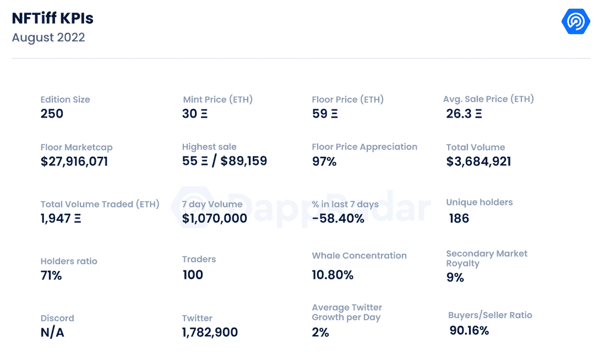
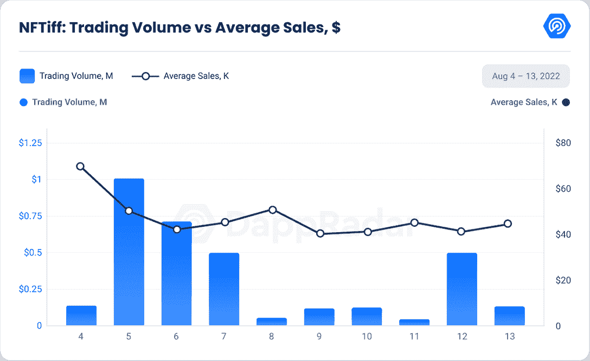
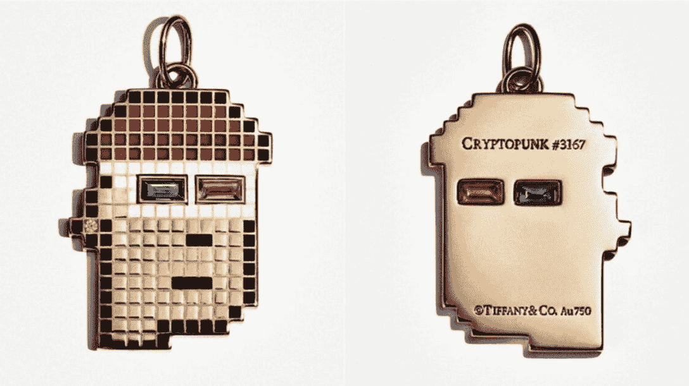
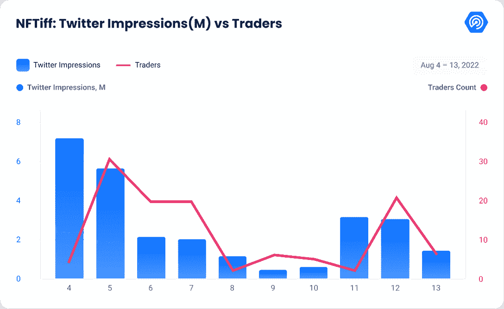

# 新的 Dapps 报告:NFT IFF–NFT 变成了可佩戴的珠宝

> 原文：<https://web.archive.org/web/https://dappradar.com/blog/new-dapps-report-nftiff-nfts-turned-into-wearable-jewelry>

## 新的 Dapps 报告:NFT IFF–NFT 变成了可佩戴的珠宝

**在 2022 年 8 月版的 DappRadar 的新 Dapps 报告中，我们更深入地探讨了 NFTiff，它正在攀登** [**NFT 图表**](https://web.archive.org/web/20221202144110/https://dappradar.com/hub/nft-explorer) **。新的 Dapps 报告详细分析了 NFT 收藏的财务指标，极具吸引力。**

这份新的 Dapps 报告是一系列执行报告的一部分，为读者提供了一个充满希望的、可再生的 NFT 收藏的高层次视角。该报告侧重于财务指标，包括销售活动、价格分析和分布指标，如独特持有人比率和鲸鱼集中指数。它还深入研究了鲸鱼的行为模式以及社会和技术概况。

美国奢侈珠宝品牌蒂芙尼&公司与区块链连锁公司合作，生产了 250 枚 NFT。这不是奢侈品牌的第一个 NFT 系列；[兰博基尼、路易威登、雷朋](https://web.archive.org/web/20221202144110/https://dappradar.com/blog/10-big-brands-that-recently-joined-the-nft-space)和[古驰](https://web.archive.org/web/20221202144110/https://dappradar.com/blog/gucci-launches-10-exclusive-supergucci-nfts)，已经发布了至少一个 NFT 系列。

它于 8 月 5 日发布，每一个 NFT 都是一张数字通行证，专属于 [CryptoPunk NFT](https://web.archive.org/web/20221202144110/https://dappradar.com/ethereum/collectibles/cryptopunks) 持有者，他们有权将他们的 NFT 变成一个定制的吊坠，内含宝石和钻石。

请不要将本文件视为财务建议。

**数据更新日期:****2022 年 8 月 13 日**

## 目录

*   [关键要点](https://web.archive.org/web/20221202144110/https://dappradar.com/blog/new-dapps-report-nftiff-nfts-turned-into-wearable-jewelry/#Key-Takeaways)
*   [财务概况](https://web.archive.org/web/20221202144110/https://dappradar.com/blog/new-dapps-report-nftiff-nfts-turned-into-wearable-jewelry/#Financial-Overview)
*   [效用](https://web.archive.org/web/20221202144110/https://dappradar.com/blog/new-dapps-report-nftiff-nfts-turned-into-wearable-jewelry/#Utility)
*   [社区意识和参与度](https://web.archive.org/web/20221202144110/https://dappradar.com/blog/new-dapps-report-nftiff-nfts-turned-into-wearable-jewelry/#Community-Awareness-and-Engagement)
*   [技术概述](https://web.archive.org/web/20221202144110/https://dappradar.com/blog/new-dapps-report-nftiff-nfts-turned-into-wearable-jewelry/#Technical-Overview)
*   [总结](https://web.archive.org/web/20221202144110/https://dappradar.com/blog/new-dapps-report-nftiff-nfts-turned-into-wearable-jewelry/#Summary)

## 关键要点

*   该系列在发布后 20 分钟内销售一空，为公司创造了 1250 万美元的收入
*   自铸币厂以来，该系列的底价已经上涨了 97%
*   该系列的唯一持有者比例为 71%，是 NFT 系列中最高的比例之一

Source: DappRadar

## NFT IFF–底价增长 97%

## 财务概述

### **区块链:**以太坊

**上市日期:**2022 年 8 月 5 日

**版本号:** 250

**性状:** 159

**属性:** 87

底价:59 瑞士法郎(117245 美元)

Source: DappRadar

NFTiff 系列于 8 月 5 日推出，造币价格为 30 ETH 或 5 万美元。它在 20 分钟内售罄，为这家奢侈珠宝公司创造了 1250 万美元的收入。

NFT 收藏品的基准交易量超过 7 位数。收藏总量超过 360 万美元或超过 1,900 ETH。虽然这一数量低于之前新的 Dapps 报告的平均水平，但值得注意的是，该系列的供应量极其有限，只有 250 件。

最初的财务指标表明，考虑到藏品背后的公司和用途，市场高度重视藏品。在推出的第一天，交易量达到 100 万美元，随后几天减少了近 90%。即使交易量急剧下降，平均销售额保持稳定，目前为 24.4 ETH(45，990 美元)，比薄荷价格下降了 8%。然而，自造币厂以来，楼面价已升值 97%，目前为 59 ETH(110，906 美元)。

### **增加了实用程序——加密朋克变成了黄金吊坠**

蒂芙尼的 NFT 称为“ [NFTiffs](https://web.archive.org/web/20221202144110/https://dappradar.com/hub/nft-explorer/collection/nftiff) ”，是为[隐朋克 NFT](https://web.archive.org/web/20221202144110/https://dappradar.com/ethereum/collectibles/cryptopunks) 持有者提供的特殊数字通行证，允许他们将自己的 NFT 变成一条个性化的宝石镶嵌项链。NFTiff 购买者[还将获得“区块链以太坊上的独立定制 1 对 1 NFT”](https://web.archive.org/web/20221202144110/https://twitter.com/TiffanyAndCo/status/1553811244536270852)，该定制与类似最终珠宝设计的数字艺术品相关联。这些有形的珠宝预计将于 2023 年初开始向通行证持有者提供。如果 NFTiff 持有者在吊坠发货前出售了他们的令牌，那么他们就不能收到吊坠。

每个隐朋克由 87 种特性和 159 种颜色的独特组合组成。后者将反映在个性化的吊坠上。[根据蒂芙尼的声明](https://web.archive.org/web/20221202144110/https://nft.tiffany.com/faq/)，每件珠宝都将由 18k 金打造，并融入至少 30 颗宝石和/或钻石。

Source: [thefashionlaw](https://web.archive.org/web/20221202144110/https://www.thefashionlaw.com/what-can-brands-take-away-from-the-tiffany-co-s-nftiff-launch/)

此外，购买 NFTiff 并将其与您的 CryptoPunk 连接，即授予 Tiffany、其附属公司、代理商和其他关联公司不可撤销、非独家、免版税的权利，使用您的 CryptoPunk 及其知识产权来设计、生产和销售吊坠。

值得注意的是，蒂芙尼公司不需要从[宇迦实验室](https://web.archive.org/web/20221202144110/https://twitter.com/yugalabs)获得许可，因为宇迦在今年早些时候从幼虫实验室购买 crypto punk 系列时表示，它将“给予个人 crypto punk NFT 持有者知识产权、商业和独家许可权”。

### **社区意识和参与度**

该系列没有自己的 Twitter 或 Instagram 账户，但它是 Tiffany & Co 社区的一部分。他们的 [Twitter 账户](https://web.archive.org/web/20221202144110/https://twitter.com/TiffanyAndCo)于 2009 年激活，目前拥有近 180 万粉丝。

社区参与度保持稳定，因为该账户每天平均增加 1，005 名新关注者，在过去 30 天里，该账户增加了 30，000 多名关注者。

他们在社交媒体上有着稳固的地位，在 Instagram 上有超过 1350 万名粉丝，在 T2 脸书有超过 1000 万个赞，在 T4 的 Youtube 频道有 12.2 万名用户。

据我们所知，这个项目没有官方的不和，也没有粉丝组织的渠道。

Source: DappRadar

NFTiff 集合有 100 个独立交易者，是我们分析过的最低的。然而，这个集合是非常排外的，并着重强调社区持有 NFT，以获取未来的利益。因此，交易者不会为了短期利润而抛售 NFT。

### **团队概述**

蒂芙尼&公司是一家美国奢侈珠宝公司，以钻石和纯银珠宝闻名。它成立于 1837 年，2019 年被 LVMH 以 168 亿美元收购。该公司在全球有 326 家门店，其中 60%在亚洲。

这些收藏由区块链的一家科技初创公司 [Chain](https://web.archive.org/web/20221202144110/https://chain.com/) 管理，旨在促进更好、更互联的经济。他们构建加密总账和云基础设施，以支持转型金融产品和 web3 应用。

[Chain](https://web.archive.org/web/20221202144110/https://twitter.com/Chain) 于 2014 年由 [Devon Gundry](https://web.archive.org/web/20221202144110/https://www.linkedin.com/in/devongundry/) 和 [Adam Ludwin](https://web.archive.org/web/20221202144110/https://www.linkedin.com/in/adamludwin/) 成立，已获得科斯拉风险投资公司、潘迪拉资本、Capital One、花旗集团、Fiserv、纳斯达克、Orange 和 Visa 超过 4000 万美元的投资。

2018 年，Stellar 收购 Chain，成立了该基金会的商业部门 Interstellar。Chain 于 2020 年被重新收购，以实现其利用区块链和云技术构建更具弹性的全球金融体系的目标。

### **鲸鱼钱包分析**

NFTiff 集合目前有一个独特的持有者比率 **71%** ，表明一个非常高的分布式集合。唯一持有人越多，持有人之间串通的可能性就越小。似乎有 4 个国家粮食计划署尚未铸造。

鲸鱼浓度为 **10.80%** ，是我们分析过的最高值。前五名持有者中，有 3 头比较突出的鲸鱼[0x 5 FBE F9 E8 d 33 EC 8805 B1 d 9 b 61 af 474 D5 c 312d 5 BF 3](https://web.archive.org/web/20221202144110/https://etherscan.io/address/0x5fbef9e8d33ec8805b1d9b61af474d5c312d5bf3)、 [mabu.eth](https://web.archive.org/web/20221202144110/https://etherscan.io/token/0xe8f88d16f24255FcFab25959705D724406D67D9d?a=0x3be89b64e1437bb18da2d26bcbe9bd3daaadfc26) 和 [tokenangels.eth](https://web.archive.org/web/20221202144110/https://etherscan.io/token/0xe8f88d16f24255FcFab25959705D724406D67D9d?a=0x78f0269f5b1ca914c8c58993f41181f89e212b27) 。第一个拥有 12 个 NFTiffs 和 12 个密码朋克，另外两个，各拥有 1 个密码朋克。

更高的鲸鱼聚集度表明著名收藏者操纵价格的风险增加。更高的鲸鱼集中度也增加了抛售的风险，如果他们清算他们的持有。抛售通常会引起连锁反应，迫使许多较小的鳍状肢也抛售。我们总是建议潜在买家进行尽职调查。

## **技术概述**

NFTiff 集合使用 IPFS，而不是完全在链上。这种类型的存储对视觉上丰富的元数据项目提出了一个常见的挑战，因为智能合约和元数据是分开的。

*   **审计状态:**尚未执行审计

*   存储:NFT IFF 系列以 ERC-721 代币的形式存储在区块链以太坊上，视觉效果在 IPFS 上直播，所有权不变。

*   **合同地址:**[0x E8 f 88d 16 f 24255 fc fab 25959705d 724406d 67d 9d](https://web.archive.org/web/20221202144110/https://etherscan.io/address/0xe8f88d16f24255FcFab25959705D724406D67D9d#analytics)

## 摘要

奢侈时尚行业比其他行业更快、更热情地接受了 NFTs，web3 可能会在未来发挥重要作用。

这非常有意义。高级时装和 NFT 都是基于排他性和稀缺性的概念运作的，这可能有助于解释该行业对 web3 的开放程度，而其他传统企业刚刚犹豫不决地开始尝试它。

奢侈品公司利用这一新空间的意义不仅仅在于大牌尝试新创意。这些品牌，包括[蒂芙尼&公司](https://web.archive.org/web/20221202144110/https://dappradar.com/hub/nft-explorer/collection/nftiff)、[普拉达](https://web.archive.org/web/20221202144110/https://www.prada.com/us/en/pradasphere/special-projects/2022/prada-timecapsule.html)、[巴黎世家](https://web.archive.org/web/20221202144110/https://animalconcerts.com/balenciaga/)和[古驰](https://web.archive.org/web/20221202144110/https://dappradar.com/blog/gucci-launches-10-exclusive-supergucci-nfts)，如何适应区块链的技术，同时利用他们忠实的追随者，对任何考虑转向 web3 的人都具有指导意义。

**借助 dappar Dar NFT 系列浏览器**，利用准确的市场数据和元数据过滤器深入了解各个 NFT 系列，从而保持领先地位。

 NewsletterUnsubscribe at any time. [T&Cs](https://web.archive.org/web/20221202144110/https://dappradar.com/terms) and [Privacy Policy](https://web.archive.org/web/20221202144110/https://dappradar.com/privacy-policy)