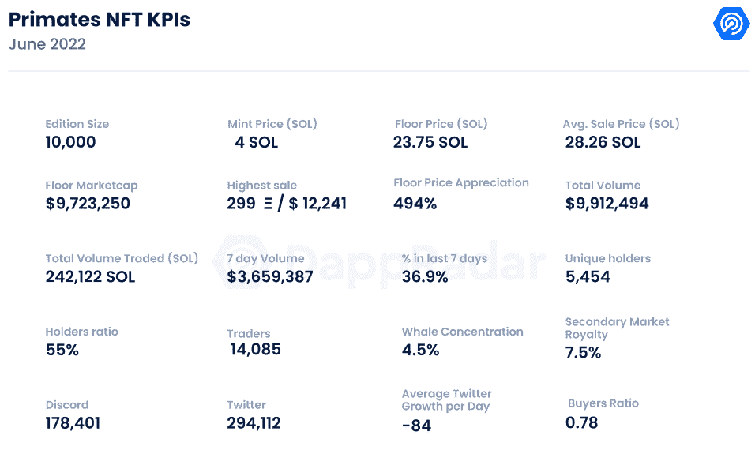
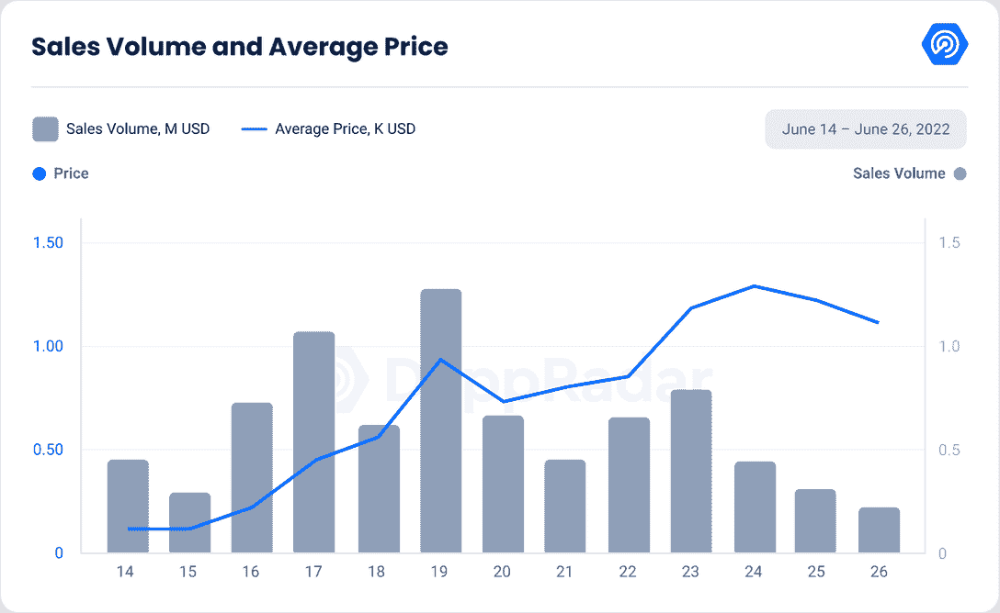
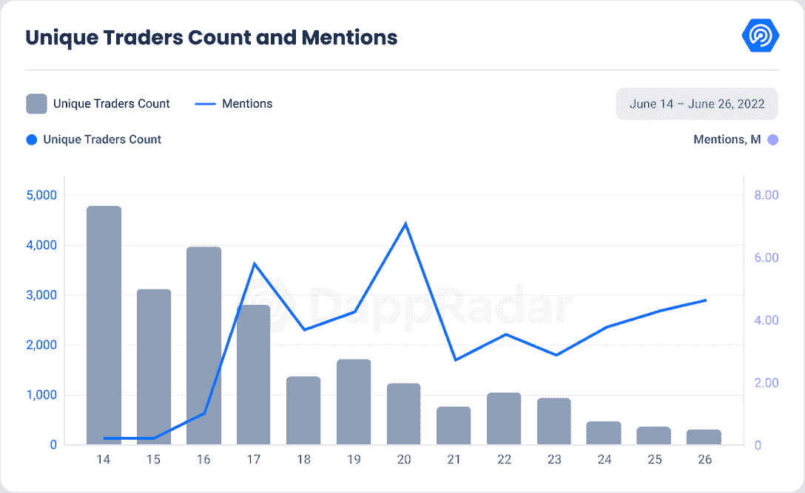

# 新的 Dapps 报告:灵长类动物——欢迎来到丛林

> 原文：<https://web.archive.org/web/https://dappradar.com/blog/new-dapps-report-primates-welcome-to-the-jungle>

## 灵长类动物是第六大交易藏品，在过去的 7 天里交易量超过 300 万美元。了解你需要知道的关于这个时髦的索拉纳 NFT 系列的一切。

**在 2022 年 6 月版的 DappRadar 的新 Dapps 报告中，我们更深入地研究了灵长类动物集合，这是攀登** [**NFT 图表**](https://web.archive.org/web/20220813150017/https://dappradar.com/hub/nft-explorer) **。新的 Dapps 报告详细分析了 NFT 收藏的财务指标，具有很强的吸引力。**

这份新的 Dapps 报告是一系列执行报告的一部分，为读者提供了一个充满希望的、可再生的 NFT 收藏的高层次视角。该报告侧重于财务指标，包括销售活动、价格分析和分布指标，如独特持有人比率和鲸鱼集中指数。它还深入研究了鲸鱼的行为模式以及社会和技术概况。

灵长类动物是 10，000 个生殖性 NFT 的集合，重点关注社区、时尚和街头服饰。该项目大胆地表示，它的目标是创造下一个类似于 Supreme 或 Palace 的顶级街头服装时尚品牌。

开发者计划与资深时装设计师合作，发布季节性的限量版服装。这个品牌的核心受众是喜欢收集和倒卖街头商品的人。商品推销也将是这个系列的核心特征，因为开发者计划提供各种各样的好东西，如滑板、烟灰缸、水瓶等等。

请不要将本文件视为财务建议。

**数据更新日期:****2022 年 6 月 28 日**

## 目录

*   [关键要点](https://web.archive.org/web/20220813150017/https://dappradar.com/blog/new-dapps-report-primates-welcome-to-the-jungle/#Key-Takeaways)
*   [财务概况](https://web.archive.org/web/20220813150017/https://dappradar.com/blog/new-dapps-report-primates-welcome-to-the-jungle/#-financial-performance-)
*   [效用](https://web.archive.org/web/20220813150017/https://dappradar.com/blog/new-dapps-report-primates-welcome-to-the-jungle/#Utility)
*   [社会意识和参与度](https://web.archive.org/web/20220813150017/https://dappradar.com/blog/new-dapps-report-primates-welcome-to-the-jungle/#Social-Awareness-and-Engagement-)
*   [技术概述](https://web.archive.org/web/20220813150017/http://technical-overview/)

## 关键要点

*   灵长类动物是过去七天中交易量第六大的收藏，交易量超过 300 万美元，总交易量超过 900 万美元，是过去 30 天中交易量第 15 大的收藏。
*   灵长类动物也是同一时期索拉纳最成功的收藏品。
*   自 6 月 14 日造币厂拍卖以来，该系列的底价已经上涨了 494%。

## 灵长类动物——尽管面临下行压力，但增长稳健

## **区块链:**索拉纳

**上市日期:**2022 年 6 月 14 日

**版本数量:** 10，000-限量版

**特征:** 6

**属性:** 188

底价: 23.75 索尔

资料来源:DappRadar

尽管市场环境恶劣，但受不利的宏观经济趋势和加密货币价格下跌的推动，灵长类动物表现出强劲的财务表现。

藏品总量超过 900 万美元或超过 242，100 索尔。然而，这一数量低于我们通常在 Dapp 报告中观察到的平均数。我们通常会看到七位数以上的总成交量。

自 5 月初以来，索拉纳的价格已经下跌了 56%。回调后，蓝筹股集合主导交易。尽管竞争激烈，灵长类动物仍然在过去七天的交易量中排名第九，在过去三十天的总交易量中排名第十五。

该系列的交易活动非常接近标准模式。该系列的总销售额增长缓慢，在铸币五天后的 6 月 19 日达到了最高交易日。

在随后的几天里，交易活动逐渐减少，交易量与最初一周持平，没有完全消失。这表明人们对收藏品仍有相当大的兴趣。平均价格的看涨图强化了这一点。

从图中可以看出，平均价格每天都在增长，目前为 28.26 索尔，比最初的铸币价格上涨了 607%。楼面价也不甘落后，为 23.75 索尔，升值 494%。

考虑到市场动荡，这是一个可靠的指标。虽然与升值 45.68%的[地精镇](https://web.archive.org/web/20220813150017/https://dappradar.com/blog/new-dapps-report-goblin-town-defying-tradition-and-the-bear-market)相去甚远，但比升值 24%的[瓦格迪](https://web.archive.org/web/20220813150017/https://dappradar.com/blog/new-dapps-report-we-are-all-going-to-die-embraces-uncertaintyhttps://dappradar.com/blog/new-dapps-report-we-are-all-going-to-die-embraces-uncertainty/)要好得多。这与之前的收藏系列 [GODA mint pass](https://web.archive.org/web/20220813150017/https://dappradar.com/blog/new-dapps-report-goda-mint-pass-gateway-between-art-and-web3) 相一致，其升值了 469%。

### 附加效用——无与伦比的商品销售。

以猿为主题的 NFT 系列并不新鲜；以时尚为重点的系列也很多。尽管竞争非常激烈，但灵长类动物系列的与众不同之处在于该项目的目的、范围和早期执行的清晰性。据[中帖](https://web.archive.org/web/20220813150017/https://medium.com/@primatesnft/the-jungle-a48fff0c534f)称，该系列旨在打造一个街头时尚品牌。

他们心中有明确的目标受众。该系列吸引了 25 岁以下的街头服饰收藏家和经销商。

为此，他们渴望效仿 Supreme 和 Palace 等品牌。他们计划与经验丰富的时尚街头服饰老手和亚马逊 FBA 合作，以确保最好的服装能够在创纪录的时间内运送到持有者手中。

该系列不仅专注于服装，还包括价值适中的物品，如 bongs、水瓶、滑板、打火机、烟灰缸等。

一些造币者还收到了一件设计师 t 恤，每个收到的人都很喜欢。它的功能是作为概念的证明和对未来事物的尝试。

### 社会意识和参与

Source: DappRadar

不像最近 NFT 项目没有社区中心的趋势，灵长类动物存在于这个光谱的另一端，激烈地围绕着社区。

[Discord](https://web.archive.org/web/20220813150017/https://discord.com/invite/theprimates) 频道是集会的中心点。该网站拥有 178，401 名注册用户，与发展援助方案报告中涵盖的大多数项目相当。

入职程序保持简单，以允许尽可能多的人加入。但是，该服务器不会损害安全性。一个活跃的团队版主确保坏演员和机器人保持在最低限度。

社区 24 小时都很活跃，讨论、分享扇子艺术，并自豪地展示他们在 NFT 购买的新品。还有一个专门介绍该项目的未来开发的先睹为快频道。

[Twitter](https://web.archive.org/web/20220813150017/https://twitter.com/Primatesnft) 于 2022 年 4 月上线，但在 2022 年 5 月 9 日才开始活跃。目前有 294，112 个，大大高于 Dappreports 所覆盖项目的平均水平。

在撰写本文时，它已经盖过了像[地精镇](https://web.archive.org/web/20220813150017/https://dappradar.com/blog/new-dapps-report-goblin-town-defying-tradition-and-the-bear-market)和[月鸟](https://web.archive.org/web/20220813150017/https://dappradar.com/blog/new-dapps-report-moonbirds-to-the-moon-and-beyond)这样的项目，它们分别有 69，689 和 178，903 个用户。

该账户迅速积累了粉丝，并在 6 月 11 日达到 367，224 人的峰值，但此后一直在下降。

这种下降是由于过去 30 天内关注者的潮起潮落，呈现出日均净流失 **-84** 个新关注者。

## 团队概述

遵循哥布林镇和 Wagdie 设定的趋势，该团队完全匿名。除了官方账户，他们没有单独的 Twitter 或 Discord 账户。

虽然这一趋势似乎很受欢迎，但它已被证明是一场赌博，因为它带来了神秘的气氛，吸引了许多好奇的询问者。它被证明是一个有效的策略，结合了地精镇展示的奢华展示。

Wagdie 已经证明了这并不总是一个成功的策略。没有一个公众人物来引导和与群众互动，人们就会容易产生怀疑和怀疑。

任何事故都会大大增加社区屈服于 FUD 的风险，为项目敲响丧钟。

## 鲸鱼钱包分析

灵长类动物有一个独特的持有者比率 **55%** ，这表明它是一个适度多样化的集合。唯一持有人越多，持有人之间串通的可能性就越小。较高的比率也表明价格突然波动的风险较低。

鲸鱼 4.5%的浓度完全是平均水平。鲸鱼聚集度高于平均水平的藏品面临着知名藏品持有者操纵价格的更大风险。

此外，更高的鲸鱼集中度也增加了抛售的风险，如果他们清算他们的持有。抛售通常会引起连锁反应，迫使许多较小的鳍状肢也抛售。

我们总是建议潜在买家进行尽职调查。

## 技术概述

与以太坊不同，Solana 上的 NFT 将元数据存储在链上，但它们仍然使用链接到数据存储的 URI。与以太坊上的 NFT 相比，索拉纳上的 NFT 确保了更便宜的汽油费和更快的交易。

收藏没有公开这份合同，这是极不寻常的，也是 Dapp 报告中的第一次。这是值得关注的，因为人们无法验证契约中代码的结构和质量。它会导致怀疑和负面的猜测。

*   **审计状态:**尚未执行审计

*   存储:NFT 以 ERC-721 令牌的形式存储在索拉纳区块链号上，而视觉效果则以不可改变的所有权存在于 IPFS 号上。

*   **合同地址:**团队没有共享合同地址。

## 摘要

与许多最近报道的收藏不同，灵长类动物没有偏离常规太远，而是在很大程度上寻求 NFT 项目中已被证实的方面。该系列和其他许多系列一样，专注于类人猿，并试图将自己树立为一个社会品牌。

让它与众不同的是执行力。该系列的艺术和设计非常受欢迎，许多买家声称仅为艺术购买了一只灵长类动物。

那些在造币期间幸运的人还获得了一件专属 t 恤，作为该项目的一部分。许多时装系列声称有成为时尚品牌的雄心，但只有少数几个系列在项目启动后的几周内给制造商带来了好成绩。

这种方式，加上相对较低的准入门槛，引起了许多 NFT 资深人士和首次购买 NFT 房产者的关注。这些收藏品的总交易量超过 900 万美元，是过去 30 天中交易量第 15 大的收藏品。

这是一个令人钦佩的结果，考虑到在最近 NFT 价格下跌后，只有像[crypto 朋克](https://web.archive.org/web/20220813150017/https://dappradar.com/hub/nft-explorer/collection/cryptopunks)、 [BAYC](https://web.archive.org/web/20220813150017/https://dappradar.com/hub/nft-explorer/collection/bored-ape-yacht-club) 和[志那都红豆](https://web.archive.org/web/20220813150017/https://dappradar.com/hub/nft-explorer/collection/azuki)这样的蓝筹股收藏还留在榜首。

尽管竞争激烈，灵长类动物仍然有 494%的大幅底价升值，并继续产生与第一周相同的交易活动。

该集合的社交指标在 Discord 和 Twitter 上都很强劲。该系列令许多最近的领先系列黯然失色，如[哥布林镇](https://web.archive.org/web/20220813150017/https://dappradar.com/hub/nft-explorer/collection/goblintownnft)和[月鸟](https://web.archive.org/web/20220813150017/https://dappradar.com/hub/nft-explorer/collection/moonbirds)。

然而，Twitter 账户似乎已经过了全盛时期。它在 6 月 11 日达到顶峰，有 367，224 名粉丝，此后一直在下降。这种不和谐是活跃的，也是社区聚集的主要点。

最后，有几个关注点，开发团队是完全匿名的，项目合同没有公开。

这将给一些人带来危险，因为不可能验证潜在缺陷的代码，也不可能与开发人员沟通，如果人们有一些担心的话。

不幸的是，一些有前途的 NFT 项目被证明是骗局或欺诈。这些项目的一个共同特点是模仿像 BAYC 这样的成功项目。我们鼓励我们的读者在对一个项目投入资金之前做好尽职调查。