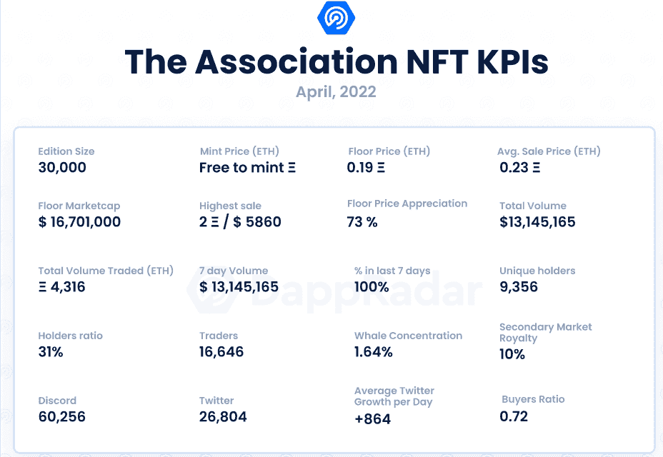
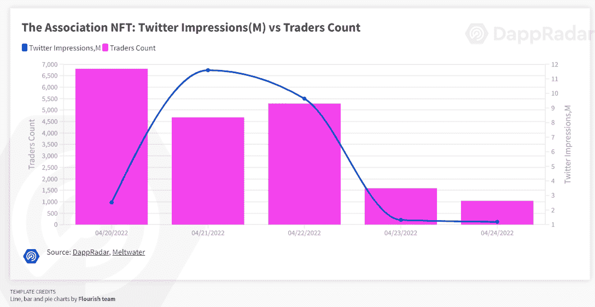

# 新的 Dapps 报告:协会——跟随 NBA Top Shot 的脚步

> 原文：<https://web.archive.org/web/https://dappradar.com/blog/new-dapps-report-the-association-following-in-the-footsteps-of-nba-top-shot>

## 本周我们来看看这个协会，一个基于 NBA 2022 年季后赛的 30，000 个 NFT 的集合

在 2022 年 4 月版的 DappRadar 的新 Dapps 报告中，我们关注了流行和有趣的 NFT 系列，这一次我们涵盖了协会。新的 Dapps 报告是对 NFT 收藏的财务指标的执行概述和分析。

这份新的 Dapps 报告是一系列执行报告的一部分，为读者提供了一个充满希望的、可再生的 NFT 收藏的高层次视角。该报告侧重于财务指标，包括销售活动和价格分析，以及分布指标，如独特持有人比率和鲸鱼集中指数。它还深入研究了鲸鱼的行为模式以及社会和技术概况。

本周我们来看看这个协会，它是基于 NBA 2022 年季后赛的 30，000 个 NFT 的集合。每个 NFT 对应一个特定的玩家。然而，这个集合的独特之处在于 NFT 根据每个玩家的表现而发展。随着玩家在季后赛期间完成更多成就，相应的 NFT 将获得更多视觉特征。

请不要将本文件视为财务建议。

**数据更新日期:****2022 年 4 月 28 日**

## 目录

*   [关键要点](https://web.archive.org/web/20220925074008/https://dappradar.com/blog/new-dapps-report-the-association-following-in-the-footsteps-of-nba-top-shot/#Key-Takeaways)
*   [财务概况](https://web.archive.org/web/20220925074008/https://dappradar.com/blog/new-dapps-report-the-association-following-in-the-footsteps-of-nba-top-shot/#Financial-overview)
*   [效用](https://web.archive.org/web/20220925074008/https://dappradar.com/blog/new-dapps-report-the-association-following-in-the-footsteps-of-nba-top-shot/#Added-Utility)
*   [社会意识和参与度](https://web.archive.org/web/20220925074008/https://dappradar.com/blog/new-dapps-report-the-association-following-in-the-footsteps-of-nba-top-shot/#Social-Awareness-and-Engagement-)
*   [技术概述](https://web.archive.org/web/20220925074008/https://dappradar.com/blog/new-dapps-report-the-association-following-in-the-footsteps-of-nba-top-shot/#Technical-Overview)
*   [鲸鱼钱包分析](https://web.archive.org/web/20220925074008/https://dappradar.com/blog/new-dapps-report-the-association-following-in-the-footsteps-of-nba-top-shot/#Whale-Wallet-Analysis)
*   [总结](https://web.archive.org/web/20220925074008/https://dappradar.com/blog/new-dapps-report-the-association-following-in-the-footsteps-of-nba-top-shot/#Summary-)

## 关键要点

*   该协会是过去 7 天中交易量第 14 大的收藏，交易量为 13，145，165 美元
*   在一周的交易中，该协会已经拥有 16646 名独立交易者

## 财务概述

**区块链:**以太坊

**上市日期:**2022 年 4 月 22 日

**版本数量:** 30，000-限量版

**性状:** NA

**属性:** NA

**底价:** 0.19 瑞士法郎

在推出一周后，该协会已经产生了超过 1300 万美元的交易量，是交易量第 14 大的收藏。这个集合是免费的(虽然汽油费仍然适用)，所以起拍价是交易第一天的平均价格，0.11 ETH。

目前 0.19 ETH 的楼面价已经升值 73%，而 0.23 ETH 的均价已经升值 109%。虽然这些统计数据都是低端的，但重要的是要记住，这个系列仍然只有一周的历史，而且艺术已经在 4 月 27 日发布。这个系列也遵循了 NBA Top Shot 的模式，发布了一个比平均水平更大的 NFT 系列，但这些将根据球员的表现而发展。

## 添加的实用程序

在撰写本文时，该协会尚未公布实用路线图。唯一的效用是艺术和赛季期间的视觉进展。篮球收藏家和一般体育爱好者会特别欣赏这个收藏。那些对推测特定球员的表现感兴趣的人可以购买特定球队或球员的 NFT。如果球员或球队有一个好的赛季，NFT 将变得更加错综复杂，这可能会从逻辑上增加其价值。

## 社会意识和参与

该协会在网上的社交活动不多。Discord 服务器拥有 **60，256 个活跃用户**，这表明该服务器是一个填充良好的服务器。Discord 对公众开放，并有一个复杂的入职程序来过滤机器人和坏演员。服务器非常活跃，开发者参与讨论。

该协会 [Twitter](https://web.archive.org/web/20220925074008/https://twitter.com/nbaxnft) 于 2022 年 3 月上线，目前拥有**26804 名粉丝**。该帐户在过去 30 天内经历了 97%的总增长，平均每天获得 864 个新关注者。这表明增长表现不佳，因为这些数字大大低于平均水平。作为参考，在类似的时间点，像[志那都红豆](https://web.archive.org/web/20220925074008/https://dappradar.com/blog/new-dapps-report-nft-collectibles-january-2022-edition-3)、[涂鸦](https://web.archive.org/web/20220925074008/https://dappradar.com/blog/new-dapps-report-nft-collectibles-november-edition)或 [CloneX](https://web.archive.org/web/20220925074008/https://dappradar.com/blog/new-dapps-report-nft-collectibles-january-2022-edition) 这样的成功收藏拥有超过 60，000 名粉丝的 Twitter 账户，每天的粉丝增长超过 2，500 人。

该协会拥有 16，646 名独立交易者，这是一个非常高的数量，超过了许多其他成功的集合，如[志那都红豆](https://web.archive.org/web/20220925074008/https://dappradar.com/blog/new-dapps-report-nft-collectibles-january-2022-edition-3) (14，130)、 [CloneX](https://web.archive.org/web/20220925074008/https://dappradar.com/blog/new-dapps-report-nft-collectibles-january-2022-edition) (9，440)，或 [Doodles](https://web.archive.org/web/20220925074008/https://dappradar.com/blog/new-dapps-report-nft-collectibles-november-edition) (12，234)。与 NBA Top Shot 在推出后的类似时间点相比，该协会在总销量(11，521 美元)、平均销售价格(31.52 美元)和独特交易者(72 人)方面表现出色。

## 团队概述

协会团队不公开。根据 Discord 上提供的信息，NBA 官方负责开发该系列。

## 技术概述

该协会使用 IPFS 存储其元数据，而不是完全在链上。这给视觉上丰富的元数据项目带来了一个共同的挑战，因为智能合约和元数据是分开的。

根据 [Blocksec](https://web.archive.org/web/20220925074008/https://twitter.com/BlockSecTeam/status/1516972147805409281?ref_src=twsrc%5Etfw%7Ctwcamp%5Etweetembed%7Ctwterm%5E1516972147805409281%7Ctwgr%5E%7Ctwcon%5Es1_&ref_url=https%3A%2F%2Fthecryptobasic.com%2F2022%2F04%2F21%2Floophole-spotted-in-nba-association-non-fungible-tokens-as-attacker-exploits-code-to-mint-100-nfts%2F) 的说法，该协会有一个合同漏洞，该漏洞被利用来允许非白名单用户通过复制白名单用户的签名来制造 NFT。

开发团队已经承认了这个漏洞，但是还没有得到官方确认的解决方案。

*   审计状态:尚未执行审计

*   存储:关联**NFT 作为 ERC-721 令牌存储在以太坊区块链上，视觉在 IPFS 上保持不变的所有权。**

 ***   合同地址:[0x 23581767 a 106 AE 21 c 074 b 2276d 25 e 5c 3 e 136 a 68 b](https://web.archive.org/web/20220925074008/https://etherscan.io/address/0x23581767a106ae21c074b2276d25e5c3e136a68b)

## 鲸鱼钱包分析

该协会目前拥有 31%的唯一持有人比例，表明收藏相对集中。1.64%，其鲸鱼浓度相对较低。前五名持有者中没有知名的 NFT 鳍手或有影响力的人。这些统计数据的组合表明，许多用户持有多个 NFT，但没有显著的鲸鱼影响相当大的价格波动。

## 摘要

该协会正在经历一些成长的烦恼。该系列由 NBA 官方授权和开发。然而，与 NBA 之前非常成功的项目 NBA Top Shot 不同，该协会是在没有 Dapper Labs 的情况下开发的，并且不是基于区块链流。

该项目启动几天后，一个合同漏洞被利用，允许非白名单用户制造 NFT，这对销售产生了负面影响。尽管如此，该协会是交易量第 14 大的收藏，交易量超过 1300 万美元。这些数字与发布后同一时间的 [NBA 顶级射手](/web/20220925074008/https://dappradar.com/blog/flow-blockchain-launches-with-nba-top-shot/)相比要高得多。作为参考，NBA Top Shot 用了 4 个月的时间达到 100 万美元的销售额，用了 6 个月的时间超过 1300 万美元的销售额。

对一个好项目的实际考验是他们跌倒后如何爬起来。该协会仍处于萌芽阶段，在写作时只有一个星期。一旦安全问题得到解决，艺术品得以发行，该协会可能会看到一个转机，因为有现成的观众想要交易这个系列，独特的交易者数量之多和大量的不和谐就是证明。

 NewsletterUnsubscribe at any time. [T&Cs](https://web.archive.org/web/20220925074008/https://dappradar.com/terms) and [Privacy Policy](https://web.archive.org/web/20220925074008/https://dappradar.com/privacy-policy)**