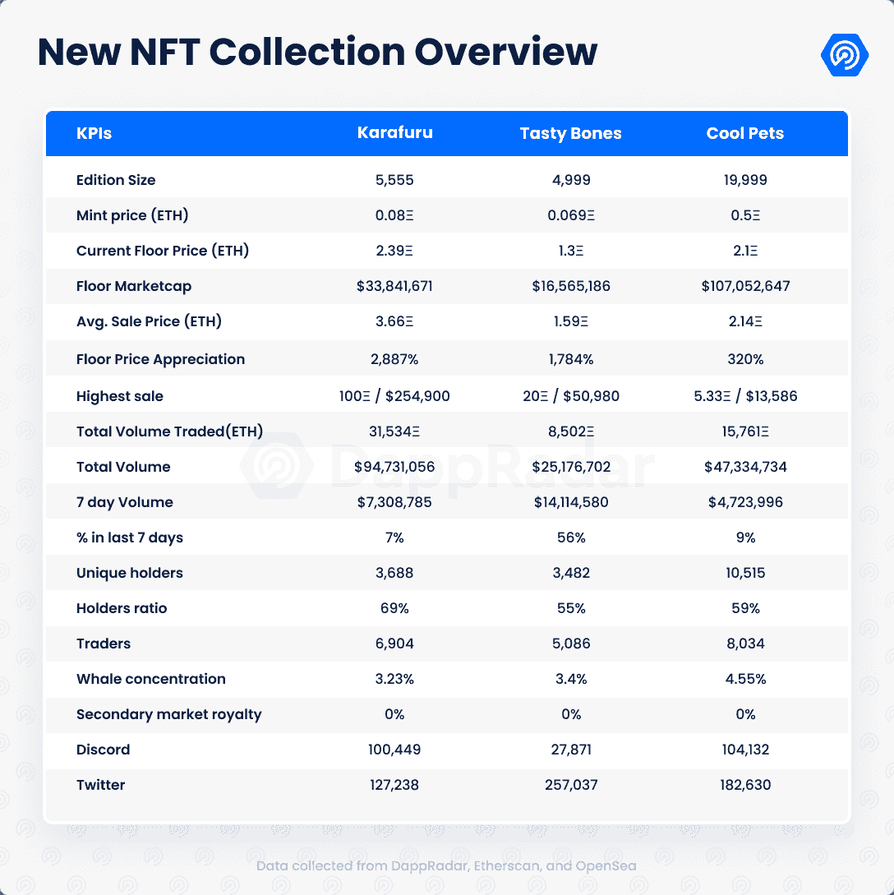
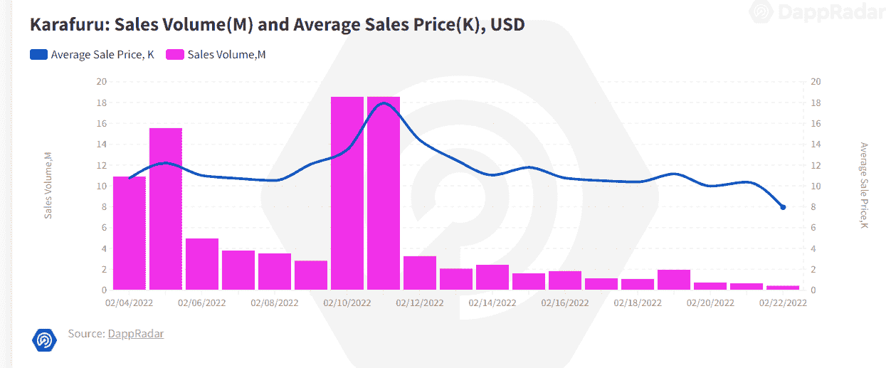
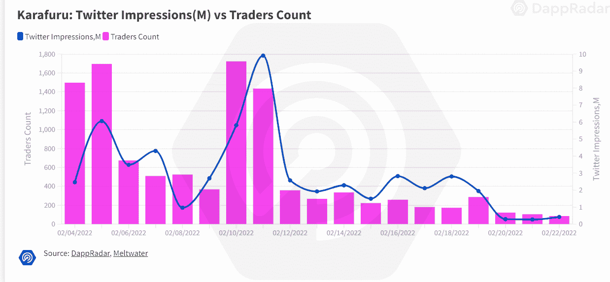
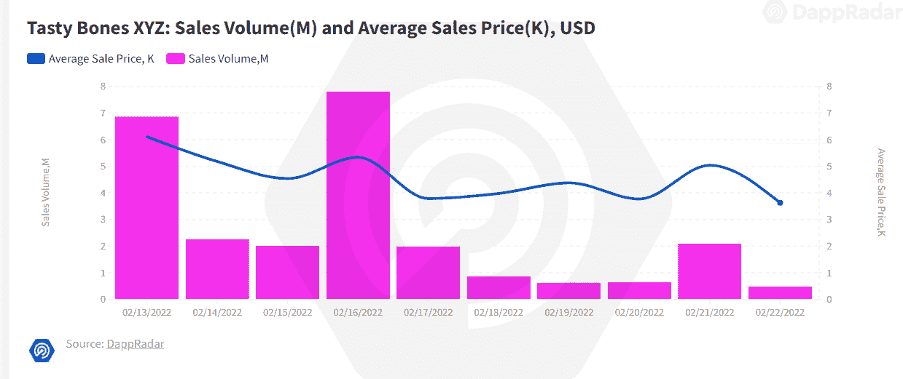
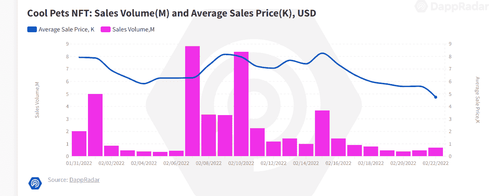
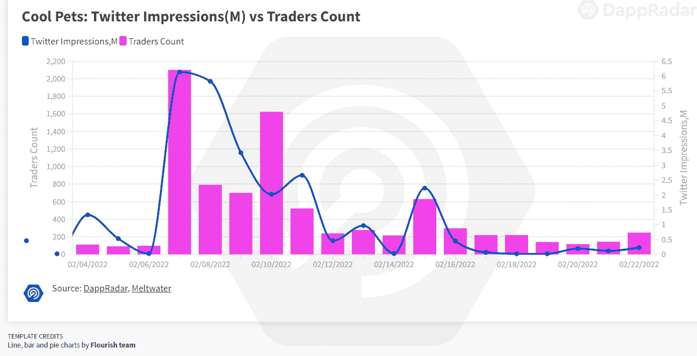
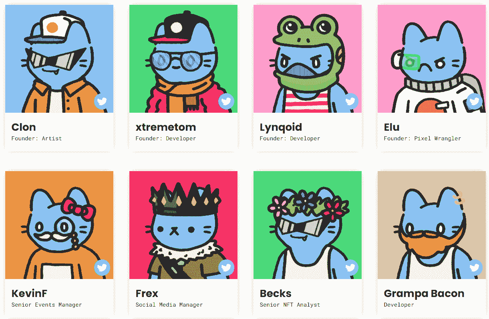
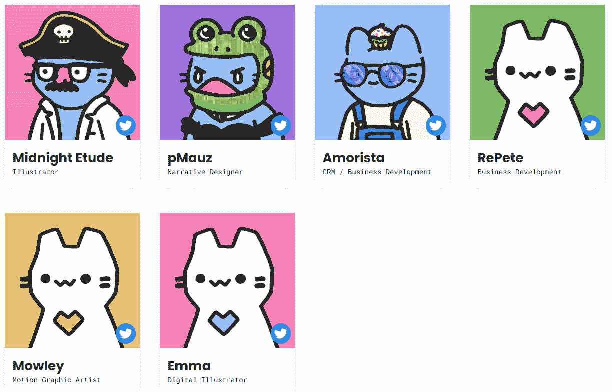

# 新的 Dapps 报告:三个粉彩系列击败市场

> 原文：<https://web.archive.org/web/https://dappradar.com/blog/new-dapps-report-three-pastel-collections-beating-the-market>

## 这次我们来看看以下三个 NFT 系列:卡拉福鲁、美味骨头和酷宠物

在这份 2022 年 2 月版的 DappRadar 的新 Dapps 报告中，我们关注了在熊市中表现良好的三个 NFT 流行系列:Karafuru、Tasty Bones 和 Cool Pets。新的 Dapps 报告是对 NFT 收藏的财务指标的执行概述和分析。

新的 Dapps 报告是一系列执行报告，为读者提供了随机生成的 NFT 集合的高层次视角。该报告侧重于财务指标，包括销售活动和价格分析，以及分布指标，如独特持有人比率和鲸鱼集中指数。它还深入研究了鲸鱼的行为模式以及社会和技术概况。

2022 年，随着宏观经济事件导致货币暴跌，加密空间开始走熊。虽然进展顺利并且[保持相对稳定](https://web.archive.org/web/20221129142718/https://dappradar.com/blog/why-are-nfts-sidestepping-the-crypto-crash)，NFT 空间也有它的麻烦，包括最近的 Opensea exploit。尽管如此，一些新系列表现良好。其中三个新成员是卡拉弗鲁、美味骨头和酷宠物。

首先，我们来看一下**，这是由雅加达[玩具博物馆](https://web.archive.org/web/20221129142718/https://motmuseum.com/)收藏的 5555 件玩具，该博物馆展示设计师的玩具，并与受欢迎的艺术家合作制作新的玩具系列。Karafuru 是博物馆与 WD_Willy 合作的产物，自 2 月 4 日推出以来，已经产生了超过 1 亿美元的交易量。**

 **然后我们看看 [**【美味骨头】**](https://web.archive.org/web/20221129142718/https://tastybones.xyz/roadmap/)**5000 个充满活力的骨骼主题头像，由在币安智能链上发布经批准的柯基犬的团队制作。在撰写本文时,“美味骨头”是过去 7 天中交易量第八大的收藏，交易量超过 1400 万美元。**

 **最后，我们来看看[**酷宠**](https://web.archive.org/web/20221129142718/https://dappradar.com/ethereum/collectibles/cool-pets-nft) ，这是 **[酷猫](https://web.archive.org/web/20221129142718/https://dappradar.com/ethereum/collectibles/cool-cats)** 的一个子集合，由 19999 只随机生成的酷宠组成，它们完全集成到 Cooltopia 生态系统中，并随着持有者的输入而逐步进化。在撰写本文时，Cool Pets 是过去 7 天中交易量第 14 大的收藏，交易量超过 700 万美元。

请不要将本文件视为财务建议。
**数据更新日期:2022 年 2 月 24 日**

## 目录

*   [关键要点](https://web.archive.org/web/20221129142718/https://dappradar.com/blog/new-dapps-report-three-pastel-collections-beating-the-market/#takeaways)
*   [卡拉福鲁](https://web.archive.org/web/20221129142718/https://dappradar.com/blog/new-dapps-report-three-pastel-collections-beating-the-market/#karafuru)
*   [好吃的骨头](https://web.archive.org/web/20221129142718/https://dappradar.com/blog/new-dapps-report-three-pastel-collections-beating-the-market/#bones)
*   [酷宠物](https://web.archive.org/web/20221129142718/https://dappradar.com/blog/new-dapps-report-three-pastel-collections-beating-the-market/#pets)
*   摘要

## 关键要点

*   **Kara furu****–**Kara furu 在 30 天内的交易量超过 1 亿美元，是交易量第六大的收藏；楼面价升值近 2900%

*   **美味骨头****–美味骨头是过去 7 天中交易量第八大的藏品，交易量超过 1400 万美元；其底价增长了近 1，800%，最高售价为 20 ETH(50，980 美元)**

 ***   **酷宠****–**作为最初酷猫路线图的一部分，酷宠是过去 30 天内交易量第十大的藏品，交易量超过 4700 万美元。

## Kara furu——超过 1 亿美元的销售额

**区块链:**以太坊
**上线日期:**2022 年 2 月 4 日
**版本尺寸:**5555–限量版
**特质:** 9
**属性:** 261
**底价:**2.39ξ

Source: [Dappradar.com](https://web.archive.org/web/20221129142718/https://dappradar.com/hub/assets/eth/0x67d9417c9c3c250f61a83c7e8658dac487b56b09/9999)

销售价格与销售量的相关性很弱。价格的大幅上涨与交易量非常大的日子相吻合。交易活动的减少压低了平均价格。

### 附加设施–标准设施产品

正如路线图中详细描述的那样，这个项目的效用似乎是标准的——它承诺独家商品和合作伙伴关系，2D 化身演变为 3D，以及推出玩具系列。玩具博物馆有着多年的类似合作经验，有着兑现承诺的良好记录，为这个项目的路线图增添了可信度。该机构也很受稀有动漫和街头艺术作品收藏家的欢迎，他们形成了现成的观众。

### 社会意识和参与

Karafuru 有一个多产和强大的在线社会存在。它的 [Discord](https://web.archive.org/web/20221129142718/https://discord.com/invite/livesofasuna) 服务器拥有超过 100，449 名活跃用户，并拥有复杂的入职程序和活跃的审核团队，可以减少恶意机器人活动和不良行为者。社区对话全天都在进行，并通过各种渠道进行，这表明参与度很高。

Karafuru 的 [Twitter](https://web.archive.org/web/20221129142718/https://twitter.com/KarafuruNft) 于 2022 年 1 月上线，目前拥有 170715 名粉丝。该账户在过去 30 天里经历了大幅增长，新增关注者超过 134 000 人，平均每天新增近 4 500 人。这表明了人们对该系列的强烈兴趣和不断增长的需求。

交易员数量与 Twitter 印象密切相关。交易者的大量涌入与 Twitter 活动的增加相一致，而交易者数量的减少反映在 Twitter 印象的减少上。

### 团队概述

除了[W](https://web.archive.org/web/20221129142718/https://twitter.com/WD_Willy)T2e[de](https://web.archive.org/web/20221129142718/https://twitter.com/WD_Willy)这位来自印尼的当红自由艺术家兼插画师，Karafuru 的创始团队其余成员——[artna](https://web.archive.org/web/20221129142718/https://twitter.com/soloandrw_)l[yst。ξ，](https://web.archive.org/web/20221129142718/https://twitter.com/soloandrw_) [Rofe，](https://web.archive.org/web/20221129142718/https://twitter.com/rofe_eth)[gradyedbert . eth](https://web.archive.org/web/20221129142718/https://twitter.com/gradyedbertnft)–保持匿名。Wede 在 Instagram 上有超过 50，000 名粉丝，在 Twitter 上有 32，800 名粉丝，在 Hicetnunc 上有一个画廊。

### 技术概述

像大多数 NFT 项目一样，Karafuru 元数据使用 IPFS 存储，而不是完全在链上存储，这给视觉上丰富的元数据项目带来了共同的挑战，因为智能合约和元数据是分开的。不过，从技术角度来看，没有什么大问题。

*   审计状态:尚未执行审计
*   存储:Karafuru NFTs 作为 ERC-721 令牌存储在区块链以太坊，由 IPFS 托管，拥有不可改变的所有权
*   合同地址:[0xd 2f 668 a 8461d 6761115 daf 8 AE B3 CD F5 f 40 c 532 c 6](https://web.archive.org/web/20221129142718/https://etherscan.io/address/0xd2F668a8461D6761115dAF8Aeb3cDf5F40C532C6)

### 鲸鱼钱包分析

Karafuru 目前拥有 69%的独特持有人比例，这表明它是一个多元化的收藏；较低的比率表明对价格突变的敏感度较高。在 3.23%，它的鲸鱼浓度一般。更高的鲸鱼聚集度表明知名收藏者操纵价格的风险增加。前五名持有者中有三只显赫的鲸鱼:[pokkai . eth](https://web.archive.org/web/20221129142718/https://dappradar.com/hub/wallet/eth/0x1cc3195c46c2f6af665ae281ad861eab88ed8fb5)、 [bonzivault.eth](https://web.archive.org/web/20221129142718/https://dappradar.com/hub/wallet/eth/0xf3d6912f569d195c4590c432975b538c147c1a9b) 和 [eddyiskongz.eth](https://web.archive.org/web/20221129142718/https://dappradar.com/hub/wallet/eth/0x8c40d627ee8a99d07fe9dbf041e11a3381c10697) 。知名 NFT 收藏家/密码投资者的出现通常表明交易活动增加，对藏品的兴趣整体上升。

## 美味骨头——底价增长 1，784%

**区块链:**以太坊
**上线日期:**2022 年 2 月 13 日
**版本尺寸:**4999–限量版
**特质:** 7
**属性:** 255
**底价**:1.3ξ

销售价格与销售量的相关性很弱。价格的大幅上涨与交易量非常大的日子相吻合。交易活动的减少压低了平均价格。

### 附加设施–标准设施产品

Tasty Bones 的路线图详细描述了许多标准的实用程序功能，包括令牌启动、独特的定制项目、事件和赠品，以及向 DAO 的演进。更多的细节是稀缺的，因为在撰写本文时，该收藏刚刚超过一周。

### 社会意识和参与

交易员数量与 Twitter 印象密切相关。交易者的大量涌入与 Twitter 活动的增加相一致，而交易者数量的减少反映在 Twitter 印象的减少上。

虽然美味骨头的 Twitter 账户是在三个月前创建的，但在 2021 年 12 月，它已经拥有了 257，000 名粉丝。它的大部分增长发生在过去 30 天，该账户获得了超过 161，000 名新粉丝，平均每天有 5，371 名新粉丝，这是该系列的强劲增长和需求指标。

美味骨头组织有 27871 名成员。新用户必须注册他们的手机，并通过验证码机器人进行验证才能进入，服务器由一个专门的团队进行主动调节，以确保机器人、垃圾邮件和不良行为者的存在降至最低。Discord 是一个活跃的社区，mods 团队经常参与讨论。该项目的 [Instagram](https://web.archive.org/web/20221129142718/https://www.instagram.com/tastybonesnft/) 拥有 26500 名粉丝，用于分享该系列的推广艺术。

### 团队概述

核心团队将自己公之于众，增加了项目的可信度，并得到皇家实验室的进一步支持来运行 NFT 项目。虽然不太出名，但这个由 [inklxb](https://web.archive.org/web/20221129142718/https://twitter.com/inklxb) 、 [5TimesDistilled.eth](https://web.archive.org/web/20221129142718/https://twitter.com/5TimesDistilled) 和 [EvaK360Boss.eth](https://web.archive.org/web/20221129142718/https://twitter.com/EvaK360Boss) 组成的团队拥有运营 NFT 项目的经验，之前曾在币安链上推出过[认证柯基犬](https://web.archive.org/web/20221129142718/https://approvingcorgis.com/)。

 Source: [tastybones.xyz](https://web.archive.org/web/20221129142718/https://tastybones.xyz/)

### 技术概述

像大多数 NFT 项目一样，Tasty Bones 元数据使用 IPFS 存储，而不是完全在链上存储，这给视觉上丰富的元数据项目带来了共同的挑战，因为智能合约和元数据是分开的。不过，从技术角度来看，没有什么大问题。

*   审计状态:尚未执行审计
*   存储:OOP NFTs 作为 ERC-721 令牌存储在以太坊区块链上，图形资产托管在 IPFS 上以实现不变的所有权
*   合同地址:[0x 1 b 79 c 7832 ed 9358 e 024 f 9 e 46 e 9 c 8 b 6 f 56633691 b](https://web.archive.org/web/20221129142718/https://etherscan.io/address/0x1b79c7832ed9358e024f9e46e9c8b6f56633691b)

### 鲸鱼钱包分析

美味骨头是一个适度分布的收藏，唯一持有者比例为 55%。比率越高，藏品越不容易受到价格操纵或价格突然波动的影响。前五大鲸鱼只控制了总收藏量的 4.07%，这是一个很好的指标，表明较大的持有者不会操纵价格。

前五名收藏者中有两只已知的鲸鱼: [pasablopunkasso.eth](https://web.archive.org/web/20221129142718/https://dappradar.com/hub/wallet/eth/0x052564eb0fd8b340803df55def89c25c432f43f4) 和 [9x9x9.eth](https://web.archive.org/web/20221129142718/https://dappradar.com/hub/wallet/eth/0x8c0d2b62f133db265ec8554282ee60eca0fd5a9e) 。知名交易商的出现表明，收集可能会成功，通常会增加交易兴趣。然而，用户也应该警惕跟随高调的交易者，因为他们的集合退出往往先于抛售。

## 酷宠物——黑仔的增长潜力

**区块链:**以太坊

销售价格与销售量的相关性很弱。价格的大幅上涨与几天的交易量非常大相吻合。交易活动的减少压低了平均价格。该集合拥有 8，136 个独立交易者的高交易者计数。

### 附加效用–非常强大的效用包

酷宠的推出是酷猫系列路线图的一部分，它为未来设定了许多功能，包括公会、慈善活动、艺术家聚光灯和合作、土地销售、游戏推出以及向 DAO 的过渡。

酷猫项目有一个非常强大的产品，团队稳步实现其承诺。这激发了对项目的信心。

至于宠物本身，它们可以通过使用牛奶代币在酷猫市场购买的物品进行培育和定制。购买的物品决定了宠物的力量和稀有程度，并且可以在计划的游戏中使用。

### 社会意识和参与

酷猫拥有强大和既定的社交媒体存在，这直接有利于酷猫作为一个子集合。酷猫 [Twitter](https://web.archive.org/web/20221129142718/https://twitter.com/coolcatsnft) 账号于 2021 年 5 月上线，目前拥有 182630 名粉丝。然而，自推出以来，它一直在稳步增长，并显示出可观的增长迹象。在过去的 30 天里，它增长了 78，615，平均每天有 2，620 个新的追随者。

酷猫 [Discord](https://web.archive.org/web/20221129142718/https://discord.com/invite/coolcatsnft) 同样拥有 104，132 名注册独立用户。服务器在通道间非常活跃。它有一个简化的验证程序来实现快速加入，但是，这使它容易受到 bot 垃圾邮件的攻击。Discord 有一个积极的调节团队，以确保这种情况发生在最低限度。

交易员数量与 Twitter 印象密切相关。交易者的大量涌入与 Twitter 活动的增加相一致，而交易者数量的减少反映在 Twitter 印象的减少上。

### 团队概述

酷猫团队由自 2021 年 7 月推出以来成功参与该系列的行业专业人士组成。尽管并非所有成员都公开了自己，但他们平易近人、声誉卓著，在各自领域拥有丰富的经验。

酷猫——因此也是酷宠——背后的团队由[克隆](https://web.archive.org/web/20221129142718/https://twitter.com/cloncast)、 [xtremetom](https://web.archive.org/web/20221129142718/https://twitter.com/xtremetom) 、 [Lynqoid](https://web.archive.org/web/20221129142718/https://twitter.com/lynqoid) 、 [E](https://web.archive.org/web/20221129142718/https://twitter.com/evanluza) [l](https://web.archive.org/web/20221129142718/https://twitter.com/evanluza) [u](https://web.archive.org/web/20221129142718/https://twitter.com/evanluza) 、 [KevinF](https://web.archive.org/web/20221129142718/https://twitter.com/KevinF_WGMI) 、 [Frex](https://web.archive.org/web/20221129142718/https://twitter.com/lilfrecklez) 、 [Becks](https://web.archive.org/web/20221129142718/https://twitter.com/itsbecks12) 和 [Grampa Bacon](https://web.archive.org/web/20221129142718/https://twitter.com/Grampa_Bacon) 组成。再者，还有[午夜练习曲](https://web.archive.org/web/20221129142718/https://twitter.com/MidnightEtude)、 [pMauz](https://web.archive.org/web/20221129142718/https://twitter.com/pMauz_crypto) 、 [Amorista](https://web.archive.org/web/20221129142718/https://twitter.com/Amorista) 、 [RePete](https://web.archive.org/web/20221129142718/https://twitter.com/RePeteW) 和[mow ley](https://web.archive.org/web/20221129142718/https://twitter.com/MyCreativeRobot)Emma。

 Source: [coolcatsnft.com](https://web.archive.org/web/20221129142718/https://www.coolcatsnft.com/team)

### 技术概述

尽管该项目存在一些与铸造相关的技术问题，导致铸造被推迟到 1 月 31 日，但该团队对此保持透明，并已解决了该问题。像大多数 NFT 项目一样，Cool Pets 元数据使用 IPFS 存储，而不是完全在链上存储。不理想，因为智能合约和元数据是分开的，这给视觉上丰富的元数据项目带来了共同的挑战，因为智能合约和元数据是分开的。不过，从这个角度来看，PFS 工作正常，没有出现任何技术问题。

*   审计状态:尚未执行审计
*   存储:OOP NFTs 被存储为宠物，是以太坊区块链上的 ERC-1155 令牌，是托管在 IPFS 上的图形资产，拥有不可改变的所有权。
*   合同地址:[0x 86 c 10d 10 ECA 1 FCA 9 daf 87 a 279 ABC cabe 0063 f 247](https://web.archive.org/web/20221129142718/https://etherscan.io/address/0x86c10d10eca1fca9daf87a279abccabe0063f247)

### 鲸鱼钱包分析

酷宠目前拥有 59%的独特持有人比例。虽然这是在光谱的低端，这可能是因为收集仍然相对年轻。较低的比率表明对价格突变的敏感度较高。4.55%，鲸鱼浓度一般。更高的鲸鱼聚集度表明知名收藏者操纵价格的风险增加。著名的 whale [icecoldmetal.eth](https://web.archive.org/web/20221129142718/https://dappradar.com/hub/wallet/eth/0x69b47e91e2eea2525770ed93f6115b9d8f4fa132) 是五大持有人之一。重要鲸鱼的出现增加了收藏品的社会形象，通常在买卖期间吸引更多的交易活动。

## 摘要

Karafuru 已经进入状态，并显示出强劲的业绩指标。这是过去 30 天内交易量第六大的收藏，交易总额为 94，731，056 美元。底价增长 2，887%是一个强劲的业绩指标，平均价格增长 4，475%也是如此。创始人拥有交付独家、备受追捧的 merch 系列的良好记录，这表明这可能是一个成功的项目。

美味骨头柔和圆润的审美是一种趋势，与酷猫和涂鸦等流行项目具有相似的风格特征。其背后的团队是众所周知的，并在运行 NFT 项目经验丰富。该系列的交易表现良好，在过去 7 天的交易量中排名第八，交易量为 14，114，580 美元，拥有超过 5，000 名独立交易者，并且继续稳步增长。Twitter 在 30 天内获得了超过 161，000 名用户，其社交媒体增长迅猛。同样，其楼面价和均价分别升值 1784%和 2204%。

作为酷猫的子项目，酷宠的成功与后者的受欢迎程度直接挂钩。该系列拥有高达 8，034 的独特交易者数量和强大的社交追随者，表明需求不断增长。虽然只有两个星期的历史，酷宠物是过去 7 天中交易量第 14 大的收藏。尽管如此，一旦宠物孵化并被赋予属性，它的真正价值就会显现出来。这可能需要一些时间，因为培育过程包括在酷猫市场购买物品。******