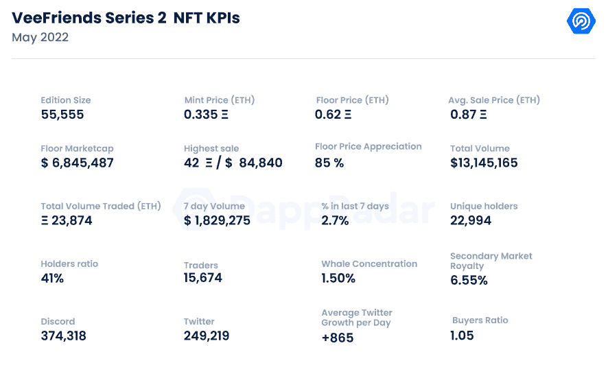
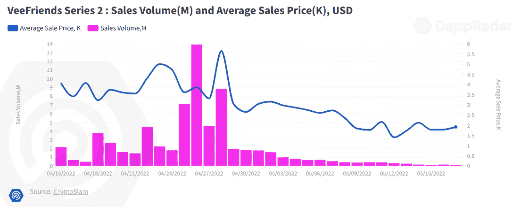
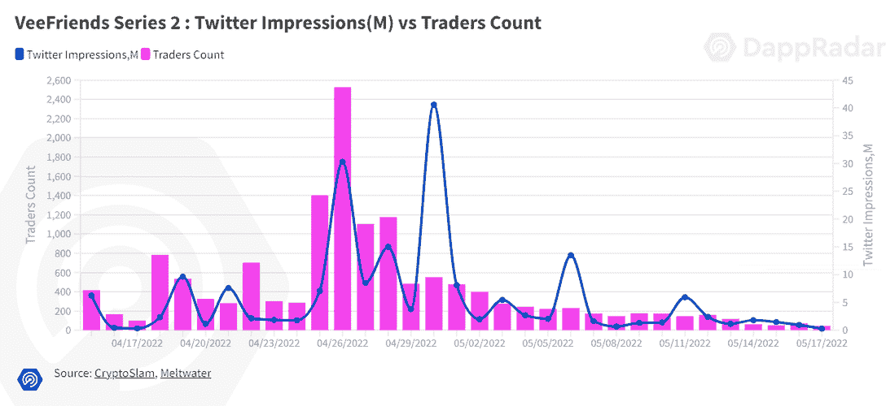
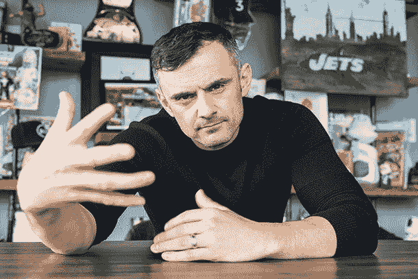

# 新 Dapps 报告:VeeFriends 系列 2

> 原文：<https://web.archive.org/web/https://dappradar.com/blog/new-dapps-report-veefriends-series-2>

## 朋友传奇的下一章

在 2022 年 5 月版的 DappRadar 的新 Dapps 报告中，我们看看流行和有趣的 NFT 系列，这次我们涵盖了 VeeFriends 系列 2。新的 Dapps 报告是对 NFT 收藏的财务指标的执行概述和分析。

这份新的 Dapps 报告是一系列执行报告的一部分，为读者提供了一个有前途的随机生成的 NFT 集合的高级视角。该报告侧重于财务指标，包括销售活动和价格分析，以及分布指标，如独特持有人比率和鲸鱼集中指数。它还深入研究了鲸鱼的行为模式以及社会和技术概况。

VeeFriends 系列 2 (VF2)是成功的 VeeFriends 项目的第二部分，由 Gary Vee 于 2021 年 4 月推出。VeeFriends 系列 2 是一个由 55，555 个 NFT 组成的系列，由最初系列的设计演变而来。我们的老读者会立刻认出他。对于新人来说，Gary 'Vee' Vaynerchuk 是一位企业家、媒体人物、营销大师和社交媒体先驱。VeeFriends 是 Gary 更大的项目生态系统的一部分，该生态系统包括 Vee Friends、图书游戏或 Vayner Pass，旨在将人们聚集在一起，建立一个持久的社区，并为持有者带来效用。

请不要将本文件视为财务建议。

**数据更新日期:****2022 年 5 月 18 日**

## 目录

*   [关键要点](https://web.archive.org/web/20220814204207/https://dappradar.com/blog/new-dapps-report-veefriends-series-2/#Key-Takeaways)
*   [财务概况](https://web.archive.org/web/20220814204207/https://dappradar.com/blog/new-dapps-report-veefriends-series-2/#Financial-Overview)
*   [增加了实用程序](https://web.archive.org/web/20220814204207/https://dappradar.com/blog/new-dapps-report-veefriends-series-2/#Added-Utility-)
*   [社会意识和参与度](https://web.archive.org/web/20220814204207/https://dappradar.com/blog/new-dapps-report-veefriends-series-2/#Social-Awareness-and-Engagement-)
*   [技术概述](https://web.archive.org/web/20220814204207/https://dappradar.com/blog/new-dapps-report-veefriends-series-2/#Technical-Overview)

## 关键要点

*   VeeFriends 系列 2 是过去 30 天中交易量第 12 大的系列，交易量超过 6800 万美元。
*   自 4 月 25 日铸造以来，该系列的底价上涨了 85%，而平均价格上涨了 160%
*   在 VeeFriends 系列 2 推出后，官方 VeeFriends Twitter 日均新增关注人数增长了 4 倍多。

## 财务概述

## V2 vee friends——vee friends 世界的新篇章

**区块链:**以太坊

**上市日期:**2022 年 4 月 25 日

**版本尺寸:** 55，555–限量版

**性状:** 5

**属性:** 346

**底价:** 0.62 瑞士法郎

在几个例子中，S2 被发行。4 月 18 日，通过焚烧书籍游戏 NFTs 赢得“朋友名单”彩票的第一系列 VeeFriends NFT 和钱包的持有者有权在公共造币厂之前铸造 VeeFriends S2。书籍游戏是在 Vee Friends 生态系统中提供效用的非功能性游戏。人们可以通过购买 12 本加里·维的书《12.5》来获得它们。《老友记》的获胜者获得了 32，000 英镑，而第一季的获胜者获得了 10，255 英镑。公共造币厂在 4 月 25 日向公众发放了 10，000 张 S2 非功能性食物券。上述 10，000 吨中的 235 吨是通过 OpenSea 上的“祖母绿拍卖”提供的。最后，在 4 月 27 日，又提供了一套特殊的 3，300 非功能性食物。

VeeFriends S2 在第一周就创造了近 1700 万美元的销售额，最高交易额 1300 万美元发生在 4 月 26 日的公开造币期间。在随后的几天里，日交易量急剧下降。

目前的底价为 0.62 ETH，比铸币价上涨了 85%。平均价格在第一周大幅上涨，高达 1.34 ETH，目前稳定在 0.87 ETH，较造币价格升值 160%。

## 添加的实用程序

加里·维因理解 NFT 空间的效用价值而闻名。他的项目有一个传统，那就是用他未来项目的效用来回报长期持有者。这方面的一个很好的例子是《NFT 游戏》一书。买了 12 本他的《十二又二分之一》的人有资格铸造 NFT 图书游戏，这在当时有未知的效用。后来有消息透露，这些 NFT 可以被烧毁，以获得各种商品，如 VeeCon 门票，有机会获得“朋友名单”彩票，以提前铸造 VeeFriends S2，并从加里·维的私人收藏中兑换 NFT。

这种趋势在 VeeFriends 系列 2 中得以延续，因为它一开始并没有太多的实用性。VeeFriends S2 的原始购买者可以选择将一个 IRL 盒子的收藏卡运送到他们家门口，每个铸造的 NFT 一个包裹。这些卡片是“竞争和收集”游戏的一部分，玩家可以通过翻转彼此的卡片来相互竞争。获胜者可以保留对手的奖励卡。除了收藏游戏，目前还没有公布任何实用工具。不幸的是，S2·NFT 号航母没有授予即将到来的航母战斗群的权限。尽管如此，VeeFriends 生态系统拥有强大的效用系数。

## 社会意识和参与

VeeFriends 系列 2 与系列 1 共享社交渠道。VeeFriends 的主要社交渠道拥有强大的社交影响力。 [Discord](https://web.archive.org/web/20220814204207/https://discord.com/invite/veefriends) 服务器是公共的，有 374，318 个活跃用户，这表明这是一个填充良好的服务器。该服务器有一个简单的入职程序，但有活跃的版主过滤新人。这样做是为了减少垃圾邮件、机器人和不便。不和很热闹，加里也积极出席。

VeeFriends [Twitter](https://web.archive.org/web/20220814204207/https://twitter.com/veefriends) 于 2021 年 2 月上线，目前拥有 249219 名粉丝。在过去的 30 天里，该账户经历了 10.4%的总增长，平均每天获得 865 名新粉丝。在 4 月 18 日左右的造币活动期间，Twitter 平均每天增加近 1387 名新用户；然而，在铸造过程结束后不久，平均增长率急剧下降到之前的基线平均每天 285 个新追随者。这表明铸造吸引了大量的追随者到渠道。

VeeFriends S2 有 15，674 名独立交易者，这是我们在新 Dapps 报告系列中报道的最高值，甚至超过了 PhantaBears。这种不寻常的交易活动必须被纳入考虑范围，因为藏品供应量高于往常，为 55，555 件，而不是 10，000 件。该系列的交易时间也超过了三周，这让它有足够的时间积累大量的追随者。另一个要考虑的关键因素是加里·维自己以前的成功和名声，以及他过去的 NFT 项目，如《维友 S1》。

## 团队概述

VeeFriends 由 Gary Vee 负责，由他的公司 Vee Friends，LLC 开发，该公司拥有这个项目中 NFTs 的所有知识产权。

Gary Vee 是 Vayner Media 的负责人，这是一家媒体营销公司，为联合利华、亿滋、百事和强生等财富 500 强公司提供服务。Gary 还发起了许多成功的 NFT 项目，如 [Vayner Sports Pass](https://web.archive.org/web/20220814204207/https://pass.vaynersports.com/) 和 FlyFish club，我们之前在[的新 Dapp 报道中报道过](https://web.archive.org/web/20220814204207/https://dappradar.com/blog/new-dapps-report-nft-collectibles-january-2022-edition-2)。

## 技术概述

像大多数其他项目一样，VeeFriends 以 ERC-721 NFT 令牌的形式存储其元数据。数据通过 IPFS 存储，而不是完全在链上存储。这种类型的存储在 NFT 中很常见。它用于减少网络负载，因为视觉上丰富的数据比文本数据占用更多的空间。

*   审计状态:尚未执行审计

*   存储:**NFT 作为 ERC-721 令牌存储在以太坊区块链上，视觉在 IPFS 上保持不变的所有权。**

 ***   合同地址:[0x 9378368 ba 6b 85 C1 FBA 5b 131 b 530 F5 F5 bedf 21 a 18](https://web.archive.org/web/20220814204207/https://etherscan.io/address/0x9378368ba6b85c1fba5b131b530f5f5bedf21a18)

## 鲸鱼钱包分析

VeeFriends 系列 2 目前的唯一持有者比例为 41%，表明收藏相对集中。藏品鲸集中比例相对较低，为 1.50%，前五大持有人中无已知鲸。这些统计数据表明，交易数据和价格被富裕持有者操纵的风险较低。

## 摘要

S2 朋友是加里·维发起的最新 NFT 项目。Gary 是 NFT 社区的资深人士，他发现了多个成功的系列，这些系列都有一个重复出现的主题，即相互依赖的效用。这是 2021 年 5 月推出的 VeeFriends 的第二部。

第二季在过去的 30 天里累积了超过 6800 万英镑，是同期交易量第 12 大的收藏。然而，铸币后的头几天，价格迅速上涨。在随后的几天里，价格波动有所减弱，目前的底价为 0.62 ETH，比铸币价升值了 82%，而平均价格为 0.87 ETH，升值了 160%。

目前，除了艺术和可选的交易卡游戏，该系列不提供任何其他功能。据加里所知，NFTs 可能有一些隐藏的效用，正如他对 S1 和图书游戏所做的那样。用他自己的话说，“图书游戏是永恒的”。

 NewsletterUnsubscribe at any time. [T&Cs](https://web.archive.org/web/20220814204207/https://dappradar.com/terms) and [Privacy Policy](https://web.archive.org/web/20220814204207/https://dappradar.com/privacy-policy)**