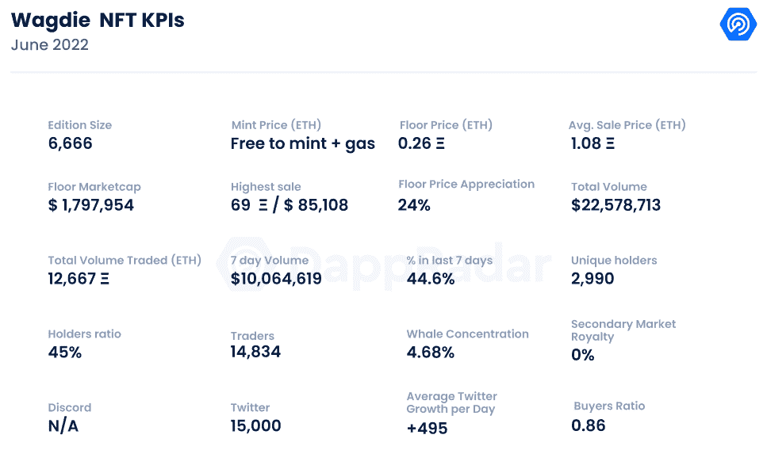
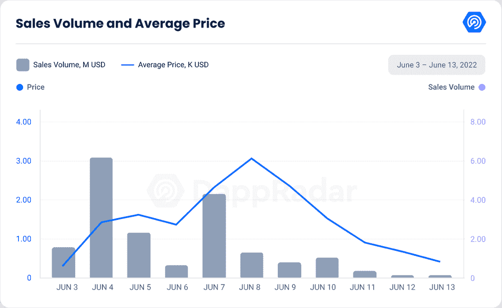
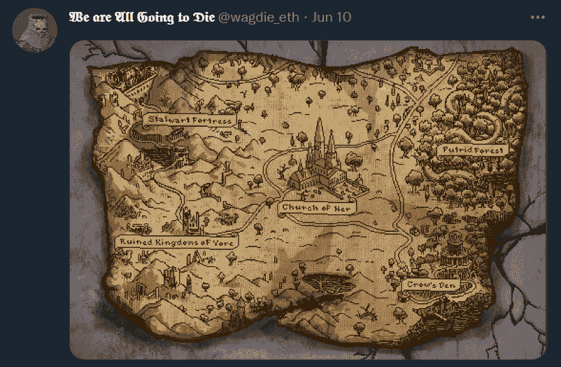
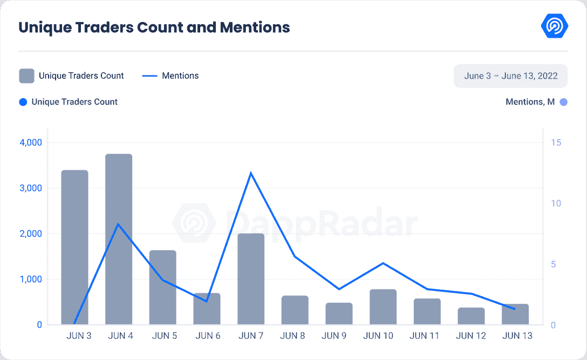
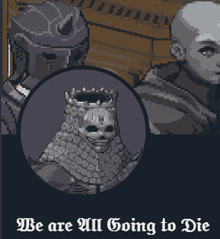

# 新的 Dapps 报告:我们都将死去——拥抱不确定性

> 原文：<https://web.archive.org/web/https://dappradar.com/blog/new-dapps-report-we-are-all-going-to-die-embraces-uncertainty>

## “我们都将死去”是一个非常不寻常的 6666 个 NFT 的集合，在过去的七天里累积了超过 1000 万美元。

**在 2022 年 6 月版的 DappRadar 的新 Dapps 报告中，我们看“我们都将死去或 Wagdie，一个神秘的收集攀登** [**NFT 图表**](https://web.archive.org/web/20220721061840/https://dappradar.com/hub/nft-explorer) **。新的 Dapps 报告对 NFT 收藏的财务指标进行了深入分析，具有很强的吸引力。**

这份新的 Dapps 报告是一系列执行报告的一部分，为读者提供了一个充满希望的、可再生的 NFT 收藏的高层次视角。该报告侧重于财务指标，包括销售活动、价格分析和分布指标，如独特持有人比率和鲸鱼集中指数。它还深入研究了鲸鱼的行为模式以及社会和技术概况。

6 月 3 日，Wagdie 推出了 6666 个程序生成的 NFT 头像。它的灵感来自视频游戏，如《黑暗灵魂》和《亵渎神明》，并从之前拍摄的《T2》地精镇《T3》中获得组织线索。它醉心于神秘和恐怖，所以关于它的细节少之又少。

该项目没有官方网站，迄今为止，所有信息都是通过夜间长达数小时的 twitter 聊天记录中的神秘片段透露的。这个神秘的面纱吸引了许多人参与这个项目。

请不要将本文件视为财务建议。

**数据更新日期:****2022 年 6 月 13 日**

## 目录

*   [关键要点](https://web.archive.org/web/20220721061840/https://dappradar.com/blog/new-dapps-report-we-are-all-going-to-die-embraces-uncertainty/#Key)
*   [Wagdie 财务概述](https://web.archive.org/web/20220721061840/https://dappradar.com/blog/new-dapps-report-we-are-all-going-to-die-embraces-uncertainty/#Wagdie)
*   [效用](https://web.archive.org/web/20220721061840/https://dappradar.com/blog/new-dapps-report-we-are-all-going-to-die-embraces-uncertainty/#Utility)
*   [社会意识和参与度](https://web.archive.org/web/20220721061840/https://dappradar.com/blog/new-dapps-report-we-are-all-going-to-die-embraces-uncertainty/#Social)
*   [技术概述](https://web.archive.org/web/20220721061840/https://dappradar.com/blog/new-dapps-report-we-are-all-going-to-die-embraces-uncertainty/#Technical)

## 关键要点

*   Wagdie 是过去七天中交易量第二大的收藏品，交易量超过 1000 万美元
*   最高的“灵魂”以 69.42 ETH 或 85，108 美元售出

## wag die–强烈的初始爆发迅速消退

## **区块链:**以太坊

**上市日期:**2022 年 6 月 3 日

**版本尺寸:**6666-限量版

**性状:** 8

**属性:** 261

**底价:** 0.26 瑞士法郎

资料来源:DappRadar

Wagdie 在过去的七天里已经积累了超过 1000 万美元，略低于总销售额的 50%。自造币厂成立 11 天后，该藏品已累计超过 2200 万美元，成为交易量第二大的藏品。以一种非常非正统的方式，这个项目的 NFT 是免费铸造的，不包括汽油费。因为没有铸币价格，所以交易当天的平均销售价格被用作 0.21 ETH 的替代品。

平均价格在最初几天迅速上涨，6 月 9 日高达 2.16 ETH，目前为 1.08 ETH。0.26 的底价比铸币价格替代品升值了 24%。这是一个急剧下降的升值，收藏从 6 月 9 日的 929%下降到 6 月 13 日的 24%。与我们之前的报告相比，24%的升值是我们有史以来最低的。

典型的情况是，在铸币后的头几天，收藏品会经历大规模的交易高峰，随后通常会出现大幅抛售。Wagdie 很不寻常，因为它的音量会来回波动。

在有争议的事件发生后，这个奇怪的收藏被暂时从 OpenSea 除名。这严重损害了交易量和价格。

### 附加效用——一个没有明确奖励的神秘游戏

Source: [Twitter](https://web.archive.org/web/20220721061840/https://twitter.com/wagdie_eth/)

该项目没有官方网站，官方推特上也没有提到任何实用路线图。相反，该团队创造性地使用 Twitter 和 [twitter-hangouts 来与社区进行互动](https://web.archive.org/web/20220721061840/https://twitter.com/wagdie_eth/status/1532833523035512837?s=20&t=8GFMLwiuPX_Pm4kBW5jOGA),并设计了一个自愿参与者选择自己冒险风格的游戏。

有的指令要求会员连接钱包，烧 ETH 甚至 NFTS；有时，它包括投票。每天，该团队都会发布前一天晚上的内容，并通过幽默和隐晦的叙述片段为下一次挑战做准备。

他们的 [DnD 风格的故事](https://web.archive.org/web/20220721061840/https://twitter.com/wagdie_eth/status/1534679165093523457?s=20&t=8GFMLwiuPX_Pm4kBW5jOGA)似乎受到了[黑暗灵魂 NFTs](https://web.archive.org/web/20220721061840/https://dappradar.com/hub/nft-explorer/collection/dark-souls-v2) 系列的启发。这些地方也是团队与社区中勇敢的成员举行仪式的地方。Gremplin 还将他们的 [pfp 改成了 Wagdie](https://web.archive.org/web/20220721061840/https://twitter.com/gremplin/status/1532899730329460738) 的风格，这让社区猜测他们的参与，并推动了该项目的宣传。

焚烧变异猿 NFT 引起了激烈的反应。根据 Twitter 上未经证实的传言，这是他们因大量报道而在 OpenSea 上被除名的背后原因。

wagdie 社区在缺乏官方支持的情况下制造了自己的不和，但自从在 OpenSea 上不幸退市后，气氛变得糟糕，迫使其成员关闭了它。

更糟糕的是，据透露，一些艺术品是从万智牌艺术中心抄袭来的，这导致该艺术家被团队除名，个别作品也被烧毁。

### 社会意识和参与

Wagdie [Twitter](https://web.archive.org/web/20220721061840/https://twitter.com/wagdie_eth) 于 2021 年 12 月上线，但它在 2022 年 5 月 31 日开始活跃。它目前有 15000 名粉丝，其中 99%是在过去两周内增加的。

他们的 Twitter 个人资料显示，这是 Dapp 报告中记录的最低增长率之一，平均每天增加 495 名新粉丝。没有官方的不和谐服务器让人们聚集在项目周围。

有粉丝倡议为社区创建不和频道；然而，如前所述，由于消极的气氛，这些很快就关闭了。

### 团队概述

[<picture></picture>](https://web.archive.org/web/20220721061840/https://twitter.com/wagdie_eth/)

该团队完全匿名。除了官方的推特(Twitter)之外，他们没有与社区沟通的渠道。这种匿名导致了围绕着这个项目的争议。

缺乏公开性会增加人们的怀疑和开发者做坏事的风险。也许这种信念的考验正是开发商的目标。

## 鲸鱼钱包分析

Wagdie 拥有独特的持有人比例 **45%** ，这表明它是一个相当多样化的收藏。较低的比率表明对价格突变的敏感度较高。在 **4.58%** 时，本次采集的鲸鱼密度为一般。更高的鲸鱼聚集度表明知名收藏者操纵价格的风险增加。

前五名持有人是已知鲸鱼: [hot.izebel.eth](https://web.archive.org/web/20220721061840/https://dappradar.com/hub/wallet/eth/0x49c3feafddaefc3bed06f4ff87ce86610c2c1076) 、 [fadedface.eth](https://web.archive.org/web/20220721061840/https://dappradar.com/hub/wallet/eth/0xfadedface6e126f2556d679521b4ceea6c372ae7) 、 [slurpzone.eth](https://web.archive.org/web/20220721061840/https://dappradar.com/hub/wallet/eth/0xcbbea7ec33d60db283ab79bdac9ffbfa46a83134) 、 [piyu.eth](https://web.archive.org/web/20220721061840/https://dappradar.com/hub/wallet/eth/0x4dc804eaa4c9cc4839f0d9c8824cce7a0c7dc10a) 和 [notgriffden.eth](https://web.archive.org/web/20220721061840/https://dappradar.com/hub/wallet/eth/0xe203efc10f3b3063a34fd6599d754e7f25e2d841) 。知名鲸鱼的高度参与表明该系列知名度很高，有潜力。

同时，他们的参与也增加了价格操纵的风险。我们鼓励潜在买家进行尽职调查。

## 技术概述

与大多数 NFT 项目一样，Wagdie 使用 IPFS 存储元数据，而不是完全在链上。这种类型的存储是标准做法，因为将图像完全存储在链上通常数据量太大。虽然没有关于这个项目的已知技术问题的报告，但谨慎总是明智的，主要是因为开发团队缺乏透明度。衡量团队在运行这些项目中的专业知识或他们的意图可能是具有挑战性的。

*   审计状态:尚未执行审计

*   存储:NFT 作为 ERC-721 令牌存储在以太坊区块链上，而视觉在 IPFS 上保持不变的所有权。

*   合同地址:[0x 659 a4 bdaaacc 62 D2 BD 9 CB 18225d 9 c 89 b5 b 697 a5a](https://web.archive.org/web/20220721061840/https://etherscan.io/address/0x659a4bdaaacc62d2bd9cb18225d9c89b5b697a5a)

## 摘要

Wagdie 无疑采取了一种非常新颖的方法来进行 NFT 发射。就像最近成功的《地精镇》一样，他们决定放弃许多 NFT 的惯例。他们的偏差包括免费造币厂，缺乏不和谐的渠道，完全匿名的团队，以及在路线图或实用程序方面缺乏项目的清晰结构。相反，该项目希望用户大胆尝试，尽管没有未来的前景，也能参与其中。

虽然这种方法似乎对地精镇有效，但对 Wagdie 来说却失败了。在过去的七天里，这笔交易的每周交易额超过了 1000 万美元，在过去的 11 天里，交易总额达到了 2200 万美元。这与《哥布林镇》相去甚远，《哥布林镇》上映第一周就赚了 2200 万美元，前两周赚了 4000 万美元。

同样，Wagdie 的底价仅上涨了 24%，即使在最高价 929%的时候，也不及哥布林镇的 4568%。

虽然 Wagdie 没有路线图或效用，不算艺术，但该项目的开发者正在以一种非常有创意的方式利用社区参与。他们通过玩各种各样的“选择你自己的冒险”游戏来充分利用 Twitter 的参与度，并通过空投价值或用途未知的物品来奖励参与者。

缺乏传统的社交和信息渠道，以及通过神秘的音频片段传播项目信息的方法，这无疑已经引起了一些人的注意。许多著名的鲸鱼是收藏的顶级持有者。这种缺乏透明度也适得其反，因为围绕 Wagdie 从 OpenSea 除名的恐慌，粉丝制造的不和谐频道崩溃。

这个系列的未来仍然不确定。然而，社交游戏可能会让社区参与很长一段时间。他们激励社区走到一起，解决每个信息片段背后的隐晦含义。黑暗灵魂游戏成功地使用了这个公式，它可以潜在地为这个系列工作。