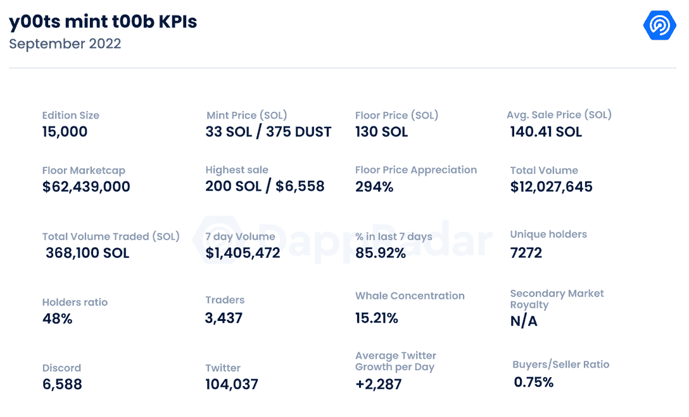
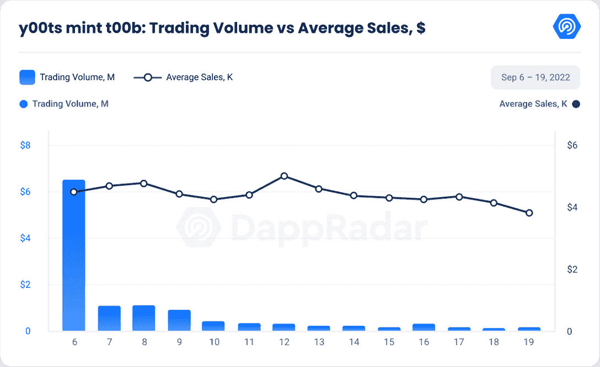
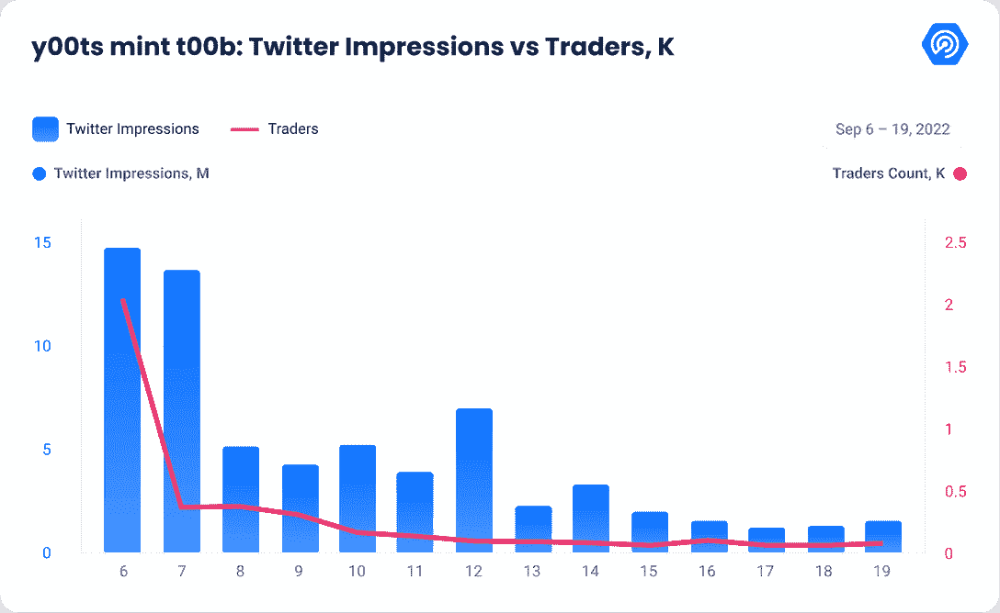

# 新的 Dapps 报告:y00ts Mint t00b–y00t opia 门票

> 原文：<https://web.archive.org/web/https://dappradar.com/blog/new-dapps-report-y00ts-mint-t00b-entry-ticket-to-y00topia>

## 在 2022 年 9 月版的 DappRadar 的新 Dapps 报告中，我们深入研究了正在 NFT 排行榜上攀升的 y00ts mint t00b。新的 Dapps 报告详细分析了 NFT 收藏的财务指标，极具吸引力。

这份新的 Dapps 报告是一系列执行报告的一部分，为读者提供了一个充满希望的、可再生的 NFT 收藏的高层次视角。该报告侧重于财务指标，包括销售活动、价格分析和分布指标，如独特持有人比率和鲸鱼集中指数。它还深入研究了鲸鱼的行为模式以及社会和技术概况。

**[Y00ts](https://web.archive.org/web/20221202031030/https://dappradar.com/hub/nft-explorer/collection/y00ts-official) mint t00b 是[索拉纳](https://web.archive.org/web/20221202031030/https://dappradar.com/rankings/protocol/solana)区块链上的 15000 个 NFT 的集合，由 [DeGods](https://web.archive.org/web/20221202031030/https://dappradar.com/solana/collectibles/degods) 背后的团队 Dust Labs 打造。**

y00ts(缩写为 y00topia)背后的兴奋部分源于其奖学金白名单计划和版权定制版本，这有望改变 NFT 收藏的通常货币化机制。

只有被列入 y00 名单的收藏家才能铸造 t00b NFT。t00bs 是小瓶，可以燃烧以制造 y00ts NFTs，代表两个不同的系列。

在 y00ts 存在之前，有 Duppies。最初，Duppies 旨在成为 DeGods 环境的“扩展集合”。2022 年 7 月初，该团队宣布将在 7 月底或 8 月初铸造 Duppies，但在推特遭到黑客攻击后，该团队改变了计划。

7 月 30 日，通过一条[推特](https://web.archive.org/web/20221202031030/https://twitter.com/DeGodsNFT/status/1553328318635593728?ref_src=twsrc%5Etfw%7Ctwcamp%5Etweetembed%7Ctwterm%5E1553328318635593728%7Ctwgr%5E9bd0d3c413f064bff5513b79f89d4fbc01297a88%7Ctwcon%5Es1_&ref_url=https%3A%2F%2Fluckytrader.com%2Farticles%2Feverything-you-need-to-know-about-y00ts)，Duppies 变成了 y00ts。

请不要将本文件视为财务建议。

**数据更新日期:****2022 年 9 月 20 日**

## 目录

*   [关键要点](https://web.archive.org/web/20221202031030/https://dappradar.com/blog/new-dapps-report-y00ts-mint-t00b-entry-ticket-to-y00topia/#Key-Takeaways)
*   [财务概况](https://web.archive.org/web/20221202031030/https://dappradar.com/blog/new-dapps-report-y00ts-mint-t00b-entry-ticket-to-y00topia/#Financial-Overview)
*   [效用](https://web.archive.org/web/20221202031030/https://dappradar.com/blog/new-dapps-report-y00ts-mint-t00b-entry-ticket-to-y00topia/#Utility)
*   [社区意识和参与度](https://web.archive.org/web/20221202031030/https://dappradar.com/blog/new-dapps-report-y00ts-mint-t00b-entry-ticket-to-y00topia/#Community-Awareness-and-Engagement)
*   [技术概述](https://web.archive.org/web/20221202031030/https://dappradar.com/blog/new-dapps-report-y00ts-mint-t00b-entry-ticket-to-y00topia/#Technical-Overview)
*   [总结](https://web.archive.org/web/20221202031030/https://dappradar.com/blog/new-dapps-report-y00ts-mint-t00b-entry-ticket-to-y00topia/#Summary)

## 关键要点

*   DeGods 和 y00ts 的开发商 Dust Labs 筹集了 700 万美元的种子资金。
*   自铸币厂以来，该系列的底价已经上涨了 294%
*   尽管铸造延迟，Y00ts 在最初几天的交易量超过了 1000 万美元

## y00ts mint t00b–底价升值 294%

**区块链:**索拉纳

**发射日期:【2022 年 9 月 5 日**

**版本大小:**15000

**特性:**不适用

**属性:**不适用

底价: 130 索尔

根据团队项目，y00ts mint 最初定于 9 月 4 日推出，由于“阻塞问题”，推迟了 5 分钟。

该项目于 9 月 5 日上线，在第一周，其成交量已超过 1000 万美元，超过了 Bored Ape 游艇俱乐部(BAYC)的收藏。

在第一天的炒作之后，总交易量下降了 80%，目前不到 17 万美元。另一方面，自造币日以来，平均销售额没有变化，目前为 4496 美元。

即使交易量急剧下降，地板价格仍为 130 索尔；它显示出比原价升值了 294%。与最近的收藏如 [NFTiff](https://web.archive.org/web/20221202031030/https://dappradar.com/blog/new-dapps-report-nftiff-nfts-turned-into-wearable-jewelry) 和[Potatoz](https://web.archive.org/web/20221202031030/https://dappradar.com/blog/new-dapps-report-the-potatoz-the-bridge-between-memes-and-web3)相比，这种价格升值在熊市中是稳固的，它们分别升值了 97%和 144%。

平均销售额和底价表明，市场对该系列仍有相当大的兴趣，考虑到该系列背后的团队和效用，它得到了市场的高度评价。

### 附加效用——NFT 所有权的新方式

Dust Labs 正在为他们称为ⓨ的 y00ts nfts 制定一个新的版权和所有权方案，作为更传统的版权标志ⓒ.的替代品

根据 y00ts 团队的说法，ⓨ的神奇之处在于，任何活跃的社区成员都可以基于共同的爱好、模因或项目组建自己的“俱乐部”或子社区，并注册ⓨ.衍生计划

每个子集合是一个管理机构，可以从每销售一个 y00t 的改进质量的版税中获利。该机制还可以使接受或拒绝利用 NFT 知识产权(IP)的请求变得更加简单。

这是在许多蓝筹 NFT 收藏正在修改他们自己的服务条款时，涉及到版权和知识产权。

*   如果您想更深入地了解 y00ts 实用程序，请阅读[我们的新指南](https://web.archive.org/web/20221202031030/https://dappradar.com/blog/what-are-y00ts-nfts-are-you-on-the-y00tlist/)。

### 社区意识和参与

[y00ts](https://web.archive.org/web/20221202031030/https://mobile.twitter.com/y00tsnft) 的推特账号创建于 2022 年 6 月 18 日，已经拥有 104037 名粉丝。在过去 30 天里，他发布了超过 233 条推文，获得了超过 68，626 名粉丝，平均每天 2，287 名粉丝。这意味着社区参与度很高。

如前所述，y00ts 是 DeGods 的附属系列，该系列也拥有强大的社区参与度，拥有超过 126，000 名关注者，平均每天有 612 名关注者，尽管该系列是在近一年前推出的。

[Discord 账户](https://web.archive.org/web/20221202031030/http://discord.gg/y00ts)创建于 8 月 19 日，拥有 6588 名活跃成员，一个简单的入职/验证过程，主要用于公告，根据[的推文。](https://web.archive.org/web/20221202031030/https://twitter.com/y00tsnft/status/1560391119770230784?s=46&t=LuGM8jqMPxjtdd37tRtcnA)

y00ts 集合有 3，437 个不同的交易者，根据我们的基准，这是平均水平。然而，这个集合非常强调社区持有 NFT，以获取未来的利益。因此，许多交易者选择不为短期利润而抛售他们的 y00ts 股票。

### 团队概述

y00ts 系列由 [DeGods](https://web.archive.org/web/20221202031030/https://dappradar.com/solana/collectibles/degods) 的创始人 [Dust Labs](https://web.archive.org/web/20221202031030/https://twitter.com/dust_labs) 创作。它为以太坊和索拉纳项目提供 NFT 工具，9 月 5 日，[宣布](https://web.archive.org/web/20221202031030/https://twitter.com/dust_labs/status/1566975856777777152)它已经筹集了 700 万美元的种子资金，参与投资的有基金会资本、索拉纳风险投资、Metaplex、Jump、FTX 风险投资和 Chapter One。

两位创始人是[弗兰克](https://web.archive.org/web/20221202031030/https://twitter.com/frankdegods)和[凯文](https://web.archive.org/web/20221202031030/https://twitter.com/kevindegods)，他是公司的首席执行官。两人都决定匿名维护自己的形象。

y00ts founder Frank | Source: YouTube

虽然这一趋势似乎很受欢迎，但它已被证明是一场赌博，因为它带来了神秘的气氛，吸引了许多好奇的询问者。任何事故都会大大增加社区屈服于 FUD 的风险，为项目敲响丧钟。

### 鲸鱼钱包分析

y00ts mint t00b 系列目前的唯一持有人比率为 **48%** ，表明其为低于平均水平的分布式系列。值得一提的是，保管其 NFs 股份的持有人不在此计算范围内。唯一持有人越多，持有人之间串通的可能性就越小。

鲸鱼浓度 **15.21%** 很高。在前五名持有者中，有一只突出的鲸鱼(yootn 8 KF 22 cqczc 732 PSP 7 qeqxwpgsd qcfzhkzoxp 25)持有 1,759 y00ts，相当于收藏的 11.8%。

更高的鲸鱼聚集度表明著名收藏者操纵价格的风险增加。更高的鲸鱼集中度也增加了抛售的风险，如果他们清算他们的持有。抛售通常会引起连锁反应，迫使许多较小的鳍状肢也抛售。我们总是建议潜在买家进行尽职调查。

## 技术概述

Y00ts 在不同于 CC0 或 NFT 项目的许可安排下运营，如 [Bored Ape](https://web.archive.org/web/20221202031030/https://dappradar.com/ethereum/collectibles/bored-ape-yacht-club) 和 [World of Women](https://web.archive.org/web/20221202031030/https://dappradar.com/ethereum/collectibles/world-of-women) ，这些项目已经将全部权利让给了持有者。

它的版权由 NFT 收藏中心自己管理，该中心对那些被授权使用 NFT 知识产权的人进行登记。这种新的许可机制将从 y00ts 商店开始实施，这是一个 y00ts 质量的定制市场，可应用于 NFTs。

*   审计状态:尚未执行审计

*   存储:y00ts: mint t00b 系列作为 SPL 令牌存储在索拉纳区块链上，视觉效果存储在区块链上，无需 IPS。

*   合同地址:不适用

## 摘要

“y00ts mint t00b”的收藏是索拉纳交易量创下历史新高的背后原因。继去年的火爆开局之后，它甚至荣登 OpenSea 的销量排行榜榜首。然而，它期待已久的首次亮相也未能幸免于延迟和障碍。由于发现了“阻塞问题”，y00ts 硬币的发行被推迟到第二天，即 9 月 5 日。

与该项目相关的 Web 3 技术初创公司 Dust Labs 从众多风险投资公司获得了 700 万美元，其中包括 FTX 风险投资公司和索拉纳风险投资公司。此外，白名单中还有一些名人，如足球偶像韦恩·鲁尼、前篮球运动员艾伦·艾弗森和艺术家里尔·贝贝。

我们会密切关注 y00ts 的未来。

 NewsletterUnsubscribe at any time. [T&Cs](https://web.archive.org/web/20221202031030/https://dappradar.com/terms) and [Privacy Policy](https://web.archive.org/web/20221202031030/https://dappradar.com/privacy-policy)