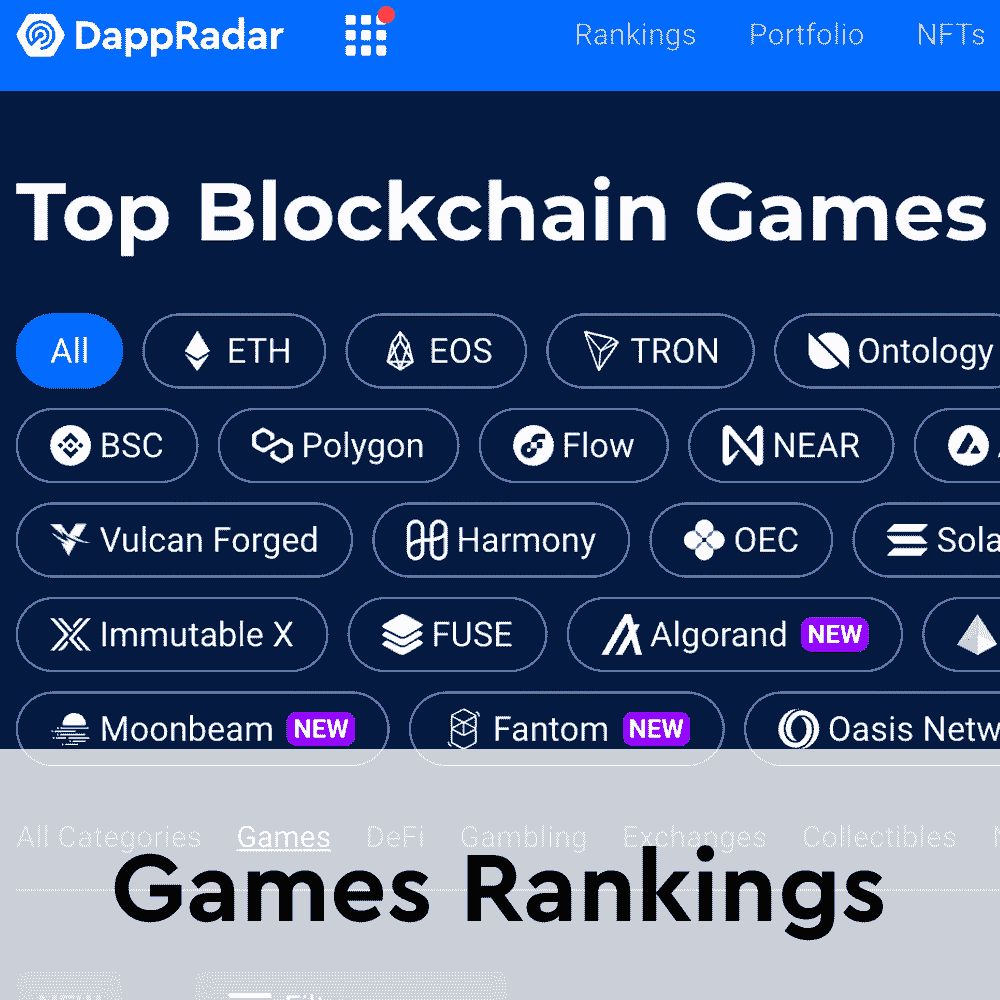

# 新功能和公寓建设者即将来到万维网

> 原文：<https://web.archive.org/web/https://dappradar.com/blog/new-features-and-apartment-builder-coming-soon-to-worldwidewebb>

## 虚拟世界将很快推出游戏机制

WorldWideWebb 是目前最受欢迎的虚拟世界之一，游戏背后的开发团队正在积极开发新功能和公寓建造工具。根据 Twitter 的最新公告，该平台将很快迎来其第二个改进版本。

公告中详细说明了 V2 环球网将会给游戏带来大量的安全增强。该团队还没有分享 V2 将给用户带来什么的详细概述。然而，主要的重点将是优化性能，并为未来的发展奠定基础。

WorldWideWebb 正准备成为元宇宙最大的 MMO 平台之一。然而，为了做到这一点，团队将努力建立一个坚实的基础。随着平台的第二个版本，玩家可以期待增强的反作弊和反欺诈机制。此外，开发团队还致力于提升性能。V2 将在整个游戏世界中为玩家提供闪电般的动作和加载速度。

随着 V2 的推出，WorldWideWebb 也将迎来一个备受期待的关于游戏中公寓的功能。公寓是游戏中的“土地”。随着公寓建造工具的即将发布，玩家将能够定制他们的虚拟家园。

韦伯·兰德在过去的七天里有着惊人的表现。该集合记录了 300%以上的独立活跃用户与其智能合同进行交互。此外，它还创造了近 350 万美元的 NFT 交易量。随着即将到来的公寓建设者，所有这些新的虚拟房主将有机会装饰和组织自己的空间。

## 万维网公寓建筑商

在 WorldWideWebb 上发布 apartment builder 是该团队在未来几周内必须完成的主要里程碑之一。该构建器是该平台未来成功的关键工具。它允许游戏玩家和 NFT 公寓业主定制他们的空间，并在虚拟世界中留下他们的印记。

根据官方推特消息，公寓建筑商将会给收藏者一个选择来完全设计和建造他们的公寓。充满了过多的项目和功能，每个公寓都有可能成为元宇宙的一个独特的空间。

重要的是，这只是公寓建设者的第一个版本。在未来，这个工具将允许玩家创建和设计任务，铸造 NFT，并将其他功能集成到他们的公寓中。

随着项目转移到 V2 并发布更多的游戏元素，DappRadar 将继续关注 WorldWideWebb。为了保持对元宇宙和游戏新闻的关注，请在 [Twitter](https://web.archive.org/web/20230114045046/https://twitter.com/dappradar) 上关注 DappRadar。此外，你可以查看下面的链接，了解更多关于区块链游戏和虚拟世界未来的信息。

[<picture></picture>](https://web.archive.org/web/20230114045046/https://dappradar.com/ethereum/collectibles/worldwide-webb-land)[<picture></picture>](https://web.archive.org/web/20230114045046/https://dappradar.com/blog/dappradar-x-bga-blockchain-games-report-january)[<picture></picture>](https://web.archive.org/web/20230114045046/https://dappradar.com/rankings/category/games) NewsletterUnsubscribe at any time. [T&Cs](https://web.archive.org/web/20230114045046/https://dappradar.com/terms) and [Privacy Policy](https://web.archive.org/web/20230114045046/https://dappradar.com/privacy-policy)