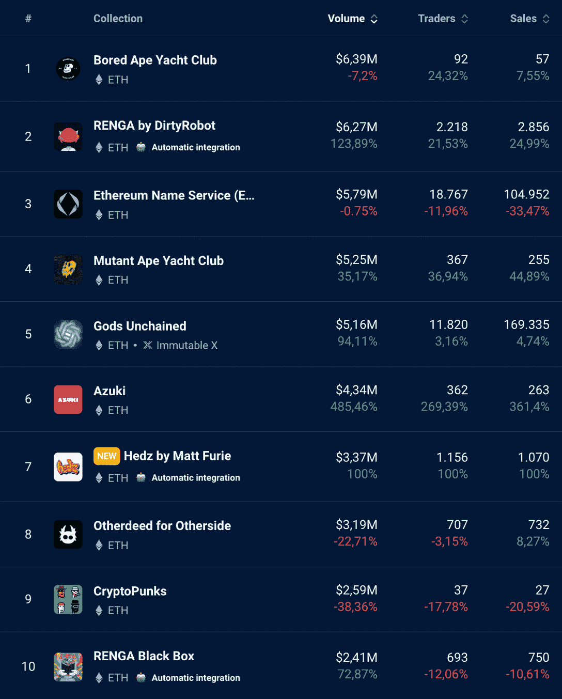
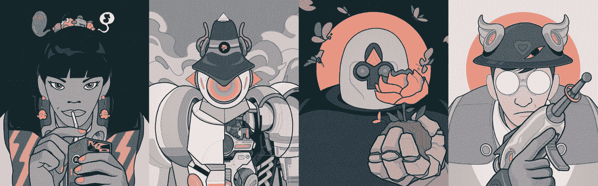

# 新的 NFT 系列 Hedz 和 RENGA 本周进入排行榜前列

> 原文：<https://web.archive.org/web/https://dappradar.com/blog/new-nft-collections-hedz-and-renga-enter-top-charts-this-week>

## 在过去的 7 天里，新来者一直在入侵达普拉达的 NFT 收藏排名

最近推出的、没有百万富翁投资支持的两个新系列，在上周的十大最棒的 NFT 系列中引起了关注。分别是 DirtyRobot 的 RENGA 和 Matt Furie 的 Hedz，两者的销量都已经达到了数百万美元。

**总结**

*   RENGA 和 Hedz 是 DappRadar 排名中[十大 NFT 项目](https://web.archive.org/web/20221201005551/https://dappradar.com/nft)的首个系列；
*   上周他们的交易量翻了一倍。
*   这些项目目前与蓝筹收藏相当，如无聊猿、志那都红豆、加密朋克和艺术块。

[View Top NFT Collections Now](https://web.archive.org/web/20221201005551/https://dappradar.com/nft)

## 伦加将讲故事和非传统艺术结合在一起

手工收集的一万个角色 [RENGA](https://web.archive.org/web/20221201005551/https://dappradar.com/hub/nft-explorer/collection/renga-by-dirtyrobot) 是由著名的 NFT 艺术家 [DirtyRobot](https://web.archive.org/web/20221201005551/https://twitter.com/DirtyRobotWorks) 创作的。该项目的愿景是以社区为基础，让人们通过讲故事的艺术来增长他们在 NFT 的经历。

每个伦加·NFT 角色都有自己的故事，他们更多的身份将在更广泛的伦加生态系统的故事中被发现。

[<picture></picture>](https://web.archive.org/web/20221201005551/https://dappradar.com/hub/nft-explorer/collection/renga-by-dirtyrobot)

该项目已达到达普拉达尔 NFT 收藏排名第二的位置，在过去一周的销售额超过 600 万美元。

虽然它的效用仍有待证实，但该项目已经显示出有大量的潜力和故事有待社区开发。

> 机器人部队是在第一次世界大战期间生产的。战争结束后，这些机器退役并被遗弃在一个被称为“技术墓地”的地方，这个地方将发展成为人们寻找零件的天堂。[#机器人军队](https://web.archive.org/web/20221201005551/https://twitter.com/hashtag/RobotArmy?src=hash&ref_src=twsrc%5Etfw)【pic.twitter.com/ikEwI7HFE8 
> 
> — RENGA (@RENGA_inc) [September 20, 2022](https://web.archive.org/web/20221201005551/https://twitter.com/RENGA_inc/status/1572057962570547202?ref_src=twsrc%5Etfw)

*   [**用达普拉达 NFT 收藏探索者**追踪伦加](https://web.archive.org/web/20221201005551/https://dappradar.com/hub/nft-explorer/collection/renga-by-dirtyrobot)

## Hedz 将 Matt Furie 带回 NFT 空间

一位著名的艺术家还签署了另一个新的集合，这是本周在 NFT 空间的图表。马特·弗瑞(Matt Furie)也因描绘了传奇的、世界闻名的青蛙佩佩而闻名，他带着自己的一系列作品正式进入 NFT。

在过去的 24 小时里， [Hedz](https://web.archive.org/web/20221201005551/https://dappradar.com/hub/nft-explorer/collection/hedz-by-matt-furie) 记录了 114 万美元的销售额。这个新系列的 NFT 目前的底价是 1.85 埃特，约合 2369.07 美元。

[<picture></picture>](https://web.archive.org/web/20221201005551/https://dappradar.com/hub/nft-explorer/collection/hedz-by-matt-furie)

Hedz NFTs 在过去 24 小时内有近 370 笔交易，平均售价约为 3000 美元。

对于这位艺术家来说，这是一个重要的转折点，正如他的[网飞纪录片所展示的](https://web.archive.org/web/20221201005551/https://www.youtube.com/watch?v=5WHZM-gDONo)，他已经进入了一场艰苦的战斗，以重新获得他自己的标志性卡通形象的所有权。

*   [**用达普拉达 NFT 收藏探索者**追踪 Hedz】](https://web.archive.org/web/20221201005551/https://dappradar.com/hub/nft-explorer/collection/hedz-by-matt-furie)

## 通过 DappRadar 了解最新的 NFT 系列

我们还在 YouTube 和 Twitter 上的 Blockchain 下的播客[中报道了这两个 NFT 系列。请看一看**我们团队对他们的真诚意见！**](https://web.archive.org/web/20221201005551/https://www.youtube.com/playlist?list=PL0L1ZfahiAoOq8hl_dUQBxSCiQIGtaGJK)

> 脱离区块链直播！[https://t.co/vD7VMFHFAo](https://web.archive.org/web/20221201005551/https://t.co/vD7VMFHFAo)
> 
> — DappRadar (@DappRadar) [September 21, 2022](https://web.archive.org/web/20221201005551/https://twitter.com/DappRadar/status/1572556398889930754?ref_src=twsrc%5Etfw)