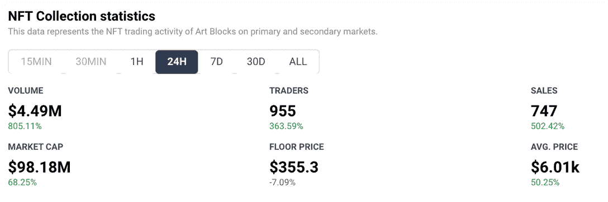
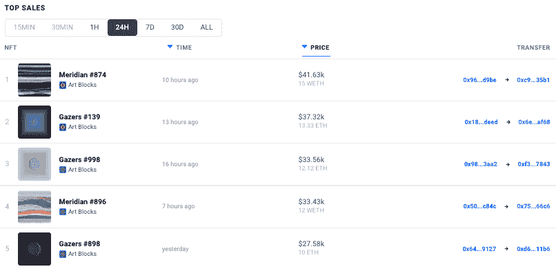
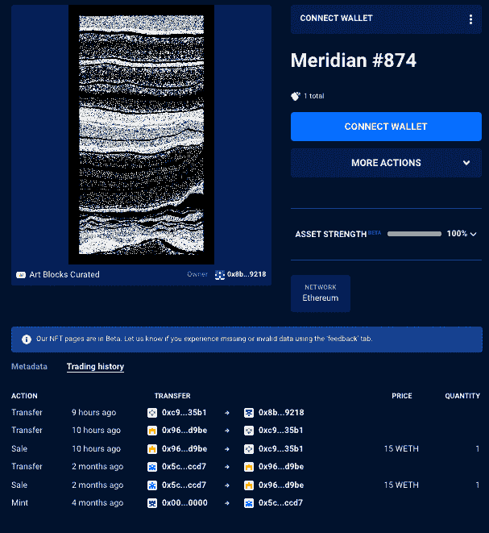
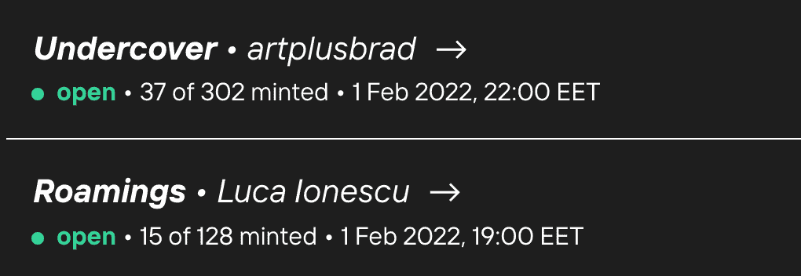

# 新的 NFT 收藏将艺术品交易量推高了 800%

> 原文：<https://web.archive.org/web/https://dappradar.com/blog/new-nft-collections-push-trading-volume-on-art-blocks-800>

## 随着 NFT 继续对抗下滑，销售额激增

数字艺术家 Thomas Lin Pederson 的一组名为“屏风”的非传统艺术作品本周在 [**艺术街区市场**](https://web.archive.org/web/20220929110412/https://dappradar.com/ethereum/collectibles/art-blocks) **亮相，受到热烈欢迎。1 月 31 日周一，1000 幅 NFT 绘画作品的征集活动开始了，现在这些作品都是以 1.25 瑞士法郎(约合 3400 美元)的价格铸造的。NFT 脚蹼已经活跃在市场上，过去 24 小时的最高销售额为 4 WETH，约合 11，000 美元。**

艺术板块经历的 NFT 交易量 800%的增长，不仅仅来自于屏幕艺术品。其他在过去 24 小时内销售的 NFT 系列包括 2021 年 12 月 6 日首次发售的[马特·凯恩的《凝视者》](https://web.archive.org/web/20220929110412/https://dappradar.com/hub/assets/eth/0xa7d8d9ef8d8ce8992df33d8b8cf4aebabd5bd270/215000139)，以及 2021 年 9 月 13 日首次发售的莫尼卡·里佐利的[《无限原野的碎片】。托马斯·林·彼得森艺术的崇拜者似乎也对艺术板块上的其他作品产生了兴趣。](https://web.archive.org/web/20220929110412/https://dappradar.com/hub/assets/eth/0xa7d8d9ef8d8ce8992df33d8b8cf4aebabd5bd270/159000665)

在撰写本文时，[艺术板块](https://web.archive.org/web/20220929110412/https://dappradar.com/ethereum/collectibles/art-blocks)的交易量在过去 24 小时内跃升了 800%,因为新的系列吸引了近 1000 名交易者，在同一时间框架内卖出了 747 件艺术品。有趣的是[在过去的 24 小时内，五个最高价值的销售中有三个来自马特·凯恩的 Gazers 系列。这三幅画总共卖了大约 10 万美元。](https://web.archive.org/web/20220929110412/https://dappradar.com/ethereum/collectibles/art-blocks)

过去 24 小时的最高销售额属于 Meridian 系列,该系列最初于 9 月底在 Art Blocks 上降价。有趣的是，卖家以两个月前购买时的价格出售了这件物品。

[<picture></picture>](https://web.archive.org/web/20220929110412/https://dappradar.com/hub/assets/eth/0xa7d8d9ef8d8ce8992df33d8b8cf4aebabd5bd270/163000874)

## 什么是艺术街区？

Art Blocks 在展示和管理生成艺术的 [NFT 收藏品](https://web.archive.org/web/20220929110412/https://dappradar.com/nft)空间中开辟了一个利基市场。Art Blocks 是第一个专注于在以太坊区块链上永久存储的真正可编程的按需生成内容的平台。买家选择一种他们喜欢的风格，为作品付费，然后由算法创建一个随机生成的内容版本，并发送到他们的以太坊账户。

最终的作品[可能是静态图像、3D 模型或互动体验](https://web.archive.org/web/20220929110412/https://www.artblocks.io/project/215)。每个输出都是不同的，平台上可以创建的内容类型有无限的可能性。

2022 年 2 月 1 日又推出了两个系列，到目前为止，这些都还没有完成，但是这些新系列完全有可能延续艺术品板块的上升趋势，因为全球对非艺术形式的艺术品和秘密艺术的兴趣[激增](https://web.archive.org/web/20220929110412/https://dappradar.com/blog/why-are-nfts-sidestepping-the-crypto-crash)

## NFT(再次)占据中心舞台

在加密货币苦苦挣扎的时候，[NFT 似乎正在蓬勃发展](https://web.archive.org/web/20220929110412/https://dappradar.com/nft)。将分析范围缩小到以太坊，它占去年交易量的 75%，我们看到了积极的趋势。NFT 的销售额和用户数量增加了，与 NFT dapp(收藏品和市场)相连的独特的活动钱包(UAW)也增加了。自 2021 年 12 月以来，平均每天有超过 53300 个 UAW 连接到[以太坊 NFT dapps](https://web.archive.org/web/20220929110412/https://dappradar.com/nft/protocol/ethereum) 。这比去年第三季度的数字高出 43%。

销售的激增表明，虽然加密价格正在下跌，但潜在的 NFT 持有者在峰值时跳出来，在兴趣的狂热中寻求以更高的价格出售他们的 NFT。此外，以太坊和其他[网络如 Solana](https://web.archive.org/web/20220929110412/https://dappradar.com/blog/solana-nft-marketplaces-get-a-lift-as-sol-price-slides) 和 Tezos】上的重要市场的活动表明，随着投资者期待度过即将到来的熊市，NFTs 正在成为一个更成熟的价值储存手段。

 NewsletterUnsubscribe at any time. [T&Cs](https://web.archive.org/web/20220929110412/https://dappradar.com/terms) and [Privacy Policy](https://web.archive.org/web/20220929110412/https://dappradar.com/privacy-policy)

***以上不构成投资建议。此处给出的信息仅供参考。请行使尽职调查，做你的研究。作者持有 ETH、BTC、AGIX、HEX、LINK、GRT、CRO、OMI、不可变 X、GALA、AVASTR、GMEE、CUBE、RADAR、FLOW、FTM、BNB、SPS、WRLD、ATOM 和 ADA。***