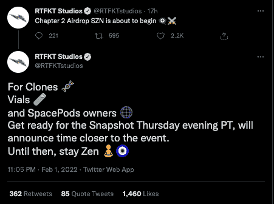

# 新的 RTFKT NFT 下降推动交易量 55%

> 原文：<https://web.archive.org/web/https://dappradar.com/blog/new-rtfkt-nft-drops-boost-trading-volume-55>

## CloneX 持有人的两个新宣布的下降

RTFKT 工作室制作的 NFT 头像收藏 CloneX 本周在 NFT 的交易量增加了 55%。CloneX 持有者的两个独家 NFT 的下降被宣布，使销售额和交易量增加了 55%以上，因为投资者在 2 月 3 日星期四的快照预期中抓住了 NFT。

在 2 月 1 日的一条推文中，[该团队宣布](https://web.archive.org/web/20220929042600/https://twitter.com/RTFKTstudios/status/1488619419051999241)小瓶、克隆体和 SpacePods NFTs 的持有者需要为周四晚上的快照做好准备。在 2 月 2 日[的另一条推特](https://web.archive.org/web/20220929042600/https://twitter.com/RTFKTstudios/status/1488642140125155328)中，RTFKT 团队澄清说将进行两次空投，一次是针对小瓶和克隆体的持有者，另一次是针对那些持有容器的人。这一澄清是在许多社区成员表达了对他们被一起分批的担忧之后发生的。

CloneX 是 20，000 个随机生成的 3D 动画灵感化身的集合。这个特别的系列是与著名的日本当代艺术家[村上隆](https://web.archive.org/web/20220929042600/https://en.wikipedia.org/wiki/Takashi_Murakami)合作创作的。众所周知，他在许多时尚相关产品上进行合作，并拥有一批狂热的追随者。铸造后仅仅五天，[号克隆体 15920](https://web.archive.org/web/20220929042600/https://dappradar.com/hub/assets/eth/0x49cf6f5d44e70224e2e23fdcdd2c053f30ada28b/12822) 就以 289 ETH 的价格售出，约合 111 万美元。

## 买一送一

如上所述，活动的激增可以归结为人们空投狩猎。在 2 月 3 日(周四)之前购买上述两个系列中的任意一个，持有者将获得一个新的 NFT。投机者预计，这个新项目将像其他 RTFKT 项目一样受欢迎。此外，[买下品牌](/web/20220929042600/https://dappradar.com/blog/nike-acquired-nft-fashion-company-rtfkt-studios/)的耐克并没有对其造成任何伤害。一方面，RTFKT 刺激交易量并让更多人持有其 NFT 是一个明智的举动。另一方面，这种方法正在成为在 NFT 空间建立强大追随者的标准方式。

## NFTs 避开加密崩溃

值得注意的是，现在受到关注的不仅仅是以太坊 NFT 系列。整个 NFT 的景观都在提升。部分原因是 NFT 上所谓的大甩卖，大部分以本土代币定价，如 SOL、ETH 和 BNB，这些代币在几个月内损失了约 50%的价值。投资者似乎被 NFT 的蓝筹股集合所吸引，比如、[Women](https://web.archive.org/web/20220929042600/https://dappradar.com/ethereum/collectibles/world-of-women)和 [BAYC](https://web.archive.org/web/20220929042600/https://dappradar.com/ethereum/collectibles/bored-ape-yacht-club) 作为价值储存手段，在熊市期间的百分比收益方面有可能超过 BTC 和瑞士联邦理工学院。

销售额的激增表明，虽然加密价格正在下跌，但以太坊和其他[网络(如 Solana](https://web.archive.org/web/20220929042600/https://dappradar.com/blog/solana-nft-marketplaces-get-a-lift-as-sol-price-slides) 和 Tezos)上的重要市场的活动达到峰值[,这表明随着投资者希望度过即将到来的熊市，NFTs 正在成为一种更成熟的价值储存手段。](https://web.archive.org/web/20220929042600/https://dappradar.com/blog/solana-nft-marketplaces-get-a-lift-as-sol-price-slides)

 NewsletterUnsubscribe at any time. [T&Cs](https://web.archive.org/web/20220929042600/https://dappradar.com/terms) and [Privacy Policy](https://web.archive.org/web/20220929042600/https://dappradar.com/privacy-policy)[<picture></picture>](https://web.archive.org/web/20220929042600/https://dappradar.com/blog/what-are-non-fungible-tokens-nfts)[<picture></picture>](https://web.archive.org/web/20220929042600/https://dappradar.com/nft/marketplaces)[<picture></picture>](https://web.archive.org/web/20220929042600/https://dappradar.com/nft/sales)