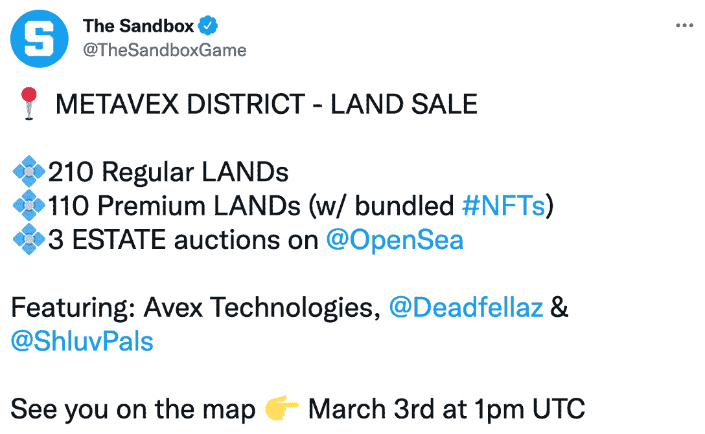

# 来自沙盒的消息:土地销售将于 3 月 3 日上线

> 原文：<https://web.archive.org/web/https://dappradar.com/blog/news-from-the-sandbox-land-sale-going-live-on-march-3rd>

## 另一个跳进元宇宙和获得虚拟房地产的机会

**周末元宇宙的大新闻随着******宣布即将进行土地拍卖，预定于 3 月 3 日星期四举行。沙盒玩家还将有机会在 3 月 31 日**的抽奖活动中赢得第二季阿尔法通行证。**

 **它可能还处于早期阶段，但新生的元宇宙已经有了一批成熟的巨头。这些是用户崇拜的平台，批评者憎恶的平台，而不知情的人只能远远地认出来。目前，四个庞然大物统治着对话:[去中心化](https://web.archive.org/web/20221215000712/https://dappradar.com/ethereum/marketplaces/decentraland)、 [Somnium Space](https://web.archive.org/web/20221215000712/https://dappradar.com/ethereum/games/somnium-space) 、 [Cryptovoxels](https://web.archive.org/web/20221215000712/https://dappradar.com/ethereum/collectibles/cryptovoxels) 和沙盒。因此，当后者[宣布](https://web.archive.org/web/20221215000712/https://twitter.com/TheSandboxGame/status/1497919562829864960)将于 3 月 3 日进行土地出售时，网络世界并不缺少谈论点和观点。

Source: Twitter

有趣的是，浮出水面的主要问题之一与反机器人安全有关，以及沙盒计划如何对抗自动化程序挤走游戏的真正粉丝的问题。

这个问题对 NFT 资产销售公司来说并不新鲜，已经有人[就沙盒问题](https://web.archive.org/web/20221215000712/https://www.reddit.com/r/TheSandboxGaming/comments/s34ni5/the_mega_city_land_sale_were_the_lands_bought_out/)提出过了。沙盒和其他大型区块链平台如何决定平衡安全和去中心化的竞争压力，将对所有 dapps 在未来如何管理这个问题产生影响。

## 土地的价格

沙盒一直保持着其土地的销售价格。因此，在周四，任何有幸购买土地的人都可以预期支付以下费用:

*   **普通土地**–1011 沙(3215 美元)
*   **优质土地**–4683 沙(14892 美元)。此次购买捆绑了 NFTs。

这是工厂的土地成本。二级市场是一个不同的故事。

在 [OpenSea](https://web.archive.org/web/20221215000712/https://opensea.io/collection/sandbox) 上，沙盒中土地的底价目前为 3.29 ETH(9195 美元)。这意味着在二级市场上进行常规土地交易的价格是直接从沙盒中购买的近三倍。优质土地围绕着主要的合作伙伴或社交中心，这是玩家进入游戏的地方。虽然没有固定价格，但它的售价远远高于普通型号。

由于一级市场和二级市场上土地价格的差异，难怪人们会给机器人编程，以数字精度开拓市场。难怪普通人在购买竞赛中无法击败机器时会如此沮丧。

## 阿尔法第二季抽奖

3 月 31 日，沙盒正在进行抽奖，参与者有机会赢得阿尔法通行证。Alpha Pass“使您能够将您的从玩到赚活动转换成最多 1，000 粒沙子”。

玩家可以通过多种方式赢取奖券:

*   完成任务–玩家通过完成任务可以赢得多达 500 张奖券。
*   木桩
*   持有史努比狗狗私人派对通行证
*   持有 Snoopverse 早期访问通行证
*   持有第一季阿尔法通行证
*   圣地

世界协调时 3 月 31 日下午 7 点左右，将通过注册电子邮件联系抽奖的获胜者。**