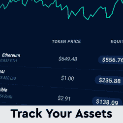
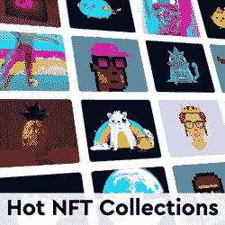

# 内马尔以超过 100 万美元的价格购买了 2 台 BAYC NFT——NFT 销量前十

> 原文：<https://web.archive.org/web/https://dappradar.com/blog/neymar-purchases-2-bayc-nfts-for-over-1-million>

## 这位足球巨星气势汹汹地闯入了 NFT 的领地

内马尔是目前最受欢迎的足球运动员之一，他最近成为 NFT 收藏品也同样引人注目。他在过去七天内购买了两艘 Bored Ape 游艇俱乐部 NFT，总价值 112 万美元。

虽然内马尔的无聊类人猿没有一个登上榜首，但这位足球运动员凭借两部作品统治了上周的最高销售额。值得注意的是，在短短几天内，内马尔已经创建了一个令人印象深刻的[投资组合](https://web.archive.org/web/20230307144442/https://dappradar.com/hub/assets/eth/0xbc4ca0eda7647a8ab7c2061c2e118a18a936f13d/6633)，包含超过 271 个 NFT。当然，许多这些都是送给这位超级明星球员的，因为他在 1 月 20 日在[的一条推特](https://web.archive.org/web/20230307144442/https://twitter.com/neymarjr/status/1484230264293318663)上宣布了他进入太空的消息。

[https://web.archive.org/web/20230307144442if_/https://www.youtube.com/embed/mdwUK5hoMUE?feature=oembed](https://web.archive.org/web/20230307144442if_/https://www.youtube.com/embed/mdwUK5hoMUE?feature=oembed)

## 内马尔位列分散的国家非传染性疾病、妇女世界和 CloneX

1.  [黑客城](https://web.archive.org/web/20230307144442/https://dappradar.com/hub/assets/eth/0x959e104e1a4db6317fa58f8295f586e1a978c297/1286)——119 万美元/ 425.000 法力——由[匿名钱包](https://web.archive.org/web/20230307144442/https://dappradar.com/hub/wallet/eth/0xa83bd770a30e0717b0047340c8d39fba369e4718)购买
2.  [CryptoPunk # 4551](https://web.archive.org/web/20230307144442/https://dappradar.com/hub/assets/eth/0xb47e3cd837ddf8e4c57f05d70ab865de6e193bbb/4551)——710.900 美元/220 ETH——被[内特·里弗斯](https://web.archive.org/web/20230307144442/https://dappradar.com/hub/wallet/eth/0x54b174179ae825ed630da40b625bb3c883cd40ae)收购
3.  [无聊猿游艇俱乐部# 5269](https://web.archive.org/web/20230307144442/https://dappradar.com/hub/assets/eth/0xbc4ca0eda7647a8ab7c2061c2e118a18a936f13d/5269)——612.640 美元/189.69 ETH——被[内马尔](https://web.archive.org/web/20230307144442/https://dappradar.com/hub/wallet/eth/0xc4505db8cc490767fa6f4b6f0f2bdd668b357a5d)收购
4.  [crypto punk # 4526](https://web.archive.org/web/20230307144442/https://dappradar.com/hub/assets/eth/0xb47e3cd837ddf8e4c57f05d70ab865de6e193bbb/4526)—$ 587.770/209 ETH—[匿名钱包](https://web.archive.org/web/20230307144442/https://dappradar.com/hub/wallet/eth/0xf4e423ce220e4d9fedcfebcd755ff9d37dc244b2)购买
5.  [Doodle # 5337](https://web.archive.org/web/20230307144442/https://dappradar.com/hub/assets/eth/0x8a90cab2b38dba80c64b7734e58ee1db38b8992e/5337)——552.880 美元/230 WETH——由 [fren-721.eth](https://web.archive.org/web/20230307144442/https://dappradar.com/hub/wallet/eth/0xcdc116b3749f0e272d337c6213d8ebffe65d6e1e) 购买
6.  [无聊猿游艇俱乐部# 6633](https://web.archive.org/web/20230307144442/https://dappradar.com/hub/assets/eth/0xbc4ca0eda7647a8ab7c2061c2e118a18a936f13d/6633)——516.120 美元/ 159.99 瑞士法郎——被[内马尔](https://web.archive.org/web/20230307144442/https://dappradar.com/hub/assets/eth/0xbc4ca0eda7647a8ab7c2061c2e118a18a936f13d/6633)收购
7.  [706 号女人](https://web.archive.org/web/20230307144442/https://dappradar.com/hub/assets/eth/0xe785e82358879f061bc3dcac6f0444462d4b5330/706)——513.050 美元/210 ETH——被[divine feminity . ETH](https://web.archive.org/web/20230307144442/https://dappradar.com/hub/wallet/eth/0xa1707c82aa2866955991c7f2c6f431d6619b8b4c)买走
8.  [CloneX # 17305](https://web.archive.org/web/20230307144442/https://dappradar.com/hub/assets/eth/0x49cf6f5d44e70224e2e23fdcdd2c053f30ada28b/15991)——493.760 美元/177 ETH——被 [nft-galaxy.eth](https://web.archive.org/web/20230307144442/https://dappradar.com/hub/wallet/eth/0x29a8f31b34e66b8c4661f084884138f46acc05e8) 收购
9.  [music hub](https://web.archive.org/web/20230307144442/https://dappradar.com/hub/assets/eth/0x959e104e1a4db6317fa58f8295f586e1a978c297/1362)457.600 美元/ 160.000 法力——由[匿名钱包](https://web.archive.org/web/20230307144442/https://dappradar.com/hub/wallet/eth/0xf519172dc3cc531786db0db7292a51a1bcfa7d82)购买
10.  [Autoglyphs # 108](https://web.archive.org/web/20230307144442/https://dappradar.com/hub/assets/eth/0xd4e4078ca3495de5b1d4db434bebc5a986197782/108)——453.840 美元/145 ETH——由[匿名钱包购买](https://web.archive.org/web/20230307144442/https://dappradar.com/hub/wallet/eth/0x7338afb07db145220849b04a45243956f20b14d9)

内马尔进军 NFT 市场绝对是本周最大销售排行榜上的头条新闻。然而，NFT 换主最贵的是[黑客城](https://web.archive.org/web/20230307144442/https://dappradar.com/hub/assets/eth/0x959e104e1a4db6317fa58f8295f586e1a978c297/1286)，一个匿名地址以 119 万美元买下的分散地的一块土地。另一块名为 [MusicHub](https://web.archive.org/web/20230307144442/https://dappradar.com/hub/assets/eth/0x959e104e1a4db6317fa58f8295f586e1a978c297/1362) 的分散地块也入选，以 457.600 美元的价格易主。

本周的名单由 [CryptoPunk #455](https://web.archive.org/web/20230307144442/https://dappradar.com/hub/assets/eth/0xb47e3cd837ddf8e4c57f05d70ab865de6e193bbb/4551) 完成，该公司以 220 ETH，或 710.900 美元的价格易手。此外， [Woman #706](https://web.archive.org/web/20230307144442/https://dappradar.com/hub/assets/eth/0xe785e82358879f061bc3dcac6f0444462d4b5330/706) 世界女性系列的一部分在[divinefmeinity . eth](https://web.archive.org/web/20230307144442/https://dappradar.com/hub/wallet/eth/0xa1707c82aa2866955991c7f2c6f431d6619b8b4c)的作品集中找到了新家，售价 513.050 美元。

关于本周十大销售额的一个重要注意事项是,[looks rare](https://web.archive.org/web/20230307144442/https://dappradar.com/blog/looksrare-nft-marketplace-token-airdrop-is-live/)销售额对 [DappRadar 排名](https://web.archive.org/web/20230307144442/https://dappradar.com/nft/sales)的影响。该市场仍然吸引着数百起可疑的销售，这些销售已被排除在该名单之外，因为其活动非常类似于 wash 交易行为。点击这里，阅读更多关于“看起来很稀有”及其最近流行起来的[。](https://web.archive.org/web/20230307144442/https://dappradar.com/blog/looksrare-nft-marketplace-hit-by-wash-trading-amidst-airdrop/)

[<picture></picture>](https://web.archive.org/web/20230307144442/https://dappradar.com/hub/assets/eth/0xbc4ca0eda7647a8ab7c2061c2e118a18a936f13d/1193)[<picture></picture>](https://web.archive.org/web/20230307144442/https://dappradar.com/hub/wallet/)[<picture></picture>](https://web.archive.org/web/20230307144442/https://dappradar.com/nft) NewsletterUnsubscribe at any time. [T&Cs](https://web.archive.org/web/20230307144442/https://dappradar.com/terms) and [Privacy Policy](https://web.archive.org/web/20230307144442/https://dappradar.com/privacy-policy)