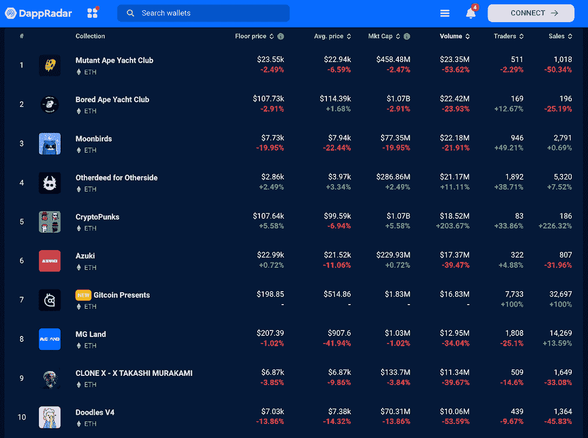
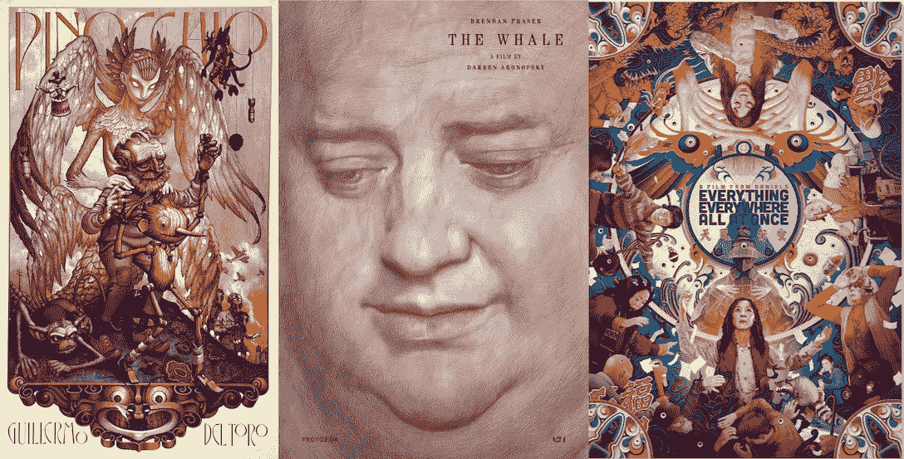
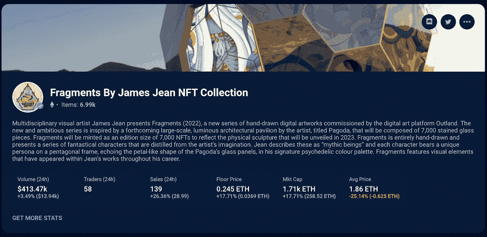
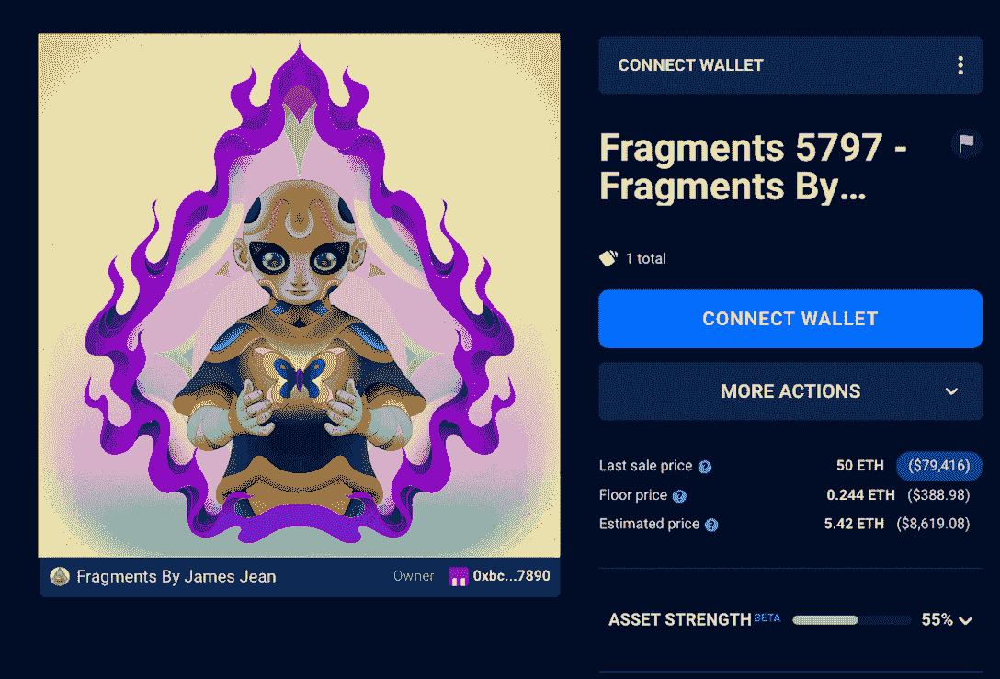
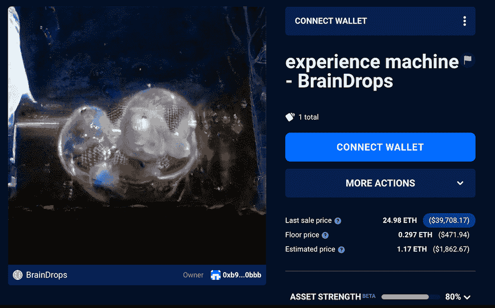
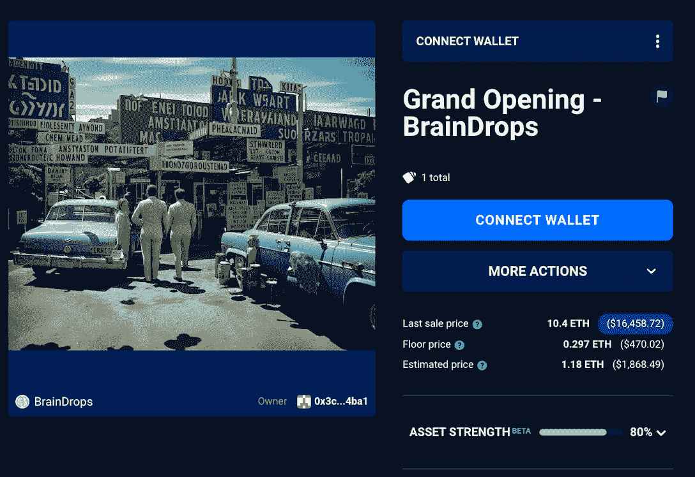
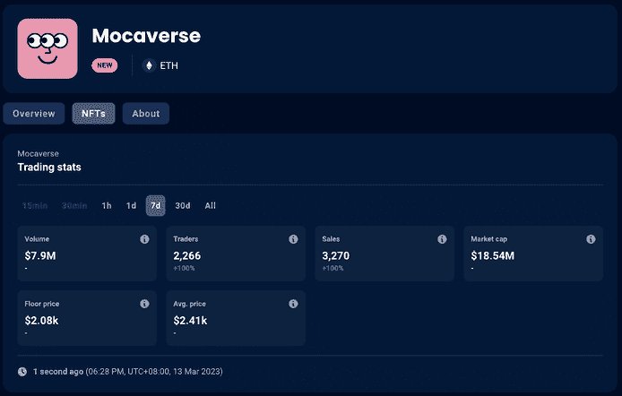

# 随着大多数藏品交易量下降，NFT 艺术界蓬勃发展

> 原文：<https://web.archive.org/web/https://dappradar.com/blog/nft-art-scene-thrives-as-trading-volume-drops-for-most-collections>

## 查看 2023 年 3 月 6 日至 12 日期间的 NFT 销售亮点排名

虽然上周整个 NFT 市场可能经历了一段平静期，但随着现有项目获得进一步的吸引力，艺术品市场继续繁荣。无论你是一个经验丰富的收藏家，还是一个新进入 NFTs 世界的人，探索 NFT 艺术多样化和快速发展的前景永远不会是一个坏时机。

## NFT 艺术项目在非艺术类股低迷的一周里表现突出

过去一周，NFT 市场整体经历了一段相对平静的时期，一些更受欢迎的藏品，如 Bored Ape Yacht Club、志那都红豆和 Doodles，交易量和交易量都有所下降。然而，尽管经济放缓，NFT 艺术界一周表现不错，过去七天有几个项目的活动有所增加。

[View the full NFT ranking](https://web.archive.org/web/20230313153611/https://dappradar.com/nft)

### 詹姆斯·简的片段重新受到关注

詹姆斯·吉恩的《NFT 的碎片》作品集最初创作于去年，最近受到了极大的关注，可能是因为第 95 届奥斯卡金像奖的热潮。这位艺术家今年奥斯卡获奖电影的独家海报,《立刻无处不在》、《鲸鱼》和《匹诺曹》,无疑起到了让他再次成为焦点的作用。

在过去的七天里，该系列的平均价格上涨了 5.6%，达到 2620 美元，交易量增加了 14.12%，总额为 222 万美元。Jean 的独特和富有想象力的角色的粉丝被 Fragments 迷住了，这一系列真正展示了他独特的视觉风格。难怪这种迷幻的艺术品成为各地艺术收藏家的必备之物。

[View more stats about Fragments](https://web.archive.org/web/20230313153611/https://dappradar.com/hub/nft-collection/fragments-by-james-jean)

### 雨滴引领 ai 艺术 nfts 崛起

艺术一直是人类表达和创造的媒介。但随着人工智能的到来，我们现在正在目睹人类和机器生成的艺术的迷人融合。因此，人工智能艺术 NFTs 的世界正迅速受到欢迎，Braindrops 等平台正处于这场创意革命的前沿。

在过去的一周里，该平台经历了令人印象深刻的增长，交易量激增 111.9%，交易者增加 292.68%，销售额跃升 308.82%。平台上的杰出艺术家包括克莱尔·西尔弗(Clair Silver)和雷尼斯托(Rainisto)，前者的作品在伦敦苏富比拍卖行出售，后者创作发人深省的艺术品。

[View more artworks on Braindrops](https://web.archive.org/web/20230313153611/https://dappradar.com/ethereum/collectibles/braindrops/nfts)

## MOC 倒爷显示需求旺盛

Animoca Brands 的 MOC 倒戈 NFT 系列最近完成了铸造。该集合是 Animoca Brands 的公司、项目、投资、股东和合作伙伴家族的成员 NFT，反映了他们在 Web3 和数字产权上的价值。

值得一提的是，这些股票的交易数据令人印象深刻。虽然才刚刚推出，但 mochedge NFT 的当前底价已经达到 1.3 ETH，是 0.138 ETH 铸币价的 10 倍以上。在过去的 7 天里，交易者的数量增加了一倍，达到 2266 人。而销售额也是如此，达到了 3000 多笔。

[Check out more stats about Mocaverse](https://web.archive.org/web/20230313153611/https://dappradar.com/ethereum/collectibles/mocaverse/)

您还可以通过以下链接探索 Animoca 品牌生态系统中的项目:

*   [沙盒](https://web.archive.org/web/20230313153611/https://dappradar.com/multichain/games/the-sandbox)
*   [Revv 赛车运动](https://web.archive.org/web/20230313153611/https://dappradar.com/polygon/games/revv-racing)
*   [Arc8](https://web.archive.org/web/20230313153611/https://dappradar.com/polygon/games/arc8-by-gamee-1)
*   [疯狂防御英雄](https://web.archive.org/web/20230313153611/https://dappradar.com/multichain/games/crazy-defense-heroes)

## 查看 NFT 销售亮点列表

*注意:出售时给出的美元价值是正确的。*

每周，DappRadar 不仅会重点报道 NFT 最昂贵的[销售](https://web.archive.org/web/20230313153611/https://dappradar.com/nft/sales)，还会报道过去七天中最有趣的销售。虽然庞大的数字肯定会占据头条，但突出新兴趋势并让 DappRadar 社区保持领先也是至关重要的。

*   [Bored Ape 游艇俱乐部# 5116](https://web.archive.org/web/20230313153611/https://dappradar.com/hub/assets/eth/0xbc4ca0eda7647a8ab7c2061c2e118a18a936f13d/5116)-693，620 美元/440 ETH-[业主的钱包](https://web.archive.org/web/20230313153611/https://dappradar.com/hub/wallet/eth/0xb7c933cbdacb223a62d1b4e904462bc597e04f83?utm_source=rankings&utm_medium=nft&utm_campaign=nft_sales)
*   [fide nza # 971](https://web.archive.org/web/20230313153611/https://dappradar.com/hub/assets/eth/0xa7d8d9ef8d8ce8992df33d8b8cf4aebabd5bd270/78000971)-$ 545，390/380 ETH-[车主的钱包](https://web.archive.org/web/20230313153611/https://dappradar.com/hub/wallet/eth/0x0e11925c629911394d4c8776f56bcfccebbf6e13?utm_source=rankings&utm_medium=nft&utm_campaign=nft_sales)
*   [方位积分 V2 # 42](https://web.archive.org/web/20230313153611/https://dappradar.com/hub/assets/eth/0x33eecbf908478c10614626a9d304bfe18b78dd73/42)—$ 350，340/225 ETH—[车主的钱包](https://web.archive.org/web/20230313153611/https://dappradar.com/hub/wallet/eth/0x5571e65d871e7097e9f4cda11d4fbcaccb9f6a88?utm_source=rankings&utm_medium=nft&utm_campaign=nft_sales)
*   [crypto punk # 7167](https://web.archive.org/web/20230313153611/https://dappradar.com/hub/assets/eth/0xb47e3cd837ddf8e4c57f05d70ab865de6e193bbb/7167)-$ 199360/124.99 ETH-[主人的钱包](https://web.archive.org/web/20230313153611/https://dappradar.com/hub/wallet/eth/0xdcae87821fa6caea05dbc2811126f4bc7ff73bd1?utm_source=rankings&utm_medium=nft&utm_campaign=nft_sales)
*   [anon # 108](https://web.archive.org/web/20230313153611/https://dappradar.com/hub/assets/eth/0x9797c220933d5c899b0d4e46898886916ebb3a3c/108)-$ 183，910/120 ETH-[车主的钱包](https://web.archive.org/web/20230313153611/https://dappradar.com/hub/wallet/eth/0x01c8c92089004bff57d2740479d9cf8d441d6bad?utm_source=rankings&utm_medium=nft&utm_campaign=nft_sales)
*   [jonburgerman 官方 70 号](https://web.archive.org/web/20230313153611/https://dappradar.com/hub/assets/eth/0xda30c44c06581ac1f43dd342fd8cf371d937ff3e/70)——144620 美元/99 ETH—[业主的钱包](https://web.archive.org/web/20230313153611/https://dappradar.com/hub/wallet/eth/0x014b848a958159d60ffe7200b5ec30914f1577b1?utm_source=rankings&utm_medium=nft&utm_campaign=nft_sales)

[Check out all the NFT market trends](https://web.archive.org/web/20230313153611/https://dappradar.com/nft/sales)

## 随身携带您的 Web3 之旅

使用 DappRadar 移动应用程序，再也不会错过 Web3。查看最受欢迎的 dapps 的性能，并关注您投资组合中的 NFT。您的 DappRadar 帐户与我们的移动应用程序同步，让您可以随时接收实时提醒。

[Download the DappRadar app now](https://web.archive.org/web/20230313153611/https://dappradar.app.link/blog)[<picture></picture>](https://web.archive.org/web/20230313153611/https://play.google.com/store/apps/details?id=com.portfolio.dappradar)