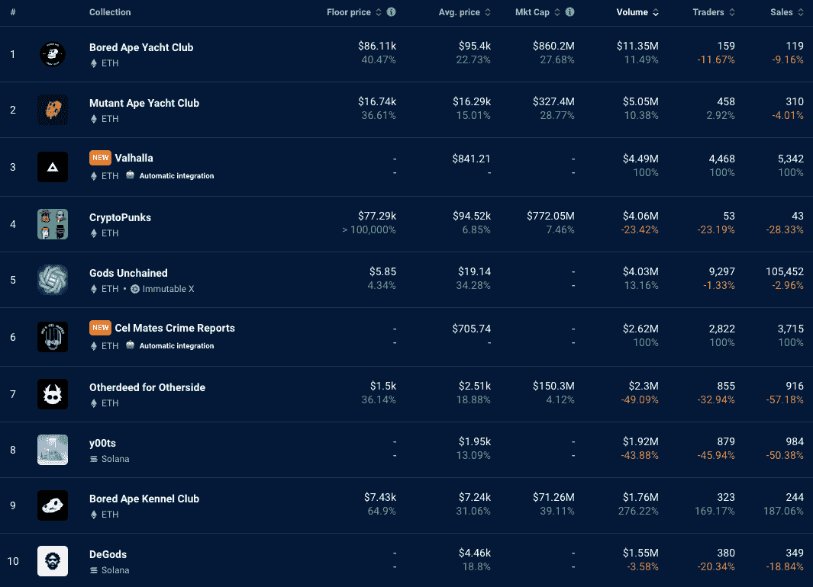

# NFT 系列摆脱了神秘的冬天

> 原文：<https://web.archive.org/web/https://dappradar.com/blog/nft-collections-break-free-from-crypto-winter>

## 尽管该行业存在不确定性，但底价和售价都在飙升

上周，我们报道了 BAYC 和 CryptoPunks 的大规模抛售，因为用户希望释放流动性，度过加密冬天。现在，随着价格开始再次攀升，买家似乎正在涌入市场。我们需要更多的时间和数据来判断这是一个虚假的黎明还是一个更稳定时期的开始。

[Explore NFT Rankings](https://web.archive.org/web/20221204010818/https://dappradar.com/nft)

### 7 天指标脱离了地面

在整个 NFT 市场，大多数藏品的底价、平均售价和交易量都有所上升。

以下系列的底价涨幅超过 25%:

*   [无聊猿游艇俱乐部](https://web.archive.org/web/20221204010818/https://dappradar.com/ethereum/collectibles/bored-ape-yacht-club)(涨幅 40.74%)
*   [变种人猿游艇俱乐部](https://web.archive.org/web/20221204010818/https://dappradar.com/ethereum/collectibles/mutant-ape-yacht-club)(涨幅 36.61%)
*   [另一侧](https://web.archive.org/web/20221204010818/https://dappradar.com/ethereum/collectibles/otherdeed-for-otherside)(地板上升 36.14%)
*   [无聊猿养狗俱乐部](https://web.archive.org/web/20221204010818/https://dappradar.com/ethereum/collectibles/bored-ape-kennel-club) (64.9%)
*   [月亮鸟](https://web.archive.org/web/20221204010818/https://dappradar.com/ethereum/collectibles/moonbirds)(涨幅 31.09%)
*   [涂鸦](https://web.archive.org/web/20221204010818/https://dappradar.com/ethereum/collectibles/doodles)(地板涨 26.43%)
*   [mfers](https://web.archive.org/web/20221204010818/https://dappradar.com/ethereum/collectibles/mfers) (最低涨幅 39.46%)

点击上面的链接，深入探索这些系列。

[<picture></picture>](https://web.archive.org/web/20221204010818/https://dappradar.com/nft)

[Seven-day on-chain metrics for top NFT collections](https://web.archive.org/web/20221204010818/https://dappradar.com/nft)

上图显示了交易量排名前 10 的藏品。一段时间以来，我们第一次可以看到一片绿色的海洋，表明他们的周环比表现有所改善。

## 为什么价格会飙升？

链上指标的上升没有单一的原因。但价格和销量上升有几个显而易见的原因。

首先，ETH 的价格在过去一周上涨了 2.3%。虽然这不是一个巨大的增长，但事实上大多数顶级藏品都是以 ETH 计价的，这意味着其虚高的价格将在我们看到的活动中发挥作用。

其次，NFT 翻转正在上升。现在，0%的费用是可用的，NFT 翻转成为一个可行的方式，使快速，小额利润。每一次转手和获利，价格都会适度上涨。总的来说，这些小数量累积起来，收藏价格就会上涨。

例如，在 BAYC、BAKC 和 MAYC 的交易中，有 63%是本周尚未交易的独特的非金融交易这是该数字有史以来的最低水平，表明短期成交量是有史以来的最高水平。看来经验丰富的鲸鱼在危机中获取利润。

> 本周，63%的 BAYC/BAKC/MAYC 交易是本周尚未交易的独特 NFT。这是迄今为止这一比率的最低值。
> 
> 这意味着短期交易占总交易的比例是最高的。【pic.twitter.com/luvPfQ62Qi 
> 
> — NFTstatistics.eth (@punk9059) [November 27, 2022](https://web.archive.org/web/20221204010818/https://twitter.com/punk9059/status/1596916259659993089?ref_src=twsrc%5Etfw)

Analysis of flipping activity

第三，活动的增加可能表明，上周的抛售和价格下跌是独家收藏市场的底部。随着 FTX 欺诈案的余波继续在 Web3 系统中蔓延，恐慌的持有人想要流动性，他们逃向更稳定的资产。

随着价格下跌，人们看到了便宜货的机会。需求上升，价格随之上涨。那些希望释放流动性、转向更安全、更稳定资产的人已经出局。因此，越来越少的人希望廉价出售他们的非金融资产。

## 查看 NFT 销售亮点列表

*注意:出售时给出的美元价值是正确的。*

每周，DappRadar 不仅会重点报道 NFT 最昂贵的[销售](https://web.archive.org/web/20221204010818/https://dappradar.com/nft/sales)，还会报道过去七天中最有趣的销售。虽然庞大的数字肯定会占据头条，但同样重要的是[突出新兴趋势](https://web.archive.org/web/20221204010818/https://dappradar.com/nft/sales)并保持 DappRadar 社区的领先地位。

*   [Bored Ape 游艇俱乐部# 1268](https://web.archive.org/web/20221204010818/https://dappradar.com/hub/assets/eth/0xbc4ca0eda7647a8ab7c2061c2e118a18a936f13d/1268)-938，440 美元/780 ETH-[业主的钱包](https://web.archive.org/web/20221204010818/https://dappradar.com/hub/wallet/eth/0xec7e5a49ee8e95a89a1a881bbf1aae2ec854d790)
*   [Bored Ape 游艇俱乐部# 232](https://web.archive.org/web/20221204010818/https://dappradar.com/hub/assets/eth/0xbc4ca0eda7647a8ab7c2061c2e118a18a936f13d/232)—$ 928，860/800 ETH—[业主的钱包](https://web.archive.org/web/20221204010818/https://dappradar.com/hub/wallet/eth/0x6c8ee01f1f8b62e987b3d18f6f28b22a0ada755f)
*   [crypto punk # 7261](https://web.archive.org/web/20221204010818/https://dappradar.com/hub/assets/eth/0xb47e3cd837ddf8e4c57f05d70ab865de6e193bbb/7261)-$ 324210/285 ETH-[主人的钱包](https://web.archive.org/web/20221204010818/https://dappradar.com/hub/wallet/eth/0x0232d1083e970f0c78f56202b9a666b526fa379f)
*   [fide nza # 280](https://web.archive.org/web/20221204010818/https://dappradar.com/hub/assets/eth/0xa7d8d9ef8d8ce8992df33d8b8cf4aebabd5bd270/78000280)-$ 321，850/295 ETH-[车主钱包](https://web.archive.org/web/20221204010818/https://dappradar.com/hub/wallet/eth/0x9852a06cb4d583c9d9b6fcb66a2c11e04e4b995e)
*   [DEAFBEEF 系列 2:传输-令牌 137](https://web.archive.org/web/20221204010818/https://dappradar.com/hub/assets/eth/0xd754937672300ae6708a51229112de4017810934/137)-213，040 美元/175 WETH-[车主的钱包](https://web.archive.org/web/20221204010818/https://dappradar.com/hub/wallet/eth/0xfe0875e12958a019dea15a795c22845179749f50)
*   [大型主街地段(55 块土地)](https://web.archive.org/web/20221204010818/https://dappradar.com/hub/assets/eth/0x959e104e1a4db6317fa58f8295f586e1a978c297/4853)——141，800 美元/350，000 MANA—[业主的钱包](https://web.archive.org/web/20221204010818/https://dappradar.com/hub/wallet/eth/0xa8f98b7b2039256ba66a12fead20e750ecf9670d)
*   [Axie Infinity Genesis Plot (-30，-30)](https://web.archive.org/web/20221204010818/https://app.axieinfinity.com/marketplace/lands/-30/-30/)–＄116，130/105 ETH–业主的钱包

## 仔细看看一些亮点

两只无聊的猿的销售额几乎达到了 100 万美元。持有这两种 NFT 的钱包提供了截然不同的故事。 [BAYC #232 坐在这里](https://web.archive.org/web/20221204010818/https://dappradar.com/hub/wallet/eth/0x6c8ee01f1f8b62e987b3d18f6f28b22a0ada755f)我们可以看到这是一个真正的鲸鱼钱包。它属于 Keungz，一个 Web3 集体，并包含大量其他蓝筹 NFT。

[BAYC #1268 放在这个钱包](https://web.archive.org/web/20221204010818/https://dappradar.com/hub/wallet/eth/0xec7e5a49ee8e95a89a1a881bbf1aae2ec854d790)里，里面没有其他蓝筹股。买家似乎也为这只猿支付了过高的价格。DappRadar 的 NFT 价值估算师告诉我们，BAYC #1268 目前价值约 79，192 美元。买家为这只猿支付了 10 倍于此的价格。每当我们看到这种不寻常的销售活动，我们都会非常谨慎地对待，直到我们发现交易背后的全部故事。

像往常一样，在过去的七天里，CryptoPunks 在 NFT 最昂贵的 50 件商品中占据了重要位置。最大的一笔交易是 CryptoPunk #7261 ，成交价为 324210 美元。[钱包属于朋克 OTC](https://web.archive.org/web/20221204010818/https://dappradar.com/hub/wallet/eth/0x0232d1083e970f0c78f56202b9a666b526fa379f) ，里面多了 60 个朋克。总体而言，朋克 OTC 的 NFT 总估价为 667 万美元。

对于元宇宙的粉丝来说，有两个大减价会吸引他们的注意力。有人花了 141，800 美元买下了分散地的一块地( [Massive Main Street Lot (55 块地)](https://web.archive.org/web/20221204010818/https://dappradar.com/hub/assets/eth/0x959e104e1a4db6317fa58f8295f586e1a978c297/4853))，还有人花了 116，130 美元买下了 Axie Infinity 最值钱的一块地( [Genesis 地块(-30，-30)](https://web.archive.org/web/20221204010818/https://app.axieinfinity.com/marketplace/lands/-30/-30/) )。

最近在 Web3 上发生的一切，这两个交易表明人们仍然愿意投资和建设一个去中心化和所有权很重要的 Web3 未来。

[Check Top NFT Sales](https://web.archive.org/web/20221204010818/https://dappradar.com/nft/sales)

## 随身携带您的 Web3 之旅

使用 DappRadar 移动应用程序，再也不会错过 Web3。查看最受欢迎的 dapps 的性能，并关注您投资组合中的 NFT。您在 DappRadar 上的帐户会与我们的移动应用程序同步，这样您很快就可以选择实时接收提醒。

[Download the DappRadar app now](https://web.archive.org/web/20221204010818/https://dappradar.app.link/blog)[<picture></picture>](https://web.archive.org/web/20221204010818/https://play.google.com/store/apps/details?id=com.portfolio.dappradar)