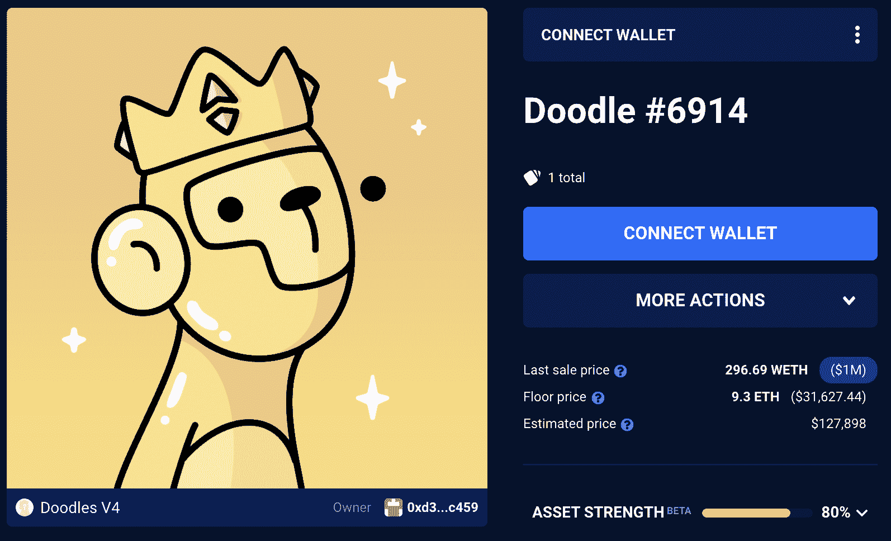
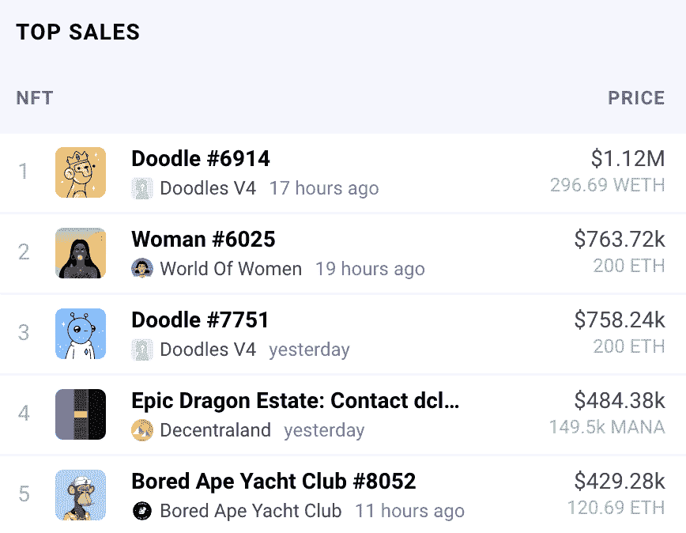
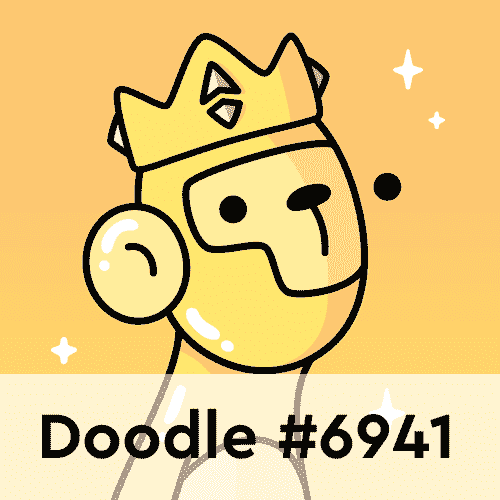

# NFT 收藏家恶作剧双倍下注涂鸦 NFT

> 原文：<https://web.archive.org/web/https://dappradar.com/blog/nft-collector-pranksy-doubles-down-on-doodles-nfts>

## 他为涂鸦#6914 支付了 112 万美元或 296.69 WETH

NFT 收藏家 Pranksy 以 1 美元的价格购买了 6914 号涂鸦。**1200 万，创收藏历史新高。涂鸦系列在 2022 年的头几天已经成为了镇上的话题，因为该系列在过去的一周见证了令人难以置信的活动。**

DappRadar 本周早些时候报道说，Pranksy 是最近几天的一些收购对象之一。这位收藏家一直热衷于购买涂鸦。1 月 5 日星期一，他在一条推特[中解释说，是时候对他在 NFT 的购买表现出一些信心了。这就是为什么他在](https://web.archive.org/web/20221206111516/https://twitter.com/pranksy/status/1478772914438778882)[的作品集](https://web.archive.org/web/20221206111516/https://dappradar.com/hub/wallet/eth/0xd387a6e4e84a6c86bd90c158c6028a58cc8ac459/nfts)中添加了 14 幅涂鸦。

这是一个单一系列的重大飞跃，然而，考虑到过去几天涂鸦受到的关注，这并不令人惊讶。Doodles 是由 Burnt Toast 设计并于去年 10 月发布的 10.000 PFP 头像 NFT 集合。从那以后，这些可爱的生物只会变得更有价值。目前，涂鸦 NFT 的底价是 9.29 瑞士法郎，约合 31.274 美元。这比 0.123 ETH 的原始造币价格增加了很多。

## 恶作剧和其他秘密名人推动涂鸦到顶部

恶作剧并不是最近唯一模仿涂鸦系列的秘密名人。像 Gary Vee 和 Loopify 这样的行业巨头也在过去几天购买了 Doodles NFTs。随着加密贵宾越来越多的关注，Doodles 自推出以来一直享受着最强劲的一周。

在过去的七天里，该系列吸引了 1700 多名独特的交易者，产生了近 5000 万美元的交易量。这使得该系列跻身于知名品牌之列，如 [Axie Infinity](https://web.archive.org/web/20221206111516/https://dappradar.com/ethereum/games/axie-infinity) 和 [Bored Ape 游艇俱乐部](https://web.archive.org/web/20221206111516/https://dappradar.com/ethereum/collectibles/bored-ape-yacht-club)。

令人印象深刻的是，由于活动的增加和底价的上涨，Doodles 现在也出现在 DappRadar NFT 销售排行榜上。在过去的 24 小时里，来自该系列的 NFT 排在第一和第三位，其中有一个[女人的世界 NFT](https://web.archive.org/web/20221206111516/https://dappradar.com/hub/assets/eth/0xe785e82358879f061bc3dcac6f0444462d4b5330/6025) 、一个[分散地的小块土地](https://web.archive.org/web/20221206111516/https://dappradar.com/hub/assets/eth/0x959e104e1a4db6317fa58f8295f586e1a978c297/134)和一个[无聊猿](https://web.archive.org/web/20221206111516/https://dappradar.com/hub/assets/eth/0xbc4ca0eda7647a8ab7c2061c2e118a18a936f13d/8052)。

DappRadar 将继续监测涂鸦系列，因为它推动达到新的高度。如果你也想密切关注它，看看下面有用的链接。也可以报名参加 [DappRadar PRO](https://web.archive.org/web/20221206111516/https://dappradar.com/token/pro) 。使用 PRO，您将获得独家 NFT 主题的 Discord 频道，以及最新的连锁销售数据。

[<picture></picture>](https://web.archive.org/web/20221206111516/https://dappradar.com/ethereum/collectibles/doodles)[<picture></picture>](https://web.archive.org/web/20221206111516/https://dappradar.com/hub/assets/eth/0x8a90cab2b38dba80c64b7734e58ee1db38b8992e/6914)[<picture></picture>](https://web.archive.org/web/20221206111516/https://dappradar.com/hub/assets/eth/0x8a90cab2b38dba80c64b7734e58ee1db38b8992e/7751) NewsletterUnsubscribe at any time. [T&Cs](https://web.archive.org/web/20221206111516/https://dappradar.com/terms) and [Privacy Policy](https://web.archive.org/web/20221206111516/https://dappradar.com/privacy-policy)