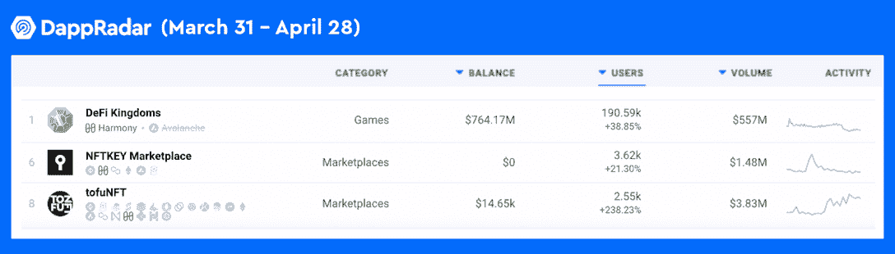
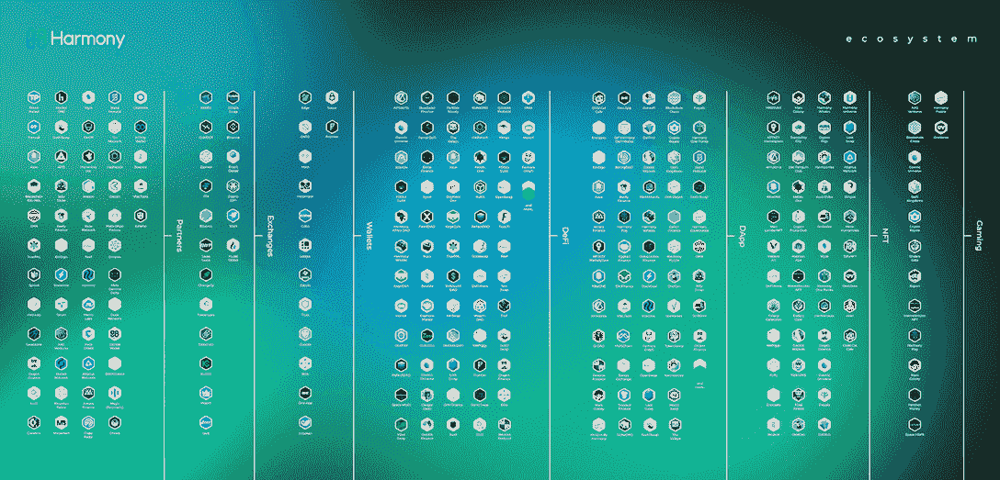
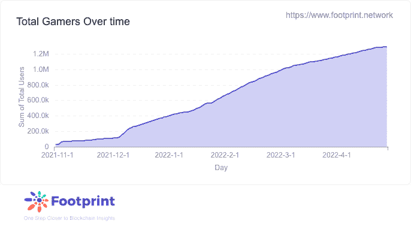
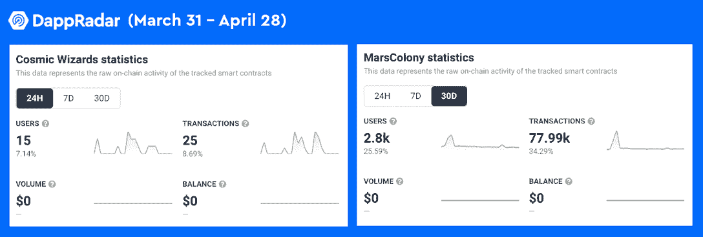
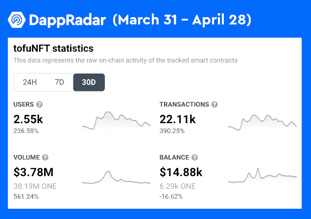

# 和谐 NFT 生态系统成长，GameFi Dapps 领先

> 原文：<https://web.archive.org/web/https://dappradar.com/blog/nft-ecosystem-on-harmony-grows-and-gamefi-dapps-take-the-lead>

## tofuNFT 和宇宙奇才在 30 天的流量激增

本月，Harmony 的 NFT 生态系统一直光芒四射，尤其是 GameFi dapps 的用户活动大幅增加。统治排行榜的是 DeFi 王国，吸引了近 20 万用户到和谐区块链。

**概要:**

*   **Harmony(**[**ONE**](https://web.archive.org/web/20220925073925/https://dappradar.com/hub/token/eth/ONE/ETH?from=0x68ac1affe00cf64ebc71e7e835a6871a379c5587)**)是跨链解决方案创新的领导者之一，允许 dapps 在多个区块链平台上运行。**
*   今年四月，GameFi dapps 在 NFT 和谐生态系统中表现强劲。
*   领先的 NFT 市场 tofuNFT 的用户活跃度飙升了 283%,显示出对和谐网上 NFT 交易的需求增加。

2022 年第一季度，加密货币行业经历了市场波动阶段。在过去的两周里， [BTC](https://web.archive.org/web/20220925073925/https://dappradar.com/hub/token/eth/WBTC?from=0x2260fac5e5542a773aa44fbcfedf7c193bc2c599) 一直徘徊在 40，000 美元左右，[联邦理工学院](https://web.archive.org/web/20220925073925/https://dappradar.com/hub/token/eth/ETH)在 3，000 美元左右。加密行业的总体下滑趋势也波及到了 NFT 行业。[然而，随着 Q1 2022](https://web.archive.org/web/20220925073925/https://dappradar.com/blog/dapp-industry-report-q1-2022-overview) 近 1 20 亿美元的交易，我们不能说市场崩溃了。

相反，我们注意到区块链网络公司制定了更加稳健的计划。例如，以 Harmony 为代表的节能公共链一直在通过跨链、可扩展和负担得起的解决方案来突破当前的 NFT 困境。自去年九月以来，达普拉达一直在追踪和谐生态系统。最近，我们注意到 NFT 地区在和谐网络中名列前茅，在过去的 30 天里， [DeFi 王国](https://web.archive.org/web/20220925073925/https://dappradar.com/harmony/games/defi-kingdoms)的唯一钱包号码增长了 38.85%， [NFTKEY Marketplace](https://web.archive.org/web/20220925073925/https://dappradar.com/harmony/marketplaces/nftkey-marketplace) 增长了 21%，而 [tofuNFT](https://web.archive.org/web/20220925073925/https://dappradar.com/harmony/marketplaces/tofunft) 增长了 283%。

## Harmony 的 NFT 生态系统在 GameFi 领域蓬勃发展

根据和谐官方发布的生态系统图，可以发现和谐已经构建了一个广泛的 dapp 矩阵，在各个垂直领域蓬勃发展。其中最值得一提的是杀手级产品 DeFi Kingdoms，它导致 Harmony 的 GameFi 数据在过去几个月飙升。

Source: Footprint

DeFi 王国是一个充满 NFT 的游戏赚取策略游戏。令人印象深刻的是，在过去的 30 天里，DeFi 王国记录了 190，592 个与 dapp 互动的独特钱包。凭借引领跨链游戏的雄心，DeFi Kingdom 已经证实了其游戏性和令牌组学确实很有吸引力。但是，更重要的是，DeFi 王国的成功证明了和谐区块链为动态 NFT 和游戏项目的健康成长提供了有机的土壤。

此外,《MarsColony》和《宇宙巫师》是另外两款表现亮眼的 NFT 游戏。MarsColony 是一款受经典太空殖民游戏启发的元宇宙游戏，其活跃用户增长了 25%，交易量增长了 33%。宇宙巫师，一个开放世界的 MMORPG 生态系统，有更令人印象深刻的数字，30 天活跃用户飙升 643%，转换 592%。

## 和谐集团在 NFT 的市场有所增长

Harmony 的 NFT 市场也因其跨链性质而闻名，tofuNFT 的接触点覆盖多达 20 个区块链。值得一提的是，tofuNFT 近期的数据表现同样令人振奋。具体来说，tofuNFT 用户在过去 30 天增长了 236%，交易量增长了 390%，交易量增长了 561%。

另一个突出的市场 dapp 是 NFTKEY Marketplace，它在过去 30 天内注册了 143，741 笔交易。生活在和谐区块链的市场似乎通过为其游戏 dapps 提供定制的 NFT 交易来补充其 GameFi 部门。

DappRadar 将继续监测 Harmony 及其生态系统的最新发展。在 [Twitter](https://web.archive.org/web/20220925073925/https://twitter.com/dappradar) 、 [Discord](https://web.archive.org/web/20220925073925/https://discord.gg/4ybbssrHkm) 和 [Youtube](https://web.archive.org/web/20220925073925/https://www.youtube.com/c/DappRadar) 上关注我们，跟上区块链世界的动态。