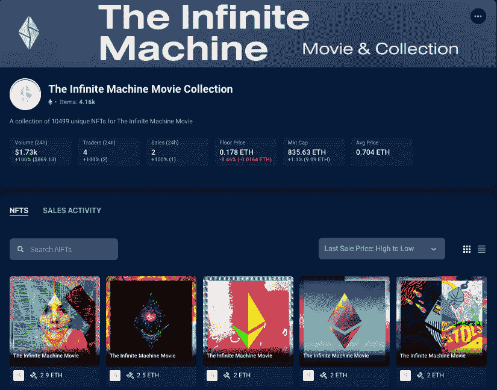
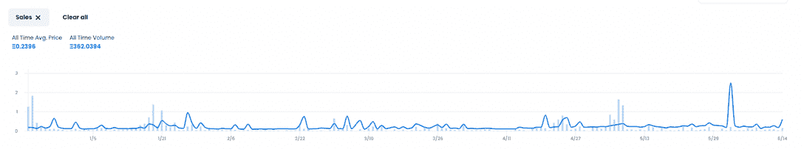

# NFT 资助的电影《无限机器》将在分散地首映

> 原文：<https://web.archive.org/web/https://dappradar.com/blog/nft-financed-movie-the-infinite-machine-will-premiere-in-decentraland>

## 雷德利·斯科特关于以太坊和维塔利克·布特林的电影将成为元宇宙的一部分

《无限机器》( The Infinite Machine)这部电影讲述了世界第二大数字资产以太坊(Ethereum)背后的故事，它的创作者是维塔利克·布特林(Vitalik Buterin)、加文·伍德(Gavin Wood)和查尔斯·霍金森(Charles Hoskinson ),这部电影将成为世界上第一部由 NFT 资助的电影。此外，制作公司之一，相对娱乐公司，最近宣布，分散的土地和琉米爱尔在船上举办电影在元宇宙。

《无限机器》是根据加密货币专家 Camilla Russo 的同名书籍改编的。在这本讲述以太坊故事的书中，作者详细描述了一个开发团队的疯狂和通常不走运的经历，该团队由 19 岁的远见卓识的 Vitalik Buterin 领导，致力于建立一个超级充电的全球网络。

[发现以太坊上排名最高的 dapps】](https://web.archive.org/web/20220730100102/https://dappradar.com/rankings/protocol/ethereum)

也许最大的新闻是这部电影将由《斯科特自由》的希亚姆·马迪拉朱和雷德利·斯科特、汤姆·莫兰和维拉·迈耶编剧和导演，与《对抗娱乐》的亚历杭德罗·米兰达一起制作。根据项目路线图，电影剧本将于 2022 年第三季度完成。雷德利·斯科特是《异形》、《银翼杀手》和《末路狂花》等开创性电影的负责人，他的参与应该会产生重大影响。

[<picture></picture>](https://web.archive.org/web/20220730100102/https://dappradar.com/blog/what-are-non-fungible-tokens-nfts)[<picture></picture>](https://web.archive.org/web/20220730100102/https://dappradar.com/nft/marketplaces)[<picture></picture>](https://web.archive.org/web/20220730100102/https://dappradar.com/nft/sales)

## 《无限机器》——第一部 NFT 投资的电影

电影制片人希望通过出售 NFT 的收藏品来资助制作过程，从而使《无限机器》成为世界上第一部完全由 NFT 资助的故事片。该系列采用了以太坊品牌的标志，该品牌已成为该领域最知名的品牌之一。

[点击此处查看无限机器合集](https://web.archive.org/web/20220730100102/https://dappradar.com/hub/nft-explorer/collection/the-infinite-machine-collection)

每位艺术家创作了一件作品，代表他们对以太坊的愿景、去中心化价值观和以太坊标志的十个版本。每一个 ETH 标志都被进一步划分为四个象限，并有计划地组合在一起，创造了 10，499 个独特的 ETH 标志马赛克，反映了艺术家们的共同愿景。

无限机器 NFT 收藏的目标是资助电影的拍摄，同时也利用以太坊的底层技术来推广新兴国家的艺术家，他们的声音可以从 NFT 空间的放大中受益。随着制作开始，NFTs 的持有者将有机会获得与 NFTs 相关的电影相关的额外服务，以及未来的空投。

到目前为止，已有 4，156 只 NFT 被铸造，底价为 0.198 ETH，约合 1，275 美元。其余的将在未来几周的销售中分发，日期待定。2021 年的第一轮获得了巨大的成功，第一版 mint 在一天多一点的时间里就销售一空，筹集了近 70 万美元。第二轮也取得了类似的成功，共筹集了 412.75 ETH。该项目预计将在未来几个月进行第三轮 NFT 销售。

[查看以太坊上最热门的 NFT 系列](https://web.archive.org/web/20220730100102/https://dappradar.com/nft/protocol/ethereum)

## 现实世界遇到了 NFT

虽然《无限机器》希望成为第一部完全由 NFT 出资的电影，但整个行业都有明显的迹象表明，NFT 技术将更多地融入现实世界。十天前，位于纽约市最时尚街区之一的一栋价值 2650 万美元的建筑在 NFT T2 市场 OpenSea T3 挂牌出售。

卖方 Okada & Company 从事商业地产业务已近 60 年。如果出售的话，西 24 街 111 号不会是区块链上出售的第一处房产，但无疑会是最昂贵的。有趣的是，自 13 天前以 15，000 ETH 的价格挂牌以来，ETH 的价格下跌了 30%以上，截至发稿时价格已降至 1，900 万美元。

 NewsletterUnsubscribe at any time. [T&Cs](https://web.archive.org/web/20220730100102/https://dappradar.com/terms) and [Privacy Policy](https://web.archive.org/web/20220730100102/https://dappradar.com/privacy-policy)