# 第三季度 NFT 金融行业下滑，但环比指标仍然看涨

> 原文：<https://web.archive.org/web/https://dappradar.com/blog/nft-financials-falling-in-q3-but-on-chain-metrics-remain-bullish>

## 到第三季度末，NFT 销售额预计将增长 6%(2110 万英镑)

从金融角度来看，不可替代代币(NFT)市场已经暴跌，因为从 2021 年 7 月到 2022 年 2 月，围绕头像、虚拟世界、域名和其他数字资产的市场扩张产生了 356 亿美元的交易。在伴随着其受欢迎程度迅速上升的最初兴奋之后，随着价格暴跌，一些人开始怀疑这些非金融资产(NFA)的长期可持续性。不幸的是，由于一些宏观和微观环境，但主要是由于最近经济不确定性导致的数字资产抛售，这种情况出现了。

随着 NFT 市场在 2022 年第三季度关闭，它仍然需要面临许多挑战，包括替代区块链的出现，市场之间的竞争，新买家和卖家的进入，新用例的实施，投资者资金的激增，更好的监管的需要，以及担心欺诈、洗钱和逃税的监管机构加强审查的威胁。

考虑到开始实施 NFTs 的品牌数量和本季度的独特贸易商数量(220 万)，NFT 市场的扩张也将在 2023 年继续扩张，但未来的道路将充满坎坷。

本报告旨在分析 2022 年前三季度后 NFT 市场的现状。

## 关键要点

*   尽管 NFT 市场的交易量比上一季度下降了 75%(2B 美元)，但销售额预计在第三季度末将增长 6%(2110 万美元)。
*   第三季度，以太坊 100 大 NFT 项目的最高市值比上一季度下降了 44%(190 亿美元)；同期，ETH 的市值仅下降了 27%(1221 万英镑)。
*   与 2021 年第三季度相比，独立交易商的数量增加了 36%。
*   在第三季度，以太坊占 NFT 总交易量的 91%(14 亿美元)，但仅占销售额的 26.2%。
*   ImmutableX 无视市场下跌，其交易量比上一季度增加了 87%。
*   截至 9 月，宇迦实验室的资产占整个 NFT 市值的 46.21%。
*   志那都红豆藏品底价有 43.18%的环比涨幅，达到 11.4 ETH
*   CryptoPunks 是持有期最高的藏品，239 天。

## 内容

*   [行业概述](https://web.archive.org/web/20221101162127/https://dappradar.com/blog/nft-financials-falling-in-q3-but-on-chain-metrics-remain-bullish/#Industry-Overview)

*   [收藏品](https://web.archive.org/web/20221101162127/https://dappradar.com/blog/nft-financials-falling-in-q3-but-on-chain-metrics-remain-bullish/#Collectibles)
*   [蓝筹股集合](https://web.archive.org/web/20221101162127/https://dappradar.com/blog/nft-financials-falling-in-q3-but-on-chain-metrics-remain-bullish/#Blue-Chip-collections)
*   [数字艺术](https://web.archive.org/web/20221101162127/https://dappradar.com/blog/nft-financials-falling-in-q3-but-on-chain-metrics-remain-bullish/#Digital-Art)
*   [游戏](https://web.archive.org/web/20221101162127/https://dappradar.com/blog/nft-financials-falling-in-q3-but-on-chain-metrics-remain-bullish/#Gaming)
*   [时尚与奢华](https://web.archive.org/web/20221101162127/https://dappradar.com/blog/nft-financials-falling-in-q3-but-on-chain-metrics-remain-bullish/#Fashion-and-Luxury-)
*   [体育](https://web.archive.org/web/20221101162127/https://dappradar.com/blog/nft-financials-falling-in-q3-but-on-chain-metrics-remain-bullish/#Sports)

*   [奖励:以太坊的合并对 NFTs 的影响](/web/20221101162127/https://dappradar.com/blog/-The-impact-of-the-Ethereum%E2%80%99s-Merge-on-NFTs)
*   [结论](https://web.archive.org/web/20221101162127/https://dappradar.com/blog/nft-financials-falling-in-q3-but-on-chain-metrics-remain-bullish/#Conclusion)

## 行业概述

从宏观经济的角度来看，乌克兰战争和美联储关于减缓“反 covid”金融措施的声明对整个加密行业的显著下降产生了重大影响。不幸的是，从金融的角度来看，非金融信托也不例外。

截至 2022 年第一季度末，NFT 交易总额超过 120 亿美元，销售额为 2800 万美元。然而，在 Q2，随着 Terra 生态系统的崩溃和 CeFi 的清算，NFT 市场的交易量下降了 33%(80 亿美元)，销售额(2023 万美元)下降了 29%。

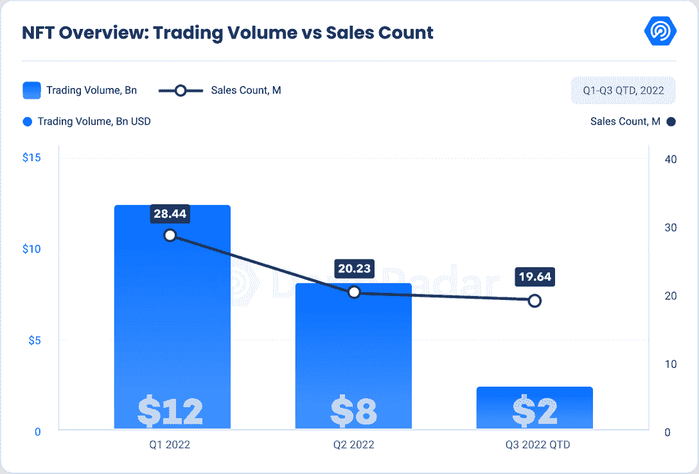

Source: [DappRadar](https://web.archive.org/web/20221101162127/https://dappradar.com/industry-overview)

第二季度经历的高度经济不确定性和加密事件的影响导致第三季度的总交易量急剧下降 75%，同期仅产生 25 亿美元。然而，看看销售计数等链上指标，以及亿万富翁行业的采用率上升，很明显对 NFT 的需求是稳定的。事实上，第三季度比上一季度增长了 6%。

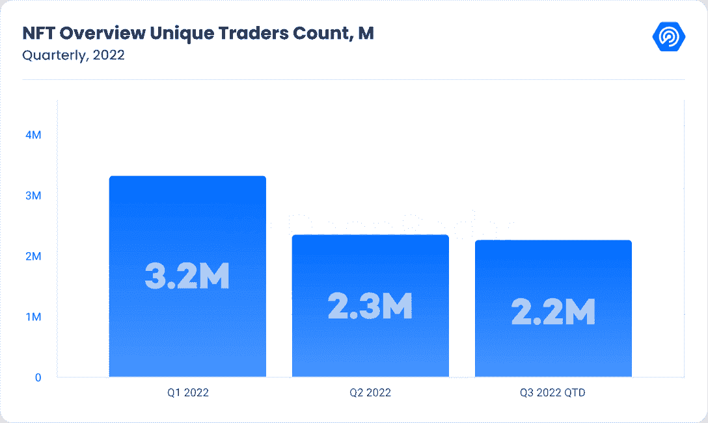

Source: [DappRadar](https://web.archive.org/web/20221101162127/https://dappradar.com/industry-overview)

即使 NFT 交易量大幅下降，独立交易者的数量仍保持在正水平，超过 220 万。更重要的是，与去年第三季度相比，增长了 36%。

[Discover NFT Collections](https://web.archive.org/web/20221101162127/https://dappradar.com/hub/nft-explorer)

虽然“鲸鱼”，即拥有大量投资组合的投资者，可能会继续推动惊人的行业销售，但新买家数量的增加表明，对 NFT 好奇的人正在对这一创新资产类别产生兴趣。

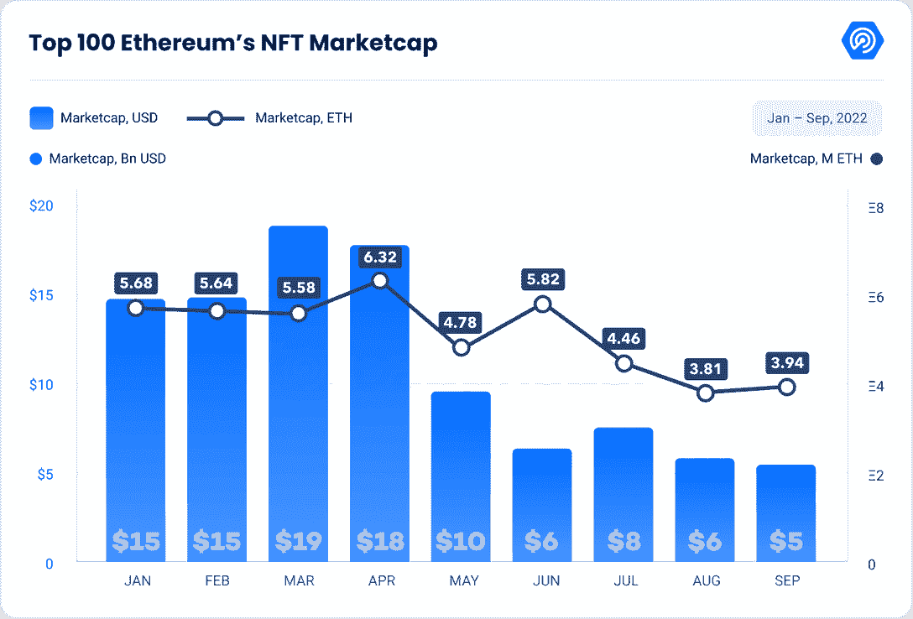

Source: [DappRadar](https://web.archive.org/web/20221101162127/https://dappradar.com/industry-overview)

此外，有理由相信，与艺术类似，非艺术信托可以成为一种能够适当储存价值的资产类别。第三季度，由于以太坊价格下降了 31%，但以太坊的价值仅下降了 27%(1221 万 ETH)，因此前 100 名以太坊美元的价值比上一季度下降了 44%(190 亿美元)。

[Explore NFT Rankings](https://web.archive.org/web/20221101162127/https://dappradar.com/nft)

然而，从 ETH 的角度来看市值数据，我们可以看到 NFT 是如何成为可以正确存储价值的资产的。即使在熊市中，自 5 月 Terra 崩溃以来，排名前 100 位的以太坊 NFT 藏品以美元计仅损失了 50%(50 亿美元)，而以太坊仅损失了 17%(394 万美元)。

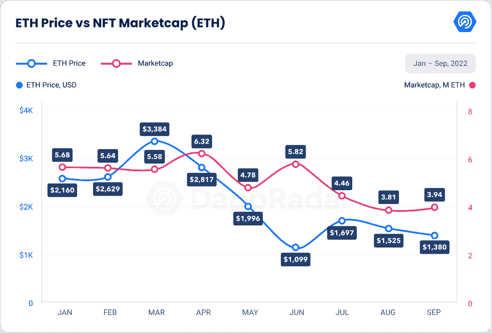

Source: [DappRadar](https://web.archive.org/web/20221101162127/https://dappradar.com/industry-overview)

与此同时，我们正在目睹熊市期间交易活动的高度集中。深入分析 NFT 类别，大多数交易活动都集中在一个层级，也称为蓝筹股，即成功保持其价值的非上市公司。

## 收藏品

毫无疑问，从金融角度来看，收藏品市场仍然占据主导地位。对于收藏品，我们理解任何类型的 NFT，除了虚拟世界和元宇宙项目中的数字地块，以及 1/1 艺术品。

在 Q1 2022 年，总交易量超过 90 亿美元，来自 1980 万笔 NFT 交易。在第二季度，由于充满挑战的宏观形势和 crypto 最大的生态系统之一的崩溃，NFT 交易总量下降了 49.5%(50 亿美元)。第三季度总交易额为 7.13 亿美元，环比下降 84%，为 Q1 2021 年以来最低季度。值得一提的是，52%的收藏品市场是由头像构成的。

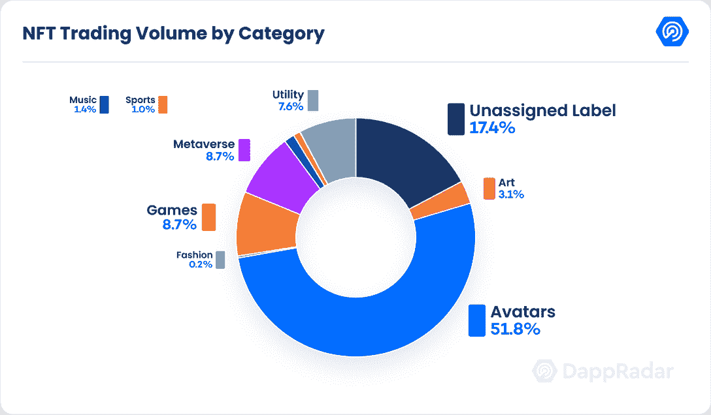

Source: [DappRadar](https://web.archive.org/web/20221101162127/https://dappradar.com/industry-overview)

DappRadar Ethereum 跟踪的 50 多个区块链仍然是交易量最大的网络。在第三季度，连锁店占总交易量的 91%(6 . 45 亿美元)。以太坊仍然是最有价值的 NFT 资产和创新市场及聚合商(如 OpenSea、X2Y2、Gem 等)的主机链的领先市场。

[Discover NFT Sales](https://web.archive.org/web/20221101162127/https://dappradar.com/nft/sales)

尽管与 2021 年第三季度相比，交易量下降了 93%，但今年售出的最昂贵的 NFT 是创纪录的 8,000 ETH(约 2370 万美元)的 [CryptoPunk #5822](https://web.archive.org/web/20221101162127/https://dappradar.com/hub/assets/eth/0xb47e3cd837ddf8e4c57f05d70ab865de6e193bbb/5822) 。这次拍卖是 NFT 有史以来最大的一次购买。它被 Chain 的首席执行官 Deepak Thapliyal 收购，他在区块链以太坊的名字是 Deepak.eth。

[<picture>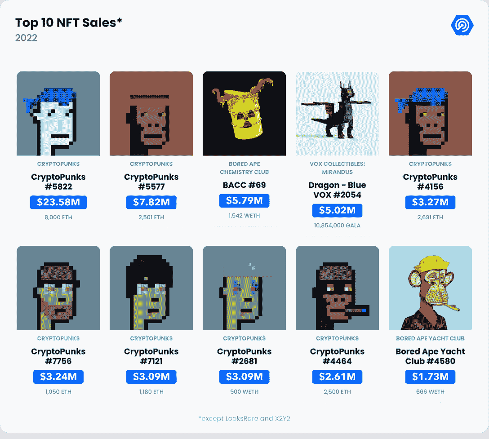</picture>](https://web.archive.org/web/20221101162127/https://dappradar.com/hub/nft-explorer)

其次是流量 2.54%，浪人 2.53%。流程链中的 NBA 和 NFL 市场，以及 Axie NFTs 推动了这些网络中的价值。此外，值得注意的是，ImmutableX 的总交易量比上一季度增长了 87%，是今年唯一有所增长的区块链。

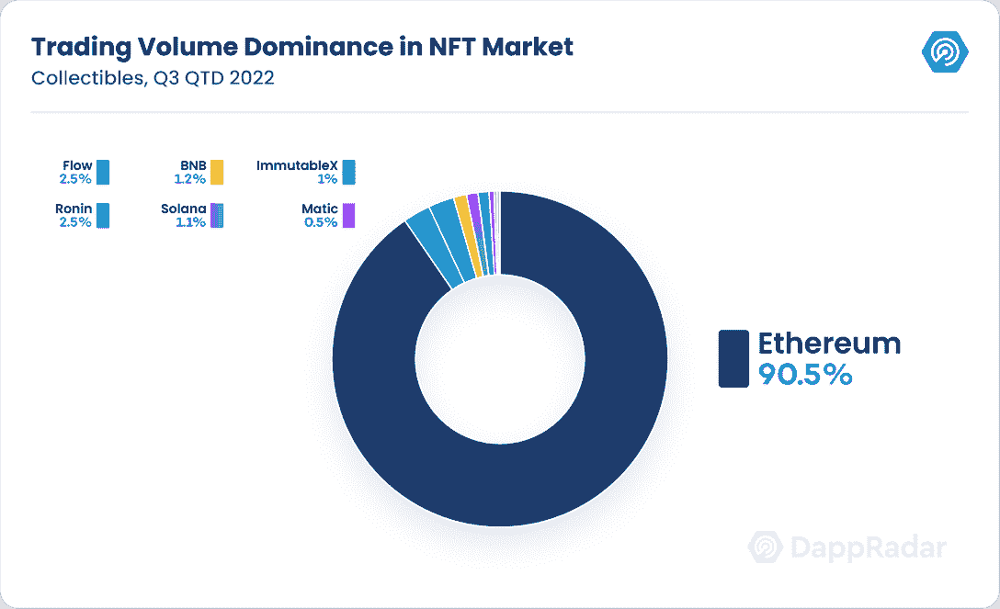

Source: [DappRadar](https://web.archive.org/web/20221101162127/https://dappradar.com/industry-overview)

从第三季度的销售额来看，情况有所不同，以太坊仍然是主要的连锁店，但仅占总销售额的 26.22%。总交易的市场份额和交易量之间的差异令人印象深刻。很明显，以太坊拥有高端收藏品，有助于[百万富翁的销售](https://web.archive.org/web/20221101162127/https://dappradar.com/nft/sales)。

另一方面，Web3 游戏和 GameFi dapps 中丰富的缩放解决方案如 immutable x(23.12%)和 Ronin(18.81%)被确认为 NFTs 的主要市场。

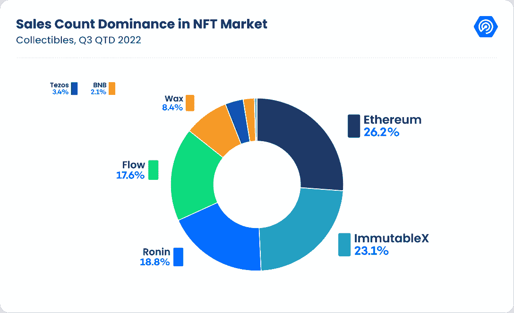

Source: [DappRadar](https://web.archive.org/web/20221101162127/https://dappradar.com/industry-overview)

## 蓝筹股集合

BAYC 和 CryptoPunks 等阿凡达 NFT 系列是去年这些资产第一轮炒作背后的主要驱动力。但并不是所有的项目都应该被视为顶级项目。

我们了解蓝筹系列，这些项目不仅价值不菲，而且由 web3 brands 领导的项目为市场注入了真正的效用，并在项目使命背后培养了一个真正的社区。

在以太坊区块链上，没有两个 NFT 是完全相同的，每个都可以由一个人持有。这一类的“俱乐部”头像还有好几个，每天都有新的推出。

排名前 11 的蓝筹股集合由宇迦实验室拥有的四个项目主导:CryptoPunks、Bored Ape Yacht Club (BAYC)、Otherside 的 Otherdeeds 和 variant Ape Yacht Club(MAYC)，它们在第二季度产生了超过 2.37 亿美元的交易量。

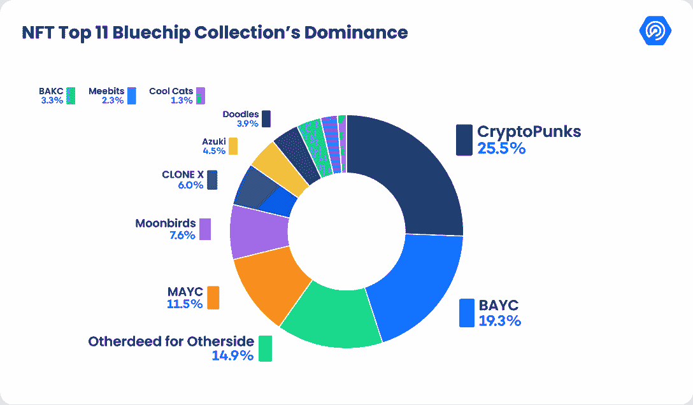

Source: [DappRadar](https://web.archive.org/web/20221101162127/https://dappradar.com/industry-overview)

前 11 大蓝筹股集合在第三季度的交易量下降了 88%，达到 3.34 亿美元以上，几乎与 2021 年第二季度的交易量持平。

事实上，当我们看到 6 月份的交易量(2 . 03 亿美元)比 5 月份(12 亿美元)下降了 83%。Terra 的崩溃导致了加密市场的流动性紧缩，这是交易量下降的主要原因。

即使总交易量下降，当我们查看前 11 名蓝筹股集合的底价时，它也没有下降，但它几乎保持了与 Terra 崩溃前相同的价值。

[Get NFT Value Estimations](https://web.archive.org/web/20221101162127/https://dappradar.com/hub/nft-value-estimator)

从 9 月份 11 大蓝筹股集合的地板价格数据来看，志那都红豆较上月上涨 43.18% (11.44 ETH)，其次是酷猫，涨幅为 15.83% (2.78 ETH)。

另一方面，宇迦的四个项目，除了变种人 Ape 游艇会较 8 月上涨 2.14% (14.30 ETH)之外，均出现了楼面价的下降。与 8 月份相比，CryptoPunks 下降了 5.19% (63.95 ETH)，Bored Ape 游艇俱乐部下降了 7.36% (73 ETH)，而 Otherdeed 仅下降了 0.57%..

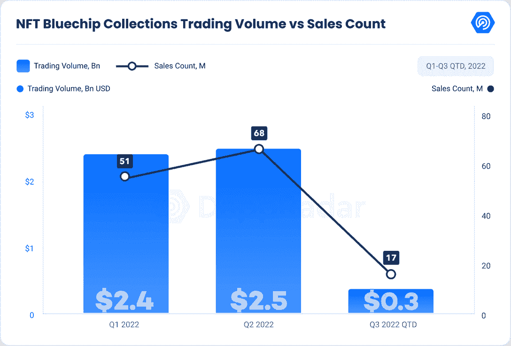

Source: [DappRadar](https://web.archive.org/web/20221101162127/https://dappradar.com/industry-overview)

由于这些收藏品不仅仅是数字收藏品，它们的优势是相当可观的。这些头像收藏象征着一张通行证，成为每个人的身份。

一个在社区眼里变得排外的人。人们使用这些头像作为他们在社交网络平台上的个人资料图片。人们使用这些头像来感觉他们属于一个俱乐部。

这些团体的“成员”真正相互支持和追随。通过拥有这些代币来反映的这些俱乐部的会员资格是唯一的，提供了有形的价值，并且增强了个人的数字身份。

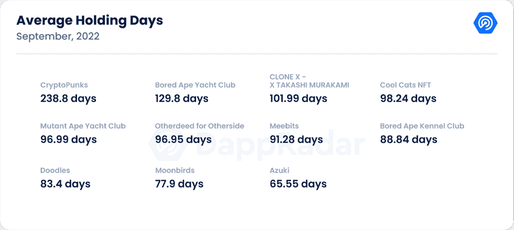

Source: [DappRadar](https://web.archive.org/web/20221101162127/https://dappradar.com/industry-overview)

出于上述原因，这些集合的平均持有天数非常重要，因为它显示了交易者如何选择不为短期利润而抛售 NFT。

CryptoPunks 排名第一，持有天数为 239 天，其次是 BAYC，持有天数为 129.8 天。变异猿游艇俱乐部和 Otherdeed for Otherside 的平均持有天数相同。在所谓的蓝筹股集合中，志那都红豆是交易最频繁的。

或许是由于围绕其创始人的声誉问题，志那都红豆被更多地视为投资工具，而不是所有者长期持有的忠诚收藏品。

### 数字艺术

除了头像之外，包含不可替代令牌的数字艺术市场也在蓬勃发展，自 2021 年 1 月以来，销售额超过 450 万，总交易额超过 30 亿美元。

据说，艺术收藏家在新冠肺炎疫情期间难以实际获得艺术品，这在一定程度上促成了该市场在 2021 年的显著增长，这种增长也持续到了 2022 年。像 Beeple，Pak，Fewocious 和其他几位艺术家是将非传统艺术带给主流观众的主要贡献者。

使用机器学习算法创造独特设计的艺术。艺术块和自动摄影仪等收藏品围绕随机生成的艺术发起了一场强大的运动。Ringers、Fidenza 或 Chromie Squiggles 等收藏品经常出现在高端 NFT 交易中。

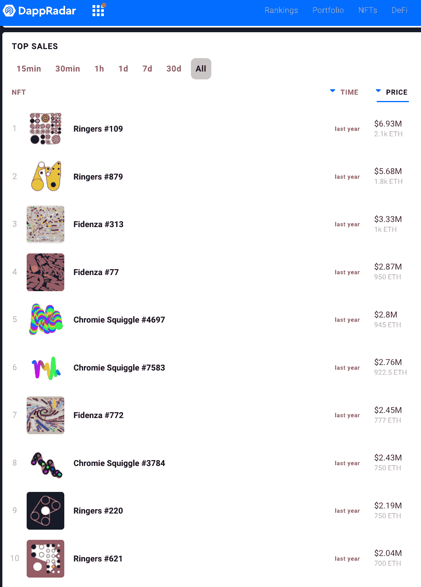

Source: [DappRadar](https://web.archive.org/web/20221101162127/https://dappradar.com/industry-overview)

2022 年第一季度的整个交易量超过了 3 亿美元，销售额为 66.6 万美元。在第二季度，整体贸易额暴跌 30%，至 2.15 亿美元，而销售数量减少 32%。第三季度，整体贸易额为 5900 万美元，比上一季度减少 72%。销售数量比上一季度减少 43%，为 25.8 万辆。

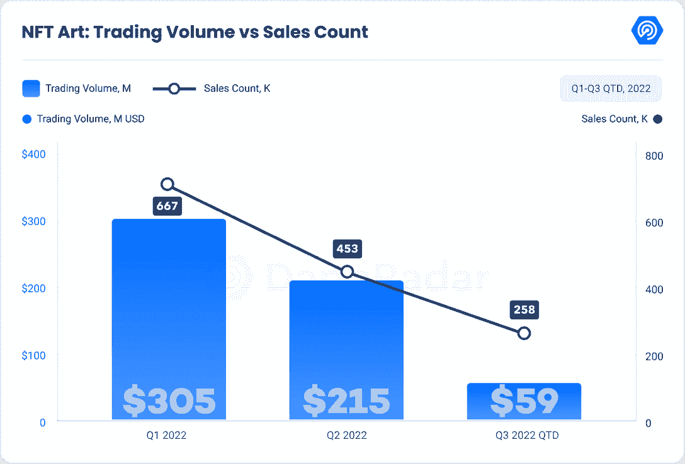

尽管交易量和销售数量自年初以来大幅下降，但数字艺术行业仍在扩张。今年，当代艺术机构开始收购以非艺术形式生产的艺术品。

最近的例子是纽约现代艺术博物馆最近出售了 29 件艺术品，其中包括毕加索、培根和雷诺阿等人的作品。此次拍卖预计将超过 7000 万美元，并将用于购买可能用于数字化展示博物馆的 NFTs。

### 赌博

区块链游戏市场(GameFi)价值超过 86 亿美元，8 月份注册的每日独立活跃钱包(UAW)为 847，000 个，预计未来几年将呈指数级增长。

众多基于区块链的流行游戏，如 [Axie Infinity](https://web.archive.org/web/20221101162127/https://dappradar.com/multichain/games/axie-infinity) 、 [Gods Unchained](https://web.archive.org/web/20221101162127/https://dappradar.com/multichain/games/gods-unchained) 和 [Aavegotchi](https://web.archive.org/web/20221101162127/https://dappradar.com/polygon/games/aavegotchi) ，都使用 NFTs 进行角色扮演。此外，主要的游戏公司，如育碧，已经将 NFT 整合到他们更传统的游戏设计中。

然而，传统的游戏社区并没有普遍欢迎 NFTs 的到来。EA Games、Mojang Studios 和 Team 是游戏公司为了应对用户反弹而放弃在游戏中使用 NFT 的三个例子。

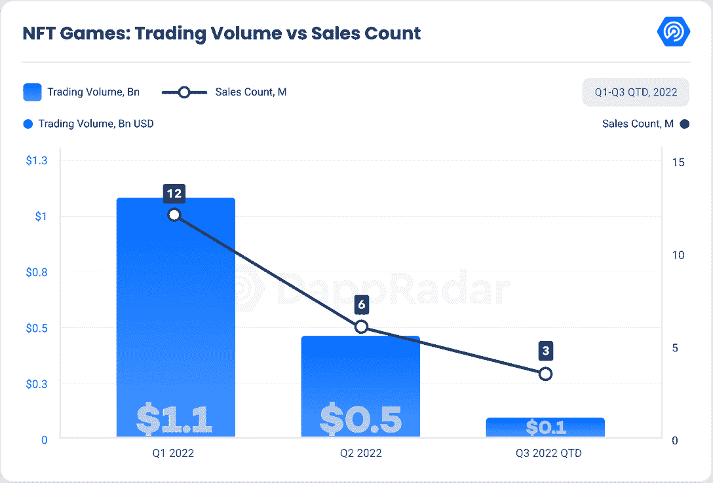

Source: [DappRadar](https://web.archive.org/web/20221101162127/https://dappradar.com/industry-overview)

2022 年第一季度，博彩不可替代代币的总交易量超过 10 亿美元。在第二季度，交易量下降了 53%，在第三季度为 7100 万美元，下降了 84%。查看销售计数，我们可以观察到相同的模式；在 Q1，它的销量接近 1200 万部，然后在 Q2 下降到 600 万部，下降了 50%，第三季度为 330 万部。

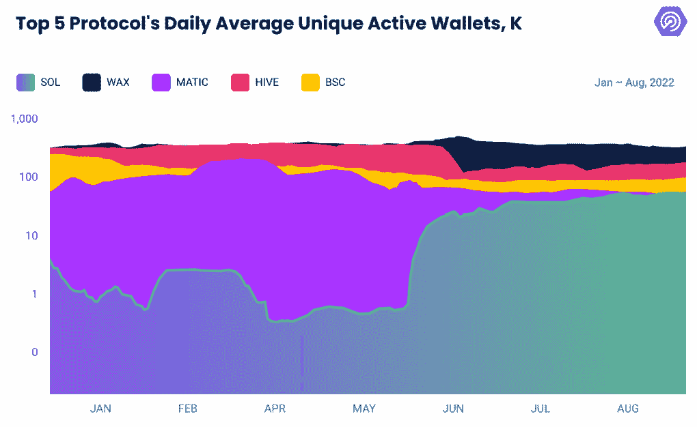

Source: [DappRadar](https://web.archive.org/web/20221101162127/https://dappradar.com/industry-overview)

与 7 月份相比，领先的 protocol Wax 在 8 月份注册的独立活跃钱包的日均数量下降了 8%。尽管如此，40%的游戏活动发生在蜡上。Hive 是区块链第二大博彩公司，也是 Splinterlands 的所在地，8 月份其平均每日无人机数量环比增长 12%，达到 169，043 架。(妈妈)。

同样，BNB 连锁店的 UAW 日均交易量从一个月到下一个月增加了 8%，超过了 92，000 笔。索拉纳继续扩张，月环比增长 21%。

即使今年的总交易量和销售额大幅下降，我们仍然不得不考虑对区块链游戏的投资总额超过 40 亿美元，正如我们最新的 BGA 游戏报告中所分析的那样。

### 时尚和奢华

不可替代代币的技术正被应用到时尚产品中，以丰富产品系列并促进消费者互动。时尚界的第一批 NFT 实验之一发生在鞋类市场，当时 RTFKT 工作室推出了他们自己的一双品牌虚拟运动鞋。

工作室开始与数字艺术家 Fewocious 合作，创作了一套限量版的 600 双 NFT 鞋，并配有两个独立的商品胶囊。几个月后，当宣布与耐克的合作时，web3 品牌震惊了世界。这家合资企业立即成为一个元宇宙品牌。

这个例子说明了 NFTs 的传播是如何在设计和时尚产业中复兴“排他性”的概念的。事实上，正如 NFTs 的描述所暗示的(“不可替代”意味着“不可替代”)，NFT 是一个独特的数字元素，只反映它所联系的事物。

区块链追踪机制保护了它的独特性，因此，每一件 NFT 都是同类中唯一的艺术品。即使数字文件 NFT 可以被复制和拷贝，NFT 的“签名”总是将它识别为原始作品，并且因此被识别为是由单个“注册”作者创建的。

甚至传统上缓慢接受技术的公司也开始重视这项创新:2021 年 3 月，古驰发布了一款名为“古驰虚拟 22”的虚拟鞋今年早些时候，它推出了 SuperGucci 系列，并与 web3 品牌 10ktf 合作。

这种倾向甚至已经迁移到了游戏平台，比如英雄联盟和路易威登的合作。博柏利是另一个例子。这家英国时尚巨头为 web3 游戏平台 Blankos 提供游戏内可穿戴 NFTs。此外，move-to-earn 的兴起让 Asics 和 New Balance 等鞋类品牌处于有趣的位置。

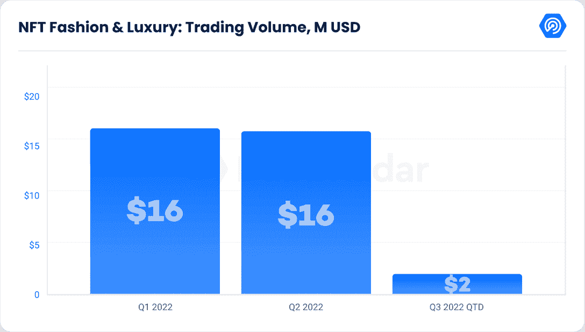

今年第一季度，与时尚相关的 NFT 交易总额超过 1600 万美元。在 Q2，超过 1500 万美元，但在 5 月，总交易量急剧下降，8 月是总交易量低于 50 万的第一个月。截至目前，第三季度比上一季度下降了 89%。

即使交易量和销售额有所下降，对时尚和奢侈品 NFT 的需求仍然是最强劲的用例之一，正如最近 NFTiff 系列所显示的那样。

该系列由蒂芙尼公司创作，由 250 枚 NFT 组成，将被转化为可穿戴的奢华珠宝，以 CryptoPunks 为主题。薄荷价格为 30 ETH(5 万美元)，在 20 分钟内销售一空，为公司创造了 1250 万美元的收入。

### 运动

事实证明，体育、游戏和科技的结合卓有成效。事实上，如果反对新冠肺炎传播的规则影响了球迷的社区层面，从根本上改变了他们的体验，使其更加个人化，那么参与游戏的概念——与使之成为可能的技术密不可分——恢复了与体育关系的社区层面。

随着 NFT 的出现，光学有了全新的含义，各种想法层出不穷。体育组织可以利用 NFT 来建立社区——只要超越我们以前所理解的思路。

许多足球联盟和其他体育现实已经考虑到这一点，并正在朝着这个方向发展:不仅是足球，还有棒球和篮球，正在加入 NFT 的领域，带来了庞大的球迷群体，他们只是在等待新的互动形式。

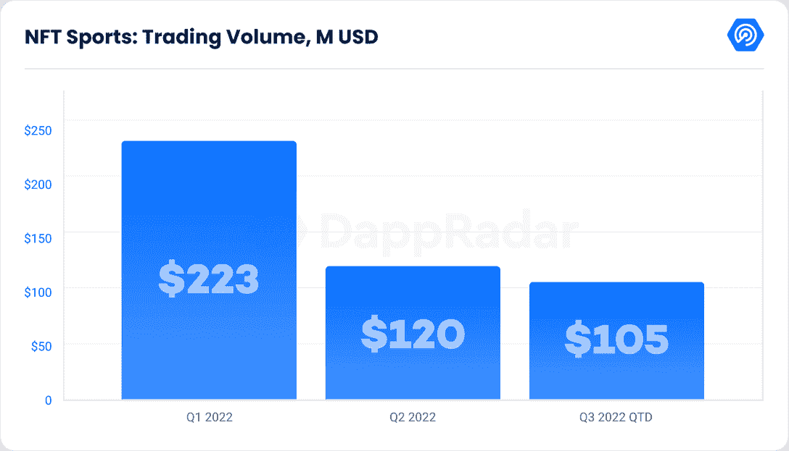

在 Sorare 和 NBA Top Shot 的带领下，体育 NFTs 在 Q1 期间从超过 400 万笔交易中产生了 1.28 亿美元的交易。然而，随着行业趋势，Q2 的销量下降了 63%,而销售额下降了 54%。第三季度的总交易额超过 1800 万美元，比上一季度又下降了 61%，销售额为 100 万美元，其中 47%来自 Q2。

尽管如此，体育界仍有望成为非体育赛事最活跃的市场之一。索拉雷将受益于世界杯的炒作。Flow 的 NBA 和 NFL 市场已经显示出稳定发展的迹象。

与此同时，Chiliz 很快将推出其 mainet，希望提高其粉丝令牌的效用和分发。像汤姆·布拉迪的亲笔签名这样的平台也可以吸引数百万现实生活中的体育收藏者。

## 额外收获:以太坊的合并对 NFTs 的影响

以太坊经历了加密史上最关键的事件之一。福图，看起来现阶段一切都按计划进行，以太坊的 NFT 运行正常。

它们将继续留在你的钱包里，在市场上正常运行，合并后你不需要采取任何行动。所有这些都由开发人员处理，希望能促进平稳过渡。

以太坊基金会预测，利害关系证明共识机制将比目前的工作证明共识方法消耗少 99%以上的能量。这是以太坊，尤其是 NFTs 的一个重大进步，成功地反驳了一个最常见的 NFT 异议。

第一个 NFT 造币厂在 26 分钟后完成了合并，这是一个带有标志性熊猫脸的时间胶囊。很快以 36 以太坊的价格购得。

在第一个 NFT 铸造和销售的消息浮出水面后，新的区块链操作系统见证了第一次收集的雪崩。Bloom 的创造者 Sheldon Evans 在推特上说，该公司开发了第一个在 PoS 网络上铸造的官方 NFT 系列。

虽然以太坊社区的大多数人似乎支持合并及其潜在优势，但也存在值得注意的反对者。一些以太坊倡导者不希望网络放弃工作证明挖掘，要么是因为能源密集型过程的安全优势，要么是因为操作计算机钻机的矿工获得的激励。

因此，以太坊社区中的一些开发人员拆分了区块链，创建了一个新的链，继续使用现有的工作证明机制。到目前为止，最著名的例子是 ETHPOW，由著名的中国矿工钱德勒·郭(Chandler Guo)领导。

以太网将不等同于以太坊的联合主网。这将与以太坊在 2016 年从其原始链中分离出来以应对 DAO 违规事件的后果类似，一些用户继续以以太坊经典为名支持旧链。然而，从那时起，发生了很大的变化，出现了更多的资产，包括 NFT。

随着 ETHPOW 和其他分支从以太坊主网上脱离，它们产生了以太坊 NFT 的副本。NFT 只是区块链的象征，可以作为艺术品和收藏品等数字资产所有权的证明。因此，一个分支以太坊链将包含指向同一件艺术品或媒体的多个契约。

在合并的准备阶段，有人讨论了“重放攻击”的可能性；也就是说，在工作证明以太坊分割上执行的交易可以在利害关系证明以太坊主网上“重放”。

在这种假设的情况下，无聊的 Ape 游艇俱乐部 NFT 所有者可以在工作证明链上销售复制版本，但是如果同一交易被恶意行为者在合并的利益证明链上“重放”,卖方也可能在该链上丢失原始版本。对于一些 NFT 收藏家来说，这可能是一个非常昂贵的教训。

随着 ETHPOW 的出现，最重要的工作证明拆分，这些事情都不太可能发生。只有当区块链共享相同的链 ID 时，重放攻击才是可行的，并且 ETHPOW 已经验证了它们将使用唯一的链 ID。

对于从以太坊分叉出来的其他工作证明链来说，这可能不是真的，这为跨链无政府状态的可能性打开了大门。

## 
结论

虽然没有人能够准确预测全球加密货币市场及其组成部分(如不可替代的代币)的未来，但预计 NFT 市场将继续由众多市场参与者扩大。Solana、Flow 和 Tezos 等区块链公司经常被认为是在游戏、娱乐和令牌化行业不知疲倦地推进 NFT 部署的主要网络。

值得一提的是，许多品牌正在采用 NFT 技术，Ticketmaster 刚刚与 Flow 建立了合作伙伴关系，以发行附在门票上的 NFT，Starbuck 刚刚推出了“Starbucks Odyssey”体验，该体验为会员提供赚取和购买数字收藏邮票(NFT)的能力，这些邮票将解锁新的沉浸式咖啡体验。

NFT 的监管环境是新技术带来的新前景的绿洲。然而，政策制定者越来越意识到与这些可能性相关的问题，如知识产权、消费者保护和洗钱。计划探索这种新环境的企业应该认识到对治理机构控制其内部活动的需求日益增长。

对 NFT 市场的预测似乎很乐观，该市场 2021 年的销售额约为 250 亿美元。尽管在利率和通胀因素不确定、战争和全球冲突持续以及其他因素影响市场的时候，所有市场都在经历更高的波动性，但无论发生什么样的波动，非金融交易及其基础市场都表现出持续的强烈迹象。