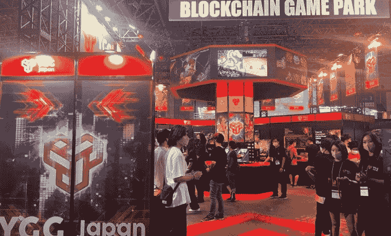
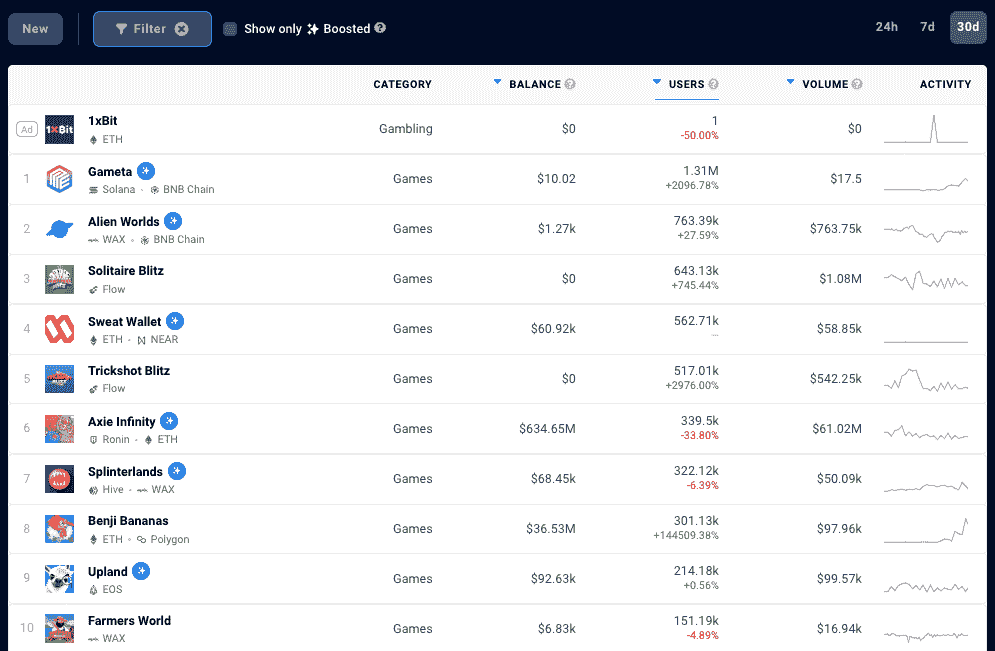

# NFT 的憎恨者不会阻止万代和 SEGA 拥抱区块链游戏

> 原文：<https://web.archive.org/web/https://dappradar.com/blog/nft-haters-wont-stop-bandai-sega-from-embracing-blockchain-gaming>

## 憎恨者会去憎恨，而玩家会去玩

总部位于日本的游戏巨头世嘉、万代和 Square Enix 致力于让区块链游戏成为规范的未来——在最近的一次采访中宣布，一小部分对非功能性桌面游戏表现出抵触的游戏玩家不会阻止游戏行业拥抱区块链技术。

2022 年，融入 NFT 的区块链游戏将推动[创纪录的用户数量](/web/20220928131105/https://dappradar.com/blog/dappradar-x-bga-blockchain-games-report-7/)进入[区块链应用](/web/20220928131105/https://dappradar.com/blog/what-are-dapps/)。然而，随着传统游戏公司关注这一领域，他们也希望修复他们眼中的破碎模式，这种模式更依赖于投机投资者，而不是享受有趣游戏的玩家。

该声明来自 Oasys 的代表 Ryo Matsubara，他在 2022 年东京游戏展上强调，该项目的大牌合作伙伴，如 Bandai Namco，Sega 和 [Square Enix](/web/20220928131105/https://dappradar.com/blog/square-enix-dungeon-siege-the-sandbox-metaverse/) ，不会加入 [crypto](https://web.archive.org/web/20220928131105/https://dappradar.com/hub/tokens/ethereum/all/) 的潮流。区块链的游戏有一个长期的愿景。

Bandai Namco 开发了 Tekken 和 Pac-Man 等游戏，是一家日本跨国玩具制造商和分销商。他们的参与很有趣，因为他们带来了游戏和物流专业知识。

相比之下，世嘉最著名的游戏通常被视为刺猬索尼克。与此同时，Square Enix 是 1987 年开始的顶级《最终幻想》系列游戏[的开发商。](https://web.archive.org/web/20220928131105/https://en.wikipedia.org/wiki/Final_Fantasy)

## 聚焦区块链奥运会

东京游戏展是世界上最受欢迎的电子游戏活动之一，由于 Covid 19 的限制，在中断三年后，今年重返日本。它带着对[即玩即赚区块链游戏的巨大关注强势回归。](/web/20220928131105/https://dappradar.com/blog/the-ultimate-guide-to-playing-games-earning-crypto/)此外，区块链博彩趋势成为该领域最重要的事件，该领域正处于休整期。

此外，区块链游戏在这三年里已经从纯粹的玩赚模式发展到玩赚模式。现在的目标是让 web3 游戏变得有趣和刺激，这样代币奖励就不再是玩游戏的唯一动机。

***Dedicated Blockchain Gaming area in Tokyo Game Show 2022***

对新的“玩即赚”游戏的投资创下历史新高，同时玩这些游戏的活跃用户数量以疯狂的速度激增(T2)。[来自 DappRadar 和区块链游戏联盟](/web/20220928131105/https://dappradar.com/blog/dappradar-x-bga-blockchain-games-report-7/)的数据也显示，尽管加密市场遭遇重大挫折，但该行业仍然非常乐观。

## 投机与游戏性

在过去一年左右的时间里，对区块链游戏的一个批评是，开发者没有足够重视令牌模型。他们正在创造一种局面，使游戏几乎完全依赖游戏内交易和 NFT 销售来进一步发展和增长。

虽然推出了无数模式破碎、更关注收入的游戏，但也有一些[辉煌的例子说明，当乐趣成为一个项目的核心时，事情会运转得多么好。](/web/20220928131105/https://dappradar.com/blog/top-5-simple-play-to-earn-games/)

同样重要的是，这些品牌要用新的眼光来看待融入了 NFT 元素的区块链游戏，而不是简单地依赖区块链现有的热门 IP。此外，这种全新的游戏模式需要更多的时间来成熟，然后大公司才会考虑与传统游戏的整合，并冒险使用现有的 IP。

有趣的是， [DappRadar 在 40 多个区块链追踪了 1180 场区块链比赛。使用过滤器，可以看到哪些在过去 30 天内吸引了超过 1000 名用户。](https://web.archive.org/web/20220928131105/https://dappradar.com/rankings/category/games) [117 款 dapp 游戏](https://web.archive.org/web/20220928131105/https://dappradar.com/rankings/category/games/1?greaterUser=1000)，或者说 10%左右，在 [1880 款游戏中达到了这个数字。](https://web.archive.org/web/20220928131105/https://dappradar.com/rankings/category/games/1)

留住人才是一个问题。善变的用户从一个机会跳到下一个机会，让人想起用户在 DeFi T1 的夏天的行为。

放眼海外，堡垒之夜的开发商 Epic Games 等主要西方游戏公司已经增加了对区块链游戏的投资，上周，神话游戏公司(Mythical Games)推出了一款新的免费游戏，名为 Blankos Block Party，其中融入了 NFT 元素。

此前，Epic Games 首席执行官蒂姆·斯维尼在 7 月份表示，他的公司“肯定”不会效仿微软的《我的世界》禁止游戏中的 NFT 集成。

## 来自游戏玩家的回扣

传统游戏玩家对非功能性游戏有很大的反感，而对于那些对游戏不那么着迷的人来说，非功能性游戏就是有意义的。对于这位作家来说，拥有和交易游戏中的物品的想法是合乎逻辑的，但显然，游戏玩家并不热衷于此。

一个原因可能是传统的游戏公司倾向于垄断他们的玩家，并将他们限制在紧密的经济循环中，旨在将资金保留在他们的生态系统中。众所周知，游戏玩家抱怨访问游戏和完成游戏或任务所需的不同付费资产和升级的成本不断增加。

此外，我们今天看到的区块链游戏的模型是在过去几年中出现的，而像世嘉和 Square Enix 这样的游戏巨头已经制作游戏几十年了。这两个群体需要考虑把玩是为了赚钱和玩是为了娱乐结合起来。

## 玩得开心

一家专注于开发和发行有趣游戏的公司是 Kongregate。Kongregate 成立于 2006 年，作为一个网页游戏目的地，其愿景是为独立游戏创建一个开放的平台，以促进社区的发展。

Kongregate 在构建、分发和开发桌面和移动游戏方面拥有超过 15 年的经验，可以通过其专用门户网站托管和发布游戏。

他们的最新作品 [BitVerse](/web/20220928131105/https://dappradar.com/blog/dappradar-x-bga-games-report-q2-2022/) 是一个 NFT 游戏世界，由几个游戏组成，围绕着居住在其中的独特的 NFT 角色，BitVerse 英雄，玩家可以定制，升级，并以许多不同的方式互动。

***加入 Ian，他将向来自 Kongregate 的团队介绍区块链游戏、NFTs 等更多内容！***

[https://web.archive.org/web/20220928131105if_/https://www.youtube.com/embed/qNONR1CuFBI?feature=oembed](https://web.archive.org/web/20220928131105if_/https://www.youtube.com/embed/qNONR1CuFBI?feature=oembed)

***以上不构成投资建议。此处给出的信息仅供参考。请行使尽职调查，做你的研究。作者持有多种加密货币的头寸，包括 BTC、瑞士法郎和雷达。***