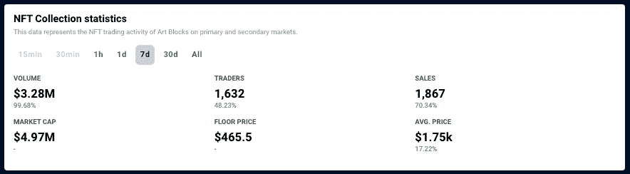
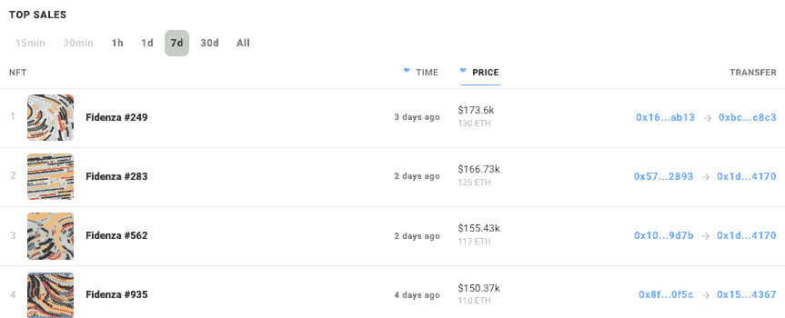
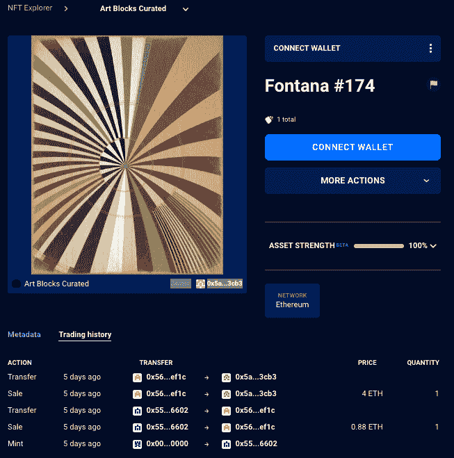
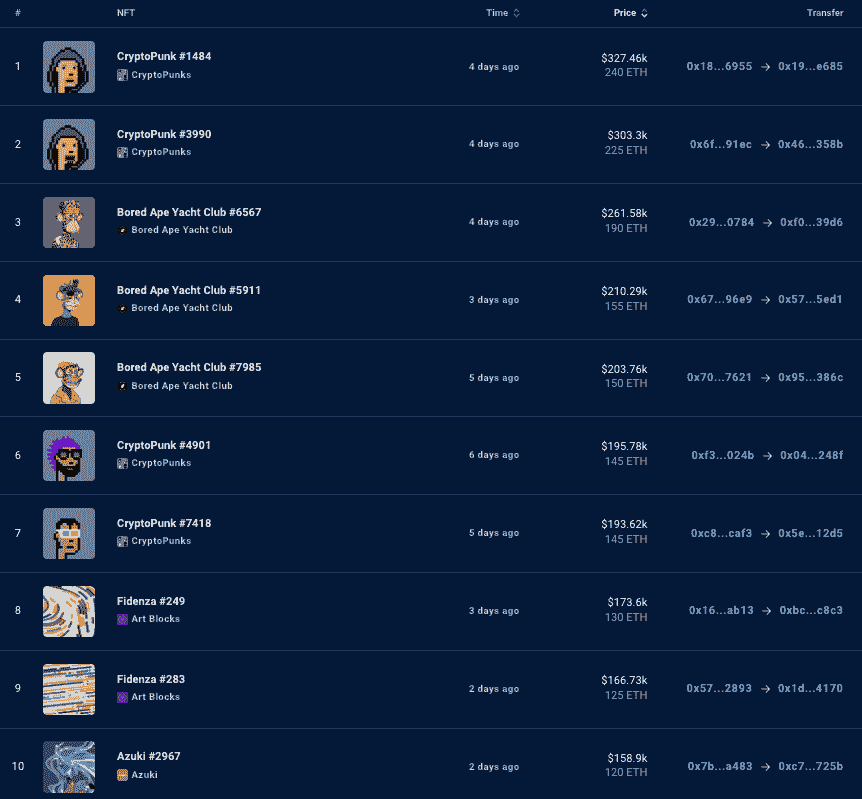
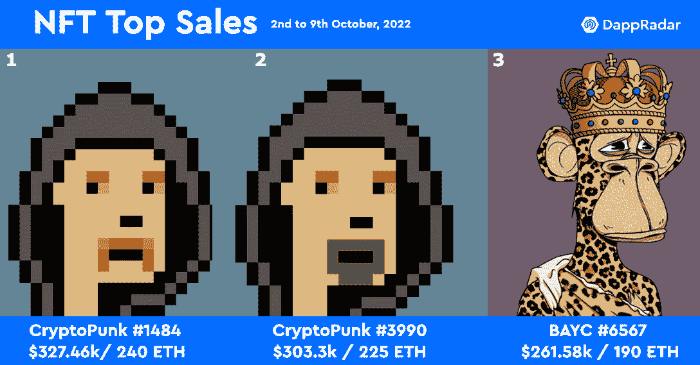

# NFT 亮点——艺术板块策划的丰塔纳系列发布会销售额跃升 70%

> 原文：<https://web.archive.org/web/https://dappradar.com/blog/nft-highlights-art-blocks-curated-sales-leap-70-on-fontana-collection-launch>

## 查看 2022 年 10 月 2 日至 9 日期间的 NFT 销售亮点排名。

Crypto art platform Art Blocks 迎来了丰收的一周，Fontana 是一个由 500 件生殖艺术作品组成的策展收藏，可用于 mint。艺术品交易平台上的交易者数量激增了 45%以上，销售额跃升了 70%以上，在之前的七天里，NFT 的交易量超过了 320 万美元。

[上周 NFT](https://web.archive.org/web/20221202122027/https://dappradar.com/nft/sales) 销售额最高的 15 件艺术品中有 4 件属于[艺术品](https://web.archive.org/web/20221202122027/https://dappradar.com/hub/nft-explorer/collection/art-blocks-curated/sales-activity?period=week)，特别是菲登扎系列的非艺术作品，其总价值超过 63 万美元。[其中一名买家](https://web.archive.org/web/20221202122027/https://dappradar.com/hub/wallet/eth/0x1da5331994e781ab0e2af9f85bfce2037a514170/nfts/1/art-blocks-curated)已经拥有了一个铬黄色的曲线，但现在又增加了两个 Fidneza，将这个钱包的艺术块的 NFT 估价提高到 43.5 万美元以上。

有两种类型的 NFT 下降对艺术块，策划和提出的艺术块。Fidenza 等精选系列价值最高。 [Fontana 是艺术家 Harvey Reyner 的新策展系列](https://web.archive.org/web/20221202122027/https://dappradar.com/hub/nft-explorer/collection/art-blocks-curated),它以 4.0 ETH 的价格开始荷兰式拍卖，直到以 0.47 ETH 的最终价格售出全部 500 NFTs。

一件丰塔纳 NFT 艺术品在二级市场上的平均价格约为 1.3 ETH，自 10 月 5 日推出以来，该系列已经产生了 650 ETH 的交易量。

在写作上转手最贵的是 [Fontana #174](https://web.archive.org/web/20221202122027/https://dappradar.com/hub/assets/eth/0xa7d8d9ef8d8ce8992df33d8b8cf4aebabd5bd270/367000174) ，五天前以 4 ETH 的价格售出，约合 5390 美元，之前铸造价格为 0.8 ETH。[买家](https://web.archive.org/web/20221202122027/https://dappradar.com/hub/wallet/eth/0x5a77b2d05afb67eacd8f9c7e98692dd1e2883cb3/nfts/1/art-blocks-curated)是加密艺术和艺术块的忠实信徒，[持有 234 个独立的艺术块 NFT](https://web.archive.org/web/20221202122027/https://dappradar.com/hub/wallet/eth/0x5a77b2d05afb67eacd8f9c7e98692dd1e2883cb3/nfts/1/art-blocks-curated)，总估价约为 67 万美元。

在经历了一个有些压抑的开端后，生成性密码艺术肯定会引起人们的注意。有没有可能，曾经贪婪的 NFT 头像交易者正把注意力转向 NFT 艺术品，这些艺术品看起来很棒，以独特的艺术形式为持有者提供真正的价值？

[数据会与](https://web.archive.org/web/20221202122027/https://dappradar.com/nft/collections)一致，因为在过去 30 天里，艺术品板块产生了超过 950 万美元的交易量，这使其超过了领先的 NFT 收藏，如[志那都红豆、Axie Infinity、Moonbirds 和 Doodles。](https://web.archive.org/web/20221202122027/https://dappradar.com/nft/collections)

## 查看 NFT 销售亮点列表

*注意:出售时给出的美元价值是正确的*

1.  [fiden za # 249](https://web.archive.org/web/20221202122027/https://dappradar.com/hub/assets/eth/0xa7d8d9ef8d8ce8992df33d8b8cf4aebabd5bd270/78000249)-173.6 万美元/ 130 瑞士法郎-[买家钱包](https://web.archive.org/web/20221202122027/https://dappradar.com/hub/wallet/eth/0xbce3e29641b2083716e023f0bb56635d3062c8c3)
2.  [fide nza # 283](https://web.archive.org/web/20221202122027/https://dappradar.com/hub/assets/eth/0xa7d8d9ef8d8ce8992df33d8b8cf4aebabd5bd270/78000283)-$ 166.73k/125 ETH-[买家钱包](https://web.archive.org/web/20221202122027/https://dappradar.com/hub/wallet/eth/0x1da5331994e781ab0e2af9f85bfce2037a514170)
3.  [志那都红豆# 2967](https://web.archive.org/web/20221202122027/https://dappradar.com/hub/assets/eth/0xed5af388653567af2f388e6224dc7c4b3241c544/2967)-158.9 万美元/ 120 瑞士法郎-[买家钱包](https://web.archive.org/web/20221202122027/https://dappradar.com/hub/wallet/eth/0x04d7c2ee4cdbac9a0fc46d3e35e79aba5cca471d)
4.  [$ LAVE](https://web.archive.org/web/20221202122027/https://dappradar.com/hub/assets/eth/0xfbeef911dc5821886e1dda71586d90ed28174b7d/70101)-$ 146.15k/110 ETH-[买家钱包](https://web.archive.org/web/20221202122027/https://dappradar.com/hub/wallet/eth/0xd1e8a92f44bdc83bc620c56a7913fd97de5abe10)
5.  [鲍伊被 few ocious](https://web.archive.org/web/20221202122027/https://dappradar.com/hub/assets/eth/0xfe7d465d8c420ee4aead45d54d32defc4e3cff2c/1)-127.46 万美元/96.52 WETH-[买家钱包](https://web.archive.org/web/20221202122027/https://dappradar.com/hub/wallet/eth/0xb379b56bcacdd58ae0768654763881849bfaad94)
6.  [志那都红豆# 3889-$ $ 79.53 千美元](https://web.archive.org/web/20221202122027/https://dappradar.com/hub/assets/eth/0xed5af388653567af2f388e6224dc7c4b3241c544/3889) / 60 瑞士法郎-[买家钱包](https://web.archive.org/web/20221202122027/https://dappradar.com/hub/wallet/eth/0x4973d08870b849bca0f38400ea29c14987060b66)
7.  [CloneX # 18932](https://web.archive.org/web/20221202122027/https://dappradar.com/hub/assets/eth/0x49cf6f5d44e70224e2e23fdcdd2c053f30ada28b/14663)-$ 62.37k/47 ETH-[买家钱包](https://web.archive.org/web/20221202122027/https://dappradar.com/hub/wallet/eth/0x7c639bac34c12561be5c7474c9628621bb85f1cc)
8.  [DEAFBEEF 系列 4:Glitchbox](https://web.archive.org/web/20221202122027/https://dappradar.com/hub/assets/eth/0xd754937672300ae6708a51229112de4017810934/201)–$ 58.66k/43 WETH——[买家钱包](https://web.archive.org/web/20221202122027/https://dappradar.com/hub/wallet/eth/0x68f4b110b6862f2341d8a869a79025029f945bf2)
9.  [时尚弄潮儿# 2325](https://web.archive.org/web/20221202122027/https://dappradar.com/hub/assets/eth/0x1a92f7381b9f03921564a437210bb9396471050c/2325)-$ 52.71 千/ 40 瑞士法郎-[买家钱包](https://web.archive.org/web/20221202122027/https://dappradar.com/hub/wallet/eth/0x93e5fdea32f4533946f0840938e533b22dc586bd)
10.  [RENGA # 8787](https://web.archive.org/web/20221202122027/https://dappradar.com/hub/assets/eth/0x394e3d3044fc89fcdd966d3cb35ac0b32b0cda91/8787)-$ 47.31k/36 ETH-[买家钱包](https://web.archive.org/web/20221202122027/https://dappradar.com/hub/wallet/eth/0x2334fd2c0010fb428724e31d8cfb0de030b3045c)

## 大量的 NFT 收藏品

由加密艺术家 Dirty Robot 创作的名为 RENGA 的一万个字符的集合现在是过去七天中交易量最大的 NFT 集合。NFTs 被称为讲故事数字收藏品，几周前刚刚上架，在过去的七天里产生了超过 560 万美元的交易量。

他们超越了无聊猿游艇俱乐部，克隆 X，被解放的神，和密码朋克。有趣的是，尽管交易如此活跃，平均价格仍在 5000 美元左右，伦加 NFTs 在第一周的交易价格约为 0.4 ETH，约合 700 美元。

通常，NFT 销售额前十名完全被 Bored Ape Yacht Club 和 CryptoPunk NFTs 占据。虽然蓝筹股 NFT 仍然主导着最高价值的销售，但我们看到一些异常者进入了前十名。

如前所述，crypto art 排名第 8 和第 9，售价分别为 125 ETH 和 130 ETH。 [Fidenza #249](https://web.archive.org/web/20221202122027/https://dappradar.com/hub/assets/eth/0xa7d8d9ef8d8ce8992df33d8b8cf4aebabd5bd270/78000249) 和 [#283](https://web.archive.org/web/20221202122027/https://dappradar.com/hub/assets/eth/0xa7d8d9ef8d8ce8992df33d8b8cf4aebabd5bd270/78000283) ，两件来自 Fidenza 艺术块系列的生成性加密艺术品，以大约 25 万美元的价格售出。此外，我们看到在[的第 12 位](https://web.archive.org/web/20221202122027/https://dappradar.com/hub/assets/eth/0xa7d8d9ef8d8ce8992df33d8b8cf4aebabd5bd270/78000562)和[的第 13 位](https://web.archive.org/web/20221202122027/https://dappradar.com/hub/assets/eth/0xa7d8d9ef8d8ce8992df33d8b8cf4aebabd5bd270/78000935)还有两个 Fidenza 销售。此外，以 120 ETH(约 16 万美元)的销售额进入前十的[是志那都红豆#2967](https://web.archive.org/web/20221202122027/https://dappradar.com/hub/assets/eth/0xed5af388653567af2f388e6224dc7c4b3241c544/2967) 。

## NFT 销量大增

在过去的七天里，NFT 的最高成交价是 240 ETH 的 [CryptoPunk #1484](https://web.archive.org/web/20221202122027/https://dappradar.com/hub/assets/eth/0xb47e3cd837ddf8e4c57f05d70ab865de6e193bbb/1484) ，约合 32.5 万美元。第二名也属于一个隐朋克，看起来和第一名朋克几乎一模一样。 [CryptoPunk #3990 售价 225 ETH](https://web.archive.org/web/20221202122027/https://dappradar.com/hub/assets/eth/0xb47e3cd837ddf8e4c57f05d70ab865de6e193bbb/3990) ，约合 30 万美元。[隐朋克#3990](https://web.archive.org/web/20221202122027/https://dappradar.com/hub/assets/eth/0xb47e3cd837ddf8e4c57f05d70ab865de6e193bbb/3990) 没有耳环，每个都有自己独立的胡子元数据。

第三高的销售额属于 6567 号 Bored Ape 游艇俱乐部，该俱乐部以 190 ETH 的价格易手，约合 26 万美元。上周，我们看到另一个戴着国王王冠的 BAYC 以将近 100 万美元的价格易手。这只猿也戴着国王的皇冠，但它的售价只有上周 T2 的隐朋克 T3 的四分之一。

每周，DappRadar 不仅会重点报道 NFT 最贵的[商品](https://web.archive.org/web/20221202122027/https://dappradar.com/nft/sales)，还会报道过去七天中最有趣的商品。虽然大量的数字肯定会占据头条，但同样重要的是[突出新兴趋势](https://web.archive.org/web/20221202122027/https://dappradar.com/nft/sales)并保持 DappRadar 社区的领先地位。

## 96 WETH 为 Bowie 上区块链

几周前， [DappRadar 报道了一个关于收集非功能性传播疾病的故事，以纪念传奇音乐家和艺术家大卫·鲍依。区块链上一个名为 Bowie 的集合，包含 14 个 NFT，已经推出，我们看到几个高价值的销售。](https://web.archive.org/web/20221202122027/https://dappradar.com/blog/bowie-nfts-on-opensea)

该系列是与各种秘密艺术家合作创作的，在写作时，销量最高的是鲍伊的作品 [FEWOCiOUS](https://web.archive.org/web/20221202122027/https://fewocious.com/) ，售价为 96.52 WETH，约合 12.7 万美元。由 [FEWOCiOUS](https://web.archive.org/web/20221202122027/https://fewocious.com/) 创作的其他作品在过去曾以超过 200 万美元的价格售出，所以可以预见这将是一张抢手货。额外的销售更多地保留在 5000 美元的关口，我们也可以看到[一位收藏家](https://web.archive.org/web/20221202122027/https://dappradar.com/hub/wallet/eth/0x7d08c340fcfe051c462dcfda8b9ed47642b96b10/nfts/1/bowie-on-the-blockchain)设法[以低于 10000 美元的价格获得两件物品](https://web.archive.org/web/20221202122027/https://dappradar.com/hub/wallet/eth/0x7d08c340fcfe051c462dcfda8b9ed47642b96b10/nfts/1/bowie-on-the-blockchain)。

之所以在区块链上突出 Bowie，是因为对持有人来说纯粹具有审美和情感价值的 NFT 集合。与我们强调密码艺术趋势的方式类似,“追星族”曾经是并将永远是一个传奇，这个系列让大卫·鲍依永垂不朽，在未来，持有者可能会获得更多的用途。此外，看到 NFT 理解和需求的演变也很有趣。

 NewsletterUnsubscribe at any time. [T&Cs](https://web.archive.org/web/20221202122027/https://dappradar.com/terms) and [Privacy Policy](https://web.archive.org/web/20221202122027/https://dappradar.com/privacy-policy)

## 随身携带您的 Web3 之旅

使用 DappRadar 移动应用程序，再也不会错过 Web3。查看最受欢迎的 dapps 的性能，并关注您投资组合中的 NFT。您在 DappRadar 上的帐户会与我们的移动应用程序同步，这样您很快就可以选择实时接收提醒。

[Download the DappRadar app now](https://web.archive.org/web/20221202122027/https://dappradar.app.link/blog)[<picture></picture>](https://web.archive.org/web/20221202122027/https://play.google.com/store/apps/details?id=com.portfolio.dappradar)

***以上不构成投资建议。此处给出的信息仅供参考。请行使尽职调查，做你的研究。作者持有多种加密货币的头寸，包括 BTC、瑞士法郎和雷达。***