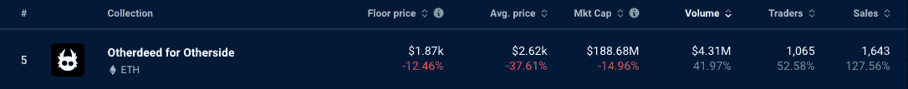
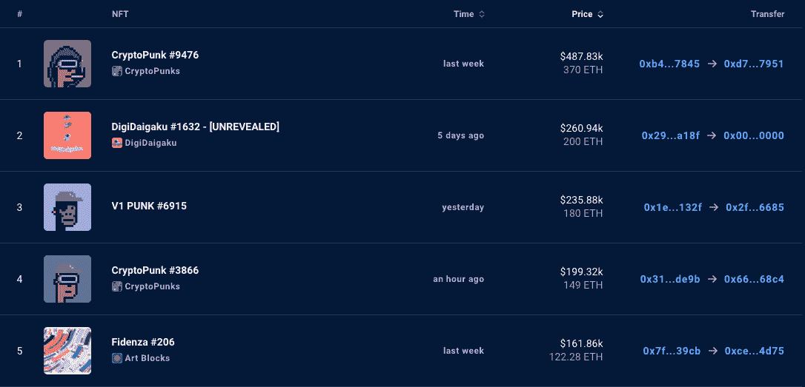

# NFT 亮点——DigiDaigaku 售价 260，940 美元，其他方面的销售额飙升 128%

> 原文：<https://web.archive.org/web/https://dappradar.com/blog/nft-highlights-digidaigaku-sells-for-260940-and-otherside-sales-shoot-up-128>

## 2022 年 10 月 17 日至 24 日 DappRadar 的 NFT 销售亮点

**DigiDaigaku # 1623 10 月 19 日以 200 ETH 售出。来自该项目的 NFTs 得到了两条新闻的推动。首先，DigiDaigaku 正在与一个全新的合作伙伴进行独家合作。第二，极限突破为一些昂贵的广告空间支付了大量的钱。**

随着买家抢购宇迦实验室虚拟世界中的地块，Otherside 的 Otherdeeds 本周的销售数量急剧增加。交易数量增加了 127.56%，达到 1609 笔，因为更便宜的 ETH 价格为鲸鱼增持打开了大门。

## DigiDaigaki 漂流者伙伴关系和超级碗广告空间

对于数字学院项目来说，这是充满重大新闻的美好的一周。首先，Limit Break 宣布在超级碗 LVII 的中场休息期间以 650 万美元的价格购买了一个 30 秒的广告空间。这场比赛将于 2023 年 2 月举行，全球将有数百万球迷观看。

极限突破的联合创始人加布·莱登(Gabe Leydon)在接受 GamesBeat 采访时说，人们多年来一直记得那些广告。我认为没有人做过类似我们在超级碗广告中计划的事情。乐观的言论，甚至高昂的广告费用可能会让人们认为 DigiDaigaku 是一个值得投资的项目。

问题中的昂贵 NFT 是 DigiDaigaku #1632。值得注意的是，卖方免费获得了数字资产，因此 200 ETH 的价格标签(260，940 美元)是纯利润。交易之后，NFT 在不同的钱包间辗转，最终选择了这个钱包。#1632 有蛾子&的火焰特征，这一点仅占该系列中其他物品的 0.05%。

[DigiDaigaku #1632 sold for 200 ETH](https://web.archive.org/web/20221130130515/https://dappradar.com/hub/assets/eth/0xd1258db6ac08eb0e625b75b371c023da478e94a9/1632)

NFT 项目也宣布了它与病毒游戏成功的联系。这是一个沙盒游戏，你被放逐到一个遥远的小岛上，在那里你必须和其他人一起生存并建立一个繁荣的新文明。漂流筏的底价目前是 25 ETH，岛屿是 5.19 ETH。

> 您现在可以在《漂流者》中扮演您的 [@DigiDaigaku](https://web.archive.org/web/20221130130515/https://twitter.com/DigiDaigaku?ref_src=twsrc%5Etfw) ！！！
> 
> 连接起来，开始漂流，为即将开始的活动做准备！奖品和详情将很快公布。
> T5 下面是如何连接:[pic.twitter.com/S84565SNmd](https://web.archive.org/web/20221130130515/https://t.co/S84565SNmd)
> 
> — Castaways (big, fish) (@castaways_gg) [October 21, 2022](https://web.archive.org/web/20221130130515/https://twitter.com/castaways_gg/status/1583577439326076928?ref_src=twsrc%5Etfw)

DigiDaigaku x Castaways collaboration

目前来自 DigiDaigaku 项目的极度自信的情绪可能是该系列底价上涨和一件物品以 200 ETH 售出的原因。在普遍悲观的气氛下，任何给人们带来好消息的人通常都会有相当数量的追随者。

[Explore DigiDaigaku NFTs](https://web.archive.org/web/20221130130515/https://dappradar.com/hub/nft-explorer/collection/digidaigaku)

## 另一边的土地价格下降了，但销售额却上升了

尽管楼面价、平均售价和市值都下降了 10%以上，但另一边的土地销售却增长了 127.56%。这使得该系列在 DappRadar 的 NFT 排名中名列第五。

[<picture></picture>](https://web.archive.org/web/20221130130515/https://dappradar.com/nft/collections)

[DappRadar’s Top NFT Collections](https://web.archive.org/web/20221130130515/https://dappradar.com/nft/collections)

有趣的是，在价格持续下跌的同时，交易量和销售额却一路飙升。这向我们表明，对持续贬值的资产的需求正在上升。这就引出了一个问题:有些人知道哪些其他人不知道的事情？

看看一些大买家的资料，我们可以看到，当股价低迷时，许多巨大的彼岸鲸鱼正在购买更多的彼岸领土。这些人是真正的信徒，他们认为宇迦实验室最终将创造一个虚拟世界，统治未来元宇宙的很大一部分。

这个[人通过 metadantes.eth](https://web.archive.org/web/20221130130515/https://dappradar.com/hub/wallet/eth/0x572d6f0628ef555061932f85687c9f8f85505ed1) 的 ENS 域。我们可以使用 DappRadar 的投资组合跟踪器来查看他们的钱包，可以看到他们持有 42 支其他方的 NFT，根据我们的 NFT 价值估算器估计价值为 57.87 ETH。转到 NFT 金融视图选项卡，你会看到我们认为他们的其他资产价值已经下降了 94.95%。Metadantes.eth 显然指望未来某个时候价格飙升。

这个钱包的主人也在价格下降的时候购买了更多的土地。这使得他们的另一方持有量高达 335 NFTs，价值估计为 461.62 ETH。考虑到宇迦实验室的虚拟世界在今年 4 月推出时的大肆宣传，似乎大多数人很快就放弃了这个想法，而少数人看到了遥远的光明未来。

[Explore Otherside NFTs](https://web.archive.org/web/20221130130515/https://dappradar.com/hub/nft-explorer/collection/otherdeed-for-otherside)

## 查看 NFT 销售亮点列表

*注意:出售时给出的美元价值是正确的。*

1.  [crypto punk # 9476](https://web.archive.org/web/20221130130515/https://dappradar.com/hub/assets/eth/0xb47e3cd837ddf8e4c57f05d70ab865de6e193bbb/9476)-$ 487830/370 ETH-[主人的钱包](https://web.archive.org/web/20221130130515/https://dappradar.com/hub/wallet/eth/0x2b941072f0cc2ad3189b6e65bf5984faeb754f5d)
2.  [DigiDaigaku # 1632](https://web.archive.org/web/20221130130515/https://dappradar.com/hub/assets/eth/0xd1258db6ac08eb0e625b75b371c023da478e94a9/1632)-$ 260，940/200 ETH-[车主的钱包](https://web.archive.org/web/20221130130515/https://dappradar.com/hub/wallet/eth/0x351eaed909eda2496ee2f52a529288525ebfe0e0)
3.  [V1 朋克# 6915](https://web.archive.org/web/20221130130515/https://dappradar.com/hub/assets/eth/0x282bdd42f4eb70e7a9d9f40c8fea0825b7f68c5d/6915)-$ 235880/180 ETH-[主人的钱包](https://web.archive.org/web/20221130130515/https://dappradar.com/hub/wallet/eth/0x8df03bfaff89595774505d1e68cdec3a38ee5c43)
4.  [crypto punk # 3866](https://web.archive.org/web/20221130130515/https://dappradar.com/hub/assets/eth/0xb47e3cd837ddf8e4c57f05d70ab865de6e193bbb/3866)-$ 199320/149 ETH-[主人的钱包](https://web.archive.org/web/20221130130515/https://dappradar.com/hub/wallet/eth/0x66362b929c1a9aaf14c51aab9b455ad7fb8268c4)
5.  [fiden za # 206](https://web.archive.org/web/20221130130515/https://dappradar.com/hub/assets/eth/0xa7d8d9ef8d8ce8992df33d8b8cf4aebabd5bd270/78000206)-161，860 美元/122.28 ETH-[车主的钱包](https://web.archive.org/web/20221130130515/https://dappradar.com/hub/wallet/eth/0xce90a7949bb78892f159f428d0dc23a8e3584d75)
6.  [Bored Ape 游艇俱乐部# 8477](https://web.archive.org/web/20221130130515/https://dappradar.com/hub/assets/eth/0xbc4ca0eda7647a8ab7c2061c2e118a18a936f13d/8477)——157460 美元/120.61 WETH—[业主的钱包](https://web.archive.org/web/20221130130515/https://dappradar.com/hub/wallet/eth/0x1f8b5b6220eee763c60ac064da06fcd63533fd00)
7.  [crypto punk # 2189](https://web.archive.org/web/20221130130515/https://dappradar.com/hub/assets/eth/0xb47e3cd837ddf8e4c57f05d70ab865de6e193bbb/2189)-$ 156080/122 ETH-[主人的钱包](https://web.archive.org/web/20221130130515/https://dappradar.com/hub/wallet/eth/0x3deed956b999b83361b85bff31d388c35125411d)
8.  [fiden za # 911](https://web.archive.org/web/20221130130515/https://dappradar.com/hub/assets/eth/0xa7d8d9ef8d8ce8992df33d8b8cf4aebabd5bd270/78000911)-154，510 美元/119 ETH-[车主钱包](https://web.archive.org/web/20221130130515/https://dappradar.com/hub/wallet/eth/0x57f647c41b89ff2a3971dc85325ab06e411f18c5)
9.  [Bored Ape 游艇俱乐部# 488](https://web.archive.org/web/20221130130515/https://dappradar.com/hub/assets/eth/0xbc4ca0eda7647a8ab7c2061c2e118a18a936f13d/488)-142，680 美元/111 ETH-[业主的钱包](https://web.archive.org/web/20221130130515/https://dappradar.com/hub/wallet/eth/0x46901e907778a950c77971a29ce75a8bfddb1d2f)
10.  [无聊猿游艇俱乐部# 8](https://web.archive.org/web/20221130130515/https://dappradar.com/hub/assets/eth/0xbc4ca0eda7647a8ab7c2061c2e118a18a936f13d/8)——141，250 美元/110 ETH—[业主的钱包](https://web.archive.org/web/20221130130515/https://dappradar.com/hub/wallet/eth/0xa37fbd2264b48ed56dd7de8b9b83db35561700ef)

## 本周最大的 NFT 拍卖会

不出所料，在过去的一周里，一个隐朋克坐在了拍卖价格最高的位置。OG 收藏在不确定的宏观经济环境中继续保持价值。[这个钱包](https://web.archive.org/web/20221130130515/https://dappradar.com/hub/wallet/eth/0xd746a8c5324c80439fa57a86ef9a181f67e17951)买了[隐朋克#9476](https://web.archive.org/web/20221130130515/https://dappradar.com/hub/assets/eth/0xb47e3cd837ddf8e4c57f05d70ab865de6e193bbb/9476) 才马上搬到[这个钱包](https://web.archive.org/web/20221130130515/https://dappradar.com/hub/wallet/eth/0x2b941072f0cc2ad3189b6e65bf5984faeb754f5d)。之前的主人也在朋克上赚了一笔可观的利润，赚了 255 ETH。按美元价值计算，当我们根据 ETH 价格的变化进行调整时，利润约为 209，000 英镑。

[Explore DappRadar’s NFT Rankings](https://web.archive.org/web/20221130130515/https://dappradar.com/nft/sales)

## 随身携带您的 Web3 之旅

使用 DappRadar 移动应用程序，再也不会错过 Web3。查看最受欢迎的 dapps 的性能，并关注您投资组合中的 NFT。您在 DappRadar 上的帐户会与我们的移动应用程序同步，这样您很快就可以选择实时接收提醒。

[Download the DappRadar app now](https://web.archive.org/web/20221130130515/https://dappradar.app.link/blog)[<picture></picture>](https://web.archive.org/web/20221130130515/https://play.google.com/store/apps/details?id=com.portfolio.dappradar)