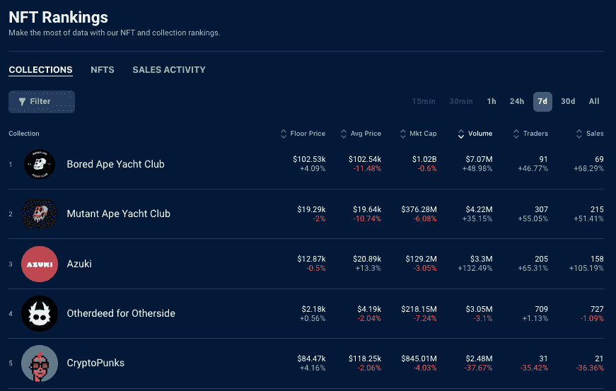
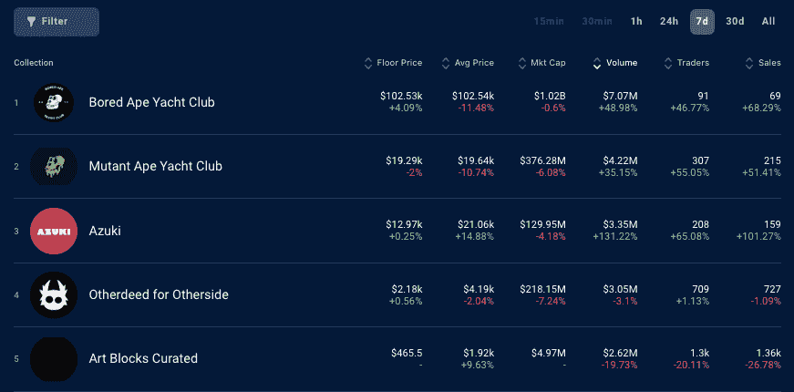
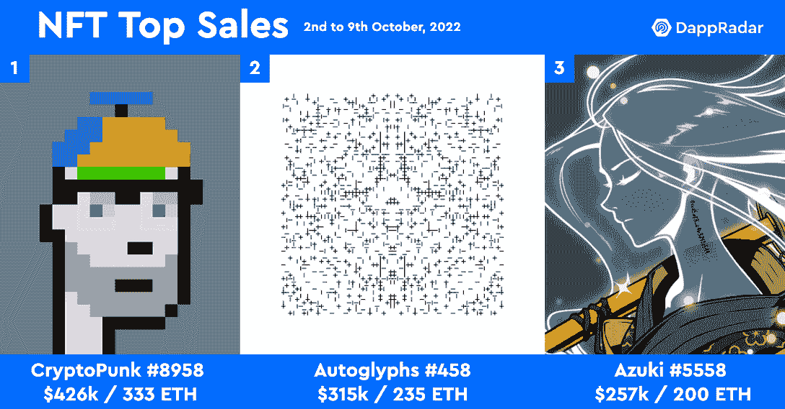

# NFT 集锦——滑冰证明让志那都红豆·NFT 的交易一飞冲天

> 原文：<https://web.archive.org/web/https://dappradar.com/blog/nft-highlights-proof-of-skate-sends-azuki-nft-trading-through-the-roof>

## 查看 2022 年 10 月 9 日至 16 日期间的 NFT 销售亮点排名

10 月 14 日，志那都红豆官方推特上的一则声明似乎刺激了日本艺术灵感的 NFT 收藏的交易活动。该团队于 10 月 19 日至 23 日在香港公布了真实世界装置 Proof-of-Skate。

这条推文包括一个视频，显示了滑板的展示，有超过 8 万的浏览量。值得注意的是，该视频的特点是一只蝴蝶在飞，似乎激活了滑板揭示。一个蝴蝶特征是一个元数据标签[在 10，000 个志那都红豆 NFT](https://web.archive.org/web/20221209201420/https://dappradar.com/hub/nft-explorer/collection/azuki?filters=W3sibGFiZWwiOiJTcGVjaWFsIiwiZGlzcGxheVR5cGUiOiJzdHJpbmciLCJ2YWx1ZXMiOlsiQnV0dGVyZmx5Il19XQ%3D%3D)中只有 86 个。

> 还有一点🦋[pic.twitter.com/g4BWLgUkCX](https://web.archive.org/web/20221209201420/https://t.co/g4BWLgUkCX)
> 
> — Azuki (@AzukiOfficial) [October 14, 2022](https://web.archive.org/web/20221209201420/https://twitter.com/AzukiOfficial/status/1581013559861202944?ref_src=twsrc%5Etfw)

帖子上说“很快会有更多的细节”，但没有透露任何东西，活动将在几天后开始。这一声明似乎导致了志那都红豆收藏的交易活动激增，因为交易者和崇拜者开始猜测空投以及与志那都红豆的蝴蝶元数据的任何潜在联系。

交易者的数量猛增了 65%,这使得交易量周环比增长了 130%以上，创造了 330 万美元的收入。这种活跃的交易将平均售价推高了 13%以上，超过了 2 万美元。志那都红豆现在是前一周交易量第三大的 NFT 收藏品。

Source: [DappRadar](https://web.archive.org/web/20221209201420/https://dappradar.com/nft)

深入研究过去七天 NFT 的具体销售情况，我们可以书面看到，转手最贵的是 200 ETH T3 的 T2 志那都红豆 5558 号，大约 25 万美元。然而，这个 NFT 有萤火虫元数据，而不是蝴蝶。我看了几遍视频，我确信这是一只蝴蝶，而不是萤火虫。

然而，前一周第二高的销售额确实有蝴蝶元数据。志那都红豆 3946 号以 130 ETH 的价格售出，约合 16 万美元。在过去的七天里，浏览[十大志那都红豆 NFT 销售额](https://web.archive.org/web/20221209201420/https://dappradar.com/hub/nft-explorer/collection/azuki/sales-activity?order-by=priceInFiat&period=week)，我们看到三个与 Butterfly metadata 和两个与 Firefly metadata 易手。

看看前十名之外揭示了过去一周许多志那都红豆销售与蝴蝶和萤火虫元数据。使用 DappRadar，我们可以看到蝴蝶元数据的最低值志那都红豆是[志那都红豆#7536](https://web.archive.org/web/20221209201420/https://dappradar.com/hub/assets/eth/0xed5af388653567af2f388e6224dc7c4b3241c544/7536) ，它以 15.7 ETH 的价格出售，约合 2 万美元。

Source: [DappRadar](https://web.archive.org/web/20221209201420/https://dappradar.com/nft)

除了神秘的推文和滑板展示之外，仍没有更多关于香港活动的信息，无论是展示实物还是数字物品，以及志那都红豆 NFT 的持有者是否会获得任何奖励，以回报他们的忠诚。

我们知道，就像上周的克隆 X 热潮一样，似乎发生在一条推文和同样神秘的预告片后面，web3 社区是饥饿的。这次熊市只是增强了他们看到他们投资的品牌取得切实进展和交付的愿望。

销售更加活跃的另一个原因是，志那都红豆持有者利用炒作的时机出售他们可能在造币阶段以大约 2th 的价格获得的 NFT，并在熊市中获得可观的利润。

如果你手里拿着一把志那都红豆 NFT，你可以通过将 ID 输入到[达普拉达 NFT 价格估算器](https://web.archive.org/web/20221209201420/https://dappradar.com/hub/nft-value-estimator/azuki)中来快速估算价格。

## 查看 NFT 销售亮点列表

*注意:出售时给出的美元价值是正确的*

每周，DappRadar 不仅会重点报道 NFT 最昂贵的[销售](https://web.archive.org/web/20221209201420/https://dappradar.com/nft/sales)，还会报道过去七天中最有趣的销售。虽然庞大的数字肯定会占据头条，但同样重要的是[突出新兴趋势](https://web.archive.org/web/20221209201420/https://dappradar.com/nft/sales)并保持 DappRadar 社区的领先地位。

1.  [Autoglyphs # 458](https://web.archive.org/web/20221209201420/https://dappradar.com/hub/assets/eth/0xd4e4078ca3495de5b1d4db434bebc5a986197782/458)-31.5 万美元/235 ETH-[买家钱包](https://web.archive.org/web/20221209201420/https://dappradar.com/hub/wallet/eth/0xc6f6c89f7f297b5230d2fd028ac06f0677c1857b)
2.  [志那都红豆# 5558](https://web.archive.org/web/20221209201420/https://dappradar.com/hub/assets/eth/0xed5af388653567af2f388e6224dc7c4b3241c544/5558)-$ 257k/200 ETH-[买家钱包](https://web.archive.org/web/20221209201420/https://dappradar.com/hub/wallet/eth/0xff3879b8a363aed92a6eaba8f61f1a96a9ec3c1e)
3.  [志那都红豆# 3946](https://web.archive.org/web/20221209201420/https://dappradar.com/hub/assets/eth/0xed5af388653567af2f388e6224dc7c4b3241c544/3946)-$ 16.6 万/130 ETH-[买家钱包](https://web.archive.org/web/20221209201420/https://dappradar.com/hub/wallet/eth/0x01976b0c442012535853cbdceb63bdedd04dd4f1)
4.  [fide nza # 324](https://web.archive.org/web/20221209201420/https://dappradar.com/hub/assets/eth/0xa7d8d9ef8d8ce8992df33d8b8cf4aebabd5bd270/78000324)-14.1 万美元/105 ETH-[买家钱包](https://web.archive.org/web/20221209201420/https://dappradar.com/hub/wallet/eth/0xc6f6c89f7f297b5230d2fd028ac06f0677c1857b)
5.  [名词# 171](https://web.archive.org/web/20221209201420/https://dappradar.com/hub/assets/eth/0x9c8ff314c9bc7f6e59a9d9225fb22946427edc03/171)–＄74k/58 WETH——[买家的钱包](https://web.archive.org/web/20221209201420/https://dappradar.com/hub/wallet/eth/0xdb773adada14e6387080844c8d023ee8eff88ad1)
6.  [Ringer # 764](https://web.archive.org/web/20221209201420/https://dappradar.com/hub/assets/eth/0xa7d8d9ef8d8ce8992df33d8b8cf4aebabd5bd270/13000764)–$ 69k/55 WETH——[买家钱包](https://web.archive.org/web/20221209201420/https://dappradar.com/hub/wallet/eth/0x68f4b110b6862f2341d8a869a79025029f945bf2)
7.  [DEAFBEEF 系列 4:Glitchbox–Token 206](https://web.archive.org/web/20221209201420/https://dappradar.com/hub/assets/eth/0xd754937672300ae6708a51229112de4017810934/206)–＄61 . k/48 ETH—[买家钱包](https://web.archive.org/web/20221209201420/https://dappradar.com/hub/wallet/eth/0x1435b92d1d46bf42bde8644c9996ceee23f89d3a)
8.  [Clone X # 13128](https://web.archive.org/web/20221209201420/https://dappradar.com/hub/assets/eth/0x49cf6f5d44e70224e2e23fdcdd2c053f30ada28b/11005)–＄45k/35 ETH—[买家钱包](https://web.archive.org/web/20221209201420/https://dappradar.com/hub/wallet/eth/0xc6c6273d4dcb6b48d180bb39286b76fe562dc924)
9.  [村上之花# 8453](https://web.archive.org/web/20221209201420/https://dappradar.com/hub/assets/eth/0x7d8820fa92eb1584636f4f5b8515b5476b75171a/258)–＄45k/35 WETH——[买家钱包](https://web.archive.org/web/20221209201420/https://dappradar.com/hub/wallet/eth/0xdc6f3b6e8f6eafab2094f9a733a371b78a7f3b77)
10.  [志那都红豆# 4409](https://web.archive.org/web/20221209201420/https://dappradar.com/hub/assets/eth/0xed5af388653567af2f388e6224dc7c4b3241c544/4409)–$ 34k/27 ETH——[买家钱包](https://web.archive.org/web/20221209201420/https://dappradar.com/hub/wallet/eth/0x80ac8b6f4cacea6129f5cf1365904f056b4e29ea)

## 大量的 NFT 收藏品

过去一周观察到的一个令人担忧的趋势是两个蓝筹股 NFT 的交易增加。无聊猿游艇俱乐部 T1 和它的姐妹俱乐部 T2 变异猿 T3 的平均价格都下降了 10%以上，而与此同时，交易者的数量和销售额平均增长了 55%。

这表明，由于一些人对宏观经济环境和全球货币的担忧开始占据上风，NFT 持有者正以低于此前的价格出售其非金融资产。可以说，这表明 BAYC NFTs 的持有者远不止十几岁的德根，他们对 T2 的财政和货币政策有着深入的了解，这些政策可能会影响 NFT 现在和未来的空间。

Source: [DappRadar](https://web.archive.org/web/20221209201420/https://dappradar.com/nft)

随着[发布新的](https://web.archive.org/web/20221209201420/https://dappradar.com/blog/nft-highlights-art-blocks-curated-sales-leap-70-on-fontana-collection-launch)丰塔纳系列，艺术街区上周迎来了丰收的一周，销售额增长了 70%以上。正如预期的那样，本周的交易量[下降了 20%](https://web.archive.org/web/20221209201420/https://dappradar.com/hub/nft-explorer/collection/art-blocks-curated) ，但最有趣的是，艺术品市场上一件生成性加密艺术品的平均价格上涨了 9%以上。随着意识的增长，越来越多的人被吸引到一个不同的媒介来进行非传统艺术和数字艺术。

## NFT 销量大增

在过去的七天里，NFT 的最高成交价是 333 ETH 的 [CryptoPunk #8958](https://web.archive.org/web/20221209201420/https://dappradar.com/hub/assets/eth/0xb47e3cd837ddf8e4c57f05d70ab865de6e193bbb/1484) ，约合 42.5 万美元。第二名属于 [Autoglyphs #458](https://web.archive.org/web/20221209201420/https://dappradar.com/hub/assets/eth/0xd4e4078ca3495de5b1d4db434bebc5a986197782/458) ，售价 235 ETH，约合 31.5 万美元，卖家净赚 234 ETH，因为他们三年前以 1 ETH 的价格购买了它。可以说，排在第二位的一件秘密艺术品解释了艺术块上提到的趋势，以及投资者开始关注阿凡达收藏和元宇宙之外的非艺术块。

第三高的销售额属于志那都红豆 5558 号，转手 200 ETH，约合 25.5 万美元。关于本周的前三名最令人兴奋的事情是，如果你回头看看[周刊的 NFT 重点文章](https://web.archive.org/web/20221209201420/https://dappradar.com/blog/tag/nft-trends)，前三名的销售几乎总是 crypto 朋克或 Bored Ape 游艇俱乐部 NFTs。在这里看到其他藏品可能会让 NFT 的崇拜者改变方向。

Source: [DappRadar](https://web.archive.org/web/20221209201420/https://dappradar.com/nft)

## 随身携带您的 Web3 之旅

使用 DappRadar 移动应用程序，再也不会错过 Web3。查看最受欢迎的 dapps 的性能，并关注您投资组合中的 NFT。您在 DappRadar 上的帐户会与我们的移动应用程序同步，这样您很快就可以选择实时接收提醒。

[Download the DappRadar app now](https://web.archive.org/web/20221209201420/https://dappradar.app.link/blog)[<picture></picture>](https://web.archive.org/web/20221209201420/https://play.google.com/store/apps/details?id=com.portfolio.dappradar)

***以上不构成投资建议。此处给出的信息仅供参考。请行使尽职调查，做你的研究。作者持有多种加密货币的头寸，包括 BTC、瑞士法郎和雷达。***