# NFT 股市从卢娜事件前的暴跌中反弹，交易量达到 20 亿美元

> 原文：<https://web.archive.org/web/https://dappradar.com/blog/nft-market-roars-back-from-pre-luna-crash-with-2-billion-in-trading-volume>

## 二月 Dapp 行业报告

## 关键要点

*   该行业的每日活跃钱包数量下降了 10%，至每天 160 万个
*   DeFi 部门的活动优势增长到 24%，而游戏则有所下降，目前为 45.43%。
*   DeFi 的 TVL 增长了 7.70%，达到 810 亿美元。
*   NFT 交易量自去年 5 月以来首次飙升至 20 亿美元，较上月增长 117%，成交 630 万笔。
*   Blur 以 13 亿美元的交易量和 64.8%的市场份额在 NFT 市场占据主导地位，而 Opensea 以 5.87 亿美元的交易量和 28.7%的市场份额紧随其后。
*   OpenSea 仍然是使用最多的市场，2 月份有 317，000 名独立交易者，比 Blur 多 227%。
*   今年 2 月，黑客已经成功利用 dapps 和用户总计 1.42 亿美元。

## 目录

1.  [Dapp 行业概述](https://web.archive.org/web/20230310152718/https://dappradar.com/blog/nft-market-roars-back-from-pre-luna-crash-with-2-billion-in-trading-volume/#Chapter-1)
2.  [DeFi TVL 飙升至 810 亿美元](https://web.archive.org/web/20230310152718/https://dappradar.com/blog/nft-market-roars-back-from-pre-luna-crash-with-2-billion-in-trading-volume/#Chapter-2)
3.  [DeFi 在 NFTs 中的足迹正在上升](https://web.archive.org/web/20230310152718/https://dappradar.com/blog/nft-market-roars-back-from-pre-luna-crash-with-2-billion-in-trading-volume/#Chapter-3)
4.  [NFT 市场持续繁荣，交易额达到 20 亿美元](https://web.archive.org/web/20230310152718/https://dappradar.com/blog/nft-market-roars-back-from-pre-luna-crash-with-2-billion-in-trading-volume/#Chapter-4)
5.  [争夺市场份额:Blur vs. Opensea](https://web.archive.org/web/20230310152718/https://dappradar.com/blog/nft-market-roars-back-from-pre-luna-crash-with-2-billion-in-trading-volume/#Chapter-5)
6.  [宇迦实验室在 NFT 的统治地位](https://web.archive.org/web/20230310152718/https://dappradar.com/blog/nft-market-roars-back-from-pre-luna-crash-with-2-billion-in-trading-volume/#Chapter-6) [——宇迦实验室大胆迈出十二步:比特币非金融交易的未来？](https://web.archive.org/web/20230310152718/https://dappradar.com/blog/nft-market-roars-back-from-pre-luna-crash-with-2-billion-in-trading-volume/#Chapter-6-1)
7.  [尽管活动主导度略有下降，区块链游戏行业仍在向前发展](https://web.archive.org/web/20230310152718/https://dappradar.com/blog/nft-market-roars-back-from-pre-luna-crash-with-2-billion-in-trading-volume/#Chapter-7)
8.  因漏洞利用和黑客攻击损失 1.42 亿美元
9.  [结论](https://web.archive.org/web/20230310152718/https://dappradar.com/blog/nft-market-roars-back-from-pre-luna-crash-with-2-billion-in-trading-volume/#Conclusion)

## 1.Dapp 行业概述

dapp 行业在 2023 年 2 月经历了轻微的放缓，平均每天有 160 万个独立活跃钱包(dUAW)与 dapp 合同互动。这意味着比 2023 年 1 月下降了 10.54%。这一下降趋势与前几年一致，因为二月份通常是一个淡季。在此期间，区块链工业似乎没有吸引新的用户。

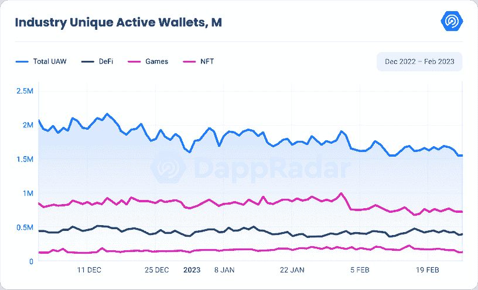

尽管活动略有减少，[区块链博彩业](https://web.archive.org/web/20230310152718/https://dappradar.com/rankings/category/games)仍然是该行业中最具优势的行业，平均 736，225 dUAW。

与此同时， [DeFi](https://web.archive.org/web/20230310152718/https://dappradar.com/defi) 继续上升趋势，平均为 390，675 dUAW，从 1 月份的 21%上升到 2 月份的 24%。

NFT 板块的主导地位也有所上升，从 1 月份的 8.47%升至 9.46%，平均为 153，337 dUAW。

在排名靠前的区块链中， [BNB 连锁店](https://web.archive.org/web/20230310152718/https://dappradar.com/rankings/protocol/binance-smart-chain)和[蜡](https://web.archive.org/web/20230310152718/https://dappradar.com/rankings/protocol/wax)在 2 月份拥有最独特的活跃钱包，平均分别为 411，172 dUAW 和 402，537 dUAW。两个区块链都保持了上个月的活动水平，变化很小。

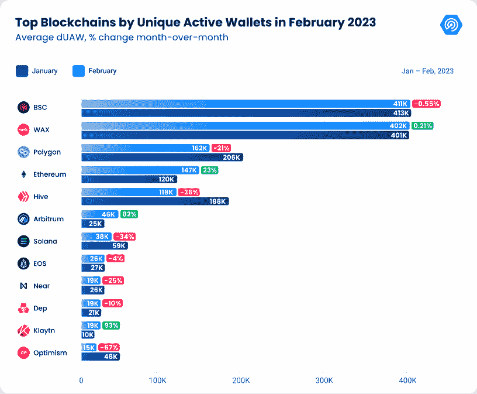

以太坊、[仲裁院](https://web.archive.org/web/20230310152718/https://dappradar.com/rankings/protocol/arbitrum)、[克莱顿](https://web.archive.org/web/20230310152718/https://dappradar.com/rankings/protocol/klaytn)是二月份涨幅最大的。以太坊增长了 23.25%，平均达到 147，924 dUAW，这得益于 [Uniswap V3](https://web.archive.org/web/20230310152718/https://dappradar.com/ethereum/exchanges/uniswap-v3) 、 [Uniswap NFT 聚合器](https://web.archive.org/web/20230310152718/https://dappradar.com/ethereum/marketplaces/uniswap-nft-aggregator)和 [Blur NFT 市场](https://web.archive.org/web/20230310152718/https://dappradar.com/ethereum/marketplaces/blur)的成功。受 DeFi dapp[GMX](https://web.archive.org/web/20230310152718/https://dappradar.com/arbitrum/defi/gmx)和 [Vela Exchange](https://web.archive.org/web/20230310152718/https://dappradar.com/arbitrum/exchanges/vela-exchange) 受欢迎程度的推动，Arbitrum 增长了 83%，平均达到 46，740 dUAW。克莱顿增长了 93.71%，平均达到 19，175 dUAW。这一增长主要来自游戏平台 Iskra 和分散交易平台 KLAYswap T21。

然而，也有一些表现不佳的区块链。乐观情绪下降了 67.52%，平均为 15，602 dUAW，因为 1 月 17 日“学会赚钱”激励计划的结束没有为 DeFi dapps 吸引新的钱包。在 [Polygon](https://web.archive.org/web/20230310152718/https://dappradar.com/rankings/protocol/polygon) 生态系统中，平均有 162，374 只 dUAW 与各种 dapps 相关，这意味着 Polygon 的数量比 1 月份下降了 21.39%。

与此同时，[索拉纳](https://web.archive.org/web/20230310152718/https://dappradar.com/rankings/protocol/solana)不断受到打击。今年 2 月，索拉纳生态系统的日活跃钱包数量急剧下降了 34.54%，平均每天只有 38，825 个钱包。索拉纳仍在处理 FTX 崩溃的后果，需要重新建立消费者和开发商的信任，以重获昔日的辉煌。不幸的是，第一层在上周末又遭遇了一次中断。我们会继续监控主要网络的状态。

[DappRadar’s Industry Overview Graphs](https://web.archive.org/web/20230310152718/https://dappradar.com/industry-overview)

## 2.DeFi TVL 飙升至 810 亿美元

2023 年 2 月，该行业的总价值锁定(TVL)继续上升。截至 2023 年 1 月底，TVL 为 752.5 亿美元，比去年 12 月增长了 26.8%。这种势头持续到 2 月份，进一步增长了 7.70%。现在这个行业的 TVL 已经达到了 810 亿美元。这一增长证明了加密投资者对 DeFi 越来越感兴趣，也越来越多地采用 DeFi。

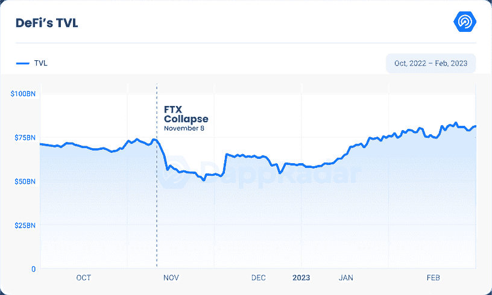

以太坊以 532 亿美元继续占据 TVL 区块链的主导地位。BNB 连锁已经巩固了其 TVL 在 70 亿美元，而创已达到 53 亿美元。Polygon 和 Avalanche 似乎分别整合了约 14 亿美元和 20 亿美元的 TVL，尽管其 TVL 小幅下降了 2%。

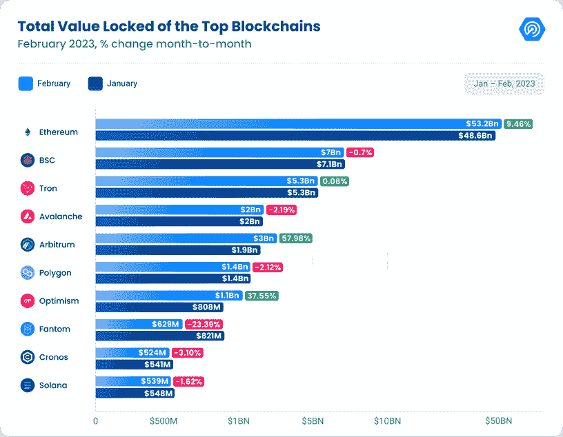

第 2 层解决方案是 DeFi 增长的主要原因，尤其是 Arbitrum 和乐观。Arbitrum 的 TVL 增长了 58%，达到 30 亿美元。这种激增的原因之一是基于 Arbitrum 的资产管理协议 FactorDAO 发布了 staking 服务。此外，有人猜测可能从 Arbitrum 空投，这进一步增加了 TVL。

同样，乐观的 TVL 增长了 37.55%，达到 11 亿美元。这一增长归功于向 30 多万个钱包空投了 1170 万个治理令牌。空投是由第二层区块链的看守集团，乐观集体。在区块链使用天然气执行交易的用户以及将投票权委托给其他用户的用户有资格进行空投。乐观主义者鼓励参与其治理体系的这一举措，已被证明是对投资者的一大吸引力。

此外，比特币基地最近推出了自己的以太坊第二层网络 base。该项目将由乐观主义推动，比特币基地已经与 DAO 合作，在 OP 栈上进行开源开发。预计 Base 的推出将为比特币基地的链上产品创造一个新的家园，并为数百万新的分散式应用程序提供一个开放的生态系统。

[DappRadar’s DeFi Industry TVL](https://web.archive.org/web/20230310152718/https://dappradar.com/defi)

值得注意的是，DeFi 的 TVL 也在 NFT 区找到了一席之地。这是一个趋势，我们将在下一节进行分析。

## 3.DeFi 在 NFTs 中的足迹正在上升

NFT 市场锁定(TVL)总价值一直呈上升趋势，其中 [Blur](https://web.archive.org/web/20230310152718/https://dappradar.com/ethereum/marketplaces/blur) 、BendDAO、 [NFTfi](https://web.archive.org/web/20230310152718/https://dappradar.com/ethereum/defi/nftfi) 、 [Sudoswap](https://web.archive.org/web/20230310152718/https://dappradar.com/ethereum/marketplaces/sudoswap) 等平台涨幅居前。

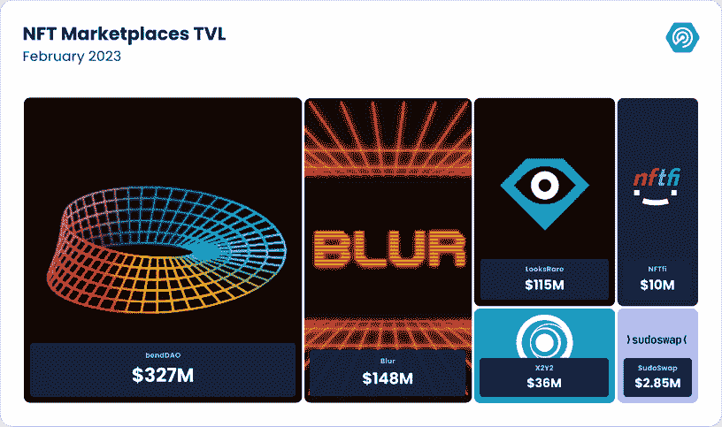

Blur 的 TVL 大幅上升，在本月底创下 1.48 亿美元的历史新高，因为买家将他们的资产锁定在竞标池中。与此同时，Blur 最近吸引了大量买家，导致其 TVL 飙升。该平台还利用空投来激励用户加入该平台，这进一步推动了其增长。

BendDAO 是另一个增长显著的平台，TVL 达到 3.27 亿美元。该平台自年初以来一直呈上升趋势，其 TVL 增长了 168%。这个 P2P NFT 流动性平台允许用户轻松交易 NFT，吸引了大量用户。

NFTfi 是一个以 NFTs 为抵押品的 P2P 贷款市场。2 月底，NFTfi 的 TVL 为 1032 万美元。Sudoswap 以 285 万美元的 TVL 完成了榜单。该平台提供了一系列独特的功能，如 P2P 交易和流动性挖掘。

TVL 在 NFT 市场的增长不仅受到使用量增加的推动，还受到推出具有独特功能和使用案例的新令牌的推动。像 Looksrare、X2Y2、Blur 和 SudoSwap 这样的平台都推出了自己的令牌来吸引用户，并与 OpenSea 这样的老牌玩家竞争。

LooksRare、T2、Blur 和 SudoSwap 推出这些代币凸显了代币组学在 NFT 市场日益增长的重要性。通过向用户提供独特的功能和好处，这些市场旨在与老牌玩家竞争，并吸引更多人使用他们的平台。

虽然 NFT dapps 的 TVL 令人印象深刻，但它无法与 DeFi 平台的价值相比。然而，随着越来越多的用户涌向这些平台，NFT dapps 的 TVL 增长对 NFT 市场来说是一个积极的信号。创新和竞争推动 NFT 行业向前发展，因此我们可以期待看到更多的增长。可以肯定地说，NFTs 的前景是光明的。

Top NFT Marketplaces

## 4.NFT 市场继续繁荣，交易额达到 20 亿美元

延续过去两个月的趋势，NFT 市场 2 月份交易量大幅飙升，自 2022 年 5 月以来首次达到 20 亿美元，主要是由侠影推动的。这比前一个月增加了 117%。然而，尽管销售额下降了 31.46%，成交量还是出现了增长。2 月份，总共售出了 630 万台。

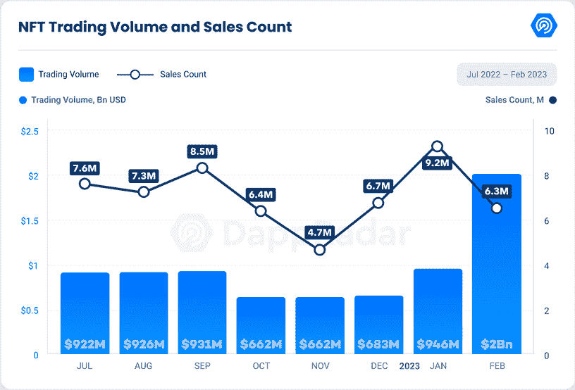

以太坊以 16 亿美元的 NFT 交易额保持了其主导地位和重要性，占整个 NFT 市场 83.36%的份额。区块链的优势与前几个月一致。

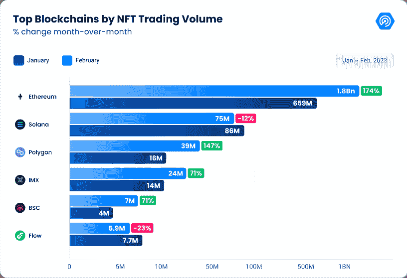

此外， [Polygon](https://web.archive.org/web/20230310152718/https://dappradar.com/nft/protocol/polygon) 显示了令人印象深刻的 147%的增长，本月达到 3900 万美元。在其他增长的连锁店中，我们发现[的不变 X](https://web.archive.org/web/20230310152718/https://dappradar.com/nft/protocol/immutablex) 和[的 BNB 连锁店](https://web.archive.org/web/20230310152718/https://dappradar.com/nft/protocol/binance-smart-chain)。Immutable X 将大量注意力放在视频游戏上，其交易量增长了 71%，达到 2，440 万美元。此外，BNB 连锁店注意到类似的增长，并记录了 700 万美元的 NFT 交易量。

## 5.争夺市场份额:Blur vs. Opensea

在表现最佳的 NFT 平台中， [Blur](https://web.archive.org/web/20230310152718/https://dappradar.com/ethereum/marketplaces/blur) 以 13 亿美元的交易额成为主导者，占整个 NFT 市场交易额的 64.8%。相比之下，领先的竞争对手 [Opensea](https://web.archive.org/web/20230310152718/https://dappradar.com/multichain/marketplaces/opensea) 以 5.87 亿美元落后，占据 28.7%的市场份额。其他 NFT 市场如 [X2Y2](https://web.archive.org/web/20230310152718/https://dappradar.com/ethereum/marketplaces/x2y2) 和[looks RAE](https://web.archive.org/web/20230310152718/https://dappradar.com/ethereum/marketplaces/looksrare)分别以 3900 万美元和 2900 万美元远远落后。

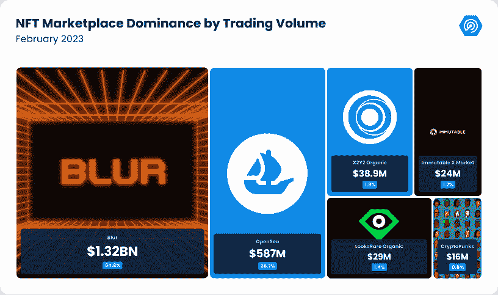

使 Blur 区别于其他 NFT 市场的是其独特的交易模式。与其他平台上看到的典型 wash 交易不同，Blur 的交易活动主要是由平台上的 NFT 鲸鱼养殖推动的。

尽管 Blur 的交易量令人印象深刻，但值得注意的是，OpenSea 仍然拥有更大的用户群，与 Blur 的 96，856 人相比，有超过 316，199 名交易者。这证实了 Blur 上的交易模式很大程度上是由平台上的 NFT 鲸鱼养殖驱动的，而不是典型的交易活动。

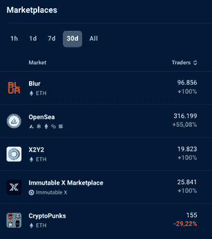

Source: [DappRadar NFT rankings](https://web.archive.org/web/20230310152718/https://dappradar.com/nft)

为了吸引更多的 NFT 创作者，模糊一直专注于版税支付选项。该平台现在提供 0.5%的最低版税，并采取措施限制在不支付版税的二级市场上销售非专利技术。通过这样做，Blur 希望对 NFT 创作者更有吸引力，并增加其市场份额。

随着 Blur 和 OpenSea 之间的竞争不断加剧，观察这些平台如何发展以及它们为不断增长的 NFT 市场带来了哪些创新将是一件有趣的事情。虽然 Blur 获得了巨大的发展势头，但它的增长能否持续还有待观察。

[Dive into Blur data](https://web.archive.org/web/20230310152718/https://dappradar.com/ethereum/marketplaces/blur)

## 6.宇迦实验室在 NFT 的主导地位

宇迦实验室在 NFT 市场占据主导地位，因为它的五个系列( [BAYC](https://web.archive.org/web/20230310152718/https://dappradar.com/ethereum/collectibles/bored-ape-yacht-club) 、 [MAYC](https://web.archive.org/web/20230310152718/https://dappradar.com/ethereum/collectibles/mutant-ape-yacht-club) 、 [BAKC](https://web.archive.org/web/20230310152718/https://dappradar.com/ethereum/collectibles/bored-ape-kennel-club) 、 [Otherdeeds](https://web.archive.org/web/20230310152718/https://dappradar.com/ethereum/collectibles/otherdeed-for-otherside) 和 [Sewer Pass](https://web.archive.org/web/20230310152718/https://dappradar.com/ethereum/collectibles/sewer-pass) )都在 NFT 十大系列之列，占据了整个 NFT 以太坊交易量(16 亿美元)的 30%。

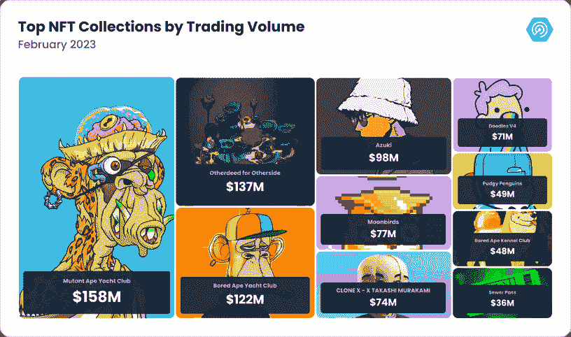

此外，[志那都红豆](https://web.archive.org/web/20230310152718/https://dappradar.com/ethereum/collectibles/azuki)和[克隆 X](https://web.archive.org/web/20230310152718/https://dappradar.com/ethereum/collectibles/clone-x-x-takashi-murakami) 继续巩固为 NFT 蓝筹股集合，交易量分别为 9800 万美元和 7430 万美元。

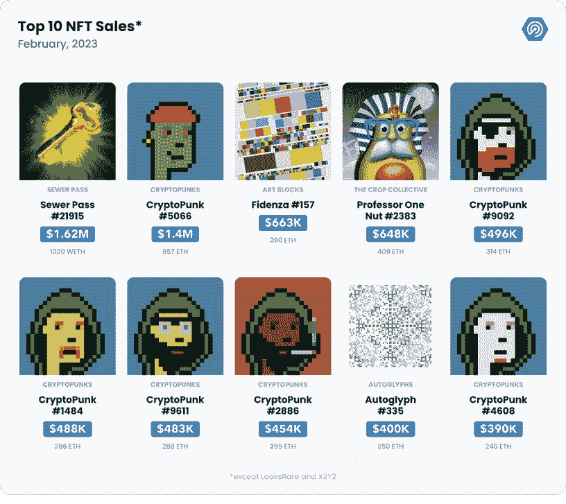[Discover the latest NFT sales](https://web.archive.org/web/20230310152718/https://dappradar.com/nft/sales)

为了进一步巩固宇迦实验室的统治地位，2 月份 NFT 十大销售额中有六个是 crypto punk，它们总共获得了 530 万美元。本月 NFT 最大的销售是金钥匙下水道通行证。职业玩家 Mongraal 以高达 1,000 ETH 的价格出售了该资产。

2 月份 NFT 交易量的增加突显出人们对数字所有权的兴趣日益浓厚，特别是在加密货币价格上涨的情况下。随着越来越多的行业采用这项技术，越来越多的人意识到拥有和交易数字资产的可能性，预计 NFT 市场将继续扩大。

### 宇迦实验室对“12 倍:比特币 NFT 的未来”迈出了大胆的一步？

最近推出的序数 NFT，也称为比特币序数，给不可替代代币(NFT)世界带来了新一波兴奋。这些代币利用比特币 mainnet 上的铭文来创建独特且可追踪的 satoshis，挑战基于以太坊的 NFT 在市场上的主导地位。尽管最初有一些怀疑，有序非功能表已经吸引了 NFT 爱好者和批评家的注意。

序数 NFT 在数据存储方面不同于其他 NFT，它们的全部数据存储在比特币交易的见证签名字段中。尽管最初持怀疑态度，但已经创造了超过 20 万个独特的序数，包括像 DeGods 和 OnChain Monkey 这样的著名项目，甚至 CryptoPunks 克隆体也已经进入了比特币区块链。

现在，宇迦实验室将首次推出其首个基于比特币的 NFT 项目 TwelveFold。该系列将包括 300 件限量版的艺术作品，每件都刻在比特币区块链上。这些作品将以 12×12 网格格式的 3D 图形和手绘元素为特色，向比特币区块链的数据存储方式致敬。

TwelveFold 的推出正值宇迦最稳定的收入来源受到威胁之际。NFT 的创作者依赖于对以太坊市场(如 OpenSea)上的非功能性文本二次销售征收的创作者版税，open sea 最近已停止征收一些版税，以抵御竞争对手 NFT 交易平台 Blur 的竞争。宇迦实验室此前批评 OpenSea 考虑这一举措。总的来说，TwelveFold 的推出对宇迦实验室和比特币 NFT 市场整体而言是重要的一步。

[Discover OnChainMonkey](https://web.archive.org/web/20230310152718/https://dappradar.com/ethereum/collectibles/onchainmonkey/nfts)

## 7.尽管活动主导地位略有下降，但区块链游戏行业仍在向前发展

区块链的游戏世界在不断发展，2023 年 2 月也不例外。根据该行业的独特活动钱包，区块链博彩业仍然是最具优势的行业，占 45.43%的优势，平均 736，225 dUAW。然而，这种主导地位从上月的 48.5%有所下降。

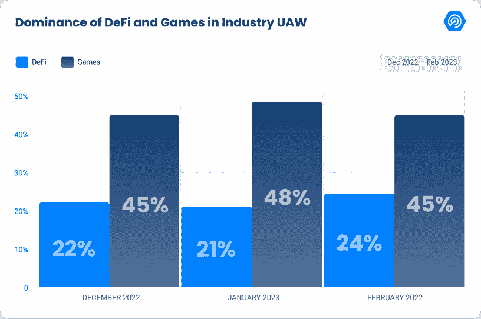

区块链博彩业最激动人心的发展之一是凯尔“蒙格拉”杰克森的“杜基·达什”钥匙 NFT 的出售。这位受欢迎的电子竞技选手以惊人的 1000 ETH(163 万美元)的价格将获胜的 NFT 钥匙卖给了亿万富翁企业家亚当·威茨曼。这笔交易意味着“Dookey Dash”的创造者宇迦实验室将获得 5%的版税，相当于 50 ETH，或 81，500 美元。

区块链博彩业的另一个重大发展是 Unity 在其在线店面中发布了“分散”类别。根据研究公司 Slintel 的数据，Unity 是市场领先的游戏开发平台，拥有 23.68%的市场份额。市场领先的视频游戏引擎现在进入了 Web3，增加了对 13 种不同的区块链软件开发工具包(SDK)的支持。

这些 SDK 包括 Algorand、Aptos、Dapper Labs 的 Flow 区块链、Immutable X、MetaMask、Solana 和 Tezos 等链和产品。Unity 旨在为游戏开发者提供他们与 Web3 gaming 联系所需的资源，web 3 gaming 是一个正在崛起的加密领域。通过 Unity Asset Store 中的分散式店面，开发人员可以轻松利用不可替换令牌(NFTs)和元宇宙等区块链技术来增强游戏体验。

这两项发展表明，区块链博彩业仍在增长，人们对此充满热情。下周，我们将发布我们的 DappRadar x BGA Games 报告，为 2023 年 2 月该行业发生的事情提供更多见解。

[Read more reports](https://web.archive.org/web/20230310152718/https://dappradar.com/reports)

## 8.因漏洞利用和黑客攻击而损失 1.42 亿美元

区块链技术被吹捧为一种革命性的力量，有望彻底改变我们交易和交换价值的方式。然而，与任何其他技术一样，它也不能幸免于黑客攻击和利用。根据 REKT 数据库，2023 年 2 月，区块链社区目睹了 15 起此类事件，造成的总损失为 1.42 亿美元。

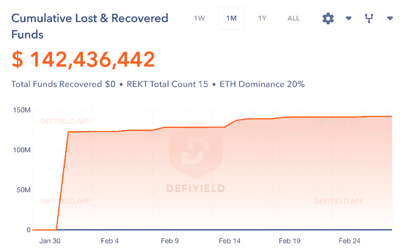

Source: [REKT Database](https://web.archive.org/web/20230310152718/https://de.fi/rekt-database)

BNB 链是受影响最大的平台，占 50%的黑客攻击和利用。以太坊、乐观和 Avax 以 16.7%紧随其后，Polygon 占事件的 8%。值得注意的是，33%的攻击发生在分散式交换机(DEX)上。

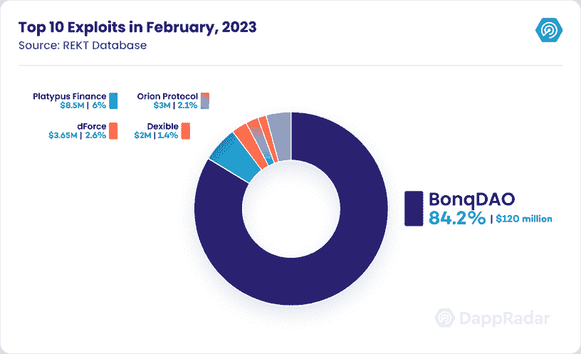

2023 年 2 月发生的最重大事件是 BonqDAO 和 AllianceBlock 黑客攻击。攻击者利用 BonqDAO 智能合约中的一个漏洞，操纵其价格 oracle 来提高 WALBT 价格。这个漏洞让攻击者赚了超过 1 亿布尔，然后他们用它来操纵 WALBT 价格和清算多个宝藏。

攻击者提取了他们的收益，共计 1.138 亿 WALBT 和 9800 万 BEUR，价值超过 1000 万美元。这些代币的倾销对其价值产生了严重影响，WALBT 下跌了 50%以上，BEUR 下跌了 34%。

这一事件强调了执行严格的安全审计和智能合同测试以检测和解决漏洞的重要性。此外，它还强调了区块链项目将安全性置于速度和创新之上的必要性。

## 9.结论

整个二月份，NFT 市场继续显示出一月份的环比看涨指标。NFT 的总交易量达到了令人印象深刻的 20 亿美元，这是自 Luna 崩溃之前以来从未出现过的价值。虽然交易量的激增部分是由 wash NFT 农场在 Blur 上推动的，但这仍然代表着整个行业的积极发展。

此外，DeFi 已经开始恢复势头，并通过 BenDAO 和 NFTfi 等平台在 NFT 市场找到了一席之地。这凸显了 NFT 市场的持续增长和创新，吸引了更多的投资者和创造者。

总体而言，2023 年对整个 dapp 行业来说是一个积极的开端。NFT 交易量的增长和对 DeFi 的重新关注预示着该行业的未来，我们将继续密切关注事态的发展。