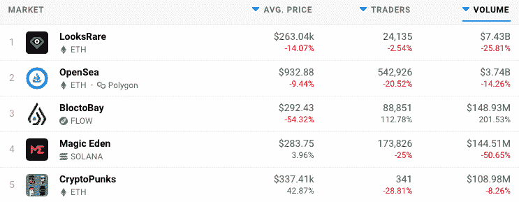

# NFT 市场 BloctoBay 月份的交易量翻了一番

> 原文：<https://web.archive.org/web/https://dappradar.com/blog/nft-marketplace-bloctobay-doubled-trading-activity-in-february>

## 流量 NFT 市场逆势而上

在一片红色的海洋中，NFT 市场 BloctoBay 的用户活跃度在二月份比一月份翻了一番。数字收藏品的崇拜者可以使用 BloctoBay 购买 NBA Top Shot、Dark Country、MotoGP 和 Chainmonster NFTs 以及数以千计的其他游戏。

基于流量的 NFT 市场的交易者增加了 112%，交易量增加了 200%。有趣的是，在过去的 30 天里，BloctoBay 上 NFT 的平均价格几乎下降了一半。在撰写本文时平均价格约为 290 美元。

尽管交易量与 NFT 两大以太坊市场 OpenSea 和 LooksRare 相差甚远。这种增长，尤其是在市场低迷的情况下，表明 BloctoBay 正在稳步前进，以确保长期排名前三。

Last 30 Days

目前影响 NFT 空间的另一个积极因素是以太坊之外的区块链越来越多的 NFT 和数字收藏品。BloctoBay 真正将流量区块链放到了地图上，这是一个以前完全由 NBA Top Shot 主导的生态系统。有更多的区块链人在非功能性测试中获得了成功。例如，罗宁是整个空间中最有价值的收藏品 Axie Infinity 的所在地。这个游戏项目成为第一个销售额超过 40 亿美元的收藏。

与此同时，Crabada 的 NFTs 是 Avalanche 上的一个游戏赚钱 dapp，是 2 月份交易量最大的。Avalanche 上的 NFT 交易量同比增长了 25%，比去年惊人地增长了 1，320%。此外， [Ebisu's Bay，克罗诺斯区块链的一个 NFT 市场](https://web.archive.org/web/20220930103319/https://dappradar.com/cronos/marketplaces/ebisu-s-bay)正在寻找牵引力，因为它在 DeFi heavy 网络上具有先发优势。

大多数人在想到区块链的 NFTs 时可能会想到 NBA TopShot，尽管他们肯定会在 2021 年初将 Flow 放在地图上，但一个更发达的生态系统正在 Flow 上出现。DappRadar 的用户可以访问我们的[行业领先的 NFT 排名](https://web.archive.org/web/20220930103319/https://dappradar.com/nft)，了解哪些藏品和区块链正在蓬勃发展，并激起了收藏家和崇拜者对 Flow 和其他几个连锁店(包括以太坊和 Polygon)的兴趣。

 NewsletterUnsubscribe at any time. [T&Cs](https://web.archive.org/web/20220930103319/https://dappradar.com/terms) and [Privacy Policy](https://web.archive.org/web/20220930103319/https://dappradar.com/privacy-policy)

***以上不构成投资建议。此处给出的信息仅供参考。请行使尽职调查，做你的研究。作者持有 ETH、BTC、AGIX、HEX、LINK、GRT、CRO、OMI、不可变 X、GALA、AVASTR、GMEE、CUBE、RADAR、FLOW、FTM、BNB、SPS、WRLD、ATOM 和 ADA。***