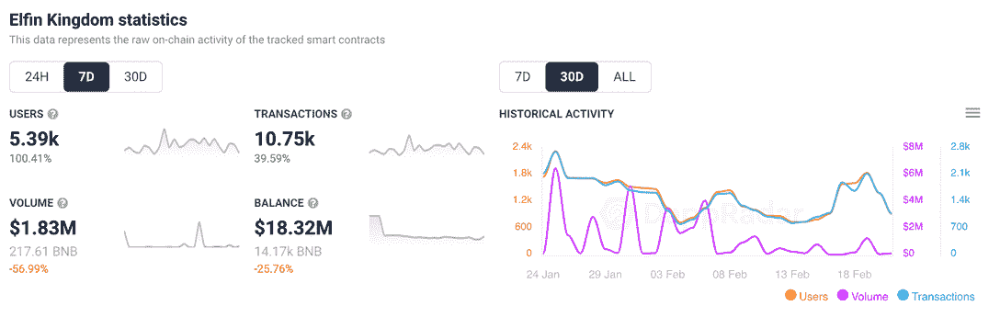
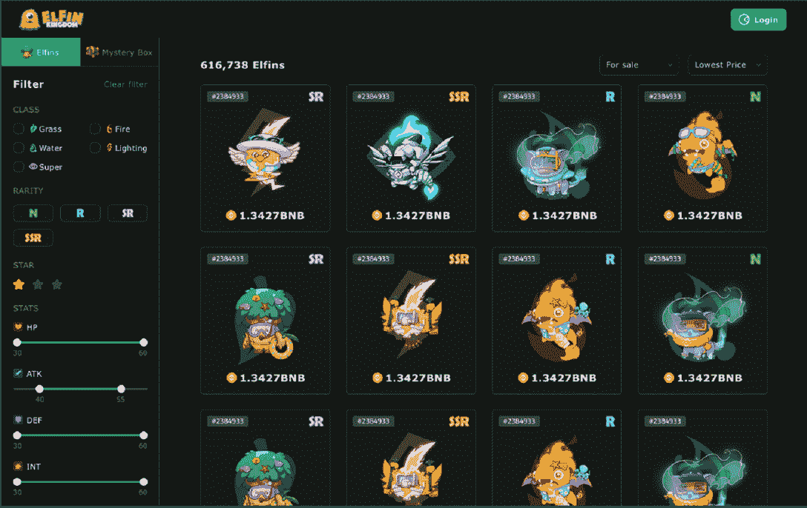

# NFT 市场帮助小精灵王国扩大用户群

> 原文：<https://web.archive.org/web/https://dappradar.com/blog/nft-marketplace-helps-elfin-kingdom-double-user-base>

## 在过去的 7 天里，连接到“玩即赚”dapp 的钱包增长了 100%

随着受口袋妖怪启发的区块链游戏《精灵王国》在 NFT 本土市场的推出，这款游戏的用户数量每周都在翻倍。该市场允许玩家开始买卖精灵和精灵包 NFT，随着“玩赚”游戏继续在币安智能链上找到立足点，该市场受到了玩家的欢迎。

一周又一周，连接到[小精灵王国](https://web.archive.org/web/20220929043730/https://dappradar.com/binance-smart-chain/games/elfin-kingdom)的钱包数量飙升超过 100%，达到 5390 个。而交易量也增长了近 40%，达到 10，750 笔。从交易量来看，我们还看到最近七天在 Elfin Kingdom 上的平均交易价值约为 170 美元。

此外，在 2 月 17 日[发布市场公告](https://web.archive.org/web/20220929043730/https://twitter.com/elfinkingdom/status/1494233322033135622)后，钱包数量显著增加，钱包连接从 2 月 16 日的 932 个跃升至 2 月 17 日的 1，590 个，并在 2 月 19 日达到 1，840 个的峰值——实际上是公告发布后的两倍。

## 什么是精灵王国

小精灵王国是一款在币安智能链上运行的 MMORPG 即玩即赚游戏,玩家在游戏中选择自己的角色，然后探索地图，完成每日任务，挖掘和收集 NFT，等等。玩家在[小精灵王国](/web/20220929043730/https://dappradar.com/blog/elfin-kingdom-lures-in-thousands-of-players/)中选择他们的角色和冒险，以获得小精灵代币和游戏内奖励。通过平台的赌注合同可以获得更多奖励，玩家目前可以下注五种不同的加密令牌，包括 BNB 和 USDC，以赚取更多的精灵。

[https://web.archive.org/web/20220929043730if_/https://www.youtube.com/embed/-tITQaXO9WQ?feature=oembed](https://web.archive.org/web/20220929043730if_/https://www.youtube.com/embed/-tITQaXO9WQ?feature=oembed)

## NFT 市场

NFT 市场允许用户查看小精灵的属性、技能、战斗值和其他详细的统计数据，并增加了根据稀有度、战斗值和进化水平过滤小精灵的功能，以帮助玩家进一步购买。此外，玩家可以转移代币，发送礼物，并在其他用户之间进行交易，新平台会记录用户的每笔交易。

用户现在可以在做出任何购买决定之前点击 Elfin NFTs 来检查所有信息，如价格、一般信息和 Elfin 的零件。

另一个特点是玩家可以在原生市场交易小精灵 NFT，他们会保持自己的经验水平，这对游戏性至关重要。但是，他们会有 24 小时的冷却期，但玩家可以在这段时间后使用战斗中的小精灵。

## 币安智能链上的从玩到赚

公平地说，2021 年见证了 DeFi 的游戏化，也被称为 GameFi，成为币安品牌网络的重要组成部分。BSC 上的[游戏类别在 2021](https://web.archive.org/web/20220929043730/https://dappradar.com/rankings/protocol/binance-smart-chain/category/games) 大幅提升了[，促进了网络和整个行业的使用。](https://web.archive.org/web/20220929043730/https://dappradar.com/blog/bsc-report-2021-a-year-in-review/)

几款 BSC 游戏脱颖而出。GameFi dapp 的 Mobox 巩固了其作为 BSC 生态系统中顶级 dapp 之一的地位。第二个是 [BombCrypto](https://web.archive.org/web/20220929043730/https://dappradar.com/blog/play-to-earn-bomb-crypto-blasts-its-way-to-top-of-the-charts/) ，这是一个玩到赚的 dapp 游戏，玩家通过战斗获得游戏的货币 BCOIN，成为区块链十大最常玩的游戏之一。如果[小精灵王国](https://web.archive.org/web/20220929043730/https://dappradar.com/binance-smart-chain/games/elfin-kingdom)可以效仿 Mobox 这样的游戏，BSC 可能会变得不那么依赖 DeFi，而更多地参与到日益增长的“以游戏挣钱”运动中。

 NewsletterUnsubscribe at any time. [T&Cs](https://web.archive.org/web/20220929043730/https://dappradar.com/terms) and [Privacy Policy](https://web.archive.org/web/20220929043730/https://dappradar.com/privacy-policy)

***以上不构成投资建议。此处给出的信息仅供参考。请行使尽职调查，做你的研究。作者持有 ETH、BTC、AGIX、HEX、LINK、GRT、CRO、OMI、不可变 X、GALA、AVASTR、GMEE、CUBE、RADAR、FLOW、FTM、BNB、SPS、WRLD、ATOM 和 ADA。***