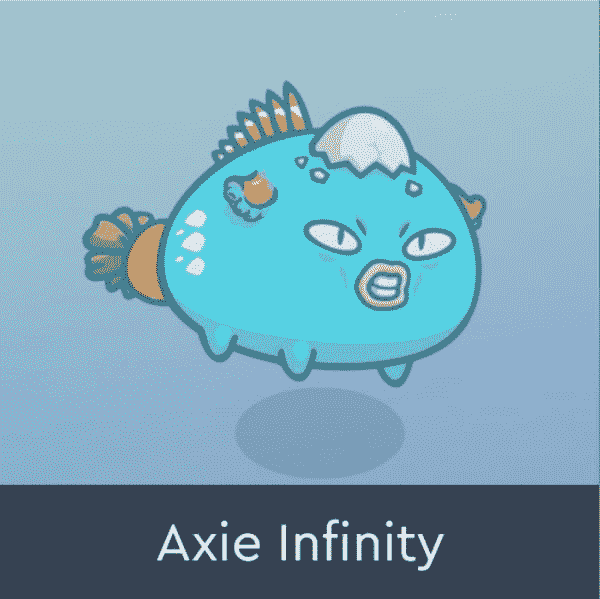
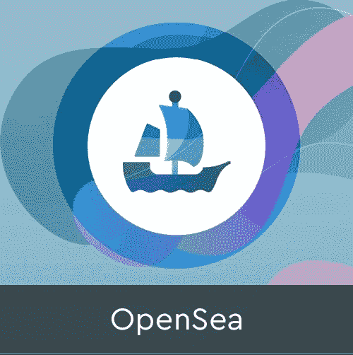
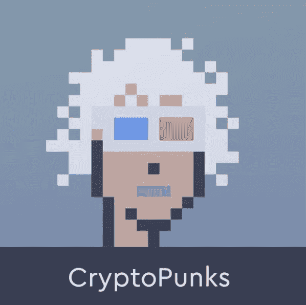

# NFT 市场争夺战

> 原文：<https://web.archive.org/web/https://dappradar.com/blog/nft-marketplaces-battle-for-pole-position>

## 一系列合作和收购

本周，成熟的 NFT 市场一直在展示它们的金融实力。OpenSea 已经收购了达摩实验室，这是一项基于以太坊的钱包服务，允许用户在银行账户和分散交易所之间转移资金。而比特币基地与万事达合作。这两个平台都在关注菲亚特 onramps，以简化 NFTs 的购买体验。

所有的目光都集中在 NFT 市场上，许多人已经错过了 OpenSea 和比特币基地的重大举措。他们与允许用户更快地访问他们的平台并开始交易 NFT 的服务合作。[如今，用户首先需要打开一个加密钱包](/web/20221206175129/https://dappradar.com/blog/how-to-start-using-defi-dapps-and-crypto-wallets-on-solana/)，购买加密，然后从网上市场购买一个 NFT。对于许多人来说，这是一座太陡峭而难以攀登的山，因为用户体验不是无缝的。

## 比特币基地让 NFT 采取行动

比特币基地和万事达卡的合作见证了两家公司让用户通过万事达卡购买 NFT。这可能会为全球的 NFT 崇拜者打开闸门，允许任何人开始交易或收集数字资产。

比特币基地宣布将于 2021 年 10 月推出他们的 NFT 市场，NFT 交易平台预计将于 2022 年在 Q2 上线。这有可能让比特币基地的 7300 万注册用户进入一个新的 NFT 市场。该平台将让人们制造和购买非功能性食品。该公司还为用户开放了一个等待加入的名单，最初有超过 100 万人注册。

比特币基地为许多人提供了进入密码世界的简单方法。一旦推出，万事达卡支付的非功能性交易可以为崇拜者提供一个完美的入口，让他们迈出进入该行业的第一步此外，在加密兔子洞的更深处。

## OpenSea 获得达摩

OpenSea 最近在来自 LooksRare 的全面攻击中保持了非常冷静的头脑。也许这是因为当 LooksRare 在玩游戏，用 LOOKS tokens 大力激励用户的时候， [OpenSea 一直在忙于收购达摩](https://web.archive.org/web/20221206175129/https://twitter.com/dharma_hq/status/1483484717294964741?s=21)。此次收购不仅为领先的 NFT 市场增加了钱包服务，也加深了对将菲亚特纳入以太坊的理解。

达摩的使命一直是让加密更容易使用，更主流友好。他们认为 NFT 为主流加密技术的采用提供了“尖端”。达摩将为 OpenSea 带来知识、专业技能和技术，以支持主流友好的方式购买、销售和制造 NFT。

作为收购的一部分，达摩的联合创始人，Nadav Hollander 和 Brendan Forster 将在 OpenSea 担任领导职务。Hollander 将担任 OpenSea 的首席技术官，最初的任务是提高 OpenSea 产品的技术可靠性和正常运行时间。此外，他还将构建网络 3 本地机制，以吸引和奖励 OpenSea 早期的忠诚社区。布兰登·福斯特将担任 OpenSea 的战略总监，为产品、商业、社区和营销注入网络本土视角。

[<picture></picture>](https://web.archive.org/web/20221206175129/https://dappradar.com/ethereum/marketplaces/axie-marketplace)[<picture></picture>](https://web.archive.org/web/20221206175129/https://dappradar.com/ethereum/marketplaces/opensea)[<picture></picture>](https://web.archive.org/web/20221206175129/https://dappradar.com/ethereum/collectibles/cryptopunks)

## 为主流 NFT 采用而扩大规模

虽然 OpenSea 已经运营多年，但它并没有固步自封。强劲的竞争对手在追逐平台，都在争夺桂冠。收购达摩，以及其强大的领导团队，并谈论奖励平台的长期用户，这正是 OpenSea 社区想要听到的。

尽管竞争越来越激烈，区块链以太坊的天然气费用也很高，但 OpenSea 仍然保持着它的地位。当然，随着 NFT 收藏家继续寻找下一个大热门，二级市场正在享受大量的活动。此外，作为 NFT 最成功的市场之一，OpenSea 受益于已经建立的品牌和受欢迎程度。

可以说，比特币基地可以向 OpenSea 发起严峻挑战。与此同时，该市场可能为不太了解的用户和 NFT 的崇拜者提供一个入口，一旦他们感觉更舒服，他们就会“毕业”到 OpenSea。

一如既往，区块链空间正以闪电般的速度前进。一会儿是清洗交易，一会儿是大规模的收购和合并。为了保持领先，请务必订阅我们的每周新闻，并为博客添加书签。

 NewsletterUnsubscribe at any time. [T&Cs](https://web.archive.org/web/20221206175129/https://dappradar.com/terms) and [Privacy Policy](https://web.archive.org/web/20221206175129/https://dappradar.com/privacy-policy)

***以上不构成投资建议。此处给出的信息仅供参考。请行使尽职调查，做你的研究。作者持有 ETH、BTC、AGIX、HEX、LINK、GRT、CRO、OMI、不变 X、ENS、GALA、AVASTR、GMEE、CUBE、RADAR、FLOW、FTM、BNB、SPS、WRLD、ATOM 和 ADA。***