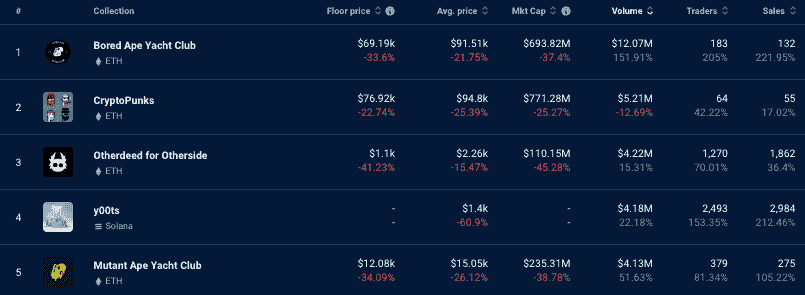
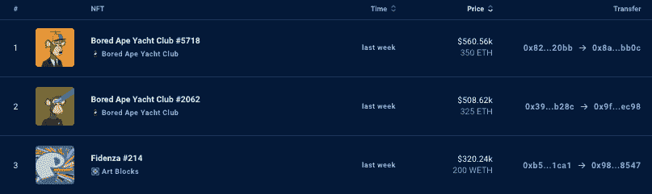
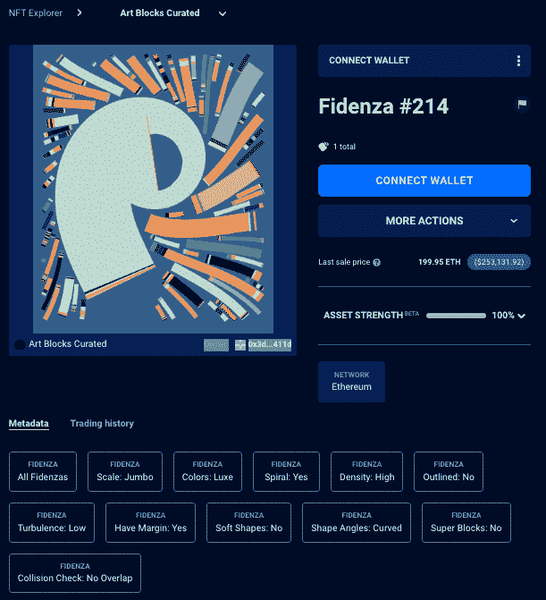
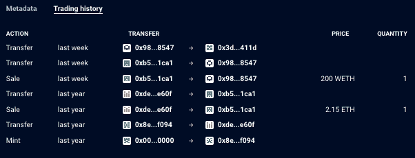

# 蓝筹股底价下跌 25%，NFT 销售飙升

> 原文：<https://web.archive.org/web/https://dappradar.com/blog/nft-sales-spike-as-blue-chip-floor-prices-drop-25>

## 随着 ETH 价格下跌，NFT 交易员正在寻找机会或恐慌性抛售

随着 FTX 证券交易所的崩溃，达普拉达 **上排名前十的** [**NFT 藏品的底价平均下跌了 25%。这种价值的下降带来了疯狂的购买活动，推动 Bored Ape 游艇俱乐部 NFTs 的销售额增长了 200%以上，而 MAYC 的销售额在过去七天里增长了 100%以上。**](https://web.archive.org/web/20221201051741/https://dappradar.com/nft/sales/1)

Sam Bankman-Fried 的 FTX 交易所的崩溃和随后的黑客攻击被业内视为加强用户保护和合理使用资金的分水岭。与此同时，随之而来的 ETH 价值下跌导致许多人对蓝筹股 NFT 进行投机，预计一旦这场最新的加密灾难尘埃落定，价格将会飙升。

[NFT Collections sort by Trading Volume](https://web.archive.org/web/20221201051741/https://dappradar.com/hub/nft-explorer?period=week )

## 蓝筹股 NFT 销量激增

FTX 交易所的崩溃带来了多米诺骨牌效应，连非上市公司也不能幸免。然而，ETH 价值的下跌意味着蓝筹股 NFT 藏品现在比几周前便宜了 25%左右，导致买家寻求便宜货，引发了一系列交易。

宇迦实验室生态系统的非交易量平均下降了 30%以上，其他地块的楼面价格下跌了 41%以上。仅仅六个月前，在即将推出的宇迦动力元宇宙中以大约 5000 美元铸造的土地现在价值 1000 美元左右。尽管如此，这三个宇迦收藏馆上周仍聚集了超过 2000 万美元的交易量。

即使在当前的前景下，NFT 的崇拜者们的信念也很坚定。由于投机者试图以折扣价获得一些最受重视的非交易资产，我们看到过去七天交易者和销售数量全线飘红。

## NFT 销售额前三名

NFT 销售额前三名的总收入为 180 万美元，BAYC #5718 的销售额最高，超过 56 万美元。更有趣的是，在 ETH 价值下跌的情况下，交易活跃，更仔细地看看 BAYC #5718 和#2062 的交易历史。

过去七天里，NFT 最高的一笔交易是 BAYC #5718 ，自一年前发行以来，交易次数并不多。我们看到[三个月前](https://web.archive.org/web/20221201051741/https://dappradar.com/hub/assets/eth/0xbc4ca0eda7647a8ab7c2061c2e118a18a936f13d/5718)，NFT 以 150 ETH 易手，现在在 ETH 价格更大幅度下跌的情况下，[以 350 ETH](https://web.archive.org/web/20221201051741/https://dappradar.com/hub/assets/eth/0xbc4ca0eda7647a8ab7c2061c2e118a18a936f13d/5718) 售出。

[BAYC #2062 更有意思](https://web.archive.org/web/20221201051741/https://dappradar.com/hub/assets/eth/0xbc4ca0eda7647a8ab7c2061c2e118a18a936f13d/2062)因为交易历史表明，无论是谁铸造了这个 NFT，他都搁置了一年多，直到几天前以 325 ETH 和[的价格出售，获得了可观的 321 ETH 利润](https://web.archive.org/web/20221201051741/https://dappradar.com/hub/assets/eth/0xbc4ca0eda7647a8ab7c2061c2e118a18a936f13d/2062)。

[Explore Blue-Chip NFTs](https://web.archive.org/web/20221201051741/https://dappradar.com/nft/collections)

## 艺术块收藏拉动 340 万美元

几个月来，随着 NFT 的崇拜者和数字艺术爱好者被吸引到这个领域的一个独特平台，艺术街区市场已经出现在名单上。NFT 策展生成艺术市场目前在 DappRadar 上的 NFT 收藏排行榜上排名第五，自成立以来，NFT 交易量超过 13 亿美元。

本周，[第三届](https://web.archive.org/web/20221201051741/https://dappradar.com/hub/assets/eth/0xa7d8d9ef8d8ce8992df33d8b8cf4aebabd5bd270/78000214)、[第八届](https://web.archive.org/web/20221201051741/https://dappradar.com/hub/assets/eth/0xa7d8d9ef8d8ce8992df33d8b8cf4aebabd5bd270/78000105)和[第十一届](https://web.archive.org/web/20221201051741/https://dappradar.com/hub/assets/eth/0xa7d8d9ef8d8ce8992df33d8b8cf4aebabd5bd270/78000369)最有价值的艺术品交易会将在艺术街区市场上举办的菲登扎收藏展上进行。Fidenza #214 以 200 WETH 的价格售出，约合 32 万美元。Fidenza #105 以 100 ETH 或 15.8 万美元的价格售出。最后， [Fidenza #369](https://web.archive.org/web/20221201051741/https://dappradar.com/hub/assets/eth/0xa7d8d9ef8d8ce8992df33d8b8cf4aebabd5bd270/78000369) 转手 90 ETH，约合 14.3 万美元。

有趣的是，Fidenda #105 和#369 多年来一直在来回交易，积累了价值。相比之下， [Fidenza #214 最初是在一年前以 2.15 ETH](https://web.archive.org/web/20221201051741/https://dappradar.com/hub/assets/eth/0xa7d8d9ef8d8ce8992df33d8b8cf4aebabd5bd270/78000214) 的价格购买的，后来以近 198 ETH 的诱人利润售出。

[Explore the ArtBlocks NFT Marketplace](https://web.archive.org/web/20221201051741/https://dappradar.com/ethereum/collectibles/art-blocks)

## 查看 NFT 销售亮点列表

*注意:出售时给出的美元价值是正确的。*

每周，DappRadar 不仅会重点报道 NFT 最昂贵的[销售](https://web.archive.org/web/20221201051741/https://dappradar.com/nft/sales)，还会报道过去七天中最有趣的销售。虽然庞大的数字肯定会占据头条，但同样重要的是[突出新兴趋势](https://web.archive.org/web/20221201051741/https://dappradar.com/nft/sales)并保持 DappRadar 社区的领先地位。

*   [fide nza # 214](https://web.archive.org/web/20221201051741/https://dappradar.com/hub/assets/eth/0xa7d8d9ef8d8ce8992df33d8b8cf4aebabd5bd270/78000214)——320.24 万美元/ 200 枚—[买家钱包](https://web.archive.org/web/20221201051741/https://dappradar.com/hub/wallet/eth/0x3deed956b999b83361b85bff31d388c35125411d)
*   [志那都红豆# 837](https://web.archive.org/web/20221201051741/https://dappradar.com/hub/assets/eth/0xed5af388653567af2f388e6224dc7c4b3241c544/837)-162.7 万美元/ 125 瑞士法郎-[买家钱包](https://web.archive.org/web/20221201051741/https://dappradar.com/hub/wallet/eth/0x8ffa85a0c59cf23967eb31c060b2ca3a920276e1)
*   Axie Infinity Land (-30，11)–150.38 万美元/112.5 weh–买家钱包
*   [Ringers # 942](https://web.archive.org/web/20221201051741/https://dappradar.com/hub/assets/eth/0xa7d8d9ef8d8ce8992df33d8b8cf4aebabd5bd270/13000942)-$ 87k/60 ETH-[买家钱包](https://web.archive.org/web/20221201051741/https://dappradar.com/hub/wallet/eth/0x41a7a1f43a1701d73524f32b9f51b353ed133a8d)
*   [other side # 68058](https://web.archive.org/web/20221201051741/https://dappradar.com/hub/assets/eth/0x34d85c9cdeb23fa97cb08333b511ac86e1c4e258/68058)的其他契约——80.87 万美元/65 ETH——[买家钱包](https://web.archive.org/web/20221201051741/https://dappradar.com/hub/wallet/eth/0xb3bdcc82ccd7e2de32b10a4c4877cc80593f00c2)
*   [hash masks # 1527](https://web.archive.org/web/20221201051741/https://dappradar.com/hub/assets/eth/0xc2c747e0f7004f9e8817db2ca4997657a7746928/1527)-$ 71.06k/54.3 WETH-[买家钱包](https://web.archive.org/web/20221201051741/https://dappradar.com/hub/wallet/eth/0x320598a45e14e053e2a2d580b1a5007cfad4fd3c)
*   [010 . ETH](https://web.archive.org/web/20221201051741/https://dappradar.com/hub/assets/eth/0x57f1887a8bf19b14fc0df6fd9b2acc9af147ea85/75743997668798502187659745535909709736892551559061240384541268234802020555727)-$ 69.55k/55 ETH-[买家钱包](https://web.archive.org/web/20221201051741/https://dappradar.com/hub/wallet/eth/0x0c664c03eebcecb6c21e3b3bc77c9dffed5bd694)
*   [名词 74](https://web.archive.org/web/20221201051741/https://dappradar.com/hub/assets/eth/0x9c8ff314c9bc7f6e59a9d9225fb22946427edc03/74)–51.47 万美元/ 35 瑞士法郎——[买家的钱包](https://web.archive.org/web/20221201051741/https://dappradar.com/hub/wallet/eth/0x7c1282a7621f0e2f6169e151628552a8b8a57b2d)
*   [非常非常非常非常幸运的黑猫](https://web.archive.org/web/20221201051741/https://dappradar.com/hub/assets/eth/0xa3aee8bce55beea1951ef834b99f3ac60d1abeeb/9576)–$ 48.41k/42 WETH—[买家钱包](https://web.archive.org/web/20221201051741/https://dappradar.com/hub/wallet/eth/0x23eea131822079e935b3177313901de90de4d877)
*   [Doodle # 7276](https://web.archive.org/web/20221201051741/https://dappradar.com/hub/assets/eth/0x8a90cab2b38dba80c64b7734e58ee1db38b8992e/7276)-$ 45.65k/40 ETH-[买家钱包](https://web.archive.org/web/20221201051741/https://dappradar.com/hub/wallet/eth/0xcc5a7686906307673baa0e3c6022767638433cc7)

## 艺术饕餮炒作短命

上周的潮流系列[艺术饕餮](https://web.archive.org/web/20221201051741/https://dappradar.com/blog/art-gobblers-generates-12-35m-in-sales-in-one-day)，自首次亮相以来，经历了一段充满挑战的时期。平均价格从 11 月 2 日超过 16 ETH 的高点跌至今天的 2 ETH 左右。与此同时，销售额和交易量下降了近 90%，而交易量在过去七天里下降了 97%。

许多不在免费造币厂的人损失了钱。相比之下，Web3 社区的一些分支质疑 NFT 有影响力的人获得免费的艺术饕餮大餐，然后将剩余空间用作退出流动性的道德性。尽管如此，自造币厂以来，[收藏产生了 11242 个 ETH](https://web.archive.org/web/20221201051741/https://dappradar.com/nft/collections) ，约 1400 万美元。

## 随身携带您的 Web3 之旅

使用 DappRadar 移动应用程序，再也不会错过 Web3。查看最受欢迎的 dapps 的性能，并关注您投资组合中的 NFT。您在 DappRadar 上的帐户会与我们的移动应用程序同步，这样您很快就可以选择实时接收提醒。

[Download the DappRadar app now](https://web.archive.org/web/20221201051741/https://dappradar.app.link/blog)[<picture></picture>](https://web.archive.org/web/20221201051741/https://play.google.com/store/apps/details?id=com.portfolio.dappradar)

***以上不构成投资建议。此处给出的信息仅供参考。请行使尽职调查，做你的研究。作者持有多种加密货币的头寸，包括 BTC、瑞士法郎和雷达。***

 NewsletterUnsubscribe at any time. [T&Cs](https://web.archive.org/web/20221201051741/https://dappradar.com/terms) and [Privacy Policy](https://web.archive.org/web/20221201051741/https://dappradar.com/privacy-policy)