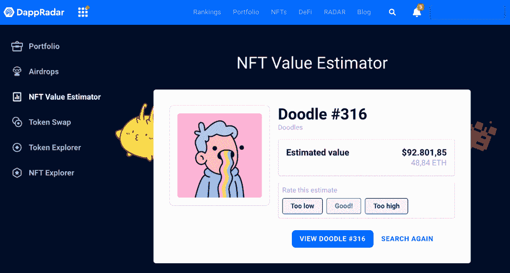

# NFT 价值评估者:如何发现代币的价值

> 原文：<https://web.archive.org/web/https://dappradar.com/blog/nft-value-estimator>

## 了解 DappRadar 工具，它可以帮助您评估您的 NFT。

对于任何发现收藏品机会的人来说，计算出 NFT 的当前价值至关重要。但是，如果 dapp 领域有如此多的猜测和噪音，你该怎么做呢？DappRadar 团队为你想出了一个简单易用且超级需要的解决方案。请继续阅读，了解我们的 NFT 价值评估工具。

## 什么是 NFT 价值估计量？

正如你可以从名字中推断出的， [NFT 价值估算器](https://web.archive.org/web/20220925234330/https://dappradar.com/hub/nft-value-estimator/)是寻找 NFT 机会的人最有用的工具之一。它允许您从各种收藏中检查 NFT 当前价格的精确估计。

对任何人来说，准确评估不可替代的令牌是一项极其困难的任务。即使你在 NFT 领域已经非常有经验，投资也不应该掉以轻心。

这就是为什么这个工具如此有价值——它给你额外的帮助，让你从最明显的价值因素看得更远，比如特定特征的稀有性。

## NFT 估值器是如何工作的？

DappRadar 的工程师使用机器学习算法创建了 NFT 价值估计器，该算法结合了来自不同来源的每个令牌的当前和历史价格。

这样，该工具可以在几秒钟内提供最准确的实际估价。

## 我能估算任何 NFT 的价值吗？

你可能知道，每天都有新的 NFT 系列出现。因此，估计每一个人的价值是不切实际的。

我们的工具验证和选择一些最好的 NFT 集合，以提供准确的估计。

[<picture></picture>](https://web.archive.org/web/20220925234330/https://dappradar.com/blog/what-are-non-fungible-tokens-nfts)[<picture></picture>](https://web.archive.org/web/20220925234330/https://dappradar.com/nft/marketplaces)[<picture></picture>](https://web.archive.org/web/20220925234330/https://dappradar.com/nft/sales)

## DappRadar 可以帮助评估哪些 NFT 藏品的价值？

总的来说，DappRadar 的 NFT 估值器可以帮助你发现 64 个不同收藏的估价(在写作的时候)。

其中一些是:

*   [艺术街区策展](https://web.archive.org/web/20220925234330/https://dappradar.com/hub/nft-explorer/collection/art-blocks-curated)；
*   [志那都红豆](https://web.archive.org/web/20220925234330/https://dappradar.com/hub/nft-explorer/collection/azuki)；
*   [无聊猿游艇俱乐部](https://web.archive.org/web/20220925234330/https://dappradar.com/hub/nft-explorer/collection/bored-ape-yacht-club)；
*   [酷猫 NFT](https://web.archive.org/web/20220925234330/https://dappradar.com/hub/nft-explorer/collection/cool-cats-nft)；
*   [隐朋克](https://web.archive.org/web/20220925234330/https://dappradar.com/hub/nft-explorer/collection/cryptopunks)；
*   [涂鸦](https://web.archive.org/web/20220925234330/https://dappradar.com/hub/nft-explorer/collection/doodles-official)；
*   [散列表](https://web.archive.org/web/20220925234330/https://dappradar.com/hub/nft-explorer/collection/hashmasks)；
*   [隐形朋友](https://web.archive.org/web/20220925234330/https://dappradar.com/hub/nft-explorer/collection/invisiblefriends)；
*   [好友](https://web.archive.org/web/20220925234330/https://dappradar.com/hub/nft-explorer/collection/veefriends)；
*   [女人的世界](https://web.archive.org/web/20220925234330/https://dappradar.com/hub/nft-explorer/collection/world-of-women-nft)；
*   [goblintownft](https://web.archive.org/web/20220925234330/https://dappradar.com/hub/nft-explorer/collection/goblintownnft)。

## 我如何使用 NFT 值估计？

使用这个工具非常简单明了。

[Check out the estimated value of your favorite NFT.](https://web.archive.org/web/20220925234330/https://dappradar.com/hub/nft-value-estimator)

按照下面的步骤操作。

1.  参观 DappRadar.com；
2.  点击主页面上的 [NFT 值估算器](https://web.archive.org/web/20220925234330/https://dappradar.com/hub/nft-value-estimator)按钮；
3.  选择要评估的令牌的 NFT 集合；
4.  粘贴 NFT ID 或粘贴其市场中的 NFT URL；
5.  查看 NFT 的估计价值。

## 使用 DappRadar 跟踪您的 NFT

NFT 估值器并不是唯一能帮助你踏上 NFT 之旅的 DappRadar 工具。

我们的 [NFT 浏览器](https://web.archive.org/web/20220925234330/https://dappradar.com/hub/nft-explorer)允许你搜索以太坊网络上的所有非功能性食物和收藏。我们的排名还向您展示了最热门的 NFT 收藏、市场排名和顶级实时销售。

[https://web.archive.org/web/20220925234330if_/https://www.youtube.com/embed/fkEaXYLOW-s?feature=oembed](https://web.archive.org/web/20220925234330if_/https://www.youtube.com/embed/fkEaXYLOW-s?feature=oembed)

如果你只是想管理你的 NFT，你可以将你的钱包连接到 [DappRadar 投资组合跟踪器](https://web.archive.org/web/20220925234330/https://dappradar.com/hub/wallet/)并查看你在以太坊、多边形和 BNB 链上的投资统计。

如果你想在激动人心的 NFTs 世界中了解更多最好的项目，那么关注 DappRadar [博客](https://web.archive.org/web/20220925234330/https://dappradar.com/blog/)、 [YouTube](https://web.archive.org/web/20220925234330/https://www.youtube.com/c/DappRadar) 频道和 [Twitter](https://web.archive.org/web/20220925234330/https://twitter.com/dappradar) 账户。

***以上不构成投资建议。此处给出的信息仅供参考。请尽职调查并自行研究。***

 NewsletterUnsubscribe at any time. [T&Cs](https://web.archive.org/web/20220925234330/https://dappradar.com/terms) and [Privacy Policy](https://web.archive.org/web/20220925234330/https://dappradar.com/privacy-policy)