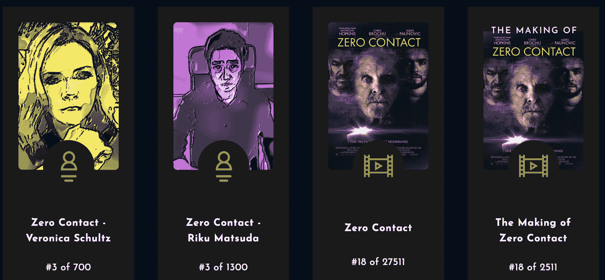

# NFT 视频流媒体服务 Vuele 在 CurrencyWorks 链上推出

> 原文：<https://web.archive.org/web/https://dappradar.com/blog/nft-video-streaming-service-vuele-launches-on-currencyworks-chain>

## 购买、出售和交易独家 NFT 故事片和可收藏的内容

**Vuele 是一种创新的电影内容流媒体服务，完全由 NFTs 和区块链技术支持。该平台允许用户购买限量版的 NFT 故事片和电影相关内容，所有这些都由区块链交易提供担保。**

电影业距离大规模采用不可替代的代币还很遥远。然而，像 Vuele 这样的平台正在迈出第一步。Vuele 旨在将传统流媒体服务与区块链技术提供的安全性和透明度结合起来。

在 Vuele 上，影迷们有机会拥有自己喜爱的电影作为 NFTs。更何况收藏者不需要具备操作一个[加密货币钱包](https://web.archive.org/web/20230111003046/https://dappradar.com/blog/best-ethereum-crypto-wallet-for-2022/)的技术知识。该平台支持菲亚特和加密支付。此外，Vuele 上的注册过程尽可能简单和用户友好。你可以用电子邮件地址注册，或者直接使用你的谷歌账户。

Vuele 视频流媒体平台依赖于建立在 Polkadot 网络上的 CurrencyWorks 区块链。这使得该项目能够为用户提供大量的互操作性，并支持众多的加密支付选项。

需要注意的是，在 Vuele 上购买 NFT 包通常并不意味着所有者拥有该内容的知识产权。这意味着用户可以欣赏这些电影、图像和其他文件供个人使用，但他们不能对其进行商业利用，除非文件包含艺术家或知识产权持有者的明确许可。

## 你现在能在 Vuele 上看到什么？

Vuele 的第一部电影是《零距离接触》，这是一部由明星安东尼·霍普金斯主演的惊悚片。重要的是，这种产品只能在 Vuele 平台上作为 NFT 使用。收藏家和电影迷可以购买各种 NFT 包，其中一些包括签名海报的独家数字版本。

《零距离接触》讲述了五个人必须合作关闭一个科技巨头最秘密的发明的故事，这个机器要么是人类问题的解决方案，要么是地球生命的终结。由巨星安东尼·霍普金斯主演的这部电影吸引了很多关注。

在撰写本文时，第一包零接触 NFTs 已经销售一空。它包含完整的零接触故事片，幕后花絮，亲笔签名的数字海报，和三个角色传记。虽然这个包已经售罄，但 Vuele 还为《零接触》电影提供了其他几个 NFT 包。你可以在官方 [Vuele 市场](https://web.archive.org/web/20230111003046/https://app.vuele.io/app/marketplace)查看。

## 电影业把赌注押在了 NFT 上

Vuele 为 NFT 空间和电影业做出了重要的一步。吸引像安东尼·霍普金斯这样的大牌明星参与一个完全基于 NFT 的项目，是在电影业大规模采用区块链技术的方向上迈出的一大步。

像[瑞茜·威瑟斯彭](https://web.archive.org/web/20230111003046/https://dappradar.com/hub/wallet/eth/0x7948aa99e095dbfc1971bc8d2d1173893146630e)、[格温妮丝·帕特洛](https://web.archive.org/web/20230111003046/https://dappradar.com/hub/wallet/eth/0x31185f782a7c11044566d70dfcf1c8175486f451)、[伊利亚·伍德](https://web.archive.org/web/20230111003046/https://dappradar.com/hub/wallet/eth/0xf6de94be96f80602d90bf29bd9e88a0e843b2eb9)和[伊娃·朗格利亚](https://web.archive.org/web/20230111003046/https://dappradar.com/hub/wallet/eth/0xaa1b056286a66a9e6752c26776ac034c662a51d5)这样的电影明星已经亲自跳进了 NFT 的空间。然而，大制作公司和电影制片厂在采用区块链技术实际发行电影方面仍然落后。

随着 Vuele 做出如此大胆的举动，电影业对不可替代代币的大规模采用又近了一步。DappRadar 将继续监测该平台，因为更多的作品需要一个信念的飞跃，并决定完全上线。要了解加密领域的最新发展，请关注 Twitter 上的 DappRadar。此外，你可以查看 [DappRadar 名人钱包](https://web.archive.org/web/20230111003046/https://dappradar.com/blog/celebrity-wallets-a-dive-into-crypto-hollywood)列表，浏览一些电影行业大腕的个人收藏。

 NewsletterUnsubscribe at any time. [T&Cs](https://web.archive.org/web/20230111003046/https://dappradar.com/terms) and [Privacy Policy](https://web.archive.org/web/20230111003046/https://dappradar.com/privacy-policy)