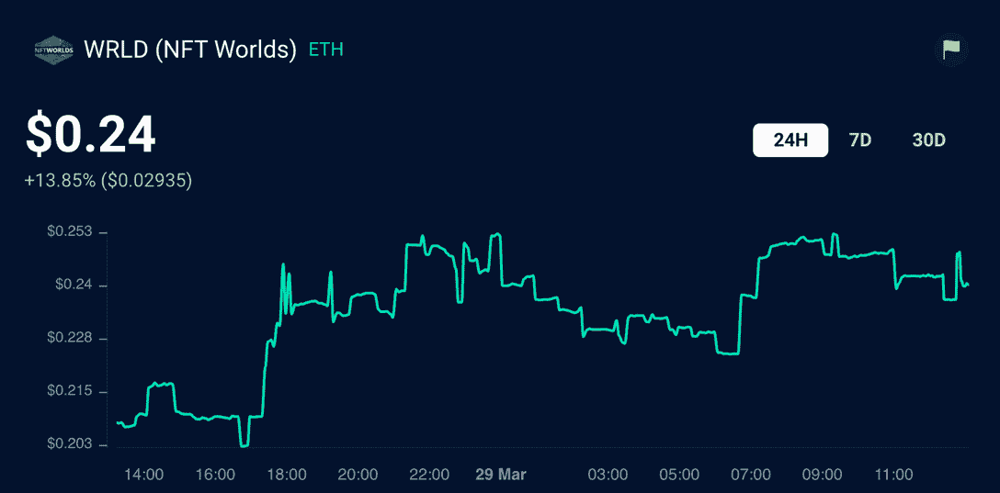
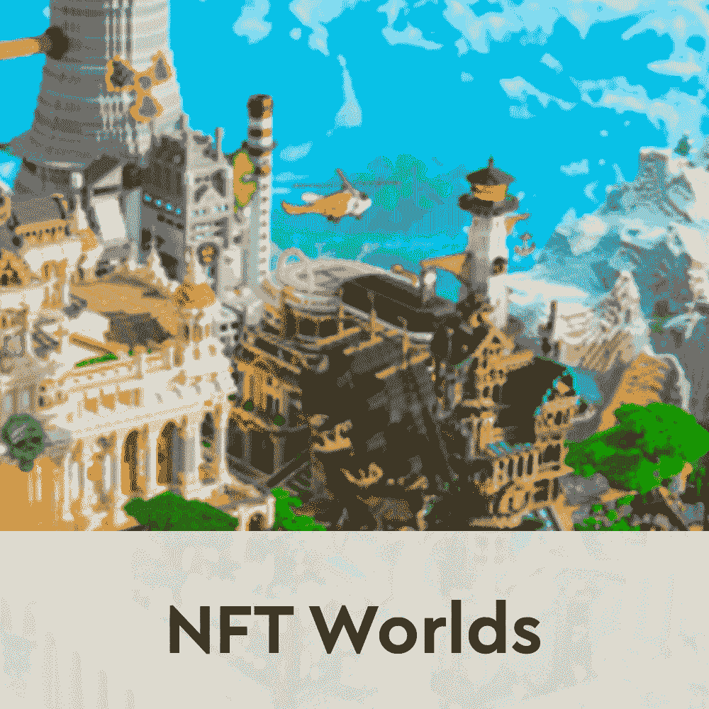
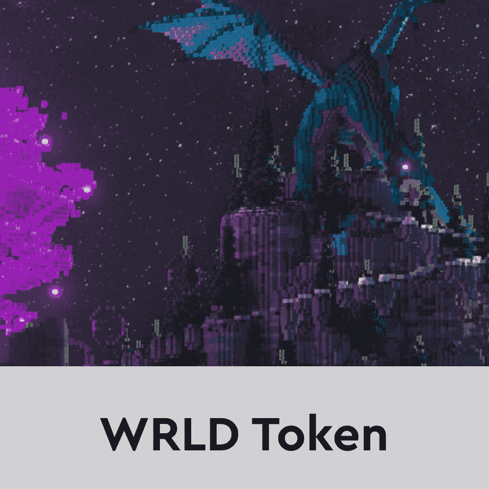
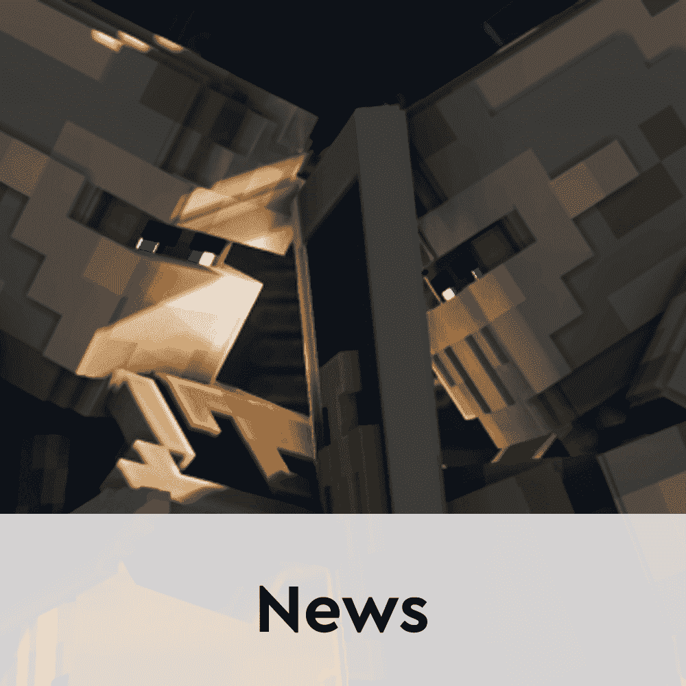

# NFT 世界期待下注数百万 WRLD 代币

> 原文：<https://web.archive.org/web/https://dappradar.com/blog/nft-worlds-looking-to-stake-millions-of-wrld-tokens>

## 许多令牌经济稳定机制将被引入平台

[**NFT 世界**](https://web.archive.org/web/20221007155252/https://dappradar.com/ethereum/games/nft-worlds) **是目前领先的虚拟世界平台之一，这在一定程度上归功于其本土的 WRLD 令牌。NFT 世界的生态系统是业内发展最快的生态系统之一，很快玩家就可以用他们的 WRLD 股份来赚取更多的代币作为被动收入。**

根据 NFT 世界的联合创始人 ArkDev 最近的一条推文，该平台将引入几个级别的 T2 WRLD 赌金机会。重要的是，赌注奖励将与个人世界的表现挂钩。越活跃，下注的人就越多，玩家赚的也就越多。

NFT 世界通过去年 12 月的首次空投引入了 WRLD 代币，自那以来，代币一直表现出色。继 2 月份第二次 WRLD 空投之后，这种代币经历了连续几周的价格上涨，在 2 月 19 日达到了 0.62 美元的历史高点。

在撰写本文时，一枚 WRLD 代币的价格是 0.26 美元。重要的是，仅在过去 24 小时内，代币的估值[就增长了 13%以上。这部分是由于新宣布的打桩机制。](https://web.archive.org/web/20221007155252/https://dappradar.com/hub/token/eth/WRLD?from=0xd5d86fc8d5c0ea1ac1ac5dfab6e529c9967a45e9)

这种出色的表现给 NFT 世界带来了很多关注。令人印象深刻的是，这款游戏目前在所有以太坊虚拟世界中拥有最高的土地底价。根据最近的 DappRadar 报告，该平台也是虚拟土地平均价格最高的平台之一。与分散土地中的 9 万块和沙盒中的 16.6 万块土地相比，10，000 块土地的限制，这些价格差异并不完全令人惊讶。

## NFT 世界推动代币经济稳定机制

虽然陆地 NFT 是 NFT 世界平台的基础元素，但它的原生令牌对游戏性也有着重要的影响。这就是为什么这个团队正在寻找各种方法来稳定游戏中的代币经济。

个人赌注是这些努力中的第一个工具。虽然关于 staking 机制的更多细节将在不久的将来变得可用，但 ArkDev 已经提供了一些线索。根据他的帖子，将会有几个赌注漏斗，每个漏斗都需要增加最低数量的 WRLD 代币。例如，要进入最高等级的 WRLD 水龙头玩家将不得不为他们拥有的每个世界下注超过 400 万 WRLD 代币。

除了打桩，NFT 世界团队正在实施其他 WRLD 燃烧机制，以确保稳定的价格。游戏中的资产市场将把 WRLD 作为主要的经济推动者。所有购买和交易都将在游戏的本地令牌中进行。此外，所有[即将到来的社区化身造币厂](https://web.archive.org/web/20221007155252/https://dappradar.com/blog/nft-worlds-pushing-the-limits-10-eth-for-land-nfts-avatars-dropping-soon/)将需要 WRLD 令牌。

燃烧机制和价格稳定工具对任何成功的游戏赚钱经济都很重要。令人印象深刻的是，NFT 世界的快速发展引起了玩家的兴趣，而 WRLD 代币的估值保持相对稳定。随着 staking mechanics 正式推出，DappRadar 将继续关注这颗元宇宙新星。如果你想了解更多关于 NFT 世界的信息，请点击下面的链接。此外，你可以在 Twitter 上关注 DappRadar，抢先了解最新的元宇宙新闻。

[<picture></picture>](https://web.archive.org/web/20221007155252/https://dappradar.com/ethereum/games/nft-worlds)[<picture></picture>](https://web.archive.org/web/20221007155252/https://dappradar.com/hub/token/eth/WRLD?from=0xd5d86fc8d5c0ea1ac1ac5dfab6e529c9967a45e9)[<picture></picture>](https://web.archive.org/web/20221007155252/https://dappradar.com/blog/tag/nft-worlds) NewsletterUnsubscribe at any time. [T&Cs](https://web.archive.org/web/20221007155252/https://dappradar.com/terms) and [Privacy Policy](https://web.archive.org/web/20221007155252/https://dappradar.com/privacy-policy)