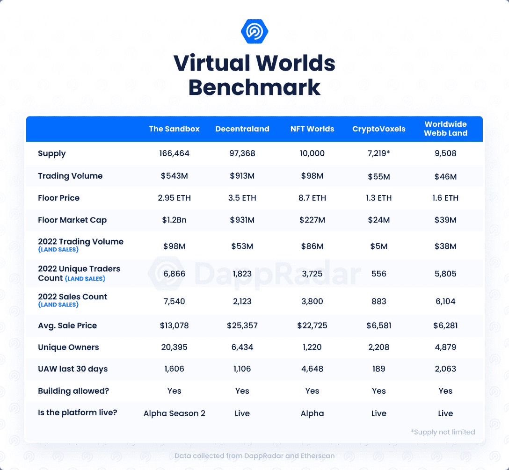
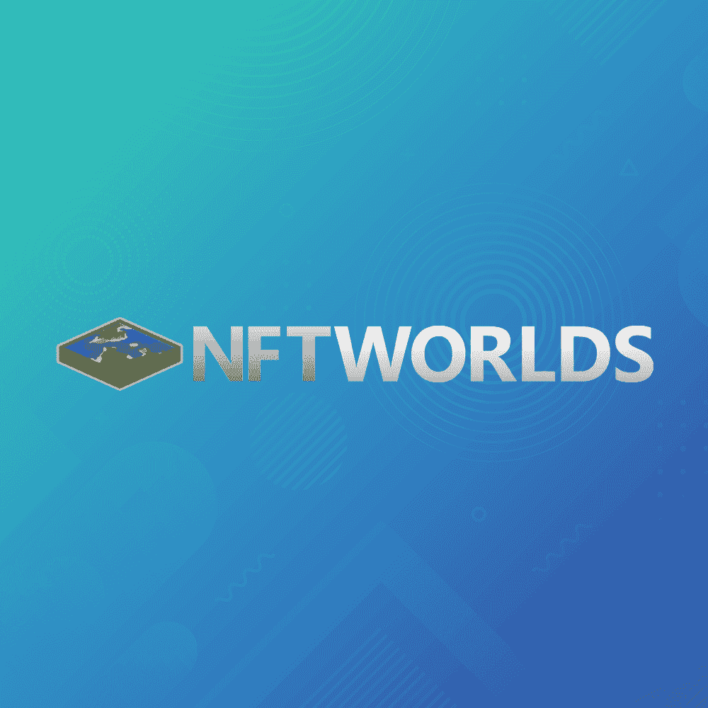
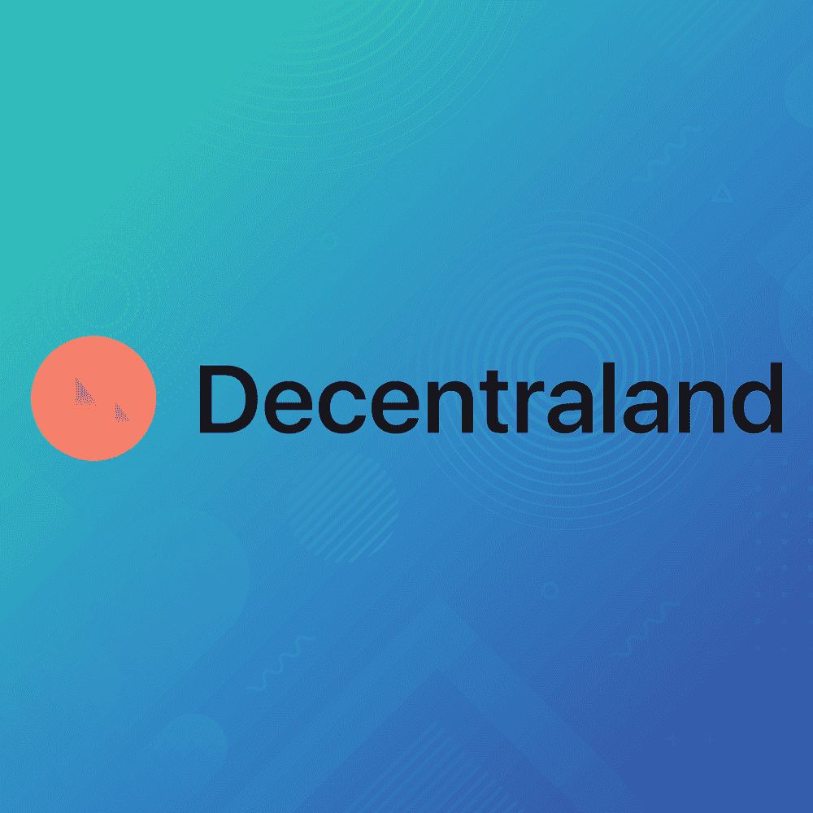

# NFT 世界挑战极限:10 个陆地技能，圣灵即将掉落

> 原文：<https://web.archive.org/web/https://dappradar.com/blog/nft-worlds-pushing-the-limits-10-eth-for-land-nfts-avatars-dropping-soon>

## NFT 世界已经宣布发行 15，000 部虚拟角色动画

NFT 世界看到了强劲的需求，将土地 NFTs 的底价推向 10 ETH，同时该团队还宣布了即将推出的阿凡达 NFT 系列。对于一个在过去几个月里连续发布更新的项目来说，这些都是重大进展。

NFT 世界是元宇宙迄今为止发展最快的虚拟世界之一。早在 10 月份，当该项目举行了第一次造币厂，一个地块的楼面价约为 0.2 ETH。现在已经高达每 NFT 10 个以太网。此外，该团队已经宣布，他们将推出后续收集的 15，000 个游戏中的化身 NFT。

NFT 世锦赛团队在 2021 年 12 月和 2022 年前几个月非常活跃。该平台最重要的更新之一是 [WRLD 令牌](https://web.archive.org/web/20230111231407/https://dappradar.com/hub/token/eth/WRLD?from=0xd5d86fc8d5c0ea1ac1ac5dfab6e529c9967a45e9)在两个不同的空投点投放。在第二次也是最后一次空投后，[2 月 19 日，这种原生代币创下了 0.62 美元的历史新高，引起了巨大的轰动。](https://web.archive.org/web/20230111231407/https://dappradar.com/blog/final-wrld-airdrop-for-nft-holders/)

与此同时，游戏的土地 NFTs 的估价迅速攀升到新的高度。原因？拥有一块土地可以让玩家通过 [WRLD 代币](https://web.archive.org/web/20230111231407/https://dappradar.com/hub/token/eth/WRLD?from=0xd5d86fc8d5c0ea1ac1ac5dfab6e529c9967a45e9)获得被动收入。当地货币价格的上涨促使许多投资者购买土地以获得 WRLD 的回报。进而将 NFT 世界的土地价值推高至目前的 10 ETH，约合 3 万美元。相比之下，其他主要的虚拟世界如[、沙盒](https://web.archive.org/web/20230111231407/https://dappradar.com/ethereum/marketplaces/the-sandbox-marketplace)和[分散的土地](https://web.archive.org/web/20230111231407/https://dappradar.com/hub/token/eth/MANA/ETH?from=0x0f5d2fb29fb7d3cfee444a200298f468908cc942)的底价只有第四区的一半。

不仅如此，在虚拟世界中拥有土地给了玩家几乎无限的创造机会。该平台创建于《我的世界》生态系统内，允许玩家完全定制一个情节，并创建几种不同的体验。从赛车 P2E 游戏，第一人称射击游戏，大型角色扮演游戏，皇家战役，等等。然而，玩家确实需要一个《我的世界》Java 版的副本来完全接受 NFT 世界所提供的一切。

## NFT 世界的头像会带来什么？

NFT 世界的化身是 15000 个 NFT 的集合，代表游戏中的可玩角色，可以用来在所有 NFT 世界的领域中个性化你自己。

你在游戏钱包里的任何 NFT 世界头像都可以随时装备。装备一个虚拟角色将会改变你在游戏中的形象以匹配你的虚拟角色。除了视觉效果之外，NFT 世界团队还宣布创世纪头像系列还将提供独家游戏内奖励，包括 WRLD 代币。然而，关于这些奖励机制的细节仍然很少。

15000 英镑的创世纪头像 NFT 系列的铸造过程和定价细节也是如此。我们知道的是，前 10，000 个陆地 NFT 的所有者将获得访问头像集合的白名单。剩下的 5000 个头像将提供给公共造币厂。

除了创世纪 NFT 世界头像集合，该团队还将推出 NFT 世界社区头像集合。它将允许游戏中的项目和社区将他们的 PFP 角色作为完全可玩的化身带入虚拟世界。

考虑到《NFT 世界》的受欢迎程度大幅上升，即将推出的《阿凡达》系列预计也会遵循同样的模式。此外，潜在的被动 WRLD 奖励也提高了人们对该系列的兴趣。

## 地板是熔岩

到 2021 年底，元宇宙置地一直处于加密投资的前沿。2022 年的前几个月也是如此。根据 MetaMetrics 的数据，所有基于以太坊的虚拟世界平台上的虚拟世界已经吸引了超过 50，000 名独特的钱包持有者。

大约 90%的所有者目前只在一个虚拟世界中拥有土地。然而，采用率正在迅速增长。根据最近的 DappRadar [沙盒土地估价报告](https://web.archive.org/web/20230111231407/https://dappradar.com/blog/the-sandbox-land-valuation-report/#comparison)，NFT 世界是 2022 年交易量第三大的虚拟土地 NFT 集合，拥有近 4000 名独立交易者。Sandbox 和 WorldWideWebb 分别以 6866 名和 5805 名独立交易者位居榜首。

此外，许多虚拟世界平台仍处于测试阶段。这意味着这些项目还没有部署全部能力来迎接更多的观众。一旦这种情况发生，虚拟土地将成为一个更加突出的加密空间。

DappRadar 将继续监测元宇宙，为您带来最新的公告和数据。如果你想了解更多关于 NFT 世界和虚拟土地的信息，请点击下面的链接。此外，你还可以在 Twitter 上关注 DappRadar，抢先获得最新消息。

[<picture></picture>](https://web.archive.org/web/20230111231407/https://dappradar.com/ethereum/games/nft-worlds)[<picture></picture>](https://web.archive.org/web/20230111231407/https://dappradar.com/ethereum/marketplaces/the-sandbox-marketplace)[<picture></picture>](https://web.archive.org/web/20230111231407/https://dappradar.com/hub/token/eth/MANA/ETH?from=0x0f5d2fb29fb7d3cfee444a200298f468908cc942) NewsletterUnsubscribe at any time. [T&Cs](https://web.archive.org/web/20230111231407/https://dappradar.com/terms) and [Privacy Policy](https://web.archive.org/web/20230111231407/https://dappradar.com/privacy-policy)