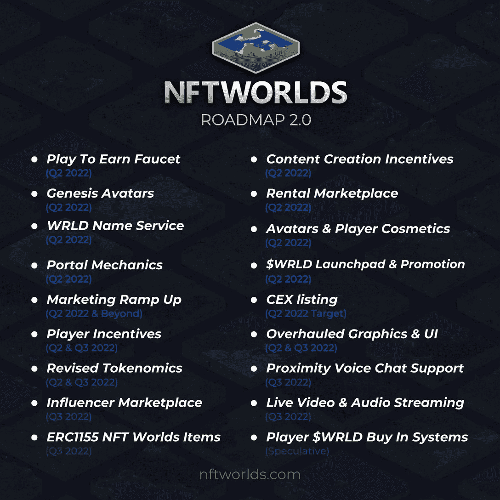

# NFT 世界将为游戏项目设立奖励池

> 原文：<https://web.archive.org/web/https://dappradar.com/blog/nft-worlds-roadmap-play-to-earn-faucet-wrld-token-rewards>

## 项目通过下注代币获得奖励池

NFT 世界计划引入 Play to Earn 水龙头，向活跃在各种游戏世界的玩家发放奖励。世界创造者通过下注预定义数量的 WRLD 代币获得不同的水龙头等级。他们在最新更新的路线图中宣布了这些计划。

## 摘要

*   目前，NFT 世界收藏的一件 NFT 至少要花费 9.6 ETH 或 3 万美元
*   自 2021 年 10 月推出以来，NFT 世界已经有超过 8100 万美元的交易量
*   NFT 世界将引入奖励池，开发者可以通过下注 WRLD 代币来获得奖励
*   WRLD 会去集中交易所，团队会[介绍 veWRLD](https://web.archive.org/web/20221001233951/https://dappradar.com/blog/nft-worlds-roadmap-play-to-earn-faucet-wrld-token-rewards/#attention)

## WRLD 玩赚水龙头

NFT 世界让开发者在《我的世界》的虚拟世界中创造游戏赚钱。开发者可以通过下注一定数量的 WRLD 代币来进入奖励池。NFT 世界将引入等级，更高的等级将带来更大的奖励池。赌注 WRLD 将作为抵押品，以防止世界所有者滥用他们的象征性奖励分配。

在过去的几个月里，我们看到了 NFT 世界的大动作。这些地块曾经是免费分配的，但现在以 9.6 ETH 或超过 3 万美元的价格出售。该项目为土地所有者引入了 NFT 赌注，以及以固定价格互相出租世界的能力。同时，玩家可以体验边玩边赚的机制，而不用担心油费。每个世界都支持跨平台的多人游戏，团队引入了更多的功能。

根据路线图文件，NFT 世界已经吸引了超过 55，000 名玩家使用它的服务器。这些玩家已经为他们的游戏活动赚取了总计 500，000 WRLD 代币。在撰写本文时，这超过了 124，000 美元，即平均每位玩家 2.25 美元。这些玩家不需要学习任何新东西，因为 NFT 世界使用了《我的世界》的框架。这意味着玩家在熟悉的领域里玩，同时获得乐趣和代币。

## 对 WRLD 的更多关注

NFT 世界的团队计划推翻他们的令牌组学。不是整个 [WRLD 代币](https://web.archive.org/web/20221001233951/https://dappradar.com/hub/token/eth/WRLD?from=0xd5d86fc8d5c0ea1ac1ac5dfab6e529c9967a45e9)供应量的 50%,只有 35%将用于“玩即赚”奖励。他们将用剩下的 15%让股票在集中交易所上市。然而，他们没有提到任何名字。这一进程应于 6 月底完成。

为了创造一个更健康的经济，该团队将引入赌注选项。通过下注或锁定 WRLD，参与者将同时赢得 WRLD 和沃罗德。veWRLD 或投票托管 WLRD 令牌作为治理令牌，但也可以用来赚取游戏中的独家项目。此外，玩家还可以将 WRLD 押在一个特定的世界上，以帮助他们满足前面提到的水龙头要求。回报将取决于这个特定世界的表现。NFT 世界的团队希望在四月底之前分享更多关于 WRLD 下沉的细节。

## NFT 世界迈向 1 亿澳元

2021 年 10 月，NFT 世界免费分发了它的土地。从那时起，该项目已经实现了 8180 万美元的交易量，超过了像月饼这样的老项目。与此同时，NFT 世锦赛在 NFT 收藏排行榜上的排名迅速上升。按照目前的速度，NFT 世界应该进入前 50 名，并在月底之前超过 Kaiju Kingz 和 Hashmasks。今年 5 月，总部位于《我的世界》的虚拟世界可能会突破 1 亿美元大关。这将把 NFT 世界带入一流的区块链项目领域。

