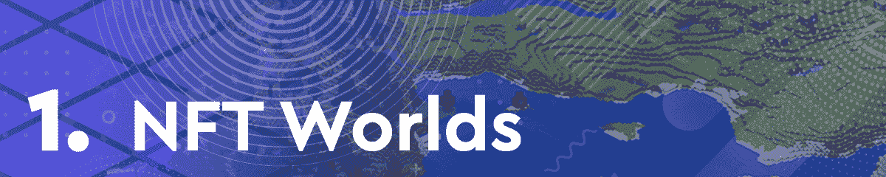
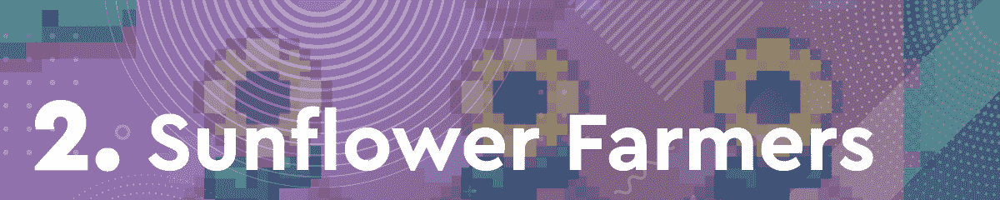
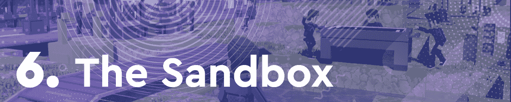
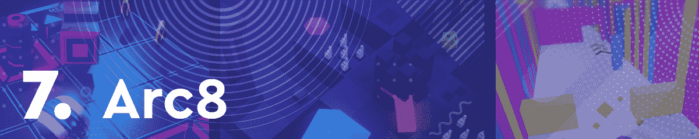
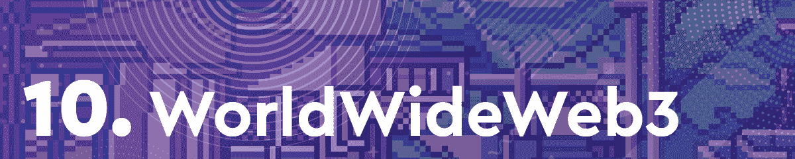

# 由于 Worlds 托肯，NFT 世界抢得头名

> 原文：<https://web.archive.org/web/https://dappradar.com/blog/nft-worlds-snatches-top-spot-thanks-to-wrld-token>

## 基于多边形的向日葵农民作为一个新的入口抢尽了风头

虚拟世界平台《NFT 世界》占据了本周区块链十大游戏排行榜的首位，这要归功于其本土代币 WRLD 令人羡慕的升值。在本周的版本中，我们还看到一个新的条目面对多边形奇迹向日葵农民。该游戏在过去一周的活动中出现了巨大的峰值。

在过去的几个月里，区块链游戏一直处于加密活动的前沿。在这篇每周一期的文章中，DappRadar 将会关注最热门的游戏 dapps。为了编制这个排名，我们考虑了连锁活动、NFT 交易量、代币估值以及围绕每个 dapp 的新闻和事件。

浏览本周十大区块链游戏的完整列表，并点击相应的图片，了解每个平台的更多信息。

[https://web.archive.org/web/20220929044603if_/https://www.youtube.com/embed/T5gAbvcrjlY?feature=oembed](https://web.archive.org/web/20220929044603if_/https://www.youtube.com/embed/T5gAbvcrjlY?feature=oembed)

NFT 世界成为本周的焦点，这要归功于其本土标志 WRLD 的估价大幅飙升。代币的首次空投发生在去年 12 月下旬，仅在过去的七天里，它的价值就上涨了 268%以上。此外，NFT 世界成功完成了它的第一次试玩。数百名玩家加入其中一个世界，玩游戏并相互交流，没有出现明显的延迟或错误。

《向日葵农民》进入本周十大游戏，排名第二。基于 Polygon 的 sensation 在过去一周一直是排名第一的 Polygon dapp，吸引了 428.830 个独特的活动钱包，超过了协议上的任何其他 dapp。此外，该平台在过去七天内产生了超过 200 万美元的交易量。

DeFi 王国已经连续几周成为 DappRadar 每周游戏排行榜前十名的一部分。虽然 Harmony dapp 自上次排名以来下降了几个位置，但它仍然排在前 3 位。在过去的一周里，DeFi 王国的发展达到了一个重要的里程碑。这款本土代币珠宝的市值达到了 10 亿美元，仅在过去七天里，其估值就上涨了 47%。

由于与主流大品牌的重要合作关系，虚拟世界分散土地本周排名攀升。随着网球赛季的开始，澳大利亚网球公开赛指日可待。重要的是，大型网球锦标赛已经与分散的土地合作，为网球爱好者提供独家派对体验。为了宣传其 CES 公告，三星还将在虚拟世界中开设一家虚拟商店。此外，分散土地宣布，它现在支持在分散土地本地市场的所有非专利技术的版税功能。这种奖励创作者的举措在社交媒体上受到了社区的赞赏。

虽然《碎片之地》的粉丝们仍在等待 2022 年初游戏的主要公告，但这款基于蜂巢的热门游戏仍排在第五位。在过去的七天里，Splinterlands 拥有超过 532.910 个独特的活动钱包，是所有连锁店中访问量最大的游戏 dapp。

沙盒目前正在捍卫其作为顶级虚拟世界之一的地位。本周排名第六，因为本地令牌 SAND 的价值下降，沙盒仍然输出冠军统计数据。在过去的七天里，虚拟世界产生了超过 1600 万美元的交易量。此外，沙盒宣布了一个即将到来的土地销售活动，吸引了更多的用户。

基于多边形的 Arc8 正面临后起之秀向日葵农民的激烈竞争。然而，基于移动的游戏 dapp 宣布了一些重大消息。该平台现在推出了一款全新的迷你游戏，专为 G-bot NFT 所有者提供。这款新游戏名为 Sky Lord，与 dapp 提供的其他迷你游戏相比，它具有利润丰厚的奖励池。

蜡像巨兽《外星世界》在本周的排名中名列第八。具体来说，由于在过去一周吸引了 379.250 个独特的活跃钱包。采矿游戏尚未宣布 2022 年的任何重大事件。尽管如此，其庞大的粉丝群一直在推动它前进。《外星世界》也刚刚庆祝了一周年纪念日。不幸的是，在过去的一周里,《外星世界》见证了它的本土货币 TLM 贬值了 10%多一点。

基于 EOS 的房地产游戏《高地》本周进入排行榜，这要归功于一项重要公告。这个游戏展示了一个即将出售的新地标建筑。大都会艺术博物馆将吸引艺术爱好者成为虚拟世界的下一个地标。此外，高地最近宣布了两个全新的社区，吸引了更多的玩家。

最后但同样重要的是，本周我们有万维网 3。虚拟世界在排名中垫底。然而，在过去的一周里，dapp 仍然有大量的活动。创造了超过 760 万美元的 NFT 交易量，虚拟世界还宣布在世界上推出一个新的区域。新的地区将被称为令牌谷。

## 虚拟世界和边玩边赚继续主导着游戏领域

2022 年的第一周证实了去年年底开始出现的趋势。虚拟世界和元宇宙继续吸引着越来越多的用户，尤其是像 NFT 世界这样的新兴平台。由于元宇宙仍处于起步阶段，用户正在寻找最佳的新虚拟体验。

此外，像新兴的向日葵农民平台这样的游戏赚钱机会继续挑战游戏和 DeFi 的界限。随着新的 dapps 在所有连锁店涌现，从玩到赚运动继续获得动力。这进一步证明了密码爱好者享受各种形式和规模的赚钱机会。

随着区块链博彩业在 2022 年达到新的高度，DappRadar 将继续对其进行监控。如果你想看到你最喜欢的区块链游戏的最新数据，请查看 [DappRadar PRO](https://web.archive.org/web/20220929044603/https://dappradar.com/token/pro) 。使用 PRO，您还可以访问独家 Discord 频道，讨论您的游戏成就。请继续关注下周的区块链十大游戏，因为游戏领域的发展速度很快，我们可能会看到新的竞争者争夺冠军！

 NewsletterUnsubscribe at any time. [T&Cs](https://web.archive.org/web/20220929044603/https://dappradar.com/terms) and [Privacy Policy](https://web.archive.org/web/20220929044603/https://dappradar.com/privacy-policy)