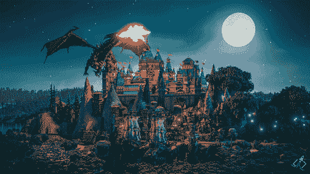
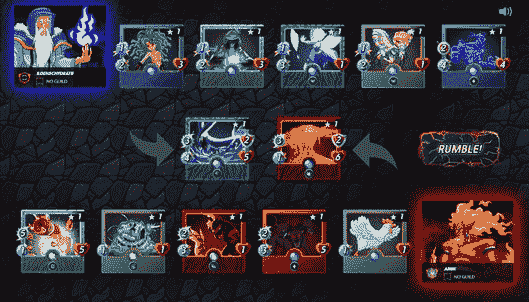
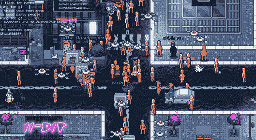
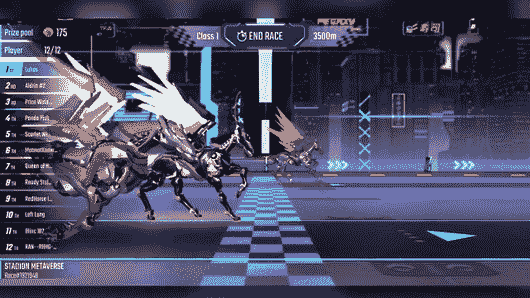
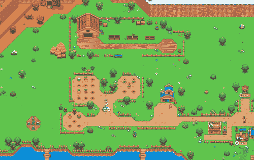
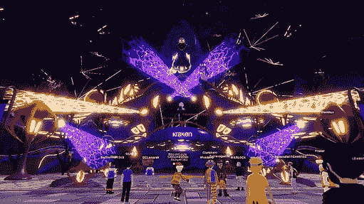
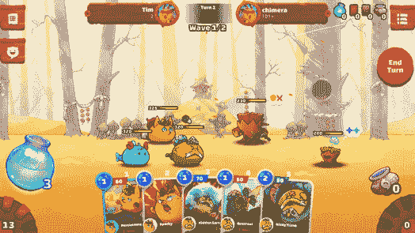
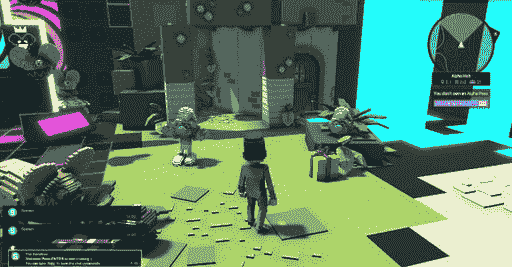
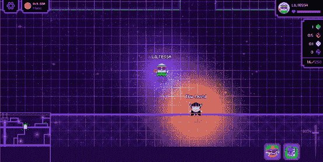

# NFT 世界凭借新路线图、大量代币和需求取得胜利

> 原文：<https://web.archive.org/web/https://dappradar.com/blog/nft-worlds-triumphs-with-new-roadmap-pumping-token-demand>

## NFT 世锦赛势头强劲，将斯皮特兰和环球韦布甩在了身后

[**NFT 世界**](https://web.archive.org/web/20221002004742/https://dappradar.com/ethereum/games/nft-worlds) **由于世界 NFTs 的底价不断提高，代币价格不断上涨，以及大范围更新的路线图，成为人气最旺的游戏。交易卡牌游戏** [**【小夹板】**](https://web.archive.org/web/20221002004742/https://dappradar.com/multichain/games/splinterlands) **下降了一个名次，而元宇宙游戏世界的** [**全球 Webb**](https://web.archive.org/web/20221002004742/https://dappradar.com/ethereum/collectibles/worldwide-webb-land) **继续缓慢上升。**

虽然许多虚拟世界的土地价格有所下降，但 NFT 世界只会变得更加昂贵。现在市场上最便宜的世界售价 9.8 ETH，约合 2.9 万美元。与此同时，WRLD 币升值了 18.8%。新路线图的发布强调了这种积极的情绪，指出该团队将引入土地标桩、奖励池水龙头和 WRLD 令牌的更多利用。

尽管 Splinterlands 掉到了排行榜的第二位，但该项目经历了非常稳定的一周。交易卡游戏吸引了超过 500，000 个独特的活跃钱包，而 SPS 治理令牌在整个行业的熊市周期间保持稳定。与此同时，随着 NFT 交易量的大幅增长和土地所有者的新利益给该项目带来了一些动力，全球范围内的韦伯排名不断攀升。

## 本周游戏解释

根据我们最新的[BGA 2022 年 Q1 区块链游戏报告](https://web.archive.org/web/20221002004742/https://dappradar.com/blog/dappradar-x-bga-games-report-q1-2022)，区块链游戏驱动了 52%的在线活动。这篇文章通过结合连锁活动、NFT 交易量、代币估值和围绕项目的新闻，来观察本周最热门的游戏 dapps。

在下面浏览本周十大区块链游戏的完整列表。单击相应的图片，了解每个平台的更多信息。或者，看看下面的视频，它总结了排名，可以快速查看。

[https://web.archive.org/web/20221002004742if_/https://www.youtube.com/embed/MGC4OAbXqd0?feature=oembed](https://web.archive.org/web/20221002004742if_/https://www.youtube.com/embed/MGC4OAbXqd0?feature=oembed)

## 1.世界

NFT 世界已经成为第一名，这要归功于即将到来的头像掉落，更新和扩展的路线图，以及对 [WRLD 令牌](https://web.archive.org/web/20221002004742/https://dappradar.com/hub/token/eth/WRLD?from=0xd5d86fc8d5c0ea1ac1ac5dfab6e529c9967a45e9)的强烈赞赏。

## 2.[夹板垫](https://web.archive.org/web/20221002004742/https://dappradar.com/multichain/games/splinterlands)

超过 500，000 名玩家将 Splinterlands 推上了排行榜，而其原生的 [SPS 标记](https://web.archive.org/web/20221002004742/https://dappradar.com/hub/swap/bsc/BNB/SPS?to=0x1633b7157e7638c4d6593436111bf125ee74703f)在熊市的一周中保持稳定。

## 3.[全球韦伯](https://web.archive.org/web/20221002004742/https://dappradar.com/ethereum/collectibles/worldwide-webb-land)

土地所有者的广告选择、各种各样的社会活动、稳定的 NFT 交易量和一个头像的预告片把 WWW 推上了排行榜。

## 4.[peg xy](https://web.archive.org/web/20221002004742/https://dappradar.com/polygon/games/pegaxy)

流行的机甲赛马游戏 Pegaxy 现在也有一个面向 Android 用户的移动版本，目前正在测试中。

## 5.[外星世界](https://web.archive.org/web/20221002004742/https://dappradar.com/multichain/games/alien-worlds)

尽管外星世界仍然吸引着大量的活动，GameFi dapp 的使用量却大幅下降。此外， [TLM 令牌](https://web.archive.org/web/20221002004742/https://dappradar.com/hub/token/bsc/TLM?from=0x2222227e22102fe3322098e4cbfe18cfebd57c95)失去了一些价值。

## 6.[向日葵地](https://web.archive.org/web/20221002004742/https://dappradar.com/polygon/games/sunflower-land)

即将到来的代币发行和有趣的复活节找彩蛋活动为向日葵王国带来了创纪录的 110，999 UAW。

## 7.[分散式国家](https://web.archive.org/web/20221002004742/https://dappradar.com/ethereum/marketplaces/decentraland)

当你的元宇宙世界迎来全球最大的 EDM 音乐节之一 Coachella 时，你这一周过得很好。[法力](https://web.archive.org/web/20221002004742/https://dappradar.com/hub/token/eth/MANA/ETH?from=0x0f5d2fb29fb7d3cfee444a200298f468908cc942)上升 3.4%。

## 8.[轴无穷大](https://web.archive.org/web/20221002004742/https://dappradar.com/multichain/games/axie-infinity)

Axie Infinity 相对平静的一周。没有改变即将到来的竞争赛季和一个关于桩土地的玩笑。与此同时 [AXS 在过去一周下跌了](https://web.archive.org/web/20221002004742/https://dappradar.com/hub/token/eth/AXS?from=0xbb0e17ef65f82ab018d8edd776e8dd940327b28b)6%。

## 9.[沙盒](https://web.archive.org/web/20221002004742/https://dappradar.com/ethereum/games/the-sandbox)

而[沙子升值 1.2%](https://web.archive.org/web/20221002004742/https://dappradar.com/hub/token/eth/SAND/ETH?from=0x3845badade8e6dff049820680d1f14bd3903a5d0) ，真正的 banger 来自各种合伙。活结会给沙盒带来一些重金属！

## 10.aavegotchi

随着 31，870 个独特的钱包涌入，Gotchiverse 变得更加繁忙。他们现在可以种植 Gotchus 炼金术来制造黄金阿尔塔和黄金瓦。 [GHST 仅下降 0.5%](https://web.archive.org/web/20221002004742/https://dappradar.com/hub/token/eth/GHST/ETH?from=0x3f382dbd960e3a9bbceae22651e88158d2791550) 。

