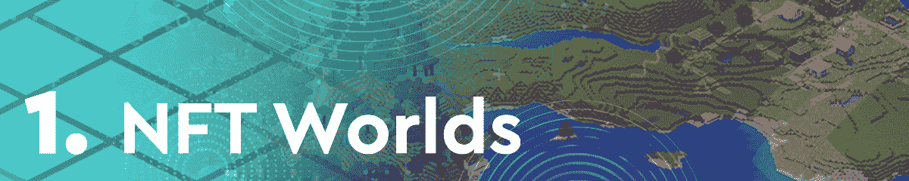
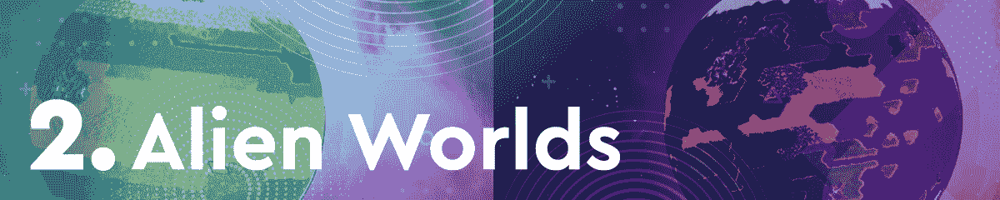
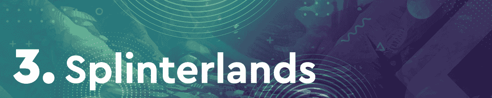
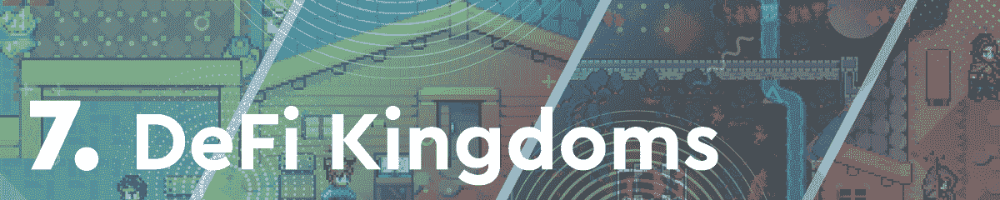
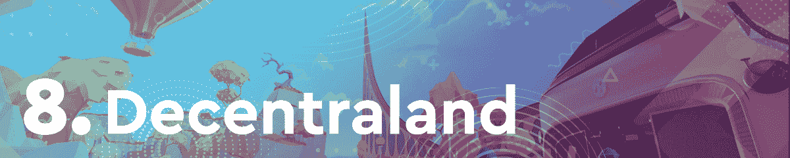
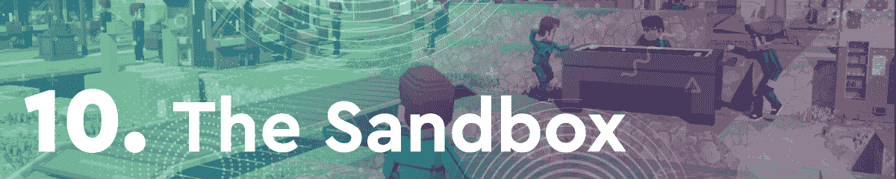

# NFT 世界 WRLD 代币 7 天暴涨 213%

> 原文：<https://web.archive.org/web/https://dappradar.com/blog/nft-worlds-wrld-token-skyrockets-213-in-7-days>

## 分裂之地和外星世界争夺前 3 名

多亏了 Worlds 托肯，NFT 世锦赛毫无疑问是本周区块链十佳比赛的赢家。虚拟世界的观众越来越多，WRLD 令牌的估值在短短七天内增长了 213%。

紧随其后的是我们的终身竞争对手《分裂的土地》和《外星世界》，这两个游戏在过去一周吸引的独特活动钱包方面占据首位。令人印象深刻的是，本周榜单上的所有游戏的原生代币价格都出现了显著上涨。

在过去的几个月里，区块链游戏一直处于加密活动的前沿。通过这篇文章，DappRadar 了解了最热门的游戏 dapps。为了编制这个排名，我们考虑了链上活动，NFT 交易量，令牌估值，以及围绕每个 dapp 的新闻和事件。

在下面浏览本周十大区块链游戏的完整列表。单击相应的图片，了解每个平台的更多信息。或者，看看下面的视频，它总结了排名，可以快速查看。

https://youtu.be/miN63wxuUGo

## 十大区块链游戏–第 6 周

NFT 世界本周高居榜首，这要归功于该平台的本土代币 WRLD 令人印象深刻的 213%的涨幅。此外，虚拟世界在过去七天里产生了超过 460 万美元的 NFT 交易量。为了使这个平台更加用户友好，NFT 世界团队不断推出更新。最新的这些使得游戏中与 WRLD 的交易完全没有汽油，而且快如闪电。此外，据称象征性的赌注期权即将出现。

《外星世界》一直出现在这些每周区块链游戏排行榜上。虽然采矿游戏最近一直在努力登顶，但它在本周的版本中排名第二。排名的上升主要是由于游戏的本地令牌 TLM 的价格上涨。在过去的七天里，TLM 的市值增加了 45%以上。

纸牌交易游戏[splitterlands](https://web.archive.org/web/20221127154935/https://dappradar.com/hive/games/splinterlands)本周排名第三，这要归功于过去 7 天里 479，890 个独特的活跃钱包的大量观众。虽然该团队没有分享任何重大新闻或公告，但该平台继续拥有稳定的追随者。

游戏赚巨人 [Axie Infinity](https://web.archive.org/web/20221127154935/https://dappradar.com/ronin/games/axie-infinity) 本周排名第四。这款回合制卡牌游戏见证了其第 20 个竞技场赛季的开始。凭借这一里程碑，该平台对 SLP 奖励在不同游戏模式中的分配方式进行了重大改变。AXS、SLP 和罗恩的代币价格飙升。

基于多边形的塔防游戏[疯狂防御英雄](https://web.archive.org/web/20221127154935/https://dappradar.com/ethereum/games/crazy-defense-heroes)本周排名第五，这要归功于[的大规模 NFT 销售](https://web.archive.org/web/20221127154935/https://dappradar.com/blog/animoca-brands-announced-tower-chest-sale-for-upcoming-game/)。Animoca Brands，疯狂防御英雄背后的团队宣布了塔箱运动，要求收藏家拥有塔代币才能购买 NFT 包。塔代币是疯狂防御英雄中的游戏赚取奖励代币。

本周独特的活跃钱包数量上升，吸引了 184，780 个用户地址。此外，高地目前正在经历一场广泛的活动，其中包括一些最著名的美国橄榄球运动员。本周，该游戏公布了几位 NFLPA 大使的名字，这促进了虚拟房地产交易游戏的活动。

年初以来，DeFi 王国一直是区块链博彩业的焦点。本周，这一游戏赚取平台排名第七，尽管其本土象征宝石的估值增长了 33.8%。在过去的七天里，DeFi 王国专注于重要的社区建设活动和治理投票，同时稳步吸引了数千个独特的活跃钱包。

虚拟世界[去中心化](https://web.archive.org/web/20221127154935/https://dappradar.com/ethereum/marketplaces/decentraland)本周因几个重要的合作关系而大放异彩。加拿大领先的新闻和文化媒体 Vice Media Group 宣布将在分散地设立元宇宙总部。此外，DJ RAC 将使分散的土地成为他的新 web3 项目的主要工作空间。

基于 BSC 的农业游戏 [Mobox](https://web.archive.org/web/20221127154935/https://dappradar.com/binance-smart-chain/games/mobox-nft-farmer) 本周排名第九，这要归功于其稳定的追随者和对其原生令牌 MBOX 相当令人印象深刻的推动。MBOX 在过去七天上涨 26.9%，达到 3.65 美元的高点。此外，该平台在过去七天内产生了超过 550 万美元的 NFT 交易量。

最后但并非最不重要的是，本周，我们的沙盒排名第十。虚拟世界宣布了几个战略合作伙伴，并举行了大规模的土地销售。此外，该平台的原生令牌 SAND 使其价格上涨了 22.3%。虽然沙盒通常在这个列表中排名稍高，但虚拟世界在过去的七天里仍然相当成功，这可能有助于提高其下周的表现。

## NFT 世界革新了元宇宙

随着元宇宙的升温和更多虚拟世界的出现，NFT 世界脱颖而出。虽然这个项目还很新，但它已经显示出巨大的潜力。NFT 世界最初是一个简单的 NFT 土地集合。然而，自推出以来，该平台已经引入了重要的功能，如其原生令牌 WRLD。

现在，NFT 世界支持完全无汽油的游戏内交易，允许玩家在几秒钟内交易和互动，而不用担心费用。此外，该平台已经在进行大规模的游戏测试活动，让玩家体验游戏的全部功能。

DappRadar 将继续监督 NFT 世界，因为它继续推动元宇宙的创新。如果你想知道更多关于 NFT 世界的事情，请查看他们的官方 dapp 页面。此外，在 [Twitter](https://web.archive.org/web/20221127154935/https://twitter.com/dappradar) 上关注 DappRadar，首先获得最新的区块链博彩新闻。

 NewsletterUnsubscribe at any time. [T&Cs](https://web.archive.org/web/20221127154935/https://dappradar.com/terms) and [Privacy Policy](https://web.archive.org/web/20221127154935/https://dappradar.com/privacy-policy)