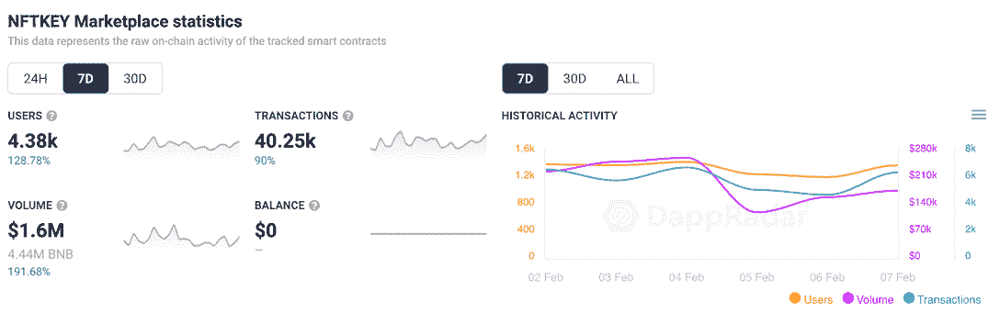
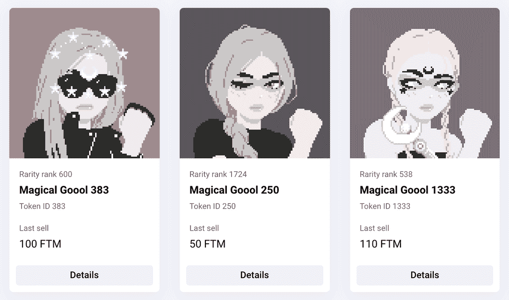
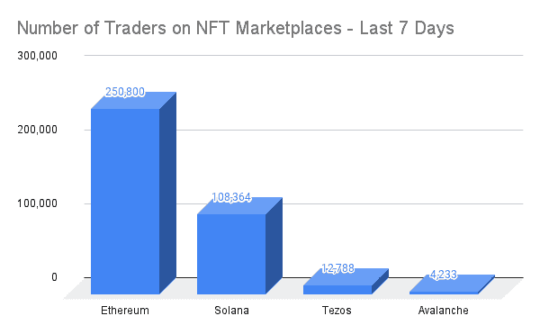

# NFTKEY Marketplace 通过多链方法使受众翻倍

> 原文：<https://web.archive.org/web/https://dappradar.com/blog/nftkey-marketplace-doubles-audience-with-multichain-approach>

## 在过去的七天里，用户数量猛增了 130%

NFT 市场 NFTKEY 本周呈上升趋势，连接到其数字收藏品市场的活跃钱包数量增加了一倍多。 [**跨链平台**](https://web.archive.org/web/20220930084423/https://dappradar.com/multichain/marketplaces/nftkey-marketplace) **允许交易者在以太坊、BSC、Avalanche、Harmony 上买卖 NFT，最近还将其功能扩展到了** [**新整合的 Fantom 网络**](https://web.archive.org/web/20220930084423/https://dappradar.com/rankings/protocol/fantom) **，在那里它找到了相当大的牵引力。**

在所有网络中， [NFTKEY 的用户基数](https://web.archive.org/web/20220930084423/https://dappradar.com/multichain/marketplaces/nftkey-marketplace)周环比增长超过 128%，连接到市场的钱包数量达到 4380 个。这些钱包完成了超过 40，000 笔交易，产生了 160 万美元的交易量。有趣的是，我们可以看到 NFTKEY 上数字收藏品的平均销售额约为 40 美元。

细分到哪个网络市场最受欢迎，我们看到大多数用户钱包[连接在 Fantom 和 Harmony](https://web.archive.org/web/20220930084423/https://dappradar.com/multichain/marketplaces/nftkey-marketplace) 上。相反，我们在以太坊上看不到活动，在雪崩网络上看不到浅层活动。当然，这完全取决于交易者可以在每个网络上购买哪些 NFT。

## NFTKEY 市场上有什么？

我们在 Harmony 上看到 32 个收藏，其中[火星殖民地](https://web.archive.org/web/20220930084423/https://dappradar.com/harmony/games/marscolony)拥有最高的 24 小时交易量。随着[对项目](https://web.archive.org/web/20220930084423/https://cyberbump.net/harmony-one-games-mars-colony-community-update-play-to-earn-metaverse/)的期望越来越大，交易者们正在追逐即将到来的火星殖民地游戏中的 NFT 地块。我们看到土地的底价现在是 1590 元，大约 362 美元。然而，地块的售价是这个价格的两倍。

在 Fantom 上，我们看到目前有 141 个收藏可用，而[magic Goools](https://web.archive.org/web/20220930084423/https://nftkey.app/collections/magicalgoools/?marketplaceTab=sold)显示了写作时最高的 24 小时交易量。目前的底价是 59 一个代币，或者一杯酒大约 14 美元。然而，我们看到价格差异很大，有些售价超过 100 英镑，或约 20 美元。

## 2022 年的 NFTs

随着我们进入 2022 年，为 NFT 的景观增添背景，[有必要知道](https://web.archive.org/web/20220930084423/https://dappradar.com/blog/dapp-industry-report-january-2022)不包括 LooksRare 的 107 亿美元的人工销售额，NFT 空间积累了 53 亿美元的交易，几乎 90%是在领先的以太坊 NFT 市场 OpenSea 上交易的。然而，T2 有越来越多的 NFT 收藏品和市场在其他区块链解决方案上运作。这些替代品为用户提供了广泛的收藏品选择和较低的交易成本。想想 [Tezos“干净的”NFTs、](https://web.archive.org/web/20220930084423/https://dappradar.com/blog/tezos-clean-nfts-start-getting-noticed) [多边形](https://web.archive.org/web/20220930084423/https://dappradar.com/rankings/protocol/polygon)和[不可变 X](https://web.archive.org/web/20220930084423/https://dappradar.com/rankings/protocol/immutablex) 作为昂贵且耗能的以太坊主网的替代物。

虽然以太坊在每周买卖 NFT 的交易者数量上仍然遥遥领先，但区块链的 NFT，如 Solana、Tezos 和 Avalanche，正引起人们的注意。作为一个整体，他们今年可能会超过以太坊。

Source: DappRadar

区块链的 Fantom 和 T2 的 Harmony 已经成功地建立了强大的 DeFi 类别，吸引了用户和价值。Fantom 的总价值目前超过 90 亿美元，而 Harmony 的总价值刚刚超过 10 亿美元。

像 [DeFi 王国](https://web.archive.org/web/20220930084423/https://dappradar.com/harmony/games/defi-kingdoms)和 [ViperSwap](https://web.archive.org/web/20220930084423/https://dappradar.com/harmony/defi/viperswap) 这样的应用程序帮助 Harmony 吸引用户，而 Fantom 上的 [SpookySwap 每周吸引大约 3 万个钱包。
这些用户现在开始接触一种全新的资产类别，即非功能性桌面和数字收藏品。](https://web.archive.org/web/20220930084423/https://dappradar.com/fantom/exchanges/spookyswap)

此外，非金融资产代表了一种资产类别，它抵御了最近的秘密价格暴跌，并保持了非常可观的价值水平——这表明非金融资产不仅成为了 T2 有形的价值储存手段，而且成为了一种可以利用和交易获利的商品。

[<picture></picture>](https://web.archive.org/web/20220930084423/https://dappradar.com/blog/what-are-non-fungible-tokens-nfts)[<picture></picture>](https://web.archive.org/web/20220930084423/https://dappradar.com/nft/marketplaces)[<picture></picture>](https://web.archive.org/web/20220930084423/https://dappradar.com/nft/sales) NewsletterUnsubscribe at any time. [T&Cs](https://web.archive.org/web/20220930084423/https://dappradar.com/terms) and [Privacy Policy](https://web.archive.org/web/20220930084423/https://dappradar.com/privacy-policy)

***以上不构成投资建议。此处给出的信息仅供参考。请行使尽职调查，做你的研究。作者持有 ETH、BTC、AGIX、HEX、LINK、GRT、CRO、OMI、不可变 X、GALA、AVASTR、GMEE、CUBE、RADAR、FLOW、FTM、BNB、SPS、WRLD、ATOM 和 ADA。***