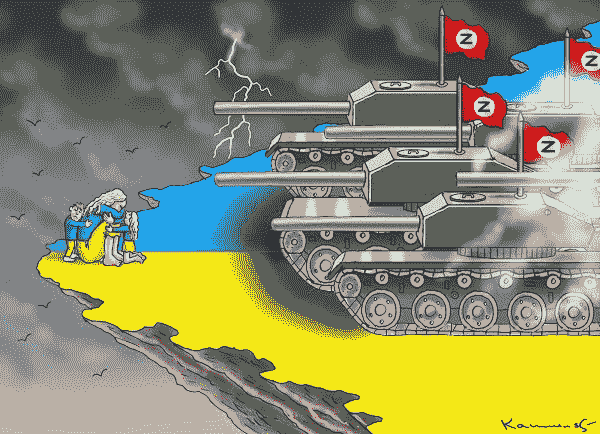

# NFTs 4 和平呼吁社区帮助乌克兰

> 原文：<https://web.archive.org/web/https://dappradar.com/blog/nfts-4-peace-calls-on-community-to-help-ukraine>

## 为乌克兰政府筹集 OpenSea 资金的新项目

在俄罗斯于 2 月 24 日入侵乌克兰后，国际社会的一些部门向这个四面楚歌的国家提供了支持。现在，Mars4 和通信机构 Fabula: Rud Pedersen Group 联手支持一个需要帮助的国家。

自 2 月 24 日俄罗斯入侵乌克兰以来，其他国家和组织的反应是对乌克兰人民压倒性的口头支持。这是一场一方强加给另一方的战争，它撕裂了家庭、社区和城市。

乌克兰的战争损失目前高达 5650 亿美元，而且这个数字每分钟都在增长。450 多万人作为难民逃离该国，650 万人在国内流离失所。专家估计，乌克兰经济的 50%将在今年年底消失。

面对这些令人痛心的数字，国际政府目前的援助水平似乎只能弥补乌克兰所遭受的痛苦和创伤。出于这个原因，社会的其他领域有义务在最有效的地方贡献他们的时间、金钱、支持和专业知识。

这就是 NFTs 4 Peace 的用武之地。这个项目是由一群立陶宛密码公司和风险资本家组织的。他们希望利用 web3 社区的力量，筹集资金来支持这个急需帮助的国家中最需要帮助的人。

## NFTs 4 和平系列

NFTs 4 Peace 系列目前在 [OpenSea](https://web.archive.org/web/20220925024303/https://opensea.io/collection/nfts4peace) 上有售，鼓励所有在乌克兰看到不公正的人看一看并参与竞标。有 96 种 NFT 可供选择。拍卖将于 4 月 18 日结束，该系列包含独特的作品，每一件都是由世界各地的艺术家精心制作的。

Image from NFTs 4 Peace collection

出售所得 100%将捐给乌克兰政府的数字转型部。NFTs 4 和平小组将在瑞士联邦理工学院和 USDT 发送资金，这是区块链技术如何成为对抗独裁主义的正义力量的又一个例子。

对许多人来说，元宇宙、加密货币和 P2E 博彩一直是乐趣和娱乐的来源。现在，他们提供了一个真正有所作为的机会。

访问 [OpenSea](https://web.archive.org/web/20220925024303/https://opensea.io/collection/nfts4peace) 选择你最喜欢的物品，表明你支持正义和自由。购买 NFT 从未如此有意义。